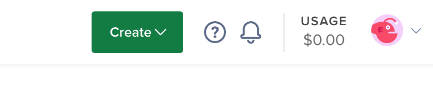
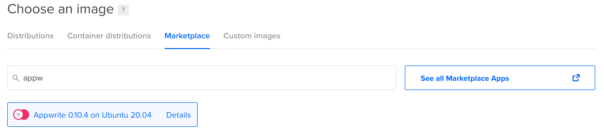
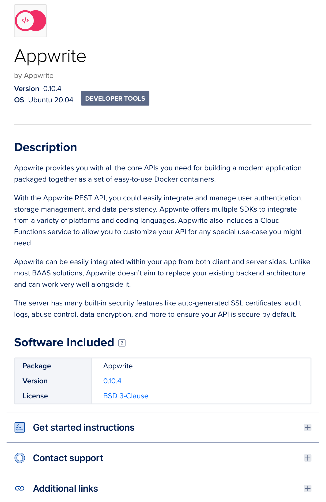
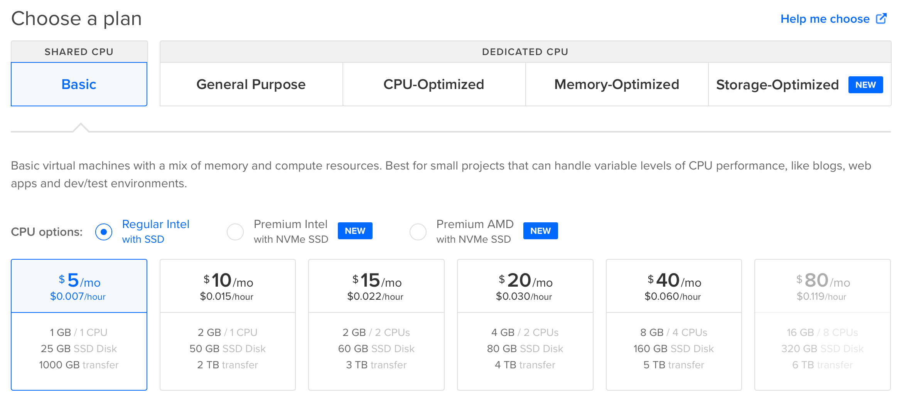
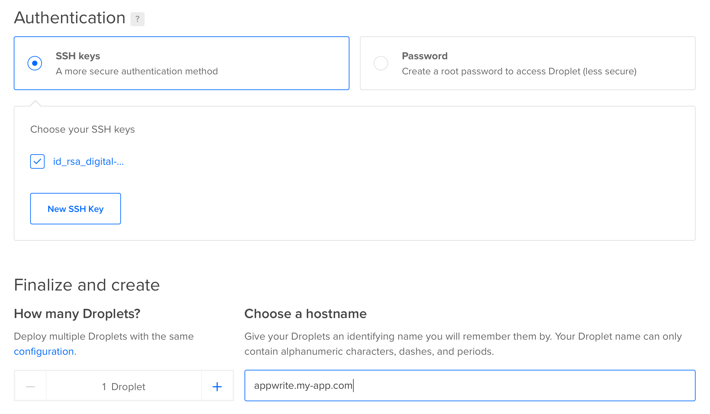
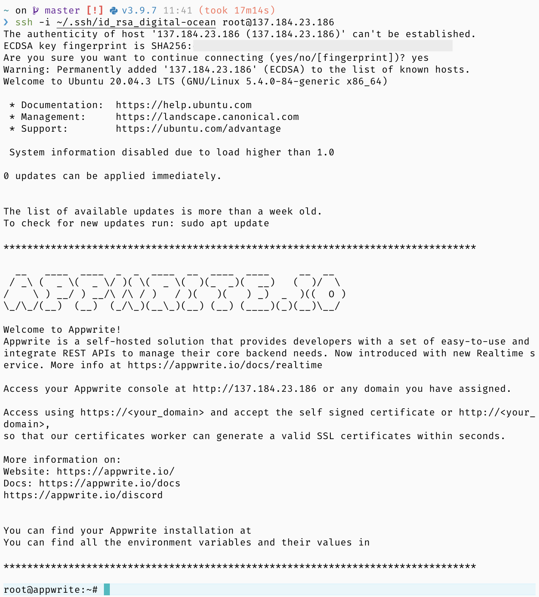
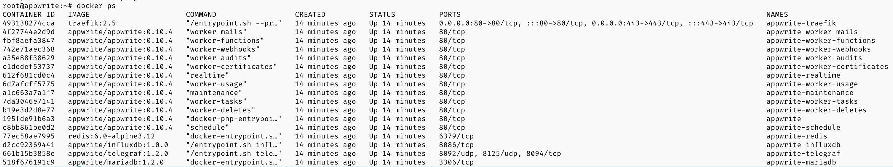
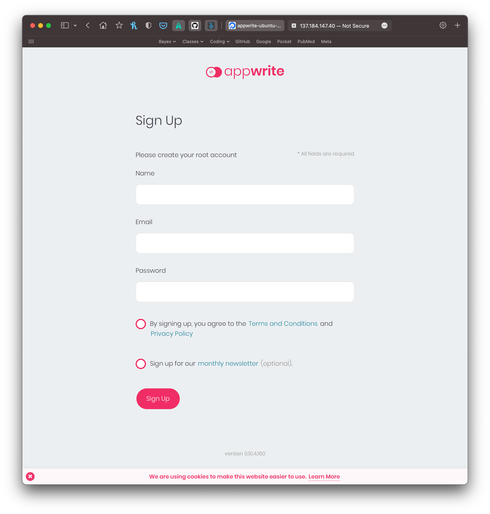
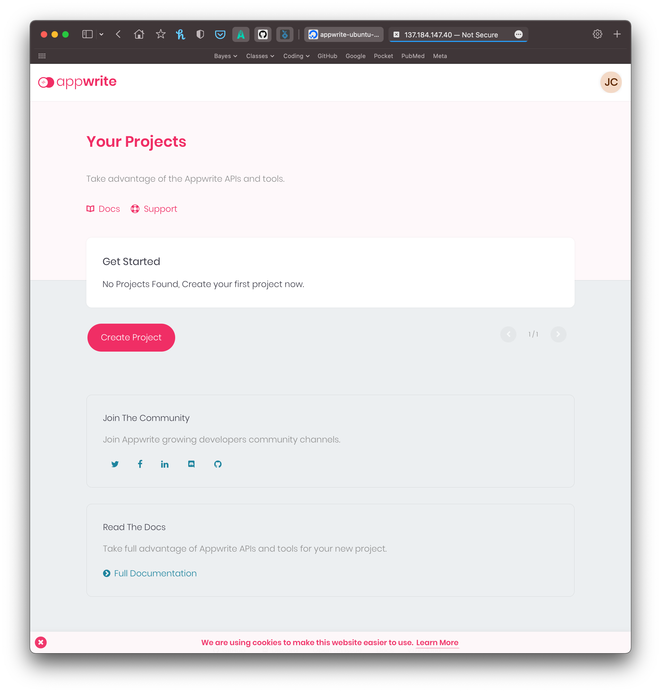

Here, I lay out step-by-step instructions for getting a Appwrite backend up and running on DigitalOcean.
First, however, I briefly describe what [Appwrite](https://appwrite.io) and [DigitalOcean](https://appwrite.io) are and why one would want to use either of these services.
For those who are just looking for a quick how-to, you can [jump](#tldr) straight to the listed instructions.

> If you notice any mistakes or updates that are needed, please add a comment at the bottom of this post.

## Background

### Appwrite

[Appwrite](https://appwrite.io) is a powerful, yet free, "Backend as a Service" (BaaS).
It provides a simple way to quickly setup a backend server for an app or project with built-in capabilities for common backend services including database management and queries, creating user accounts, and file upload and access.
Further, it has an intuitive GUI console paired with a CLI tool and SDKs for many common programming languages (including Python).
Overall, Appwrite is a great option for instantly creating a flexible backend server for projects ranging from the simple hobby-apps to complex apps used by hundreds to thousands of users.

### DigitalOcean

[DigitalOcean](https://www.digitalocean.com) is a cloud service provider.
They offer tons of features that can suit large corporations, but also simple services for the everyday hobbyist.
DigitalOcean is a great way to get a project up-and-running in the cloud.

---

## Setting up Appwrite on DigitalOcean

### TL;DR

Here are the steps for those who don't need much help and just want to get started:

1. Login to [DigitalOcean](https://www.digitalocean.com) and create a basic Droplet, selecting Appwrite from the Marketplace.
2. Login to the virtual machine and update security settings (["#30DaysOfAppwrite: Appwrite for Production"](https://dev.to/appwrite/30daysofappwrite-appwrite-for-production-56hi)).
3. Sign into the Appwrite console and get to work!

### Walkthrough

#### 1. Create a DigitalOcean Droplet with Appwrite pre-installed.

The first step of this process is to create a [Droplet](https://www.digitalocean.com/products/droplets/) on DigitalOcean.
The Droplet is a virtual machine in the cloud and can be as simple as a single shared CPU with 1 GB RAM and 25 GB storage for \$5 a month.
One of the main selling points of Appwrite is its ability to thrive on this size of infrastructure for small projects.

Once logged in to DigitalOcean, click on the "Create" button in the top-right and select "Droplet" from the dropdown.



Instead of a specific OS distribution, it is easiest to just select the Appwrite option under the "Marketplace" tab.
Select "Marketplace" and enter "Appwrite" into the search box.



You can click on "Details" to see more information about this Appwrite option.



Next, we need to select the capabilities we want for the Droplet.
For a starter project, it is enough to go with the "Basic" option of a shared CPU and at least 1 GB of RAM.
At the time of writing, the cheapest option is an Intel CPU with SSD for \$5 per month.



Now, create login credentials for the virtual machine.
You can either add SSH keys or create a root password, but DigitalOcean recommends creating SSH keys.
It is simple enough and DigitalOcean has provided a quick guide on how to do it.

Finally, just add a hostname which will be the domain for the virtual machine.
For this tutorial, I set the hostname as "appwrite.my-app.com".



To access the server through a domain you already own (e.g. "my-app.com" in this case), you will need to add this Droplet as a record of the domain.
This will vary depending on which DNS registrar you use and who manages the DNS records, but DigitalOcean has a helpful guide on handling this: [How To Point to DigitalOcean Nameservers From Common Domain Registrars](https://www.digitalocean.com/community/tutorials/how-to-point-to-digitalocean-nameservers-from-common-domain-registrars).

#### 2. Update Appwrite security settings on the Droplet.

After a few minutes, DigitalOcean will have your virtual machine running.
While you can go right to the Appwrite console (as in step 3, below), I think it is worth first checking the security settings of the production server.

The Appwrite option available through the DitigialOcean Marketplace comes with several key production-level security settings already in place.
More details can be found in the 30 Days of Appwrite post ["Appwrite for Production"](https://dev.to/appwrite/30daysofappwrite-appwrite-for-production-56hi).
It is worth looking through the options to make sure everything is set as you would like.
For instance, I think it is, especially for small single-person projects, worth setting `_APP_CONSOLE_WHITELIST_EMAILS` to one of your emails.
Otherwise, the default settings seem pretty reasonable and are probably good for most people.

To access these settings, we must SSH into the virtual machine.

```bash
ssh root@137.184.23.186
```

Note that if you used a non-default name for the SSH key, you will need to indicate which key to use like so:

```bash
ssh -i ~/.ssh/id_rsa_digital-ocean root@137.184.23.186
```



You can see that everything is already setup by looking at the running containers.

```bash
docker ps
```



Take a look at the Appwrite settings by changing your directory to `appwrite` and using `vim` or `nano` to view the `.env` file.
*Do not change the `docker-compose.yml` file, make the changes in the `.env` file.*

If you make any changes, make sure the run the following command to have the changes take effect.

```bash
docker-compose up -d
```

#### 3. Sign in to the Appwrite console.

Finally, we can go to the IP address or URL for our new server and login to the Appwrite console.
Once signed in, you can instantly begin using your new backend.




