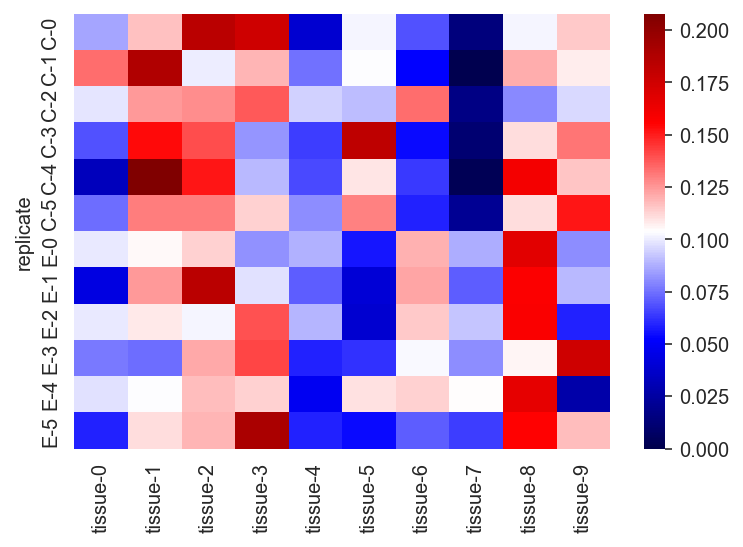
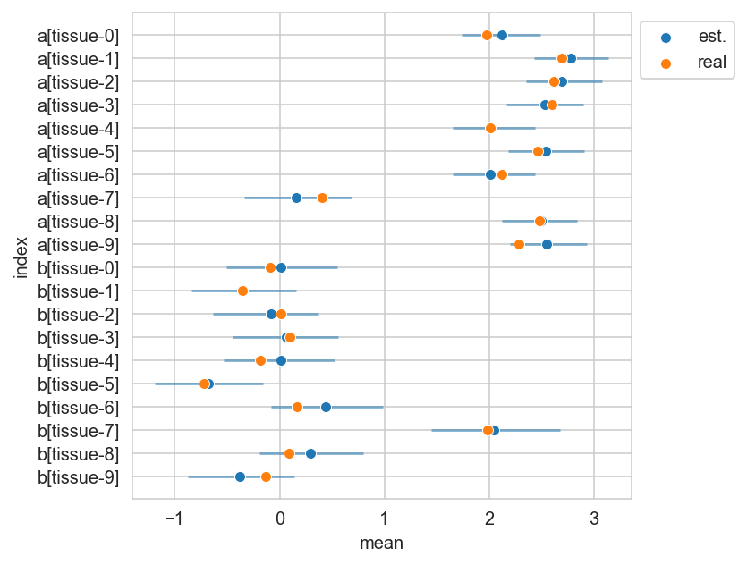
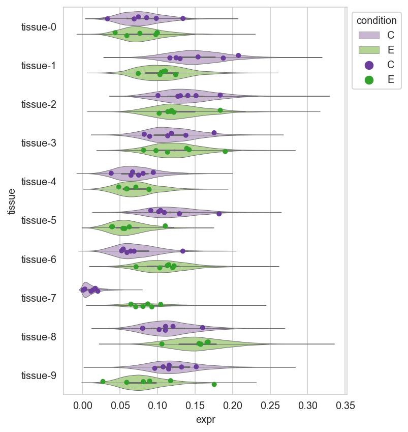

> I want to apologize at the top for the general lack-luster appearance and text in this post.
> It is meant to serve as a quick, simple guide, so I chose to keep it relatively light on text and explanation.

## Introduction

Below, I provide a simple example of a Dirichlet regression in PyMC.
This form of generalized linear model is appropriate when modeling proportions of multiple groups, that is, when modeling a collection of positive values that must sum to a constant.
Some common examples include ratios and percentages.

For this example, I used a simplified case that was the original impetus for me looking in this form of model.
I have measured a protein’s expression in two groups, a control and experimental, across $10$ tissues.
I have measured the expression in $6$ replicates for each condition across all $10$ tissues.
Therefore, I have $10 \times 6 \times 2$ measurements.
The values are all greater than or equal to $0$ (i.e. 0 or positive) and the sum of the values for each replicate sum to $1$.

I want to know if the expression of the protein is different between control and experiment in each tissue.

Because of the constraint on the values being $\ge 0$ and summing to $1$ across replicates, the likelihood should be a Dirichlet distribution.
The exponential is the appropriate link function between the likelihood and linear combination of variables.

## Setup

```python
import arviz as az
import janitor  # noqa: F401
import matplotlib.pyplot as plt
import numpy as np
import pandas as pd
import pymc as pm
import seaborn as sns
```


```python
%matplotlib inline
%config InlineBackend.figure_format = 'retina'
sns.set_style("whitegrid")
```

## Data generation

A fake dataset was produced for the situation described above.
The vectors `ctrl_tissue_props` and `expt_tissue_props` contain the "true" proportions of protein expression across the ten tissues for the control and experimental conditions.
These were randomly generated as printed at the end of the code block.


```python
N_TISSUES = 10
N_REPS = 6
CONDITIONS = ["C", "E"]

TISSUES = [f"tissue-{i}" for i in range(N_TISSUES)]
REPS = [f"{CONDITIONS[0]}-{i}" for i in range(N_REPS)]
REPS += [f"{CONDITIONS[1]}-{i}" for i in range(N_REPS)]

np.random.seed(909)
ctrl_tissue_props = np.random.beta(2, 2, N_TISSUES)
ctrl_tissue_props = ctrl_tissue_props / np.sum(ctrl_tissue_props)
expt_tissue_props = np.random.beta(2, 2, N_TISSUES)
expt_tissue_props = expt_tissue_props / np.sum(expt_tissue_props)

print("Real proportions for each tissue:")
print(np.vstack([ctrl_tissue_props, expt_tissue_props]).round(3))
```

    Real proportions for each tissue:
    [[0.072 0.148 0.137 0.135 0.074 0.118 0.083 0.015 0.12  0.098]
     [0.066 0.104 0.138 0.149 0.062 0.057 0.098 0.109 0.131 0.086]]


Protein expression values were sampled using these proportions, multiplied by 100 to reduce the variability in the sampled values.
Recall that the Dirichlet is effectively a multi-class Beta distribution, so the input numbers can be thought of as the observed number of instances for each class.
The more observations, the more confidence that the observed frequencies are representative of the true proportions.


```python
_ctrl_data = np.random.dirichlet(ctrl_tissue_props * 100, N_REPS)
_expt_data = np.random.dirichlet(expt_tissue_props * 100, N_REPS)

expr_data = (
    pd.DataFrame(np.vstack([_ctrl_data, _expt_data]), columns=TISSUES)
    .assign(replicate=REPS)
    .set_index("replicate")
)
expr_data.round(3)
```


<div>
<style scoped>
    .dataframe tbody tr th:only-of-type {
        vertical-align: middle;
    }

    .dataframe tbody tr th {
        vertical-align: top;
    }

    .dataframe thead th {
        text-align: right;
    }
</style>
<table border="1" class="dataframe">
  <thead>
    <tr style="text-align: right;">
      <th></th>
      <th>tissue-0</th>
      <th>tissue-1</th>
      <th>tissue-2</th>
      <th>tissue-3</th>
      <th>tissue-4</th>
      <th>tissue-5</th>
      <th>tissue-6</th>
      <th>tissue-7</th>
      <th>tissue-8</th>
      <th>tissue-9</th>
    </tr>
    <tr>
      <th>replicate</th>
      <th></th>
      <th></th>
      <th></th>
      <th></th>
      <th></th>
      <th></th>
      <th></th>
      <th></th>
      <th></th>
      <th></th>
    </tr>
  </thead>
  <tbody>
    <tr>
      <th>C-0</th>
      <td>0.085</td>
      <td>0.116</td>
      <td>0.184</td>
      <td>0.175</td>
      <td>0.038</td>
      <td>0.101</td>
      <td>0.069</td>
      <td>0.014</td>
      <td>0.102</td>
      <td>0.115</td>
    </tr>
    <tr>
      <th>C-1</th>
      <td>0.134</td>
      <td>0.188</td>
      <td>0.101</td>
      <td>0.119</td>
      <td>0.075</td>
      <td>0.104</td>
      <td>0.052</td>
      <td>0.001</td>
      <td>0.121</td>
      <td>0.107</td>
    </tr>
    <tr>
      <th>C-2</th>
      <td>0.098</td>
      <td>0.125</td>
      <td>0.127</td>
      <td>0.138</td>
      <td>0.094</td>
      <td>0.091</td>
      <td>0.134</td>
      <td>0.017</td>
      <td>0.080</td>
      <td>0.096</td>
    </tr>
    <tr>
      <th>C-3</th>
      <td>0.069</td>
      <td>0.154</td>
      <td>0.140</td>
      <td>0.082</td>
      <td>0.065</td>
      <td>0.182</td>
      <td>0.054</td>
      <td>0.011</td>
      <td>0.110</td>
      <td>0.132</td>
    </tr>
    <tr>
      <th>C-4</th>
      <td>0.033</td>
      <td>0.208</td>
      <td>0.151</td>
      <td>0.090</td>
      <td>0.067</td>
      <td>0.109</td>
      <td>0.064</td>
      <td>0.003</td>
      <td>0.160</td>
      <td>0.115</td>
    </tr>
    <tr>
      <th>C-5</th>
      <td>0.074</td>
      <td>0.130</td>
      <td>0.130</td>
      <td>0.113</td>
      <td>0.081</td>
      <td>0.129</td>
      <td>0.059</td>
      <td>0.020</td>
      <td>0.111</td>
      <td>0.152</td>
    </tr>
    <tr>
      <th>E-0</th>
      <td>0.100</td>
      <td>0.105</td>
      <td>0.114</td>
      <td>0.081</td>
      <td>0.088</td>
      <td>0.056</td>
      <td>0.120</td>
      <td>0.087</td>
      <td>0.167</td>
      <td>0.081</td>
    </tr>
    <tr>
      <th>E-1</th>
      <td>0.043</td>
      <td>0.124</td>
      <td>0.184</td>
      <td>0.098</td>
      <td>0.071</td>
      <td>0.040</td>
      <td>0.122</td>
      <td>0.071</td>
      <td>0.157</td>
      <td>0.089</td>
    </tr>
    <tr>
      <th>E-2</th>
      <td>0.099</td>
      <td>0.108</td>
      <td>0.102</td>
      <td>0.139</td>
      <td>0.089</td>
      <td>0.039</td>
      <td>0.115</td>
      <td>0.092</td>
      <td>0.158</td>
      <td>0.059</td>
    </tr>
    <tr>
      <th>E-3</th>
      <td>0.076</td>
      <td>0.074</td>
      <td>0.122</td>
      <td>0.142</td>
      <td>0.058</td>
      <td>0.062</td>
      <td>0.103</td>
      <td>0.081</td>
      <td>0.106</td>
      <td>0.176</td>
    </tr>
    <tr>
      <th>E-4</th>
      <td>0.098</td>
      <td>0.103</td>
      <td>0.117</td>
      <td>0.113</td>
      <td>0.048</td>
      <td>0.110</td>
      <td>0.113</td>
      <td>0.104</td>
      <td>0.166</td>
      <td>0.027</td>
    </tr>
    <tr>
      <th>E-5</th>
      <td>0.059</td>
      <td>0.110</td>
      <td>0.119</td>
      <td>0.190</td>
      <td>0.059</td>
      <td>0.054</td>
      <td>0.071</td>
      <td>0.065</td>
      <td>0.155</td>
      <td>0.117</td>
    </tr>
  </tbody>
</table>
</div>


```python
sns.heatmap(expr_data, vmin=0, cmap="seismic");
```


    

    


The sum of the values for each replicate should be 1.


```python
expr_data.values.sum(axis=1)
# > array([1., 1., 1., 1., 1., 1., 1., 1., 1., 1., 1., 1.])
```


    array([1., 1., 1., 1., 1., 1., 1., 1., 1., 1., 1., 1.])


## Model

### Model specification

The model is rather straight forward and immediately recognizable as a generalized linear model.
The main attributes are the use of the Dirichlet likelihood and exponential link function.
Note, that for the PyMC library, the first dimension contains each "group" of data, that is, the values should sum to $1$ along that axis.
In this case, the values of each *replicate* should sum to $1$.


```python
coords = {"tissue": TISSUES, "replicate": REPS}

intercept = np.ones_like(expr_data)
x_expt_cond = np.vstack([np.zeros((N_REPS, N_TISSUES)), np.ones((N_REPS, N_TISSUES))])

with pm.Model(coords=coords) as dirichlet_reg:
    a = pm.Normal("a", 0, 5, dims=("tissue",))
    b = pm.Normal("b", 0, 2.5, dims=("tissue",))
    eta = pm.Deterministic(
        "eta",
        a[None, :] * intercept + b[None, :] * x_expt_cond,
        dims=("replicate", "tissue"),
    )
    mu = pm.Deterministic("mu", pm.math.exp(eta), dims=("replicate", "tissue"))
    y = pm.Dirichlet("y", mu, observed=expr_data.values, dims=("replicate", "tissue"))

# pm.model_to_graphviz(dirichlet_reg)
dirichlet_reg
```


$$
  \begin{array}{rcl}
  a &\sim & \mathcal{N}(0,~5) \\\\
  b &\sim & \mathcal{N}(0,~2.5) \\\\
  \eta &\sim & \operatorname{Deterministic}(f(a, b)) \\\\
  \mu &\sim & \operatorname{Deterministic}(f(\eta)) \\\\
  y &\sim & \operatorname{Dir}(\mu)
  \end{array}
$$


### Sampling

PyMC does all of the heavy lifting and we just need to press the "Inference Button" with the `pm.sample()` function.


```python
with dirichlet_reg:
    trace = pm.sample(
        draws=1000, tune=1000, chains=2, cores=2, random_seed=20, target_accept=0.9
    )
    _ = pm.sample_posterior_predictive(trace, random_seed=43, extend_inferencedata=True)
```

    Auto-assigning NUTS sampler...
    Initializing NUTS using jitter+adapt_diag...
    Multiprocess sampling (2 chains in 2 jobs)
    NUTS: [a, b]


<style>
    /* Turns off some styling */
    progress {
        /* gets rid of default border in Firefox and Opera. */
        border: none;
        /* Needs to be in here for Safari polyfill so background images work as expected. */
        background-size: auto;
    }
    .progress-bar-interrupted, .progress-bar-interrupted::-webkit-progress-bar {
        background: #F44336;
    }
</style>


<div>
  <progress value='4000' class='' max='4000' style='width:300px; height:20px; vertical-align: middle;'></progress>
  100.00% [4000/4000 00:16<00:00 Sampling 2 chains, 0 divergences]
</div>


    Sampling 2 chains for 1_000 tune and 1_000 draw iterations (2_000 + 2_000 draws total) took 29 seconds.


<style>
    /* Turns off some styling */
    progress {
        /* gets rid of default border in Firefox and Opera. */
        border: none;
        /* Needs to be in here for Safari polyfill so background images work as expected. */
        background-size: auto;
    }
    .progress-bar-interrupted, .progress-bar-interrupted::-webkit-progress-bar {
        background: #F44336;
    }
</style>


<div>
  <progress value='2000' class='' max='2000' style='width:300px; height:20px; vertical-align: middle;'></progress>
  100.00% [2000/2000 00:00<00:00]
</div>


## Posterior analysis

### Recovering known parameters

The table below shows the summaries of the marginal posterior distributions for the variables $a$ and $b$ of the model.


```python
real_a = np.log(ctrl_tissue_props * 100)
real_b = np.log(expt_tissue_props * 100) - real_a

res_summary = (
    az.summary(trace, var_names=["a", "b"], hdi_prob=0.89)
    .assign(real=np.hstack([real_a, real_b]))
    .reset_index()
)
res_summary
```


<div>
<style scoped>
    .dataframe tbody tr th:only-of-type {
        vertical-align: middle;
    }

    .dataframe tbody tr th {
        vertical-align: top;
    }

    .dataframe thead th {
        text-align: right;
    }
</style>
<table border="1" class="dataframe">
  <thead>
    <tr style="text-align: right;">
      <th></th>
      <th>index</th>
      <th>mean</th>
      <th>sd</th>
      <th>hdi_5.5%</th>
      <th>hdi_94.5%</th>
      <th>mcse_mean</th>
      <th>mcse_sd</th>
      <th>ess_bulk</th>
      <th>ess_tail</th>
      <th>r_hat</th>
      <th>real</th>
    </tr>
  </thead>
  <tbody>
    <tr>
      <th>0</th>
      <td>a[tissue-0]</td>
      <td>2.122</td>
      <td>0.240</td>
      <td>1.735</td>
      <td>2.490</td>
      <td>0.012</td>
      <td>0.009</td>
      <td>393.0</td>
      <td>923.0</td>
      <td>1.0</td>
      <td>1.973280</td>
    </tr>
    <tr>
      <th>1</th>
      <td>a[tissue-1]</td>
      <td>2.782</td>
      <td>0.223</td>
      <td>2.432</td>
      <td>3.142</td>
      <td>0.013</td>
      <td>0.009</td>
      <td>309.0</td>
      <td>657.0</td>
      <td>1.0</td>
      <td>2.691607</td>
    </tr>
    <tr>
      <th>2</th>
      <td>a[tissue-2]</td>
      <td>2.691</td>
      <td>0.231</td>
      <td>2.349</td>
      <td>3.082</td>
      <td>0.013</td>
      <td>0.009</td>
      <td>334.0</td>
      <td>566.0</td>
      <td>1.0</td>
      <td>2.618213</td>
    </tr>
    <tr>
      <th>3</th>
      <td>a[tissue-3]</td>
      <td>2.529</td>
      <td>0.234</td>
      <td>2.163</td>
      <td>2.903</td>
      <td>0.013</td>
      <td>0.009</td>
      <td>324.0</td>
      <td>481.0</td>
      <td>1.0</td>
      <td>2.603835</td>
    </tr>
    <tr>
      <th>4</th>
      <td>a[tissue-4]</td>
      <td>2.009</td>
      <td>0.247</td>
      <td>1.648</td>
      <td>2.435</td>
      <td>0.013</td>
      <td>0.009</td>
      <td>399.0</td>
      <td>586.0</td>
      <td>1.0</td>
      <td>2.006772</td>
    </tr>
    <tr>
      <th>5</th>
      <td>a[tissue-5]</td>
      <td>2.538</td>
      <td>0.231</td>
      <td>2.180</td>
      <td>2.906</td>
      <td>0.013</td>
      <td>0.009</td>
      <td>322.0</td>
      <td>641.0</td>
      <td>1.0</td>
      <td>2.465910</td>
    </tr>
    <tr>
      <th>6</th>
      <td>a[tissue-6]</td>
      <td>2.015</td>
      <td>0.250</td>
      <td>1.653</td>
      <td>2.435</td>
      <td>0.013</td>
      <td>0.009</td>
      <td>363.0</td>
      <td>804.0</td>
      <td>1.0</td>
      <td>2.118144</td>
    </tr>
    <tr>
      <th>7</th>
      <td>a[tissue-7]</td>
      <td>0.159</td>
      <td>0.324</td>
      <td>-0.334</td>
      <td>0.690</td>
      <td>0.012</td>
      <td>0.008</td>
      <td>828.0</td>
      <td>1068.0</td>
      <td>1.0</td>
      <td>0.407652</td>
    </tr>
    <tr>
      <th>8</th>
      <td>a[tissue-8]</td>
      <td>2.497</td>
      <td>0.230</td>
      <td>2.123</td>
      <td>2.843</td>
      <td>0.013</td>
      <td>0.009</td>
      <td>328.0</td>
      <td>568.0</td>
      <td>1.0</td>
      <td>2.484808</td>
    </tr>
    <tr>
      <th>9</th>
      <td>a[tissue-9]</td>
      <td>2.552</td>
      <td>0.234</td>
      <td>2.198</td>
      <td>2.930</td>
      <td>0.013</td>
      <td>0.009</td>
      <td>333.0</td>
      <td>688.0</td>
      <td>1.0</td>
      <td>2.281616</td>
    </tr>
    <tr>
      <th>10</th>
      <td>b[tissue-0]</td>
      <td>0.010</td>
      <td>0.335</td>
      <td>-0.507</td>
      <td>0.549</td>
      <td>0.016</td>
      <td>0.011</td>
      <td>435.0</td>
      <td>810.0</td>
      <td>1.0</td>
      <td>-0.089065</td>
    </tr>
    <tr>
      <th>11</th>
      <td>b[tissue-1]</td>
      <td>-0.351</td>
      <td>0.313</td>
      <td>-0.841</td>
      <td>0.161</td>
      <td>0.016</td>
      <td>0.011</td>
      <td>401.0</td>
      <td>852.0</td>
      <td>1.0</td>
      <td>-0.353870</td>
    </tr>
    <tr>
      <th>12</th>
      <td>b[tissue-2]</td>
      <td>-0.086</td>
      <td>0.313</td>
      <td>-0.636</td>
      <td>0.372</td>
      <td>0.015</td>
      <td>0.011</td>
      <td>413.0</td>
      <td>680.0</td>
      <td>1.0</td>
      <td>0.009744</td>
    </tr>
    <tr>
      <th>13</th>
      <td>b[tissue-3]</td>
      <td>0.065</td>
      <td>0.318</td>
      <td>-0.445</td>
      <td>0.560</td>
      <td>0.016</td>
      <td>0.011</td>
      <td>409.0</td>
      <td>746.0</td>
      <td>1.0</td>
      <td>0.099328</td>
    </tr>
    <tr>
      <th>14</th>
      <td>b[tissue-4]</td>
      <td>0.009</td>
      <td>0.334</td>
      <td>-0.535</td>
      <td>0.528</td>
      <td>0.015</td>
      <td>0.011</td>
      <td>486.0</td>
      <td>884.0</td>
      <td>1.0</td>
      <td>-0.184059</td>
    </tr>
    <tr>
      <th>15</th>
      <td>b[tissue-5]</td>
      <td>-0.682</td>
      <td>0.324</td>
      <td>-1.191</td>
      <td>-0.160</td>
      <td>0.016</td>
      <td>0.011</td>
      <td>433.0</td>
      <td>743.0</td>
      <td>1.0</td>
      <td>-0.720852</td>
    </tr>
    <tr>
      <th>16</th>
      <td>b[tissue-6]</td>
      <td>0.437</td>
      <td>0.331</td>
      <td>-0.082</td>
      <td>0.987</td>
      <td>0.016</td>
      <td>0.011</td>
      <td>423.0</td>
      <td>759.0</td>
      <td>1.0</td>
      <td>0.162447</td>
    </tr>
    <tr>
      <th>17</th>
      <td>b[tissue-7]</td>
      <td>2.045</td>
      <td>0.389</td>
      <td>1.443</td>
      <td>2.676</td>
      <td>0.015</td>
      <td>0.010</td>
      <td>703.0</td>
      <td>1041.0</td>
      <td>1.0</td>
      <td>1.981890</td>
    </tr>
    <tr>
      <th>18</th>
      <td>b[tissue-8]</td>
      <td>0.298</td>
      <td>0.306</td>
      <td>-0.189</td>
      <td>0.795</td>
      <td>0.016</td>
      <td>0.011</td>
      <td>390.0</td>
      <td>761.0</td>
      <td>1.0</td>
      <td>0.085959</td>
    </tr>
    <tr>
      <th>19</th>
      <td>b[tissue-9]</td>
      <td>-0.384</td>
      <td>0.325</td>
      <td>-0.876</td>
      <td>0.143</td>
      <td>0.016</td>
      <td>0.011</td>
      <td>423.0</td>
      <td>797.0</td>
      <td>1.0</td>
      <td>-0.129034</td>
    </tr>
  </tbody>
</table>
</div>


The plot below shows the posterior estimates (blue) against the known proportions (orange).

```python
_, ax = plt.subplots(figsize=(5, 5))
sns.scatterplot(
    data=res_summary,
    y="index",
    x="mean",
    color="tab:blue",
    ax=ax,
    zorder=10,
    label="est.",
)
ax.hlines(
    res_summary["index"],
    xmin=res_summary["hdi_5.5%"],
    xmax=res_summary["hdi_94.5%"],
    color="tab:blue",
    alpha=0.5,
    zorder=5,
)
sns.scatterplot(
    data=res_summary,
    y="index",
    x="real",
    ax=ax,
    color="tab:orange",
    zorder=20,
    label="real",
)
ax.legend(loc="upper left", bbox_to_anchor=(1, 1))
plt.show()
```


    

    


### Posterior predictive distribution


```python
post_pred = (
    trace.posterior_predictive["y"]
    .to_dataframe()
    .reset_index()
    .filter_column_isin("replicate", ["C-0", "E-0"])
    .assign(condition=lambda d: [x[0] for x in d["replicate"]])
)

plot_expr_data = (
    expr_data.copy()
    .reset_index()
    .pivot_longer("replicate", names_to="tissue", values_to="expr")
    .assign(condition=lambda d: [x[0] for x in d["replicate"]])
)

violin_pal = {"C": "#cab2d6", "E": "#b2df8a"}
point_pal = {"C": "#6a3d9a", "E": "#33a02c"}

_, ax = plt.subplots(figsize=(5, 7))
sns.violinplot(
    data=post_pred,
    x="y",
    y="tissue",
    hue="condition",
    palette=violin_pal,
    linewidth=0.5,
    ax=ax,
)
sns.stripplot(
    data=plot_expr_data,
    x="expr",
    y="tissue",
    hue="condition",
    palette=point_pal,
    dodge=True,
    ax=ax,
)
ax.legend(loc="upper left", bbox_to_anchor=(1, 1), title="condition")
```


    <matplotlib.legend.Legend at 0x105b11de0>


    

    


---

## Session Info


```python
%load_ext watermark
%watermark -d -u -v -iv -b -h -m
```

    Last updated: 2022-11-09
    
    Python implementation: CPython
    Python version       : 3.10.6
    IPython version      : 8.4.0
    
    Compiler    : Clang 13.0.1 
    OS          : Darwin
    Release     : 21.6.0
    Machine     : x86_64
    Processor   : i386
    CPU cores   : 4
    Architecture: 64bit
    
    Hostname: JHCookMac.local
    
    Git branch: sex-diff-expr-better
    
    matplotlib: 3.5.3
    pandas    : 1.4.4
    numpy     : 1.21.6
    arviz     : 0.12.1
    pymc      : 4.1.5
    janitor   : 0.22.0
    seaborn   : 0.11.2
    

