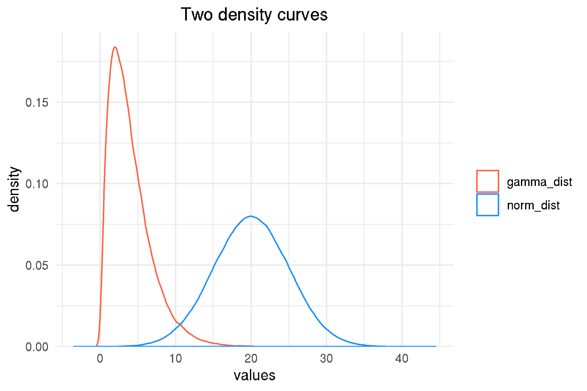
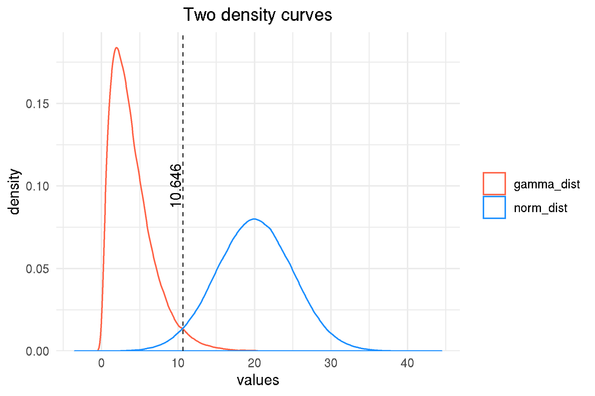

```r
library(tibble)

set.seed(0)

gamma_dist <- rgamma(1e5, shape = 2, scale = 2)
norm_dist <- rnorm(5e5, mean = 20, sd = 5)

df <- tibble(
  x = c(gamma_dist, norm_dist),
	original_dataset = c(rep("gamma_dist", 1e5), rep("norm_dist", 5e5))
)
df
#> # A tibble: 600,000 x 2
#>        x original_dataset
#>    <dbl> <chr>
#>  1  6.89 gamma_dist
#>  2  2.25 gamma_dist
#>  3  1.30 gamma_dist
#>  4  4.10 gamma_dist
#>  5  7.77 gamma_dist
#>  6  5.08 gamma_dist
#>  7  4.58 gamma_dist
#>  8  2.30 gamma_dist
#>  9  1.36 gamma_dist
#> 10  1.67 gamma_dist
#> # … with 599,990 more rows
```


```r
library(ggplot2)

p <- ggplot(df) +
  geom_density(aes(x = x, color = original_dataset))

p <- p +
  scale_y_continuous(expand = expand_scale(mult = c(0, 0.05))) +
  scale_color_manual(values = c("tomato", "dodgerblue")) +
  theme_minimal() +
  theme(
      legend.title = element_blank(),
      plot.title = element_text(hjust = 0.5)
  ) +
  labs(x = "values",
       title = "Two density curves")
```



```r
from <- 0
to <- 40
gamma_density <- density(gamma_dist, from = from, to = to)
norm_density <- density(norm_dist, from = from, to = to)
```

```r
idx <- (gamma_density$y < norm_density$y) &
       (gamma_density$x > 5) &
       (gamma_density$x < 20)
poi <- min(gamma_density$x[idx])
poi
#> 10.64579
```

```r
p <- p + 
  geom_vline(xintercept = poi, linetype = 2, size = 0.3, color = "black") +
  annotate(geom = "text", label = round(poi, 3),
           x = poi - 1, y = 0.1, size = 4, angle = 90)
```

