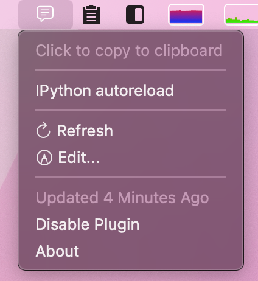

## Introduction

I found that I was constantly referring to the IPython documentation to look up the code for the [autoreload](https://ipython.readthedocs.io/en/stable/config/extensions/autoreload.html) magic command and wished there was an easy place for me to keep and access these sort of "oft-copied" texts.
I realized I could just build a simple [SwiftBar](https://github.com/swiftbar/SwiftBar) application and put these snippets in my menu bar.



## SwiftBar

[SwiftBar](https://github.com/swiftbar/SwiftBar) is a macOS tool for quickly creating a menu bar application.
It is as simple as writing an executable script (in any language) that prints to Standard Out in a specified format.
The [documentation](https://github.com/swiftbar/SwiftBar) is very good and there are many [examples](https://github.com/matryer/bitbar-plugins), so I highly recommend diving in if this seems at all interesting to you.
It is really pretty simple to get a good looking and functional menu bar application.

## Explaining the code

Below, I go through the major portions of the script.
The entire script is available on my SwiftBar plugin GitHub [repo](https://github.com/jhrcook/SwiftBar-Plugins/blob/master/oft-copied.1h.py).

### Copied-text information

First, the copied text is just organized as a dictionary, shown below.
The keys are recognizable labels for the text that will appear in the menu bar, and the values are the snippets that get copied.
Currently, I only have one snippet, but as I find more, I just need to add them to this dictionary.

```python
COPY_TEXT_INFO: Final[dict[str, str]] = {
    "IPython autoreload": "%load_ext autoreload\n%autoreload 2"
}
```

### Instructions for SwiftBar

Below are the two functions for adding a copyable snippet to the menu bar.
The `_copyables()` function just runs each key-value pair in `COPY_TEXT_INFO` through `_format_copyable()`.
This function just organizes the data into the correct format for SwiftBar to parse.

```python
def _format_copyable(title: str, text: str) -> str:
    out = f"{title} | bash={self_path} param0='--to-copy={title}'"
    text = text.replace("\n", "\\\\n")
    out += f" tooltip='{text}'"
    out += " refresh=true terminal=false"
    return out


def _copyables() -> None:
    for title, text in COPY_TEXT_INFO.items():
        print(_format_copyable(title, text))
    return None
```

Below is an example of the output (I've made it multi-line so it is easier to read).
This is parsed by SwiftBar into the option in the drop down menu pictured at the top of this post.

```text
IPython autoreload | bash=oft-copied.1h.py 
                     param0='--to-copy=IPython autoreload' 
                     tooltip='%load_ext autoreload\\n%autoreload 2'
                     refresh=true
                     terminal=false
```

### Adding text to Pasteboard in Python

Below is the function that actually adds from text to the Pasteboard.
There are Python libraries that can do this, but they seem like an unnecessary dependency for this simple process.
If I run into any weird behavior with new snippets, though, then I will likely try them out.

```python
def copy_text(title: str) -> None:
    """Copy desired text to pasteboard.

    Args:
        title (str): Title of the copyable text in the look-up table.
    """
    text = COPY_TEXT_INFO[title]
    p1 = subprocess.Popen(["echo", text], stdout=subprocess.PIPE)
    p2 = subprocess.Popen(["pbcopy"], stdin=p1.stdout)
    if p1.stdout is not None:
        p1.stdout.close()
    if p2.stdin is not None:
        p2.stdin.close()
    return None
```

### Method dispatch per script input

The code below is the entry point for the script when it is run.
Ideally, I could use the ['Tpyer'](https://typer.tiangolo.com) library how it is intended, but there is not a native way to have 'Typer' use a default command.
The default command (i.e. when to argument is supplied when the script is run) would run the normal SwiftBar-output-generating function, and then different commands could be used to run the other features (adding text to the Pasteboard, in this case).
There is a [workaround](https://gist.github.com/jhrcook/30a6f51d7541fed9b6c4c254a0abef3c), but I chose to keep it simpler here.[^1]

[^1]: I *did* use this more complex workaround for my coffee consumption tracking SwiftBar plugin: [source](https://github.com/jhrcook/SwiftBar-Plugins/blob/master/coffee-tracker.1h.py).

I just have a single 'Typer' command, `main()`, that takes an optional input and uses that input to decide which methods to run.
If *no* argument is supplied, then the normal SwiftBar output is produced by calling `swiftbar_app()`.
If an argument *is* supplied, then it should be a key in `COPY_TEXT_INFO` and the corresponding value will be added to Pasteboard in the `copy_text()` function.

```python

@app.command()
def main(to_copy: Optional[str] = None) -> None:
    """Primary entry point for the SwiftBar application.

    This function handles the possible input and runs the appropriate method:

    - If there is no input, then the SwiftBar application information needs to be
      presented for SwiftBar.
    - If a string is provided, then the corresponding text needs to be added to the
      pasteboard.

    Args:
        to_copy (Optional[str], optional): Title of the text to copy. Defaults to None.
    """
    if to_copy is not None:
        copy_text(to_copy)
    else:
        swiftbar_app()
    return None


if __name__ == "__main__":
    app()
```

### Other useful options in the app

To finish, I thought I would just point out two other nice options I've included in the app.

The first is a *Refresh* button that has SwiftBar re-run the script.
This is useful if I've added a new snippet and want it to appear in the menu bar app now (instead of the next time SwiftBar runs it according to the 1 hour schedule).

```python
def _refresh() -> None:
    print("---")
    print(":arrow.clockwise: Refresh | symbolize=true refresh=true terminal=false")
    return None
```

The second helpful feature I've added is an *Edit* button that opens the script up in TextMate.
I imagine using this to quickly add a new snippet.

```
def _edit() -> None:
    out = ":pencil.tip.crop.circle: Edit... | symbolize=true"
    out += f" bash='mate' param0='{str(plugin_path)}'"
    out += " refresh=true terminal=false"
    print(out)
    return None
```
