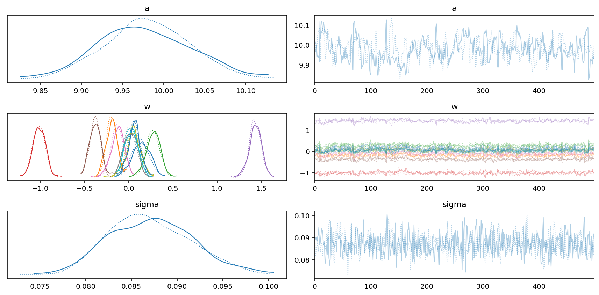
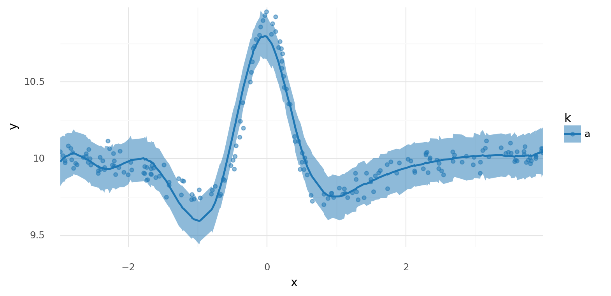
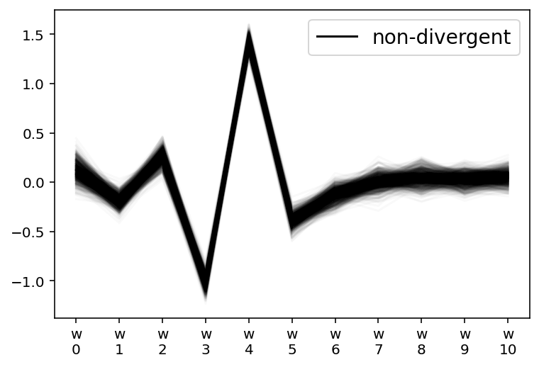
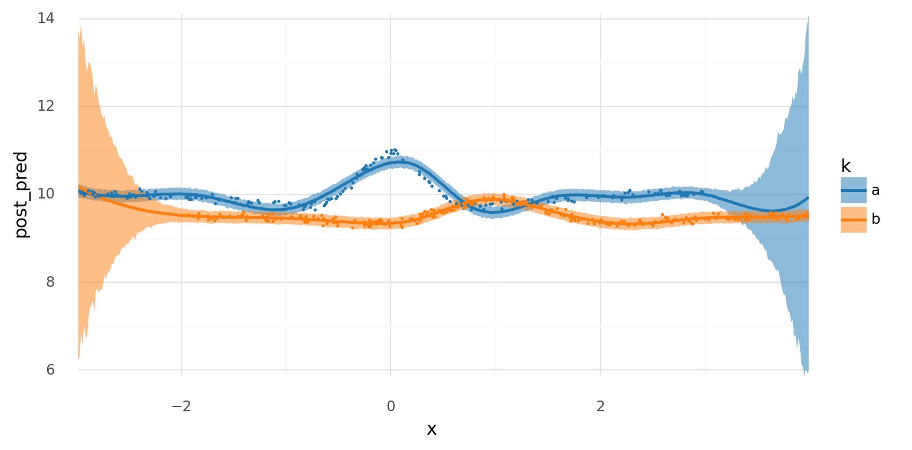
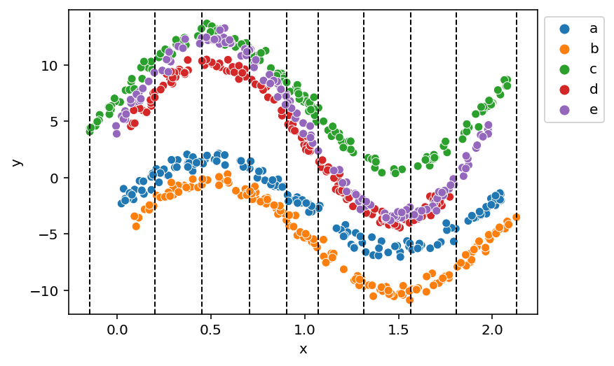

## Table of Contents

1. [Introduction](#introduction)
1. [Setup](#setup)
1. [One group](#one-group)
1. [Two groups: single set of weights](#two-groups-single-set-of-weights)
1. [Two groups: separate spline bases and per-group weights](#two-groups-separate-spline-bases-and-per-group-weights)
1. [Two groups: single spline basis and per-group weights](#two-groups-single-spline-basis-and-per-group-weights)
1. [Two groups: per-group weights with hierarchical prior](#two-groups-per-group-weights-with-hierarchical-prior)
1. [One group: multivariate-normal prior on weights](#one-group-multivariate-normal-prior-on-weights)
1. [Two group: multivariate normal prior on weights](#two-group-multivariate-normal-prior-on-weights)
1. [Session info](#session-info)

## Introduction

This was my second round of experimenting with fitting splines in PyMC (note that I used version 4 that is still in beta).
In my [first post about splines](), I went into more depth detailing what a spline is and how to construct the basis and model.
Here, I conducted more of an open exploration and experimentation so my comments were limited and mostly aimed to distinguish between the models and describe their pros and cons.

My primary objective for this round was to fit multi-level/hierarchical spline models.
I worked up from a single spline fit to a single curve to fitting two curves with a hierarchical model and multivariate normal distribution on the spline parameters.

>If you have any follow up questions or recommendations, *please email me or leave a comment at the bottom of the post*.
> I am no expert statistical modeler and am still trying to learn about modeling splines in complex models
> I would greatly appreciate any feedback or suggestions.

## Setup

```python
import re
from dataclasses import dataclass
from pathlib import Path
from typing import Optional

import arviz as az
import janitor  # noqa: F401
import matplotlib.pyplot as plt
import numpy as np
import pandas as pd
import plotnine as gg
import pymc as pm
import pymc.math as pmmath
import scipy.stats as st
import seaborn as sns
from aesara import tensor as at
from patsy import DesignMatrix, build_design_matrices, dmatrix
```

```python
# Set default theme for 'plotnine'.
gg.theme_set(gg.theme_minimal() + gg.theme(figure_size=(8, 4)))
%matplotlib inline
%config InlineBackend.figure_format='retina'

# Constants
RANDOM_SEED = 847
HDI_PROB = 0.89
```

```python
pm.__version__
```

    '4.0.0b2'

## One group

To begin, I started with just fitting a single spline to a single curve.
For most of this notebook, I used difference of Gaussians to create non-linear curves.

### Data

The data is just a difference of Gaussian curves.
I created the `ModelData` data class to organize the data and corresponding spline information.

```python
@dataclass
class ModelData:
    """Modeling data."""

    data: pd.DataFrame
    B: DesignMatrix
    knots: np.ndarray
```

```python
def diff_of_gaussians(
    x: np.ndarray,
    mus: tuple[float, float],
    sds: tuple[float, float],
    noise: float,
    y_offset: float = 0.0,
) -> pd.DataFrame:
    y = (
        st.norm.pdf(x, mus[0], sds[0])
        - st.norm.pdf(x, mus[1], sds[1])
        + np.random.normal(0, noise, size=len(x))
    )
    return pd.DataFrame({"x": x, "y": y + y_offset})
```

```python
group_pal = {
    "a": "#1F77B4",
    "b": "#FF7F0E",
    "c": "#2CA02C",
    "d": "#D62728",
    "e": "#9467BD",
}
```

```python
np.random.seed(RANDOM_SEED)

x = np.random.uniform(-3, 4, 200)
data = diff_of_gaussians(x, (0, 0), (0.3, 1), 0.05, y_offset=10)

sns.scatterplot(data=data, x="x", y="y");
```


### Spline basis

I used the ['patsy'](https://patsy.readthedocs.io/en/latest/spline-regression.html) library to build a the B-spline bases used in this notebook.
The `dmatrix()` function builds a design matrix for the data $x$ using the modeling syntax from R.
I built a wrapper around this function to help keep the various splines I build below consistent.

In some cases, I wanted to include the basis intercept in the design matrix and sometimes I didn't.
The actual parameter was always included in the model, but sometimes I wanted to make it a separate, explicit covariate in the model and other times I wanted to include it in the spline basis.
Understanding when to use the spline intercept and when not to took some time, so I tried to describe the logic in the models below.

Below, I built the spline basis for this first simple model and show some descriptive statistics for the knots and spline basis, followed by plotting the basis over the data $x$.

```python
def make_knot_list(data: pd.DataFrame, num_knots: int = 10) -> np.ndarray:
    """Use the quntiles of the data to define knots for a spline."""
    return np.quantile(data.x, np.linspace(0, 1, num_knots))


def build_spline(
    data: pd.DataFrame,
    knot_list: Optional[np.ndarray] = None,
    num_knots: int = 10,
    intercept: bool = False,
) -> tuple[np.ndarray, DesignMatrix]:
    """Build a spline basis."""
    if knot_list is None:
        knot_list = make_knot_list(data, num_knots)

    B = dmatrix(
        f"0 + bs(x, knots=knots, degree=3, include_intercept={intercept})",
        {"x": data.x.values, "knots": knot_list[1:-1]},
    )
    return knot_list, B
```

```python
knots, B = build_spline(data, intercept=False)
single_curve_data = ModelData(data=data, B=B, knots=knots)
```

```python
single_curve_data.knots
```

    array([-2.98089976, -2.36504627, -1.67490314, -0.72551484, -0.04744339,
            0.50477523,  1.30390392,  2.31655179,  3.43279987,  3.97389701])

```python
single_curve_data.B
```

    DesignMatrix with shape (200, 11)
      Columns:
        ['bs(x, knots=knots, degree=3, include_intercept=False)[0]',
         'bs(x, knots=knots, degree=3, include_intercept=False)[1]',
         'bs(x, knots=knots, degree=3, include_intercept=False)[2]',
         'bs(x, knots=knots, degree=3, include_intercept=False)[3]',
         'bs(x, knots=knots, degree=3, include_intercept=False)[4]',
         'bs(x, knots=knots, degree=3, include_intercept=False)[5]',
         'bs(x, knots=knots, degree=3, include_intercept=False)[6]',
         'bs(x, knots=knots, degree=3, include_intercept=False)[7]',
         'bs(x, knots=knots, degree=3, include_intercept=False)[8]',
         'bs(x, knots=knots, degree=3, include_intercept=False)[9]',
         'bs(x, knots=knots, degree=3, include_intercept=False)[10]']
      Terms:
        'bs(x, knots=knots, degree=3, include_intercept=False)' (columns 0:11)
      (to view full data, use np.asarray(this_obj))

```python
np.asarray(single_curve_data.B).shape
```

    (200, 11)

```python
single_curve_data.data.shape
```

    (200, 2)

```python
def plot_spline_basis(model_data: ModelData) -> gg.ggplot:
    basis_df = (
        pd.DataFrame(model_data.B)
        .reset_index(drop=False)
        .assign(x=model_data.data.x.values)
        .pivot_longer(index=["index", "x"], names_to="basis", values_to="density")
    )

    return (
        gg.ggplot(basis_df, gg.aes(x="x", y="density", color="basis"))
        + gg.geom_line()
        + gg.geom_vline(xintercept=model_data.knots, color="gray", linetype="--")
        + gg.theme(legend_position="none")
    )
```

```python
plot_spline_basis(single_curve_data)
```


    <ggplot: (336642039)>

### Model #1

Again, this is a simple first model with a global intercept $a$ and spline "weights" $\mathbf{w}$.
I built the spline basis with 10 knots and *without* the intercept in the design matrix, instead including the intercept explicitly as $a$.
Because I do not include the intercept in the design matrix, there are $N=11$ dimensions on the spline parameter: one between each knot plus one at the end.

$$
\begin{aligned}
y &\sim Normal(\mu, \sigma) \\\\
\mu &= a + \mathbf{B} \mathbf{w}^\text{T} \\\\
a &\sim N(0, 5) \\\\
w_n &\sim N(0, 5) \quad \forall i \in {1, ..., N} \\\\
\end{aligned}
$$

```python
def build_model1(model_data: ModelData) -> pm.Model:
    """Simple model for a single spline curve."""
    df = model_data.data
    B = np.asarray(model_data.B)
    B_dim = B.shape[1]
    with pm.Model(rng_seeder=RANDOM_SEED) as model:
        a = pm.Normal("a", 0, 5)
        w = pm.Normal("w", 0, 5, shape=B_dim)
        mu = pm.Deterministic("mu", a + pmmath.dot(B, w.T))
        sigma = pm.Gamma("sigma", 2, 0.5)
        y = pm.Normal("y", mu, sigma, observed=df.y)
    return model
```

```python
pm.model_to_graphviz(build_model1(single_curve_data))
```


### Prior predictive

To demonstrate the flexibility of the model, I pulled some prior predictive samples from the model and plotted them below.
Note how the spline can be shifted vertically – they would instead by fixed near 0 if there was no intercept in the design matrix and no explicit intercept in $\mu$.

```python
def build_new_data(model_data: ModelData, n_x: int = 500) -> ModelData:
    """Build new data for predictions by a model."""
    x = model_data.data.x
    new_data = pd.DataFrame({"x": np.linspace(x.min(), x.max(), num=n_x)}).assign(y=0)
    new_B = build_design_matrices(
        [model_data.B.design_info],
        {"x": new_data.x.values, "knots": model_data.knots[1:-1]},
    )[0]
    return ModelData(data=new_data, B=new_B, knots=model_data.knots.copy())
```

```python
def plot_prior(
    prior_pred: az.InferenceData, var_name: str, data: pd.DataFrame, alpha: float = 1.0
) -> None:
    """Plot samples from a prior predictive distribution."""
    if var_name == "y":
        var_prior = prior_pred.prior_predictive[var_name].values
    else:
        var_prior = prior_pred.prior[var_name].values
    var_prior = var_prior.squeeze()
    prior_df = (
        pd.DataFrame(var_prior.T)
        .reset_index(drop=False)
        .assign(x=data.x)
        .pivot_longer(["index", "x"], names_to="prior_sample")
        .astype({"prior_sample": str})
    )

    sns.lineplot(
        data=prior_df, x="x", y="value", hue="prior_sample", legend=None, alpha=alpha
    )
    plt.show()
```

```python
new_single_curve_data = build_new_data(single_curve_data)
```

```python
with build_model1(new_single_curve_data):
    m1_prior_pred = pm.sample_prior_predictive(samples=10, return_inferencedata=True)
```

Below are the prior samples for $\mu$ across the input range.

```python
plot_prior(m1_prior_pred, "mu", data=new_single_curve_data.data)
```


These are the same prior samples, but now including "noise" in the likelihood.
These can be thought of as example data that the model would predict before seeing any real data.

```python
plot_prior(m1_prior_pred, "y", data=new_single_curve_data.data, alpha=0.6)
```


### Sample from posterior

For consistency, I used the sample sampling arguments for PyMC in each of the models (except for some of the more complex models at the end).
If I were using these models for a real analysis, I would likely use more tuning and posterior draws and 4 chains, but to speed-up the notebook, I limited them to 500 each and only sampled 2 chains.

```python
pm_sample_kwargs = {
    "draws": 500,
    "tune": 500,
    "chains": 2,
    "cores": 2,
    "target_accept": 0.95,
    "return_inferencedata": True,
}
pm_ppc_kwargs = {
    "extend_inferencedata": True,
    "progressbar": False,
}
```

```python
with build_model1(single_curve_data):
    m1_trace = pm.sample(**pm_sample_kwargs)
    pm.sample_posterior_predictive(m1_trace, **pm_ppc_kwargs)
```

    Auto-assigning NUTS sampler...
    Initializing NUTS using jitter+adapt_diag...
    Multiprocess sampling (2 chains in 2 jobs)
    NUTS: [a, w, sigma]

<style>
    /*Turns off some styling*/
    progress {
        /*gets rid of default border in Firefox and Opera.*/
        border: none;
        /*Needs to be in here for Safari polyfill so background images work as expected.*/
        background-size: auto;
    }
    .progress-bar-interrupted, .progress-bar-interrupted::-webkit-progress-bar {
        background: #F44336;
    }
</style>

<div>
  <progress value='2000' class='' max='2000' style='width:300px; height:20px; vertical-align: middle;'></progress>
  100.00% [2000/2000 00:10<00:00 Sampling 2 chains, 0 divergences]
</div>

    Sampling 2 chains for 500 tune and 500 draw iterations (1_000 + 1_000 draws total) took 24 seconds.
    The estimated number of effective samples is smaller than 200 for some parameters.

### Posterior analysis

The posterior distributions for the key parameters in this first model look smooth and there were no divergences.
Some of the $\widehat{R}$ values are a 1.01 or 1.02, but increasing the tuning steps or `target_accept` would probably fix that at the cost of longer runtime.

```python
az.plot_trace(m1_trace, var_names=["~mu"])
plt.tight_layout();
```



```python
az.plot_parallel(m1_trace, var_names=["w"]);
```


```python
az.summary(m1_trace, var_names=["~mu"])
```

<div>
<style scoped>
    .dataframe tbody tr th:only-of-type {
        vertical-align: middle;
    }

    .dataframe tbody tr th {
        vertical-align: top;
    }

    .dataframe thead th {
        text-align: right;
    }
</style>
<table border="1" class="dataframe">
  <thead>
    <tr style="text-align: right;">
      <th></th>
      <th>mean</th>
      <th>sd</th>
      <th>hdi_3%</th>
      <th>hdi_97%</th>
      <th>mcse_mean</th>
      <th>mcse_sd</th>
      <th>ess_bulk</th>
      <th>ess_tail</th>
      <th>r_hat</th>
    </tr>
  </thead>
  <tbody>
    <tr>
      <th>a</th>
      <td>9.979</td>
      <td>0.054</td>
      <td>9.886</td>
      <td>10.084</td>
      <td>0.004</td>
      <td>0.003</td>
      <td>149.0</td>
      <td>275.0</td>
      <td>1.01</td>
    </tr>
    <tr>
      <th>w[0]</th>
      <td>0.136</td>
      <td>0.098</td>
      <td>-0.058</td>
      <td>0.309</td>
      <td>0.006</td>
      <td>0.004</td>
      <td>249.0</td>
      <td>368.0</td>
      <td>1.01</td>
    </tr>
    <tr>
      <th>w[1]</th>
      <td>-0.192</td>
      <td>0.061</td>
      <td>-0.312</td>
      <td>-0.082</td>
      <td>0.004</td>
      <td>0.003</td>
      <td>236.0</td>
      <td>411.0</td>
      <td>1.02</td>
    </tr>
    <tr>
      <th>w[2]</th>
      <td>0.275</td>
      <td>0.080</td>
      <td>0.133</td>
      <td>0.429</td>
      <td>0.005</td>
      <td>0.003</td>
      <td>292.0</td>
      <td>404.0</td>
      <td>1.00</td>
    </tr>
    <tr>
      <th>w[3]</th>
      <td>-1.012</td>
      <td>0.068</td>
      <td>-1.139</td>
      <td>-0.894</td>
      <td>0.004</td>
      <td>0.003</td>
      <td>239.0</td>
      <td>392.0</td>
      <td>1.01</td>
    </tr>
    <tr>
      <th>w[4]</th>
      <td>1.431</td>
      <td>0.068</td>
      <td>1.302</td>
      <td>1.563</td>
      <td>0.005</td>
      <td>0.003</td>
      <td>212.0</td>
      <td>376.0</td>
      <td>1.01</td>
    </tr>
    <tr>
      <th>w[5]</th>
      <td>-0.379</td>
      <td>0.062</td>
      <td>-0.492</td>
      <td>-0.267</td>
      <td>0.004</td>
      <td>0.003</td>
      <td>273.0</td>
      <td>500.0</td>
      <td>1.01</td>
    </tr>
    <tr>
      <th>w[6]</th>
      <td>-0.125</td>
      <td>0.072</td>
      <td>-0.256</td>
      <td>0.011</td>
      <td>0.005</td>
      <td>0.003</td>
      <td>210.0</td>
      <td>295.0</td>
      <td>1.00</td>
    </tr>
    <tr>
      <th>w[7]</th>
      <td>0.016</td>
      <td>0.073</td>
      <td>-0.116</td>
      <td>0.143</td>
      <td>0.004</td>
      <td>0.003</td>
      <td>320.0</td>
      <td>758.0</td>
      <td>1.01</td>
    </tr>
    <tr>
      <th>w[8]</th>
      <td>0.053</td>
      <td>0.081</td>
      <td>-0.098</td>
      <td>0.207</td>
      <td>0.005</td>
      <td>0.003</td>
      <td>297.0</td>
      <td>351.0</td>
      <td>1.00</td>
    </tr>
    <tr>
      <th>w[9]</th>
      <td>0.031</td>
      <td>0.070</td>
      <td>-0.089</td>
      <td>0.161</td>
      <td>0.005</td>
      <td>0.004</td>
      <td>184.0</td>
      <td>480.0</td>
      <td>1.02</td>
    </tr>
    <tr>
      <th>w[10]</th>
      <td>0.062</td>
      <td>0.069</td>
      <td>-0.065</td>
      <td>0.195</td>
      <td>0.004</td>
      <td>0.003</td>
      <td>287.0</td>
      <td>383.0</td>
      <td>1.00</td>
    </tr>
    <tr>
      <th>sigma</th>
      <td>0.087</td>
      <td>0.005</td>
      <td>0.079</td>
      <td>0.096</td>
      <td>0.000</td>
      <td>0.000</td>
      <td>697.0</td>
      <td>669.0</td>
      <td>1.01</td>
    </tr>
  </tbody>
</table>
</div>

```python
az.plot_forest(m1_trace, var_names=["a", "w"], hdi_prob=HDI_PROB);
```


Below are plots of $\mu$ and posterior predictions across the range of $x$.
We can see that this model fit the data fairly well.
There is a bit of a discrepancy before the major peak that could be remedied by increasing the number of knots in the spline, but it shall suffice for our purposes here.

```python
def _style_posterior_plot(plot: gg.ggplot) -> gg.ggplot:
    return (
        plot
        + gg.scale_x_continuous(expand=(0, 0))
        + gg.scale_y_continuous(expand=(0, 0.02))
        + gg.scale_color_manual(group_pal)
        + gg.scale_fill_manual(group_pal)
    )


def plot_posterior_mu(
    trace: az.InferenceData, data: pd.DataFrame, pt_alpha: float = 0.5
) -> gg.ggplot:
    """Plot posterior distirbution for `mu` alongside the raw data."""
    mu_post_df = (
        az.summary(trace, var_names="mu", hdi_prob=HDI_PROB, kind="stats")
        .reset_index(drop=True)
        .merge(data.copy(), left_index=True, right_index=True)
    )

    if "k" not in data.columns:
        mu_post_df["k"] = "a"

    p = (
        gg.ggplot(mu_post_df, gg.aes(x="x"))
        + gg.geom_point(gg.aes(y="y", color="k"), alpha=pt_alpha)
        + gg.geom_ribbon(gg.aes(ymin="hdi_5.5%", ymax="hdi_94.5%", fill="k"), alpha=0.5)
        + gg.geom_line(gg.aes(y="mean", color="k"), size=0.5)
    )
    return _style_posterior_plot(p)
```

```python
plot_posterior_mu(m1_trace, data=single_curve_data.data)
```


    <ggplot: (340754673)>

```python
def summarize_ppc(trace: az.InferenceData, data: pd.DataFrame) -> pd.DataFrame:
    """Summarize a posterior predictive distribution."""
    post_pred = trace.posterior_predictive["y"].values.reshape(-1, data.shape[0])
    ppc_avg = post_pred.mean(0)
    ppc_hdi = az.hdi(post_pred, hdi_prob=HDI_PROB)

    ppc_df = data.copy().assign(
        post_pred=ppc_avg, hdi_low=ppc_hdi[:, 0], hdi_high=ppc_hdi[:, 1]
    )
    return ppc_df


def plot_ppc(
    ppc_summary: pd.DataFrame, plot_pts: bool = True, pt_alpha: float = 0.5
) -> gg.ggplot:
    """Plot a posterior predictive distribution."""
    if "k" not in ppc_summary.columns:
        ppc_summary["k"] = np.repeat(["a"], ppc_summary.shape[0])

    p = gg.ggplot(ppc_summary, gg.aes(x="x"))

    if plot_pts:
        p += gg.geom_point(gg.aes(y="y", color="k"), alpha=pt_alpha)

    p = (
        p
        + gg.geom_ribbon(gg.aes(ymin="hdi_low", ymax="hdi_high", fill="k"), alpha=0.5)
        + gg.geom_line(gg.aes(y="post_pred", color="k"), size=1)
    )
    return _style_posterior_plot(p)


def summarize_and_plot_ppc(
    trace: az.InferenceData,
    data: pd.DataFrame,
    plot_pts: bool = True,
    pt_alpha: float = 0.5,
) -> gg.ggplot:
    """Summarize and plot the posterior predictive distribution."""
    ppc_summary = summarize_ppc(trace, data)
    return plot_ppc(ppc_summary, plot_pts=plot_pts, pt_alpha=pt_alpha)
```

```python
summarize_and_plot_ppc(m1_trace, single_curve_data.data)
```

    /var/folders/r4/qpcdgl_14hbd412snp1jnv300000gn/T/ipykernel_16319/1935723833.py:5: FutureWarning: hdi currently interprets 2d data as (draw, shape) but this will change in a future release to (chain, draw) for coherence with other functions



    <ggplot: (340754529)>

### Comments

Overall, this first model fit a single curve very well, but we are interested in fitting multiple curves.

## Two groups: single set of weights

Moving closer to the main purpose of this experimentation, we will now build a data set with two curves representing data from two groups or classes $k = \{\text{a}, \text{b}\}$.
Both of the curves are different differences of Gaussians, with a slight vertical shift.
I added the vertical shift to force the modeling of a group-specific intercept as well as a global intercept.
It is worth noting that managing these intercepts in the models was at times tricky and dependent upon how the spline basis was built.
I will describe this more throughout the rest of the notebook.

For this first model with two groups, I will "naively" fit the same model as above (only a single set of spline weights) to demonstrate why we need a multi-level approach.

### Data

Again, the two curves are vertically and horizontally offset difference of Gaussians.

```python
np.random.seed(RANDOM_SEED)

x1 = np.random.uniform(-3, 3, 200)
d1 = diff_of_gaussians(x1, (0, 0), (0.3, 1), 0.05, y_offset=10).assign(k="a")
x2 = np.random.uniform(-3, 3, 300) + 1
d2 = diff_of_gaussians(x2, (1, 1), (0.5, 1), 0.05, y_offset=9.5).assign(k="b")

data = pd.concat([d1, d2]).reset_index(drop=True)
data["k"] = pd.Categorical(data["k"], categories=["a", "b"], ordered=True)

sns.scatterplot(data=data, x="x", y="y", hue="k", palette=group_pal);
```


### Spline basis

```python
knots, B = build_spline(data)
two_spline_data = ModelData(data=data.copy(), B=B, knots=knots)
```

### Sample from posterior

```python
with build_model1(two_spline_data):
    m1_trace2 = pm.sample(**pm_sample_kwargs)
    pm.sample_posterior_predictive(m1_trace2, **pm_ppc_kwargs)
```

    Auto-assigning NUTS sampler...
    Initializing NUTS using jitter+adapt_diag...
    Multiprocess sampling (2 chains in 2 jobs)
    NUTS: [a, w, sigma]

<style>
    /*Turns off some styling*/
    progress {
        /*gets rid of default border in Firefox and Opera.*/
        border: none;
        /*Needs to be in here for Safari polyfill so background images work as expected.*/
        background-size: auto;
    }
    .progress-bar-interrupted, .progress-bar-interrupted::-webkit-progress-bar {
        background: #F44336;
    }
</style>

<div>
  <progress value='2000' class='' max='2000' style='width:300px; height:20px; vertical-align: middle;'></progress>
  100.00% [2000/2000 00:11<00:00 Sampling 2 chains, 0 divergences]
</div>

    Sampling 2 chains for 500 tune and 500 draw iterations (1_000 + 1_000 draws total) took 22 seconds.
    The estimated number of effective samples is smaller than 200 for some parameters.

### Posterior analysis

It is visible from the shapes of the posterior distributions and mixing of the chains that this model did not fit as easily as the first.
This is expected because the two curves in the data are quite different from each other, at times moving in different directions.

```python
az.plot_trace(m1_trace2, var_names=["~mu"])
plt.tight_layout();
```


From the parallel plot below, we can see that $w_{3-6}$ had a higher level of uncertainty.
This is because this is where the two curves are most different and at odds with each other.

```python
az.plot_parallel(m1_trace2, var_names=["w"]);
```


```python
az.plot_forest(m1_trace2, var_names="w", hdi_prob=HDI_PROB, combined=True);
```


```python
az.summary(m1_trace2, var_names=["~mu"])
```

<div>
<style scoped>
    .dataframe tbody tr th:only-of-type {
        vertical-align: middle;
    }

    .dataframe tbody tr th {
        vertical-align: top;
    }

    .dataframe thead th {
        text-align: right;
    }
</style>
<table border="1" class="dataframe">
  <thead>
    <tr style="text-align: right;">
      <th></th>
      <th>mean</th>
      <th>sd</th>
      <th>hdi_3%</th>
      <th>hdi_97%</th>
      <th>mcse_mean</th>
      <th>mcse_sd</th>
      <th>ess_bulk</th>
      <th>ess_tail</th>
      <th>r_hat</th>
    </tr>
  </thead>
  <tbody>
    <tr>
      <th>a</th>
      <td>9.989</td>
      <td>0.138</td>
      <td>9.734</td>
      <td>10.231</td>
      <td>0.010</td>
      <td>0.007</td>
      <td>181.0</td>
      <td>339.0</td>
      <td>1.01</td>
    </tr>
    <tr>
      <th>w[0]</th>
      <td>0.095</td>
      <td>0.271</td>
      <td>-0.384</td>
      <td>0.605</td>
      <td>0.018</td>
      <td>0.013</td>
      <td>226.0</td>
      <td>415.0</td>
      <td>1.01</td>
    </tr>
    <tr>
      <th>w[1]</th>
      <td>-0.164</td>
      <td>0.163</td>
      <td>-0.456</td>
      <td>0.162</td>
      <td>0.007</td>
      <td>0.005</td>
      <td>525.0</td>
      <td>682.0</td>
      <td>1.00</td>
    </tr>
    <tr>
      <th>w[2]</th>
      <td>-0.651</td>
      <td>0.184</td>
      <td>-0.999</td>
      <td>-0.331</td>
      <td>0.012</td>
      <td>0.009</td>
      <td>230.0</td>
      <td>354.0</td>
      <td>1.01</td>
    </tr>
    <tr>
      <th>w[3]</th>
      <td>-0.037</td>
      <td>0.155</td>
      <td>-0.337</td>
      <td>0.247</td>
      <td>0.010</td>
      <td>0.007</td>
      <td>253.0</td>
      <td>404.0</td>
      <td>1.00</td>
    </tr>
    <tr>
      <th>w[4]</th>
      <td>-0.174</td>
      <td>0.164</td>
      <td>-0.512</td>
      <td>0.102</td>
      <td>0.010</td>
      <td>0.007</td>
      <td>250.0</td>
      <td>415.0</td>
      <td>1.01</td>
    </tr>
    <tr>
      <th>w[5]</th>
      <td>-0.209</td>
      <td>0.168</td>
      <td>-0.510</td>
      <td>0.122</td>
      <td>0.011</td>
      <td>0.008</td>
      <td>237.0</td>
      <td>516.0</td>
      <td>1.00</td>
    </tr>
    <tr>
      <th>w[6]</th>
      <td>-0.180</td>
      <td>0.176</td>
      <td>-0.511</td>
      <td>0.138</td>
      <td>0.011</td>
      <td>0.008</td>
      <td>276.0</td>
      <td>378.0</td>
      <td>1.01</td>
    </tr>
    <tr>
      <th>w[7]</th>
      <td>-0.605</td>
      <td>0.170</td>
      <td>-0.928</td>
      <td>-0.295</td>
      <td>0.010</td>
      <td>0.007</td>
      <td>274.0</td>
      <td>542.0</td>
      <td>1.01</td>
    </tr>
    <tr>
      <th>w[8]</th>
      <td>-0.012</td>
      <td>0.197</td>
      <td>-0.382</td>
      <td>0.343</td>
      <td>0.010</td>
      <td>0.008</td>
      <td>366.0</td>
      <td>511.0</td>
      <td>1.00</td>
    </tr>
    <tr>
      <th>w[9]</th>
      <td>-0.842</td>
      <td>0.205</td>
      <td>-1.198</td>
      <td>-0.451</td>
      <td>0.010</td>
      <td>0.007</td>
      <td>388.0</td>
      <td>557.0</td>
      <td>1.00</td>
    </tr>
    <tr>
      <th>w[10]</th>
      <td>-0.374</td>
      <td>0.193</td>
      <td>-0.705</td>
      <td>-0.001</td>
      <td>0.012</td>
      <td>0.009</td>
      <td>246.0</td>
      <td>382.0</td>
      <td>1.01</td>
    </tr>
    <tr>
      <th>sigma</th>
      <td>0.319</td>
      <td>0.011</td>
      <td>0.299</td>
      <td>0.339</td>
      <td>0.000</td>
      <td>0.000</td>
      <td>627.0</td>
      <td>585.0</td>
      <td>1.01</td>
    </tr>
  </tbody>
</table>
</div>

The model just took the average of the two curves ("split the baby").

```python
plot_posterior_mu(m1_trace2, data=two_spline_data.data)
```


    <ggplot: (339788782)>

```python
summarize_and_plot_ppc(m1_trace2, two_spline_data.data)
```

    /var/folders/r4/qpcdgl_14hbd412snp1jnv300000gn/T/ipykernel_16319/1935723833.py:5: FutureWarning: hdi currently interprets 2d data as (draw, shape) but this will change in a future release to (chain, draw) for coherence with other functions


    <ggplot: (339219890)>

### Comments

The purpose of this initial demonstration of fitting two distinct curves with a single set of spline weights was to motivate the following models that include a set of weights per group $k$.

## Two groups: separate spline bases and per-group weights

One way to jointly model multiple curves is to build a separate spline basis per group and include separate spline weights per group in the model.
This technically works, but has some drawbacks I discussed afterwards.

### Spline basis

For this model, a distinct spline basis was created for each group.
Notably, each spline basis has a different set of knots (though the same number) – this helps substantially with model fit.
To implement this, I basically treated the groups as separate data sets and built `ModelData` objects for them separately.

I decided to not include the intercepts in each spline and instead model them explicitly as $\bf{a}$ in the model.
I think it would have been more or less equivalent to include the spline intercepts in the design matrices and then add a single global intercept $a$ in the model.

```python
multi_model_data: list[ModelData] = []
for k in two_spline_data.data.k.unique():
    data_k = two_spline_data.data.copy().query(f"k=='{k}'").reset_index(drop=True)
    knots_k, B_k = build_spline(data_k)
    md = ModelData(data=data_k, B=B_k, knots=knots_k)
    multi_model_data.append(md)

print(len(multi_model_data))
```

    2

```python
for md in multi_model_data:
    print(md.B.shape)
```

    (200, 11)
    (300, 11)

```python
def stack_splines(datas: list[ModelData]) -> np.ndarray:
    """Stack the spline arrays from a collection of ModelData."""
    return np.vstack([np.asarray(md.B) for md in datas])


def stack_data(datas: list[ModelData]) -> pd.DataFrame:
    """Stack the data from a collection of ModelData."""
    return pd.concat([md.data for md in datas]).reset_index(drop=True)


stacked_B = stack_splines(multi_model_data)
stacked_data = stack_data(multi_model_data)

basis_df = (
    pd.DataFrame(stacked_B)
    .assign(k=stacked_data.k.values, x=stacked_data.x.values)
    .pivot_longer(["k", "x"], names_to="basis", values_to="density")
    .assign(basis=lambda d: [f"{k}: {x}" for x, k in zip(d.basis, d.k)])
)
(
    gg.ggplot(basis_df, gg.aes(x="x", color="k"))
    + gg.geom_line(gg.aes(group="basis", y="density"), alpha=0.5, size=1)
    + gg.geom_rug(data=stacked_data, alpha=0.5, sides="b")
    + gg.scale_color_manual(values=group_pal)
)
```


    <ggplot: (339223266)>

### Model #2

In theory, I could use a different number of knots per spline basis, but I forced them to have the same number of knots so I could have a 2-dimensional ($K$ knots $\times$ $N$ groups) variable $\bf{w}$.

$$
\begin{aligned}
y &\sim N(\mu, \sigma) \\\\
\mu_k &= \mathbf{a}_k + \mathbf{B}_k \mathbf{w}_k^\text{T} \\\\
a_k &\sim N(0, 5) \quad \forall k \in K \\\\
w _ {i,k} &\sim N(0, 2) \quad \forall k \in K, \forall i \in {1, \dots, N}
\end{aligned}
$$

```python
def build_model2(datas: list[ModelData]) -> pm.Model:
    """Model separate splines."""
    y_hat = np.mean([d.data.y.mean() for d in datas])
    B_dim = datas[0].B.shape[1]
    for md in datas:
        assert md.B.shape[1] == B_dim, "Splines have different number of features."

    B_k = [np.asarray(md.B) for md in datas]
    df = stack_data(datas)
    k = df.k.cat.codes.values.astype(int)
    n_k = len(df.k.cat.categories)

    with pm.Model(rng_seeder=RANDOM_SEED) as model:
        a = pm.Normal("a", y_hat, 5, shape=n_k)
        w = pm.Normal("w", 0, 2, shape=(B_dim, n_k))
        _mu = []
        for i in range(n_k):
            _mu.append(pmmath.dot(B_k[i], w[:, i]).reshape((-1, 1)))
        mu = pm.Deterministic("mu", a[k] + at.vertical_stack(*_mu).squeeze())
        sigma = pm.Gamma("sigma", 2, 0.5)
        y = pm.Normal("y", mu, sigma, observed=df.y.values)
    return model
```

```python
m2 = build_model2(multi_model_data)
pm.model_to_graphviz(m2)
```


### Sample from posterior

```python
with build_model2(multi_model_data):
    m2_trace = pm.sample(**pm_sample_kwargs)
    pm.sample_posterior_predictive(m2_trace, **pm_ppc_kwargs)
```

    Auto-assigning NUTS sampler...
    Initializing NUTS using jitter+adapt_diag...
    Multiprocess sampling (2 chains in 2 jobs)
    NUTS: [a, w, sigma]

<style>
    /*Turns off some styling*/
    progress {
        /*gets rid of default border in Firefox and Opera.*/
        border: none;
        /*Needs to be in here for Safari polyfill so background images work as expected.*/
        background-size: auto;
    }
    .progress-bar-interrupted, .progress-bar-interrupted::-webkit-progress-bar {
        background: #F44336;
    }
</style>

<div>
  <progress value='2000' class='' max='2000' style='width:300px; height:20px; vertical-align: middle;'></progress>
  100.00% [2000/2000 00:25<00:00 Sampling 2 chains, 0 divergences]
</div>

    Sampling 2 chains for 500 tune and 500 draw iterations (1_000 + 1_000 draws total) took 38 seconds.

### Posterior analysis

The model actually fits very well.
This shouldn't be surprising though because it is effectively just two duplicates of the first model, one for each curve.
The parameters are not linked in any way (other than $\sigma$ which is the same value here anyways).

```python
az.plot_trace(m2_trace, var_names=["~mu"])
plt.tight_layout();
```


```python
az.summary(m2_trace, var_names=["~mu"], hdi_prob=HDI_PROB)
```

<div>
<style scoped>
    .dataframe tbody tr th:only-of-type {
        vertical-align: middle;
    }

    .dataframe tbody tr th {
        vertical-align: top;
    }

    .dataframe thead th {
        text-align: right;
    }
</style>
<table border="1" class="dataframe">
  <thead>
    <tr style="text-align: right;">
      <th></th>
      <th>mean</th>
      <th>sd</th>
      <th>hdi_5.5%</th>
      <th>hdi_94.5%</th>
      <th>mcse_mean</th>
      <th>mcse_sd</th>
      <th>ess_bulk</th>
      <th>ess_tail</th>
      <th>r_hat</th>
    </tr>
  </thead>
  <tbody>
    <tr>
      <th>a[0]</th>
      <td>10.019</td>
      <td>0.043</td>
      <td>9.955</td>
      <td>10.090</td>
      <td>0.003</td>
      <td>0.002</td>
      <td>282.0</td>
      <td>400.0</td>
      <td>1.00</td>
    </tr>
    <tr>
      <th>a[1]</th>
      <td>9.519</td>
      <td>0.032</td>
      <td>9.469</td>
      <td>9.572</td>
      <td>0.002</td>
      <td>0.001</td>
      <td>308.0</td>
      <td>343.0</td>
      <td>1.00</td>
    </tr>
    <tr>
      <th>w[0, 0]</th>
      <td>-0.008</td>
      <td>0.080</td>
      <td>-0.126</td>
      <td>0.124</td>
      <td>0.004</td>
      <td>0.003</td>
      <td>344.0</td>
      <td>447.0</td>
      <td>1.01</td>
    </tr>
    <tr>
      <th>w[0, 1]</th>
      <td>-0.055</td>
      <td>0.062</td>
      <td>-0.159</td>
      <td>0.035</td>
      <td>0.003</td>
      <td>0.002</td>
      <td>372.0</td>
      <td>437.0</td>
      <td>1.00</td>
    </tr>
    <tr>
      <th>w[1, 0]</th>
      <td>-0.054</td>
      <td>0.046</td>
      <td>-0.133</td>
      <td>0.015</td>
      <td>0.002</td>
      <td>0.002</td>
      <td>460.0</td>
      <td>737.0</td>
      <td>1.00</td>
    </tr>
    <tr>
      <th>w[1, 1]</th>
      <td>-0.019</td>
      <td>0.040</td>
      <td>-0.085</td>
      <td>0.042</td>
      <td>0.002</td>
      <td>0.001</td>
      <td>677.0</td>
      <td>750.0</td>
      <td>1.00</td>
    </tr>
    <tr>
      <th>w[2, 0]</th>
      <td>-0.038</td>
      <td>0.061</td>
      <td>-0.132</td>
      <td>0.059</td>
      <td>0.003</td>
      <td>0.002</td>
      <td>414.0</td>
      <td>414.0</td>
      <td>1.00</td>
    </tr>
    <tr>
      <th>w[2, 1]</th>
      <td>-0.139</td>
      <td>0.048</td>
      <td>-0.218</td>
      <td>-0.069</td>
      <td>0.002</td>
      <td>0.002</td>
      <td>430.0</td>
      <td>472.0</td>
      <td>1.01</td>
    </tr>
    <tr>
      <th>w[3, 0]</th>
      <td>-0.306</td>
      <td>0.054</td>
      <td>-0.392</td>
      <td>-0.222</td>
      <td>0.003</td>
      <td>0.002</td>
      <td>381.0</td>
      <td>629.0</td>
      <td>1.00</td>
    </tr>
    <tr>
      <th>w[3, 1]</th>
      <td>-0.245</td>
      <td>0.038</td>
      <td>-0.309</td>
      <td>-0.188</td>
      <td>0.002</td>
      <td>0.001</td>
      <td>446.0</td>
      <td>471.0</td>
      <td>1.00</td>
    </tr>
    <tr>
      <th>w[4, 0]</th>
      <td>-0.274</td>
      <td>0.052</td>
      <td>-0.354</td>
      <td>-0.189</td>
      <td>0.003</td>
      <td>0.002</td>
      <td>363.0</td>
      <td>517.0</td>
      <td>1.00</td>
    </tr>
    <tr>
      <th>w[4, 1]</th>
      <td>0.305</td>
      <td>0.042</td>
      <td>0.243</td>
      <td>0.374</td>
      <td>0.002</td>
      <td>0.001</td>
      <td>434.0</td>
      <td>460.0</td>
      <td>1.01</td>
    </tr>
    <tr>
      <th>w[5, 0]</th>
      <td>1.472</td>
      <td>0.052</td>
      <td>1.388</td>
      <td>1.551</td>
      <td>0.003</td>
      <td>0.002</td>
      <td>389.0</td>
      <td>538.0</td>
      <td>1.00</td>
    </tr>
    <tr>
      <th>w[5, 1]</th>
      <td>0.453</td>
      <td>0.040</td>
      <td>0.385</td>
      <td>0.513</td>
      <td>0.002</td>
      <td>0.001</td>
      <td>425.0</td>
      <td>460.0</td>
      <td>1.00</td>
    </tr>
    <tr>
      <th>w[6, 0]</th>
      <td>-0.960</td>
      <td>0.054</td>
      <td>-1.050</td>
      <td>-0.875</td>
      <td>0.003</td>
      <td>0.002</td>
      <td>373.0</td>
      <td>526.0</td>
      <td>1.01</td>
    </tr>
    <tr>
      <th>w[6, 1]</th>
      <td>-0.352</td>
      <td>0.042</td>
      <td>-0.421</td>
      <td>-0.290</td>
      <td>0.002</td>
      <td>0.001</td>
      <td>445.0</td>
      <td>464.0</td>
      <td>1.00</td>
    </tr>
    <tr>
      <th>w[7, 0]</th>
      <td>0.231</td>
      <td>0.059</td>
      <td>0.132</td>
      <td>0.315</td>
      <td>0.003</td>
      <td>0.002</td>
      <td>408.0</td>
      <td>673.0</td>
      <td>1.00</td>
    </tr>
    <tr>
      <th>w[7, 1]</th>
      <td>-0.052</td>
      <td>0.042</td>
      <td>-0.121</td>
      <td>0.013</td>
      <td>0.002</td>
      <td>0.001</td>
      <td>420.0</td>
      <td>570.0</td>
      <td>1.00</td>
    </tr>
    <tr>
      <th>w[8, 0]</th>
      <td>-0.213</td>
      <td>0.062</td>
      <td>-0.307</td>
      <td>-0.111</td>
      <td>0.003</td>
      <td>0.002</td>
      <td>486.0</td>
      <td>351.0</td>
      <td>1.00</td>
    </tr>
    <tr>
      <th>w[8, 1]</th>
      <td>-0.076</td>
      <td>0.047</td>
      <td>-0.151</td>
      <td>-0.005</td>
      <td>0.002</td>
      <td>0.002</td>
      <td>492.0</td>
      <td>454.0</td>
      <td>1.00</td>
    </tr>
    <tr>
      <th>w[9, 0]</th>
      <td>0.066</td>
      <td>0.054</td>
      <td>-0.019</td>
      <td>0.155</td>
      <td>0.003</td>
      <td>0.002</td>
      <td>407.0</td>
      <td>535.0</td>
      <td>1.00</td>
    </tr>
    <tr>
      <th>w[9, 1]</th>
      <td>0.010</td>
      <td>0.049</td>
      <td>-0.073</td>
      <td>0.086</td>
      <td>0.002</td>
      <td>0.001</td>
      <td>605.0</td>
      <td>647.0</td>
      <td>1.00</td>
    </tr>
    <tr>
      <th>w[10, 0]</th>
      <td>-0.007</td>
      <td>0.053</td>
      <td>-0.088</td>
      <td>0.082</td>
      <td>0.003</td>
      <td>0.002</td>
      <td>366.0</td>
      <td>456.0</td>
      <td>1.00</td>
    </tr>
    <tr>
      <th>w[10, 1]</th>
      <td>-0.028</td>
      <td>0.046</td>
      <td>-0.105</td>
      <td>0.034</td>
      <td>0.002</td>
      <td>0.002</td>
      <td>446.0</td>
      <td>585.0</td>
      <td>1.00</td>
    </tr>
    <tr>
      <th>sigma</th>
      <td>0.064</td>
      <td>0.002</td>
      <td>0.061</td>
      <td>0.067</td>
      <td>0.000</td>
      <td>0.000</td>
      <td>1222.0</td>
      <td>545.0</td>
      <td>1.00</td>
    </tr>
  </tbody>
</table>
</div>

We can see that the intercept $\mathbf{a}$ has done its job by acting as a group-varying intercept allowing $\mathbf{w}$ to represent deviations from there.

```python
az.plot_forest(m2_trace, var_names=["a"], hdi_prob=HDI_PROB, combined=True);
```


```python
az.plot_forest(m2_trace, var_names=["w"], hdi_prob=HDI_PROB, combined=True);
```


From the plots of $\mu$ and the posterior predictive distribution below, this model fits the data very well.

```python
plot_posterior_mu(m2_trace, data=stacked_data)
```


    <ggplot: (339553344)>

```python
summarize_and_plot_ppc(m2_trace, stacked_data)
```

    /var/folders/r4/qpcdgl_14hbd412snp1jnv300000gn/T/ipykernel_16319/1935723833.py:5: FutureWarning: hdi currently interprets 2d data as (draw, shape) but this will change in a future release to (chain, draw) for coherence with other functions


    <ggplot: (340756836)>

### Comments

This model could suffice for many models dependent on the needs of the problem and the proposed data-generation process.
It fits quickly and well.

There are two main limitations of this approach:

1. The weights for each spline do not correspond to the same range of $x$ values, i.e. $w_1$ for group "a" does not correspond to the same region of $x$ that $w_1$ for group "b" does. Therefore, we cannot build a hierarchical level atop $\bf{w}$ that takes advantage of the spatial relationship of the parameters.
2. Though $x$ extends beyond 3, as evidenced by data for group "b," predictions in that region cannot be made for group "a" because it is beyond the spline's reach. Out-of-distribution predictions are often fraught in modeling splines, but in this case, we could logically want to use our understanding of group "b" to inform predictions of "a" up to values of $x=4$.

These are both alleviated in the next model.

## Two groups: single spline basis and per-group weights

This model is the same as the previous, but used a single spline basis for all of the data.
This solves the issues above by aligning the parameters $\mathbf{w}$ and extending the region of $x$ covered by both groups.

### Spline bases

For this model, I included the intercept in the spline basis.
This formed the varying intercept for each group and thus I only added a single global intercept $a$ to the model.

```python
df = two_spline_data.data.copy().reset_index(drop=True)
knots, joint_B = build_spline(df, intercept=True)
m3_data = ModelData(data=df, B=joint_B, knots=knots)
```

```python
plot_spline_basis(m3_data)
```


    <ggplot: (339928863)>

```python
basis_df = (
    pd.DataFrame(m3_data.B)
    .assign(k=m3_data.data.k.values, x=m3_data.data.x.values)
    .pivot_longer(["k", "x"], names_to="basis", values_to="density")
    .assign(basis=lambda d: [f"{k}: {x}" for x, k in zip(d.basis, d.k)])
)
(
    gg.ggplot(basis_df, gg.aes(x="x", color="k"))
    + gg.geom_line(gg.aes(group="basis", y="density"), alpha=0.5, size=1)
    + gg.geom_rug(data=m3_data.data, alpha=0.5, sides="b")
    + gg.scale_color_manual(values=group_pal)
)
```


    <ggplot: (340750153)>

### Model #3

For this model, I followed the second option described previously where I included the intercept in the spline basis and then added a single, global intercept $a$ in the model.
In this case, this pattern was required, otherwise there is weird behavior at the beginning of the spline for the group that has no data (group "b" in this case).

$$
\begin{aligned}
y &\sim N(\mu, \sigma) \\\\
\mu &= a + \mathbf{B}_k \mathbf{w}_k^\text{T} \\\\
a &\sim N(0, 5) \\\\
w _ {i,k} &\sim N(0, 2) \quad \forall k \in K, \forall i \in {1, \dots, N}
\end{aligned}
$$

While MCMC does not sample from this model as easily as when using two different spline bases, it avoids the drawbacks mentioned for the previous model.
Namely, we can make predictions for either group across the full observed range of $x$ (the range within the basis).

```python
def build_model3(model_data: ModelData) -> pm.Model:
    """Model multiple curves with the same spline basis."""
    B, df = np.asarray(model_data.B), model_data.data
    B_dim = B.shape[1]
    k = df.k.cat.codes.values.astype(int)
    n_k = len(df.k.cat.categories)
    with pm.Model(rng_seeder=RANDOM_SEED) as model:
        a = pm.Normal("a", df.y.mean(), 5)
        w = pm.Normal("w", 0, 2, shape=(B_dim, n_k))
        _mu = []
        for i in range(n_k):
            _mu.append(at.dot(B[k == i, :], w[:, i]).reshape((-1, 1)))
        mu = pm.Deterministic("mu", a + at.vertical_stack(*_mu).squeeze())
        sigma = pm.Gamma("sigma", 2, 0.5)
        y = pm.Normal("y", mu, sigma, observed=df.y.values)
    return model
```

```python
m3 = build_model3(m3_data)
pm.model_to_graphviz(m3)
```


### Sample from posterior

```python
with build_model3(m3_data):
    m3_trace = pm.sample(**pm_sample_kwargs)
    pm.sample_posterior_predictive(m3_trace, **pm_ppc_kwargs)
```

    Auto-assigning NUTS sampler...
    Initializing NUTS using jitter+adapt_diag...
    Multiprocess sampling (2 chains in 2 jobs)
    NUTS: [a, w, sigma]

<style>
    /*Turns off some styling*/
    progress {
        /*gets rid of default border in Firefox and Opera.*/
        border: none;
        /*Needs to be in here for Safari polyfill so background images work as expected.*/
        background-size: auto;
    }
    .progress-bar-interrupted, .progress-bar-interrupted::-webkit-progress-bar {
        background: #F44336;
    }
</style>

<div>
  <progress value='2000' class='' max='2000' style='width:300px; height:20px; vertical-align: middle;'></progress>
  100.00% [2000/2000 01:52<00:00 Sampling 2 chains, 0 divergences]
</div>

    Sampling 2 chains for 500 tune and 500 draw iterations (1_000 + 1_000 draws total) took 127 seconds.
    The chain reached the maximum tree depth. Increase max_treedepth, increase target_accept or reparameterize.
    The chain reached the maximum tree depth. Increase max_treedepth, increase target_accept or reparameterize.
    The estimated number of effective samples is smaller than 200 for some parameters.

### Posterior analysis

Note how the posterior distribution for the last and first value of $w$ for group "a" and "b," respectively, are very wide (most easily seen in the forest plot below).
This is because there is no data to inform these values and their posterior distribution is determined by their prior.
Also, this increased uncertainty had ill-effects on the posterior sampling of the intercept $a$ because there is some non-identifiability between the first spline parameter of group "b" and $a$.

```python
az.plot_trace(m3_trace, var_names=["~mu"])
plt.tight_layout();
```


```python
az.summary(m3_trace, var_names=["~mu"], hdi_prob=HDI_PROB)
```

<div>
<style scoped>
    .dataframe tbody tr th:only-of-type {
        vertical-align: middle;
    }

    .dataframe tbody tr th {
        vertical-align: top;
    }

    .dataframe thead th {
        text-align: right;
    }
</style>
<table border="1" class="dataframe">
  <thead>
    <tr style="text-align: right;">
      <th></th>
      <th>mean</th>
      <th>sd</th>
      <th>hdi_5.5%</th>
      <th>hdi_94.5%</th>
      <th>mcse_mean</th>
      <th>mcse_sd</th>
      <th>ess_bulk</th>
      <th>ess_tail</th>
      <th>r_hat</th>
    </tr>
  </thead>
  <tbody>
    <tr>
      <th>a</th>
      <td>9.776</td>
      <td>0.374</td>
      <td>9.233</td>
      <td>10.344</td>
      <td>0.038</td>
      <td>0.027</td>
      <td>100.0</td>
      <td>187.0</td>
      <td>1.01</td>
    </tr>
    <tr>
      <th>w[0, 0]</th>
      <td>0.307</td>
      <td>0.375</td>
      <td>-0.260</td>
      <td>0.867</td>
      <td>0.037</td>
      <td>0.026</td>
      <td>104.0</td>
      <td>189.0</td>
      <td>1.01</td>
    </tr>
    <tr>
      <th>w[0, 1]</th>
      <td>-0.062</td>
      <td>2.077</td>
      <td>-4.015</td>
      <td>2.783</td>
      <td>0.080</td>
      <td>0.078</td>
      <td>666.0</td>
      <td>431.0</td>
      <td>1.00</td>
    </tr>
    <tr>
      <th>w[1, 0]</th>
      <td>0.018</td>
      <td>0.378</td>
      <td>-0.557</td>
      <td>0.569</td>
      <td>0.038</td>
      <td>0.027</td>
      <td>100.0</td>
      <td>188.0</td>
      <td>1.01</td>
    </tr>
    <tr>
      <th>w[1, 1]</th>
      <td>-0.113</td>
      <td>0.486</td>
      <td>-0.904</td>
      <td>0.649</td>
      <td>0.038</td>
      <td>0.027</td>
      <td>167.0</td>
      <td>348.0</td>
      <td>1.01</td>
    </tr>
    <tr>
      <th>w[2, 0]</th>
      <td>0.560</td>
      <td>0.375</td>
      <td>-0.021</td>
      <td>1.113</td>
      <td>0.038</td>
      <td>0.027</td>
      <td>101.0</td>
      <td>196.0</td>
      <td>1.01</td>
    </tr>
    <tr>
      <th>w[2, 1]</th>
      <td>-0.325</td>
      <td>0.388</td>
      <td>-0.930</td>
      <td>0.256</td>
      <td>0.037</td>
      <td>0.027</td>
      <td>107.0</td>
      <td>284.0</td>
      <td>1.01</td>
    </tr>
    <tr>
      <th>w[3, 0]</th>
      <td>-0.497</td>
      <td>0.378</td>
      <td>-1.122</td>
      <td>0.015</td>
      <td>0.037</td>
      <td>0.026</td>
      <td>104.0</td>
      <td>206.0</td>
      <td>1.01</td>
    </tr>
    <tr>
      <th>w[3, 1]</th>
      <td>-0.284</td>
      <td>0.375</td>
      <td>-0.850</td>
      <td>0.277</td>
      <td>0.038</td>
      <td>0.027</td>
      <td>101.0</td>
      <td>153.0</td>
      <td>1.01</td>
    </tr>
    <tr>
      <th>w[4, 0]</th>
      <td>0.685</td>
      <td>0.373</td>
      <td>0.118</td>
      <td>1.236</td>
      <td>0.037</td>
      <td>0.026</td>
      <td>103.0</td>
      <td>179.0</td>
      <td>1.01</td>
    </tr>
    <tr>
      <th>w[4, 1]</th>
      <td>-0.437</td>
      <td>0.375</td>
      <td>-1.031</td>
      <td>0.091</td>
      <td>0.038</td>
      <td>0.027</td>
      <td>98.0</td>
      <td>186.0</td>
      <td>1.01</td>
    </tr>
    <tr>
      <th>w[5, 0]</th>
      <td>1.231</td>
      <td>0.380</td>
      <td>0.633</td>
      <td>1.767</td>
      <td>0.038</td>
      <td>0.027</td>
      <td>100.0</td>
      <td>201.0</td>
      <td>1.01</td>
    </tr>
    <tr>
      <th>w[5, 1]</th>
      <td>-0.463</td>
      <td>0.375</td>
      <td>-1.056</td>
      <td>0.060</td>
      <td>0.038</td>
      <td>0.027</td>
      <td>99.0</td>
      <td>165.0</td>
      <td>1.01</td>
    </tr>
    <tr>
      <th>w[6, 0]</th>
      <td>-0.674</td>
      <td>0.372</td>
      <td>-1.249</td>
      <td>-0.128</td>
      <td>0.038</td>
      <td>0.027</td>
      <td>98.0</td>
      <td>170.0</td>
      <td>1.01</td>
    </tr>
    <tr>
      <th>w[6, 1]</th>
      <td>0.324</td>
      <td>0.375</td>
      <td>-0.260</td>
      <td>0.850</td>
      <td>0.038</td>
      <td>0.027</td>
      <td>101.0</td>
      <td>190.0</td>
      <td>1.01</td>
    </tr>
    <tr>
      <th>w[7, 0]</th>
      <td>0.427</td>
      <td>0.381</td>
      <td>-0.194</td>
      <td>0.960</td>
      <td>0.038</td>
      <td>0.027</td>
      <td>102.0</td>
      <td>192.0</td>
      <td>1.01</td>
    </tr>
    <tr>
      <th>w[7, 1]</th>
      <td>-0.191</td>
      <td>0.375</td>
      <td>-0.777</td>
      <td>0.349</td>
      <td>0.037</td>
      <td>0.026</td>
      <td>103.0</td>
      <td>203.0</td>
      <td>1.01</td>
    </tr>
    <tr>
      <th>w[8, 0]</th>
      <td>0.010</td>
      <td>0.374</td>
      <td>-0.623</td>
      <td>0.515</td>
      <td>0.038</td>
      <td>0.027</td>
      <td>94.0</td>
      <td>160.0</td>
      <td>1.01</td>
    </tr>
    <tr>
      <th>w[8, 1]</th>
      <td>-0.560</td>
      <td>0.375</td>
      <td>-1.136</td>
      <td>-0.018</td>
      <td>0.037</td>
      <td>0.027</td>
      <td>102.0</td>
      <td>188.0</td>
      <td>1.01</td>
    </tr>
    <tr>
      <th>w[9, 0]</th>
      <td>0.557</td>
      <td>0.401</td>
      <td>-0.071</td>
      <td>1.150</td>
      <td>0.037</td>
      <td>0.026</td>
      <td>122.0</td>
      <td>189.0</td>
      <td>1.01</td>
    </tr>
    <tr>
      <th>w[9, 1]</th>
      <td>-0.211</td>
      <td>0.377</td>
      <td>-0.815</td>
      <td>0.310</td>
      <td>0.037</td>
      <td>0.027</td>
      <td>100.0</td>
      <td>195.0</td>
      <td>1.01</td>
    </tr>
    <tr>
      <th>w[10, 0]</th>
      <td>-0.606</td>
      <td>0.575</td>
      <td>-1.578</td>
      <td>0.223</td>
      <td>0.038</td>
      <td>0.027</td>
      <td>232.0</td>
      <td>484.0</td>
      <td>1.00</td>
    </tr>
    <tr>
      <th>w[10, 1]</th>
      <td>-0.333</td>
      <td>0.379</td>
      <td>-0.915</td>
      <td>0.229</td>
      <td>0.038</td>
      <td>0.027</td>
      <td>103.0</td>
      <td>194.0</td>
      <td>1.01</td>
    </tr>
    <tr>
      <th>w[11, 0]</th>
      <td>0.057</td>
      <td>1.915</td>
      <td>-2.874</td>
      <td>3.228</td>
      <td>0.075</td>
      <td>0.073</td>
      <td>664.0</td>
      <td>606.0</td>
      <td>1.00</td>
    </tr>
    <tr>
      <th>w[11, 1]</th>
      <td>-0.255</td>
      <td>0.374</td>
      <td>-0.838</td>
      <td>0.277</td>
      <td>0.038</td>
      <td>0.027</td>
      <td>99.0</td>
      <td>205.0</td>
      <td>1.01</td>
    </tr>
    <tr>
      <th>sigma</th>
      <td>0.085</td>
      <td>0.003</td>
      <td>0.080</td>
      <td>0.089</td>
      <td>0.000</td>
      <td>0.000</td>
      <td>662.0</td>
      <td>631.0</td>
      <td>1.00</td>
    </tr>
  </tbody>
</table>
</div>

The forest plot below highlights the variability of the spline parameters where they were not informed by data.

```python
az.plot_forest(m3_trace, var_names=["w"], hdi_prob=HDI_PROB, combined=True);
```


The fit of the model looked pretty good, but there were some notable differences between these results and those from using separate spline bases.

```python
plot_posterior_mu(m3_trace, data=m3_data.data)
```


    <ggplot: (341642237)>

Below, I plotted the posteriors for $\mu$ for the models with separate and shared spline bases, separating the two groups into different panels.
The largest difference is in the first dip around $x=-1$ for group "a" where the model with a separate spline basis for each group appears to have greater accuracy.
This is likely caused by the placement of the knots for the basis being better positioned for group "a" in that case.
This problem could likely be remedied by adding more knots.

```python
compare_traces = {"separate": m2_trace, "shared": m3_trace}
compare_mu_df = pd.concat(
    [
        az.summary(t, var_names="mu", hdi_prob=HDI_PROB, kind="stats")
        .reset_index()
        .assign(model=n)
        .merge(m3_data.data, left_index=True, right_index=True)
        for n, t in compare_traces.items()
    ]
)

(
    gg.ggplot(compare_mu_df, gg.aes(x="x", y="mean"))
    + gg.facet_wrap("~k", nrow=1, scales="free")
    + gg.geom_point(gg.aes(y="y"), data=m3_data.data, size=0.7, alpha=0.3)
    + gg.geom_ribbon(gg.aes(ymin="hdi_5.5%", ymax="hdi_94.5%", fill="model"), alpha=0.4)
    + gg.geom_line(gg.aes(color="model"), size=1)
    + gg.scale_x_continuous(expand=(0, 0))
    + gg.scale_y_continuous(expand=(0, 0.02))
    + gg.scale_color_brewer(type="qual", palette="Set1")
    + gg.scale_fill_brewer(type="qual", palette="Set1")
    + gg.theme(subplots_adjust={"wspace": 0.25})
    + gg.labs(color="spline", fill="spline")
)
```

    /usr/local/Caskroom/miniconda/base/envs/speclet/lib/python3.9/site-packages/plotnine/utils.py:371: FutureWarning: The frame.append method is deprecated and will be removed from pandas in a future version. Use pandas.concat instead.
    /usr/local/Caskroom/miniconda/base/envs/speclet/lib/python3.9/site-packages/plotnine/utils.py:371: FutureWarning: The frame.append method is deprecated and will be removed from pandas in a future version. Use pandas.concat instead.
    /usr/local/Caskroom/miniconda/base/envs/speclet/lib/python3.9/site-packages/plotnine/utils.py:371: FutureWarning: The frame.append method is deprecated and will be removed from pandas in a future version. Use pandas.concat instead.


    <ggplot: (341671647)>

```python
summarize_and_plot_ppc(m3_trace, m3_data.data)
```

    /var/folders/r4/qpcdgl_14hbd412snp1jnv300000gn/T/ipykernel_16319/1935723833.py:5: FutureWarning: hdi currently interprets 2d data as (draw, shape) but this will change in a future release to (chain, draw) for coherence with other functions


    <ggplot: (341841412)>

### Out-of-distribution predictions

Unlike before, we could make predictions for each group across the full range of observed $x$ values because the spline basis covered the full area.

```python
new_m3_data = build_new_data(m3_data)
new_data = new_m3_data.data.copy()
new_data = pd.concat([new_data.assign(k=k) for k in ["a", "b"]]).reset_index(drop=True)
new_data["k"] = pd.Categorical(new_data["k"], categories=["a", "b"], ordered=True)
new_m3_data.B = np.vstack([np.asarray(new_m3_data.B) for _ in range(2)])
new_m3_data.data = new_data
```

```python
with build_model3(new_m3_data):
    m3_post_pred_new = pm.sample_posterior_predictive(
        trace=m3_trace,
        var_names=["mu", "y"],
        return_inferencedata=True,
        extend_inferencedata=False,
        progressbar=False,
    )
```

As expected, the predictive distributions for each group were very wide when the inputs exceed where there is data.
Beyond where there is data, the posterior predictions were the same as the prior predictions because there was no data to inform the likelihood of Bayes rule.
Note that if there was no global intercept $a$ included in the model, the out-of-distribution predictions would collapse to the prior on $\mathbf{w}$ which is centered at 0 causing massive drooping tails in the curves where there is no supporting data.

```python
(
    summarize_and_plot_ppc(m3_post_pred_new, new_m3_data.data, plot_pts=False)
    + gg.geom_point(gg.aes(x="x", y="y", color="k"), data=m3_data.data, size=0.1)
)
```

    /var/folders/r4/qpcdgl_14hbd412snp1jnv300000gn/T/ipykernel_16319/1935723833.py:5: FutureWarning: hdi currently interprets 2d data as (draw, shape) but this will change in a future release to (chain, draw) for coherence with other functions


    <ggplot: (341830226)>

### Comments

While not perfect and slower to sample, this model had several oft-desired features.
In the next model, I added hierarchical priors to the spline to help with out-of-distribution predictions.

## Two groups: per-group weights with hierarchical prior

When we used two separate splines bases, one for each group, one annoyance was that the values for the spline weights $mathbf{w}$ in the model were not aligned.
Therefore, knowledge about $w_{\text{a},1}$ was not necessarily informative about $w_{\text{b},1}$ because they were in reference to different ranges of $x$.
Using the same spline basis for both groups (introduced in the previous model) aligns the weight parameters.
With this in place, hierarchical priors can be included over the weight parameters to relate them to each other in the model.
This was especially powerful in the current case because where group "a" had no data, the parameters for "a" could be informed by the parameters for "b," and vice versa.

### Model #4

$$
\begin{aligned}
y &\sim N(\mu, \sigma) \\\\
\mu_k &= a + \mathbf{B}_k \mathbf{w}_k^\text{T} \quad \forall k \in K \\\\
a &\sim N(0, 2.5) \\\\
w_k &\sim N(\mathbf{\mu} _ \mathbf{w}, \sigma _ \mathbf{w}) \quad \forall k \in K \\\\
\mu _ {w,i} &\sim N(0, 1) \quad \forall i \in {1, \dots, N} \\\\
\sigma _ \mathbf{w} &\sim \text{Gam}(2, 0.5)
\end{aligned}
$$

```python
def build_model4(model_data: ModelData) -> pm.Model:
    data, B = model_data.data, np.asarray(model_data.B)
    B_dim = B.shape[1]
    k = data.k.cat.codes.values.astype(int)
    n_k = len(data.k.cat.categories)
    with pm.Model(rng_seeder=RANDOM_SEED) as m4:
        a = pm.Normal("a", data.y.mean(), 2.5)
        mu_w = pm.Normal("mu_w", 0, 1, shape=(B_dim, 1))
        sigma_w = pm.Gamma("sigma_w", 2, 0.5)
        w = pm.Normal("w", mu_w, sigma_w, shape=(B_dim, n_k))
        _mu = []
        for i in range(n_k):
            _mu.append(pm.math.dot(B[k == i], w[:, i]).reshape((-1, 1)))
        mu = pm.Deterministic("mu", a + at.vertical_stack(*_mu).squeeze())
        sigma = pm.Gamma("sigma", 2, 0.5)
        y = pm.Normal("y", mu, sigma, observed=data.y.values)

    return m4
```

```python
m4 = build_model4(m3_data)
pm.model_to_graphviz(m4)
```


### Sample from posterior

```python
m4_sample_kwargs = pm_sample_kwargs.copy()
m4_sample_kwargs["target_accept"] = 0.99
with build_model4(m3_data):
    m4_trace = pm.sample(**m4_sample_kwargs)
    pm.sample_posterior_predictive(m4_trace, **pm_ppc_kwargs)
```

    Auto-assigning NUTS sampler...
    Initializing NUTS using jitter+adapt_diag...
    Multiprocess sampling (2 chains in 2 jobs)
    NUTS: [a, mu_w, sigma_w, w, sigma]

<style>
    /*Turns off some styling*/
    progress {
        /*gets rid of default border in Firefox and Opera.*/
        border: none;
        /*Needs to be in here for Safari polyfill so background images work as expected.*/
        background-size: auto;
    }
    .progress-bar-interrupted, .progress-bar-interrupted::-webkit-progress-bar {
        background: #F44336;
    }
</style>

<div>
  <progress value='2000' class='' max='2000' style='width:300px; height:20px; vertical-align: middle;'></progress>
  100.00% [2000/2000 02:41<00:00 Sampling 2 chains, 0 divergences]
</div>

    Sampling 2 chains for 500 tune and 500 draw iterations (1_000 + 1_000 draws total) took 180 seconds.
    The estimated number of effective samples is smaller than 200 for some parameters.

### Posterior analysis

Again, MCMC has a bit of trouble, but it sampled sufficiently well for our purposes.
Notice how the posterior distributions for the values of $\mathbf{w}$ outside of the observed data for each group are tighter than before.
This is because the hierarchical model partially pooled data to inform these regions even without directly observing any data.

```python
az.plot_trace(m4_trace, var_names=["~mu"])
plt.tight_layout();
```


```python
az.summary(m4_trace, var_names=["~mu"], hdi_prob=HDI_PROB)
```

<div>
<style scoped>
    .dataframe tbody tr th:only-of-type {
        vertical-align: middle;
    }

    .dataframe tbody tr th {
        vertical-align: top;
    }

    .dataframe thead th {
        text-align: right;
    }
</style>
<table border="1" class="dataframe">
  <thead>
    <tr style="text-align: right;">
      <th></th>
      <th>mean</th>
      <th>sd</th>
      <th>hdi_5.5%</th>
      <th>hdi_94.5%</th>
      <th>mcse_mean</th>
      <th>mcse_sd</th>
      <th>ess_bulk</th>
      <th>ess_tail</th>
      <th>r_hat</th>
    </tr>
  </thead>
  <tbody>
    <tr>
      <th>a</th>
      <td>9.755</td>
      <td>0.309</td>
      <td>9.283</td>
      <td>10.286</td>
      <td>0.037</td>
      <td>0.026</td>
      <td>70.0</td>
      <td>141.0</td>
      <td>1.01</td>
    </tr>
    <tr>
      <th>mu_w[0, 0]</th>
      <td>0.210</td>
      <td>0.585</td>
      <td>-0.737</td>
      <td>1.112</td>
      <td>0.028</td>
      <td>0.020</td>
      <td>449.0</td>
      <td>643.0</td>
      <td>1.00</td>
    </tr>
    <tr>
      <th>mu_w[1, 0]</th>
      <td>-0.015</td>
      <td>0.494</td>
      <td>-0.801</td>
      <td>0.770</td>
      <td>0.026</td>
      <td>0.019</td>
      <td>357.0</td>
      <td>550.0</td>
      <td>1.00</td>
    </tr>
    <tr>
      <th>mu_w[2, 0]</th>
      <td>0.103</td>
      <td>0.498</td>
      <td>-0.661</td>
      <td>0.925</td>
      <td>0.033</td>
      <td>0.023</td>
      <td>229.0</td>
      <td>426.0</td>
      <td>1.00</td>
    </tr>
    <tr>
      <th>mu_w[3, 0]</th>
      <td>-0.302</td>
      <td>0.503</td>
      <td>-1.049</td>
      <td>0.551</td>
      <td>0.029</td>
      <td>0.020</td>
      <td>304.0</td>
      <td>541.0</td>
      <td>1.00</td>
    </tr>
    <tr>
      <th>mu_w[4, 0]</th>
      <td>0.132</td>
      <td>0.468</td>
      <td>-0.696</td>
      <td>0.806</td>
      <td>0.034</td>
      <td>0.024</td>
      <td>195.0</td>
      <td>431.0</td>
      <td>1.01</td>
    </tr>
    <tr>
      <th>mu_w[5, 0]</th>
      <td>0.356</td>
      <td>0.476</td>
      <td>-0.373</td>
      <td>1.093</td>
      <td>0.030</td>
      <td>0.021</td>
      <td>245.0</td>
      <td>599.0</td>
      <td>1.00</td>
    </tr>
    <tr>
      <th>mu_w[6, 0]</th>
      <td>-0.122</td>
      <td>0.483</td>
      <td>-0.888</td>
      <td>0.599</td>
      <td>0.028</td>
      <td>0.020</td>
      <td>294.0</td>
      <td>590.0</td>
      <td>1.00</td>
    </tr>
    <tr>
      <th>mu_w[7, 0]</th>
      <td>0.116</td>
      <td>0.506</td>
      <td>-0.708</td>
      <td>0.885</td>
      <td>0.036</td>
      <td>0.025</td>
      <td>205.0</td>
      <td>353.0</td>
      <td>1.01</td>
    </tr>
    <tr>
      <th>mu_w[8, 0]</th>
      <td>-0.189</td>
      <td>0.484</td>
      <td>-0.914</td>
      <td>0.624</td>
      <td>0.034</td>
      <td>0.024</td>
      <td>202.0</td>
      <td>530.0</td>
      <td>1.01</td>
    </tr>
    <tr>
      <th>mu_w[9, 0]</th>
      <td>0.148</td>
      <td>0.480</td>
      <td>-0.616</td>
      <td>0.918</td>
      <td>0.032</td>
      <td>0.023</td>
      <td>221.0</td>
      <td>533.0</td>
      <td>1.01</td>
    </tr>
    <tr>
      <th>mu_w[10, 0]</th>
      <td>-0.326</td>
      <td>0.533</td>
      <td>-1.228</td>
      <td>0.447</td>
      <td>0.030</td>
      <td>0.021</td>
      <td>322.0</td>
      <td>663.0</td>
      <td>1.00</td>
    </tr>
    <tr>
      <th>mu_w[11, 0]</th>
      <td>-0.163</td>
      <td>0.590</td>
      <td>-1.051</td>
      <td>0.817</td>
      <td>0.040</td>
      <td>0.028</td>
      <td>218.0</td>
      <td>495.0</td>
      <td>1.01</td>
    </tr>
    <tr>
      <th>w[0, 0]</th>
      <td>0.328</td>
      <td>0.310</td>
      <td>-0.183</td>
      <td>0.818</td>
      <td>0.037</td>
      <td>0.026</td>
      <td>71.0</td>
      <td>133.0</td>
      <td>1.01</td>
    </tr>
    <tr>
      <th>w[0, 1]</th>
      <td>0.219</td>
      <td>0.877</td>
      <td>-1.349</td>
      <td>1.465</td>
      <td>0.038</td>
      <td>0.029</td>
      <td>527.0</td>
      <td>562.0</td>
      <td>1.00</td>
    </tr>
    <tr>
      <th>w[1, 0]</th>
      <td>0.041</td>
      <td>0.313</td>
      <td>-0.479</td>
      <td>0.545</td>
      <td>0.037</td>
      <td>0.026</td>
      <td>74.0</td>
      <td>129.0</td>
      <td>1.01</td>
    </tr>
    <tr>
      <th>w[1, 1]</th>
      <td>-0.094</td>
      <td>0.416</td>
      <td>-0.701</td>
      <td>0.598</td>
      <td>0.036</td>
      <td>0.026</td>
      <td>131.0</td>
      <td>414.0</td>
      <td>1.01</td>
    </tr>
    <tr>
      <th>w[2, 0]</th>
      <td>0.576</td>
      <td>0.314</td>
      <td>0.075</td>
      <td>1.079</td>
      <td>0.038</td>
      <td>0.027</td>
      <td>70.0</td>
      <td>137.0</td>
      <td>1.02</td>
    </tr>
    <tr>
      <th>w[2, 1]</th>
      <td>-0.304</td>
      <td>0.327</td>
      <td>-0.862</td>
      <td>0.185</td>
      <td>0.038</td>
      <td>0.027</td>
      <td>74.0</td>
      <td>159.0</td>
      <td>1.01</td>
    </tr>
    <tr>
      <th>w[3, 0]</th>
      <td>-0.474</td>
      <td>0.311</td>
      <td>-0.997</td>
      <td>0.009</td>
      <td>0.037</td>
      <td>0.026</td>
      <td>72.0</td>
      <td>132.0</td>
      <td>1.01</td>
    </tr>
    <tr>
      <th>w[3, 1]</th>
      <td>-0.264</td>
      <td>0.311</td>
      <td>-0.778</td>
      <td>0.224</td>
      <td>0.037</td>
      <td>0.026</td>
      <td>72.0</td>
      <td>131.0</td>
      <td>1.01</td>
    </tr>
    <tr>
      <th>w[4, 0]</th>
      <td>0.707</td>
      <td>0.311</td>
      <td>0.208</td>
      <td>1.213</td>
      <td>0.038</td>
      <td>0.027</td>
      <td>70.0</td>
      <td>124.0</td>
      <td>1.02</td>
    </tr>
    <tr>
      <th>w[4, 1]</th>
      <td>-0.416</td>
      <td>0.312</td>
      <td>-0.980</td>
      <td>0.033</td>
      <td>0.037</td>
      <td>0.027</td>
      <td>70.0</td>
      <td>140.0</td>
      <td>1.02</td>
    </tr>
    <tr>
      <th>w[5, 0]</th>
      <td>1.246</td>
      <td>0.313</td>
      <td>0.672</td>
      <td>1.684</td>
      <td>0.037</td>
      <td>0.026</td>
      <td>73.0</td>
      <td>140.0</td>
      <td>1.01</td>
    </tr>
    <tr>
      <th>w[5, 1]</th>
      <td>-0.440</td>
      <td>0.311</td>
      <td>-1.007</td>
      <td>-0.002</td>
      <td>0.037</td>
      <td>0.026</td>
      <td>70.0</td>
      <td>140.0</td>
      <td>1.01</td>
    </tr>
    <tr>
      <th>w[6, 0]</th>
      <td>-0.646</td>
      <td>0.311</td>
      <td>-1.166</td>
      <td>-0.145</td>
      <td>0.037</td>
      <td>0.026</td>
      <td>71.0</td>
      <td>148.0</td>
      <td>1.01</td>
    </tr>
    <tr>
      <th>w[6, 1]</th>
      <td>0.341</td>
      <td>0.310</td>
      <td>-0.212</td>
      <td>0.802</td>
      <td>0.037</td>
      <td>0.026</td>
      <td>71.0</td>
      <td>138.0</td>
      <td>1.01</td>
    </tr>
    <tr>
      <th>w[7, 0]</th>
      <td>0.438</td>
      <td>0.313</td>
      <td>-0.093</td>
      <td>0.924</td>
      <td>0.038</td>
      <td>0.027</td>
      <td>70.0</td>
      <td>134.0</td>
      <td>1.01</td>
    </tr>
    <tr>
      <th>w[7, 1]</th>
      <td>-0.166</td>
      <td>0.312</td>
      <td>-0.688</td>
      <td>0.311</td>
      <td>0.038</td>
      <td>0.027</td>
      <td>70.0</td>
      <td>133.0</td>
      <td>1.01</td>
    </tr>
    <tr>
      <th>w[8, 0]</th>
      <td>0.041</td>
      <td>0.314</td>
      <td>-0.425</td>
      <td>0.596</td>
      <td>0.037</td>
      <td>0.026</td>
      <td>73.0</td>
      <td>126.0</td>
      <td>1.01</td>
    </tr>
    <tr>
      <th>w[8, 1]</th>
      <td>-0.541</td>
      <td>0.311</td>
      <td>-1.109</td>
      <td>-0.095</td>
      <td>0.037</td>
      <td>0.026</td>
      <td>72.0</td>
      <td>128.0</td>
      <td>1.01</td>
    </tr>
    <tr>
      <th>w[9, 0]</th>
      <td>0.551</td>
      <td>0.325</td>
      <td>-0.020</td>
      <td>1.019</td>
      <td>0.037</td>
      <td>0.026</td>
      <td>78.0</td>
      <td>142.0</td>
      <td>1.01</td>
    </tr>
    <tr>
      <th>w[9, 1]</th>
      <td>-0.190</td>
      <td>0.310</td>
      <td>-0.699</td>
      <td>0.302</td>
      <td>0.037</td>
      <td>0.026</td>
      <td>71.0</td>
      <td>136.0</td>
      <td>1.01</td>
    </tr>
    <tr>
      <th>w[10, 0]</th>
      <td>-0.484</td>
      <td>0.523</td>
      <td>-1.370</td>
      <td>0.285</td>
      <td>0.038</td>
      <td>0.027</td>
      <td>190.0</td>
      <td>340.0</td>
      <td>1.01</td>
    </tr>
    <tr>
      <th>w[10, 1]</th>
      <td>-0.315</td>
      <td>0.313</td>
      <td>-0.796</td>
      <td>0.219</td>
      <td>0.038</td>
      <td>0.027</td>
      <td>71.0</td>
      <td>134.0</td>
      <td>1.01</td>
    </tr>
    <tr>
      <th>w[11, 0]</th>
      <td>-0.138</td>
      <td>0.865</td>
      <td>-1.506</td>
      <td>1.259</td>
      <td>0.042</td>
      <td>0.032</td>
      <td>422.0</td>
      <td>449.0</td>
      <td>1.01</td>
    </tr>
    <tr>
      <th>w[11, 1]</th>
      <td>-0.234</td>
      <td>0.310</td>
      <td>-0.811</td>
      <td>0.207</td>
      <td>0.037</td>
      <td>0.026</td>
      <td>71.0</td>
      <td>134.0</td>
      <td>1.01</td>
    </tr>
    <tr>
      <th>sigma_w</th>
      <td>0.644</td>
      <td>0.139</td>
      <td>0.432</td>
      <td>0.850</td>
      <td>0.006</td>
      <td>0.004</td>
      <td>588.0</td>
      <td>586.0</td>
      <td>1.00</td>
    </tr>
    <tr>
      <th>sigma</th>
      <td>0.085</td>
      <td>0.003</td>
      <td>0.080</td>
      <td>0.089</td>
      <td>0.000</td>
      <td>0.000</td>
      <td>1192.0</td>
      <td>789.0</td>
      <td>1.00</td>
    </tr>
  </tbody>
</table>
</div>

```python
az.plot_forest(m4_trace, var_names=["mu_w"], hdi_prob=HDI_PROB, combined=True);
```


```python
az.plot_forest(
    [m3_trace, m4_trace],
    model_names=["m3: separate", "m4: hierarchical"],
    var_names=["w"],
    hdi_prob=HDI_PROB,
    combined=True,
);
```


Again, the model visually performed very well.

```python
plot_posterior_mu(m4_trace, m3_data.data)
```


    <ggplot: (341670650)>

```python
summarize_and_plot_ppc(m4_trace, m3_data.data)
```

    /var/folders/r4/qpcdgl_14hbd412snp1jnv300000gn/T/ipykernel_16319/1935723833.py:5: FutureWarning: hdi currently interprets 2d data as (draw, shape) but this will change in a future release to (chain, draw) for coherence with other functions


    <ggplot: (341782020)>

### Out-of-distribution predictions

As mentioned previously, adding hierarchical priors to $\mathbf{w}$ helped tighten out-of-distribution predictions.
Below, I plotted the posterior predictions of this model, followed by a comparison with the previous, non-hierarchical version.
Note how when not informed by observed data, the predictions for one group tended towards the predictions of the other but still remain relatively uncertain.
This was due to the sharing of information induced by the hierarchical prior distribution.

```python
with build_model4(new_m3_data):
    m4_post_pred_new = pm.sample_posterior_predictive(
        trace=m4_trace,
        var_names=["mu", "y"],
        return_inferencedata=True,
        extend_inferencedata=False,
    )
```

<style>
    /*Turns off some styling*/
    progress {
        /*gets rid of default border in Firefox and Opera.*/
        border: none;
        /*Needs to be in here for Safari polyfill so background images work as expected.*/
        background-size: auto;
    }
    .progress-bar-interrupted, .progress-bar-interrupted::-webkit-progress-bar {
        background: #F44336;
    }
</style>

<div>
  <progress value='1000' class='' max='1000' style='width:300px; height:20px; vertical-align: middle;'></progress>
  100.00% [1000/1000 00:00<00:00]
</div>

```python
(
    summarize_and_plot_ppc(m4_post_pred_new, new_m3_data.data, plot_pts=False)
    + gg.geom_point(gg.aes(x="x", y="y", color="k"), data=m3_data.data, size=0.1)
)
```

    /var/folders/r4/qpcdgl_14hbd412snp1jnv300000gn/T/ipykernel_16319/1935723833.py:5: FutureWarning: hdi currently interprets 2d data as (draw, shape) but this will change in a future release to (chain, draw) for coherence with other functions


    <ggplot: (341692145)>

```python
comarisons = {"no pooling": m3_post_pred_new, "hierarchical": m4_post_pred_new}
compare_ppc_df = pd.concat(
    [summarize_ppc(t, new_m3_data.data).assign(model=n) for n, t in comarisons.items()]
)

(
    gg.ggplot(compare_ppc_df, gg.aes(x="x", y="post_pred"))
    + gg.facet_wrap("~k", nrow=1, scales="free")
    + gg.geom_ribbon(gg.aes(ymin="hdi_low", ymax="hdi_high", fill="model"), alpha=0.2)
    + gg.geom_line(gg.aes(color="model"), size=1)
    + gg.scale_x_continuous(expand=(0, 0))
    + gg.scale_y_continuous(expand=(0, 0.02))
    + gg.scale_color_brewer(type="qual", palette="Set1")
    + gg.scale_fill_brewer(type="qual", palette="Set1")
    + gg.theme(subplots_adjust={"wspace": 0.25})
    + gg.labs(color="spline", fill="spline")
)
```

    /var/folders/r4/qpcdgl_14hbd412snp1jnv300000gn/T/ipykernel_16319/1935723833.py:5: FutureWarning: hdi currently interprets 2d data as (draw, shape) but this will change in a future release to (chain, draw) for coherence with other functions
    /var/folders/r4/qpcdgl_14hbd412snp1jnv300000gn/T/ipykernel_16319/1935723833.py:5: FutureWarning: hdi currently interprets 2d data as (draw, shape) but this will change in a future release to (chain, draw) for coherence with other functions
    /usr/local/Caskroom/miniconda/base/envs/speclet/lib/python3.9/site-packages/plotnine/utils.py:371: FutureWarning: The frame.append method is deprecated and will be removed from pandas in a future version. Use pandas.concat instead.
    /usr/local/Caskroom/miniconda/base/envs/speclet/lib/python3.9/site-packages/plotnine/utils.py:371: FutureWarning: The frame.append method is deprecated and will be removed from pandas in a future version. Use pandas.concat instead.


    <ggplot: (342201567)>

### Comments

This model performed great and it would definitely be possible to stop here.

Note that the choice of partial pooling is one made by the modeler and may not necessarily always be the best choice.
The model's structure is a form of *a priori* knowledge, thus choice of hierarchical distributions should reflect prior knowledge about the system being modeled.

## One group: multivariate-normal prior on weights

There is another change we could make to the hierarchical model above to further replace the spline parameters.
A naive approach could be to add a single prior distribution on the hyper-prior for $\mathbf{w}$: $\mathbf{\mu}_\mathbf{w} \sim N(A,B)$, but we would be leaving out some information.
This hyper-prior would be implicitly modeling that all of the spline parameters are equally related to each other, but we may believe that there could be spatial relationships such as neighboring parameters (e.g. $w_1$ and $w_2$) are possibly correlated.
We can include this information by modeling $\mathbf{w}$ as a multivariate normal distribution.

Below, I build two models for a single curve to ease into this new addition.
The first "Model #5 simple" is just a regular spline for a single curve like the first model, followed by "Model 5 multivariate normal" where I added the multivariate normal prior on $\mathbf{w}$, again for a single curve.
Extending this to multiple curves was done in the next section.

### Model #5 simple

Again, I regressed a bit to start simple.
Recall that the spline does not include an intercept so I added $a$ to the model.

```python
def build_model5_simple(model_data: ModelData) -> pm.Model:
    data, B = model_data.data, np.asarray(model_data.B)
    B_dim = B.shape[1]
    with pm.Model(rng_seeder=RANDOM_SEED) as m5:
        sigma_w = pm.Gamma("sigma_w", 2, 0.5)
        a = pm.Normal("a", data.y.mean(), 5)
        w = pm.Normal("w", 0, sigma_w, shape=B_dim)
        mu = pm.Deterministic("mu", a + pmmath.dot(B, w))
        sigma = pm.Gamma("sigma", 2, 0.5)
        y = pm.Normal("y", mu, sigma, observed=data.y.values)
    return m5
```

```python
pm.model_to_graphviz(build_model5_simple(single_curve_data))
```


### Sample from posterior

```python
with build_model5_simple(single_curve_data):
    m5_s_trace = pm.sample(**pm_sample_kwargs)
    pm.sample_posterior_predictive(m5_s_trace, **pm_ppc_kwargs)
```

    Auto-assigning NUTS sampler...
    Initializing NUTS using jitter+adapt_diag...
    Multiprocess sampling (2 chains in 2 jobs)
    NUTS: [sigma_w, a, w, sigma]

<style>
    /*Turns off some styling*/
    progress {
        /*gets rid of default border in Firefox and Opera.*/
        border: none;
        /*Needs to be in here for Safari polyfill so background images work as expected.*/
        background-size: auto;
    }
    .progress-bar-interrupted, .progress-bar-interrupted::-webkit-progress-bar {
        background: #F44336;
    }
</style>

<div>
  <progress value='2000' class='' max='2000' style='width:300px; height:20px; vertical-align: middle;'></progress>
  100.00% [2000/2000 00:11<00:00 Sampling 2 chains, 0 divergences]
</div>

    Sampling 2 chains for 500 tune and 500 draw iterations (1_000 + 1_000 draws total) took 27 seconds.
    The estimated number of effective samples is smaller than 200 for some parameters.

### Model #5 multivariate normal

Now I have replaced the normal prior with a multivariate normal prior on $\mathbf{w}$.
I won't go into detail here about how this was done but instead provide some references below.
The main difference is now a covariance matrix can be learned for $\mathbf{w}$ that will describe how the parameters are correlated.

As mentioned in the resources below, if using the `LKJCholeskyCov()` prior for a non-observed variable, it is often best to use the non-centered parameterization.
Below, I included the code for a model with the standard parameterization, but I actually sample from the non-centered model here.

References for using the LKJ Cholesky prior in PyMC:

1. The documentation for the `LKJCholeskyCov()` function provides a great starting point: [PyMC doc: `LKJCholeskyCov`](https://docs.pymc.io/en/v4.0.0b1/api/distributions/multivariate.html#pymc.distributions.multivariate.LKJCholeskyCov)
1. PyMC3 Example: ["LKJ Cholesky Covariance Priors for Multivariate Normal Models"](https://docs.pymc.io/en/v3.11.4/pymc-examples/examples/case_studies/LKJ.html)
1. The classic prior on multilevel modeling uses the LKJ Cholskey in later models and shows how to go from the standard to non-centered parameterization: [A Primer on Bayesian Methods for Multilevel Modeling](https://docs.pymc.io/projects/examples/en/latest/case_studies/multilevel_modeling.html)

```python
def build_model5_mv(model_data: ModelData) -> pm.Model:
    data, B = model_data.data, np.asarray(model_data.B)
    B_dim = B.shape[1]
    with pm.Model(rng_seeder=RANDOM_SEED) as m5_mv:
        _sd_dist = pm.Gamma.dist(2, 0.5, shape=B_dim)
        chol, corr, stds = pm.LKJCholeskyCov(
            "chol", eta=2, n=B_dim, sd_dist=_sd_dist, compute_corr=True
        )
        cov = pm.Deterministic("cov", chol.dot(chol.T))
        w = pm.MvNormal("w", mu=0, chol=chol, shape=B_dim)
        a = pm.Normal("a", data.y.mean(), 5)
        mu = pm.Deterministic("mu", a + pm.math.dot(B, w))
        sigma = pm.Gamma("sigma", 2, 0.5)
        y = pm.Normal("y", mu, sigma, observed=data.y)
    return m5_mv
```

```python
pm.model_to_graphviz(build_model5_mv(single_curve_data))
```


```python
def build_model5_mv_noncentered(model_data: ModelData, lkj_eta: int = 2) -> pm.Model:
    data, B = model_data.data, np.asarray(model_data.B)
    B_dim = B.shape[1]
    with pm.Model(rng_seeder=RANDOM_SEED) as m5_mv:
        _sd_dist = pm.Gamma.dist(2, 0.5, shape=B_dim)
        chol, corr, stds = pm.LKJCholeskyCov(
            "chol", eta=lkj_eta, n=B_dim, sd_dist=_sd_dist, compute_corr=True
        )
        cov = pm.Deterministic("cov", chol.dot(chol.T))
        delta_w = pm.Normal("delta_w", 0, 1, shape=B_dim)
        w = pm.Deterministic("w", at.dot(chol, delta_w.T).T)
        a = pm.Normal("a", data.y.mean(), 5)
        mu = pm.Deterministic("mu", a + pm.math.dot(B, w))
        sigma = pm.Gamma("sigma", 2, 0.5)
        y = pm.Normal("y", mu, sigma, observed=data.y)
    return m5_mv
```

```python
pm.model_to_graphviz(build_model5_mv_noncentered(single_curve_data))
```


### Sample from posterior

```python
m5_sample_kwargs = pm_sample_kwargs.copy()
m5_sample_kwargs["target_accept"] = 0.99
with build_model5_mv_noncentered(single_curve_data):
    m5_mv_trace = pm.sample(**m5_sample_kwargs)
    pm.sample_posterior_predictive(m5_mv_trace, **pm_ppc_kwargs)
```

    Auto-assigning NUTS sampler...
    Initializing NUTS using jitter+adapt_diag...
    Multiprocess sampling (2 chains in 2 jobs)
    NUTS: [chol, delta_w, a, sigma]

<style>
    /*Turns off some styling*/
    progress {
        /*gets rid of default border in Firefox and Opera.*/
        border: none;
        /*Needs to be in here for Safari polyfill so background images work as expected.*/
        background-size: auto;
    }
    .progress-bar-interrupted, .progress-bar-interrupted::-webkit-progress-bar {
        background: #F44336;
    }
</style>

<div>
  <progress value='2000' class='' max='2000' style='width:300px; height:20px; vertical-align: middle;'></progress>
  100.00% [2000/2000 05:04<00:00 Sampling 2 chains, 0 divergences]
</div>

    Sampling 2 chains for 500 tune and 500 draw iterations (1_000 + 1_000 draws total) took 318 seconds.
    The chain reached the maximum tree depth. Increase max_treedepth, increase target_accept or reparameterize.
    The chain reached the maximum tree depth. Increase max_treedepth, increase target_accept or reparameterize.
    The rhat statistic is larger than 1.05 for some parameters. This indicates slight problems during sampling.
    The estimated number of effective samples is smaller than 200 for some parameters.

### Posterior analysis

This model had some difficulty fitting and could probably benefit from further experimentation.
For demonstrative purposes, though, it should suffice.

```python
az.plot_trace(m5_s_trace, var_names=["~mu"])
plt.tight_layout();
```


```python
az.plot_trace(m5_mv_trace, var_names=["a", "w", "sigma", "chol", "chol_stds"])
plt.tight_layout();
```


Note how the estimates for $\mathbf{w}$ did not change substantially.

```python
az.plot_forest(
    [m5_s_trace, m5_mv_trace],
    model_names=["simple", "MV"],
    var_names="w",
    hdi_prob=HDI_PROB,
    combined=True,
);
```


Also, the posterior distribution for $\mu$ did not change significantly with the addition of the multivariate normal prior.

```python
plot_posterior_mu(m5_s_trace, data=single_curve_data.data)
```


    <ggplot: (342508090)>

```python
plot_posterior_mu(m5_mv_trace, data=single_curve_data.data)
```


    <ggplot: (343035895)>

The following plot shows the mean of the posterior estimates for correlations between values of $\mathbf{w}$.
They were fairly weak, but you can see that some of the strongest measurements were negative correlations between positions 3, 4, and 5 where the main peaks were located in the data.

```python
def plot_chol_corr(trace: az.InferenceData) -> gg.ggplot:
    corr_post_df = (
        az.summary(trace, var_names=["chol_corr"], hdi_prob=HDI_PROB)
        .reset_index(drop=False)
        .rename(columns={"index": "parameter"})
        .assign(_idx=lambda d: [list(re.findall("[0-9]+", x)) for x in d.parameter])
        .assign(
            d0=lambda d: [int(x[0]) for x in d["_idx"]],
            d1=lambda d: [int(x[1]) for x in d["_idx"]],
        )
    )
    corr_post_df.loc[corr_post_df["d0"] == corr_post_df["d1"], "mean"] = np.nan
    return (
        gg.ggplot(corr_post_df, gg.aes(x="d0", y="d1"))
        + gg.geom_tile(gg.aes(fill="mean"))
        + gg.scale_x_continuous(expand=(0, 0), breaks=np.arange(0, 100))
        + gg.scale_y_continuous(expand=(0, 0), breaks=np.arange(0, 100))
        + gg.scale_fill_gradient2(
            low="blue", mid="white", high="red", na_value="lightgray"
        )
        + gg.coord_fixed()
        + gg.theme(figure_size=(4, 4))
        + gg.labs(x="w", y="w", fill="corr.")
    )
```

```python
plot_chol_corr(m5_mv_trace)
```

    /usr/local/Caskroom/miniconda/base/envs/speclet/lib/python3.9/site-packages/arviz/stats/diagnostics.py:561: RuntimeWarning: invalid value encountered in double_scalars


    <ggplot: (341381190)>

```python
az.plot_parallel(m5_mv_trace, var_names="w");
```



```python
az.plot_forest(m5_mv_trace, var_names=["chol_corr"], hdi_prob=HDI_PROB, combined=True);
```


The following plot shows the posterior distributions for the correlation of neighboring parameters $w_{i, i+1}$.
Relative to the width of the 89% HDI, the differences were small, but the expected trends were identified by the model.

```python
chol_corr_post = (
    az.summary(m5_mv_trace, var_names="chol_corr", kind="stats", hdi_prob=HDI_PROB)
    .reset_index(drop=False)
    .assign(_idx=lambda d: [re.findall("[0-9]+", x) for x in d["index"]])
    .assign(
        corr0=lambda d: [int(x[0]) for x in d["_idx"]],
        corr1=lambda d: [int(x[1]) for x in d["_idx"]],
    )
    .query("corr0 == (corr1-1)")
    .reset_index(drop=True)
    .assign(
        correlation=lambda d: [f"$w_{a}$:$w_{b}$" for a, b in zip(d.corr0, d.corr1)]
    )
)

(
    gg.ggplot(chol_corr_post, gg.aes(x="correlation", y="mean"))
    + gg.geom_linerange(gg.aes(ymin="hdi_5.5%", ymax="hdi_94.5%"))
    + gg.geom_point()
    + gg.theme(figure_size=(6, 3))
    + gg.labs(x="comparison", y="correlation (mean ± 89% HDI)")
)
```


    <ggplot: (340443570)>

### Comments

Introducing the multivariate distribution made it more difficult for MCMC to sample from the posterior of the model, but it did capture some interesting effects.
Below this strategy was extended to multiple curves.

## Two group: multivariate normal prior on weights

The last model I built here extended the multivariate normal distribution on $\mathbf{w}$ to the multi-curve model.
Again, I used the non-centered parameterization.
The commented out line in the function `build_model6()` shows how the multivariate distribution would be constructed in the standard (centered) parameterization.

### Model #6

```python
def build_model6(model_data: ModelData) -> pm.Model:
    """Multi-curve spline regression with a multivariate normal prior."""
    data, B = model_data.data, np.asarray(model_data.B)
    B_dim = B.shape[1]
    k = data.k.cat.codes.values.astype(int)
    n_k = len(data.k.cat.categories)
    with pm.Model(rng_seeder=RANDOM_SEED) as model:
        _sd_dist = pm.Gamma.dist(2, 0.5, shape=B_dim)
        chol, corr, stds = pm.LKJCholeskyCov(
            "chol", eta=2, n=B_dim, sd_dist=_sd_dist, compute_corr=True
        )
        cov = pm.Deterministic("cov", chol.dot(chol.T))

        mu_w = pm.Normal("mu_w", 0, 1, shape=(B_dim, 1))
        delta_w = pm.Normal("delta_w", 0, 1, shape=(B_dim, n_k))
        w = pm.Deterministic("w", mu_w + at.dot(chol, delta_w))
        # w = pm.MvNormal("w", mu=mu_w, chol=chol, shape=(B_dim, n_k))

        _mu = []
        for i in range(n_k):
            _mu.append(pm.math.dot(B[k == i, :], w[:, i]).reshape((-1, 1)))

        a = pm.Normal("a", data.y.mean(), 2.5)
        mu = pm.Deterministic("mu", a + at.vertical_stack(*_mu).squeeze())
        sigma = pm.Gamma("sigma", 2, 0.5)
        y = pm.Normal("y", mu, sigma, observed=data.y.values)

    return model
```

```python
pm.model_to_graphviz(build_model6(m3_data))
```


### Sample from posterior

```python
m6_sample_kwargs = pm_sample_kwargs.copy()
m6_sample_kwargs["target_accept"] = 0.99
with build_model6(m3_data):
    m6_trace = pm.sample(**m6_sample_kwargs)
    pm.sample_posterior_predictive(m6_trace, **pm_ppc_kwargs)
```

    Auto-assigning NUTS sampler...
    Initializing NUTS using jitter+adapt_diag...
    Multiprocess sampling (2 chains in 2 jobs)
    NUTS: [chol, mu_w, delta_w, a, sigma]

<style>
    /*Turns off some styling*/
    progress {
        /*gets rid of default border in Firefox and Opera.*/
        border: none;
        /*Needs to be in here for Safari polyfill so background images work as expected.*/
        background-size: auto;
    }
    .progress-bar-interrupted, .progress-bar-interrupted::-webkit-progress-bar {
        background: #F44336;
    }
</style>

<div>
  <progress value='2000' class='' max='2000' style='width:300px; height:20px; vertical-align: middle;'></progress>
  100.00% [2000/2000 07:18<00:00 Sampling 2 chains, 0 divergences]
</div>

    Sampling 2 chains for 500 tune and 500 draw iterations (1_000 + 1_000 draws total) took 454 seconds.
    The chain reached the maximum tree depth. Increase max_treedepth, increase target_accept or reparameterize.
    The chain reached the maximum tree depth. Increase max_treedepth, increase target_accept or reparameterize.
    The rhat statistic is larger than 1.05 for some parameters. This indicates slight problems during sampling.
    The estimated number of effective samples is smaller than 200 for some parameters.

### Posterior analysis

MCMC again struggled to fit this model, but the results are worth investigating.

```python
az.plot_trace(
    m6_trace,
    var_names=["a", "w", "delta_w", "chol_stds"],
)
plt.tight_layout();
```


We can see again that the posterior distributions for values of $\mathbf{w}$ with no data were far wider than those with data, but these posteriors are much wider than in the hierarchical model.
I believe this discrepancy was caused by how in the hierarchical model there was a single standard deviation parameter for $w$ but there was a separate distribution for each spline parameter $w_{i,:}$ with the multivariate normal prior.

```python
az.plot_forest(
    [m4_trace, m6_trace],
    model_names=["hierarchical", "MV"],
    var_names=["a", "w"],
    hdi_prob=HDI_PROB,
    combined=True,
);
```


```python
az.plot_forest(m6_trace, var_names="chol_corr", hdi_prob=HDI_PROB, combined=True);
```


The posterior estimates for the correlation of the parameters in $\mathbf{w}$ are more interesting when there are multiple groups in the data.
Data from multiple groups helps the multivariate normal identify the covariance between parameters of $\mathbf{w}$.

```python
plot_chol_corr(m6_trace)
```

    /usr/local/Caskroom/miniconda/base/envs/speclet/lib/python3.9/site-packages/arviz/stats/diagnostics.py:561: RuntimeWarning: invalid value encountered in double_scalars


    <ggplot: (336864627)>

```python
az.plot_parallel(m6_trace, var_names="w");
```


```python
plot_posterior_mu(m6_trace, m3_data.data)
```


    <ggplot: (338965917)>

```python
summarize_and_plot_ppc(m6_trace, m3_data.data)
```

    /var/folders/r4/qpcdgl_14hbd412snp1jnv300000gn/T/ipykernel_16319/1935723833.py:5: FutureWarning: hdi currently interprets 2d data as (draw, shape) but this will change in a future release to (chain, draw) for coherence with other functions


    <ggplot: (339602279)>

### Out-of-distribution predictions

```python
with build_model6(new_m3_data):
    m6_post_pred_new = pm.sample_posterior_predictive(
        trace=m6_trace,
        var_names=["mu", "y"],
        return_inferencedata=True,
        extend_inferencedata=False,
    )
```

<style>
    /*Turns off some styling*/
    progress {
        /*gets rid of default border in Firefox and Opera.*/
        border: none;
        /*Needs to be in here for Safari polyfill so background images work as expected.*/
        background-size: auto;
    }
    .progress-bar-interrupted, .progress-bar-interrupted::-webkit-progress-bar {
        background: #F44336;
    }
</style>

<div>
  <progress value='1000' class='' max='1000' style='width:300px; height:20px; vertical-align: middle;'></progress>
  100.00% [1000/1000 00:00<00:00]
</div>

```python
(
    summarize_and_plot_ppc(m6_post_pred_new, new_m3_data.data, plot_pts=False)
    + gg.geom_point(gg.aes(x="x", y="y", color="k"), data=m3_data.data, size=0.1)
    # + gg.scale_y_continuous(limits=(7.5, 12))
)
```

    /var/folders/r4/qpcdgl_14hbd412snp1jnv300000gn/T/ipykernel_16319/1935723833.py:5: FutureWarning: hdi currently interprets 2d data as (draw, shape) but this will change in a future release to (chain, draw) for coherence with other functions



    <ggplot: (340773346)>

### Fitting model when the curves are more related

One thing to note with the mock data used above is that the curves often moved in different directions in the most interesting parts of the curve (i.e. near the peaks).
This made it difficult for the multivariate normal prior to identify consistent trends in the spline parameters $\mathbf{w}$ corresponding to these regions.
To highlight the capabilities of the multivariate normal distribution, I built new mock data from sine curves of the same period but different amplitudes.
These curves are far more correlated in structure, resulting in a more interesting correlation matrix.

```python
np.random.seed(RANDOM_SEED)
groups = list("abcde")
amps = np.arange(4, 4 + len(groups))
m6_groups_data: list[pd.DataFrame] = []
for k, A in zip(groups, amps):
    xmin, xmax = np.random.normal(0, 0.1), np.random.normal(2, 0.1)
    n = int(np.random.normal(150, 5))
    x = np.random.uniform(xmin, xmax, n)
    y = A * np.sin(np.pi * x)
    y_offset = np.random.uniform(-10, 10)
    noise = np.random.normal(0, 0.4, n)
    y = y + y_offset + noise
    df = pd.DataFrame({"x": x, "y": y}).assign(k=k)
    m6_groups_data.append(df)

m6_df = pd.concat(m6_groups_data).reset_index(drop=True)
m6_df["k"] = pd.Categorical(m6_df["k"], categories=groups, ordered=True)

m6_knots2, m6_B2 = build_spline(data=m6_df, intercept=True)
m6_data2 = ModelData(data=m6_df, B=m6_B2, knots=m6_knots2)

ax = sns.scatterplot(data=m6_data2.data, x="x", y="y", hue="k", palette=group_pal)
for knot in m6_data2.knots:
    ax.axvline(knot, c="k", ls="--", lw=1)

ax.legend(loc="upper left", bbox_to_anchor=(1, 1))
plt.show()
```



```python
m6_2 = build_model6(m6_data2)
pm.model_to_graphviz(m6_2)
```


```python
with m6_2:
    m6_trace2 = pm.sample(**m6_sample_kwargs)
    pm.sample_posterior_predictive(m6_trace2, **pm_ppc_kwargs)
```

    Auto-assigning NUTS sampler...
    Initializing NUTS using jitter+adapt_diag...
    Multiprocess sampling (2 chains in 2 jobs)
    NUTS: [chol, mu_w, delta_w, a, sigma]

<style>
    /*Turns off some styling*/
    progress {
        /*gets rid of default border in Firefox and Opera.*/
        border: none;
        /*Needs to be in here for Safari polyfill so background images work as expected.*/
        background-size: auto;
    }
    .progress-bar-interrupted, .progress-bar-interrupted::-webkit-progress-bar {
        background: #F44336;
    }
</style>

<div>
  <progress value='2000' class='' max='2000' style='width:300px; height:20px; vertical-align: middle;'></progress>
  100.00% [2000/2000 08:24<00:00 Sampling 2 chains, 0 divergences]
</div>

    Sampling 2 chains for 500 tune and 500 draw iterations (1_000 + 1_000 draws total) took 519 seconds.
    The chain reached the maximum tree depth. Increase max_treedepth, increase target_accept or reparameterize.
    The chain reached the maximum tree depth. Increase max_treedepth, increase target_accept or reparameterize.
    The estimated number of effective samples is smaller than 200 for some parameters.

```python
az.plot_trace(m6_trace2, var_names=["a", "mu_w", "chol_stds", "w", "delta_w", "sigma"])
plt.tight_layout();
```


The parallel plot of $\mathbf{\mu_w}$ below shows that it detected the primary underlying form of the sine curves.

```python
az.plot_parallel(m6_trace2, var_names=["mu_w"]);
```


The model fit well and was able to make accurate posterior predictions.
In the plot of the posterior of $\mu$ below, I also indicated the regions of the spline so that the following correlation matrix could be compared to the original data.

```python
w_pos = [m6_data2.knots[0] + 0.02]
w_pos += ((m6_data2.knots[1:] + m6_data2.knots[:-1]) / 2).tolist()
w_pos.append(m6_data2.knots[-1] - 0.04)
knot_labels = pd.DataFrame({"x": w_pos, "label": np.arange(len(w_pos))})

(
    plot_posterior_mu(m6_trace2, m6_data2.data)
    + gg.geom_vline(xintercept=m6_data2.knots, linetype="--")
    + gg.geom_text(
        gg.aes(x="x", label="label"),
        y=m6_data2.data.y.min(),
        data=knot_labels,
        va="bottom",
    )
)
```


    <ggplot: (340109496)>

Note how spline parameters 3-4 and 7-8 were negatively correlated.
The first set corresponded to a local maximum near $x=0.5$ and the latter to a local minimum around $x=1.5$.

```python
plot_chol_corr(m6_trace2)
```

    /usr/local/Caskroom/miniconda/base/envs/speclet/lib/python3.9/site-packages/arviz/stats/diagnostics.py:561: RuntimeWarning: invalid value encountered in double_scalars


    <ggplot: (341595627)>

```python
axes = az.plot_forest(
    m6_trace2,
    var_names=["chol_corr"],
    hdi_prob=HDI_PROB,
    combined=True,
    rope=[-0.1, 0.1],
)
for ax in axes.flatten():
    ax.axvline(0, c="g")
plt.show();
```


```python
summarize_and_plot_ppc(m6_trace2, m6_data2.data)
```

    /var/folders/r4/qpcdgl_14hbd412snp1jnv300000gn/T/ipykernel_16319/1935723833.py:5: FutureWarning: hdi currently interprets 2d data as (draw, shape) but this will change in a future release to (chain, draw) for coherence with other functions


    <ggplot: (340333635)>

### Out-of-distribution predictions

Lastly, I made predictions for each curve across the full observed region of $x$.
Note how the partial pooling of the hierarchical structure affected each group differently.

```python
new_m6_datas = []
for k in m6_data2.data.k.cat.categories:
    new_data = build_new_data(m6_data2)
    new_data.data["k"] = k
    new_m6_datas.append(new_data)

new_m6_df = pd.concat([md.data for md in new_m6_datas]).reset_index(drop=True)
new_m6_df["k"] = pd.Categorical(
    new_m6_df["k"], categories=m6_data2.data.k.cat.categories, ordered=True
)
_, new_m6_B = build_spline(new_m6_df, knot_list=m6_data2.knots, intercept=True)
new_m6_data2 = ModelData(data=new_m6_df, B=new_m6_B, knots=m6_data2.knots.copy())
```

```python
with build_model6(new_m6_data2):
    m6_post_pred_new = pm.sample_posterior_predictive(
        trace=m6_trace2,
        var_names=["mu", "y"],
        return_inferencedata=True,
        extend_inferencedata=False,
    )
```

<style>
    /*Turns off some styling*/
    progress {
        /*gets rid of default border in Firefox and Opera.*/
        border: none;
        /*Needs to be in here for Safari polyfill so background images work as expected.*/
        background-size: auto;
    }
    .progress-bar-interrupted, .progress-bar-interrupted::-webkit-progress-bar {
        background: #F44336;
    }
</style>

<div>
  <progress value='1000' class='' max='1000' style='width:300px; height:20px; vertical-align: middle;'></progress>
  100.00% [1000/1000 00:00<00:00]
</div>

```python
(
    summarize_and_plot_ppc(m6_post_pred_new, new_m6_data2.data, plot_pts=False)
    + gg.geom_point(
        gg.aes(x="x", y="y", color="k"), data=m6_data2.data, size=1, alpha=0.6
    )
)
```

    /var/folders/r4/qpcdgl_14hbd412snp1jnv300000gn/T/ipykernel_16319/1935723833.py:5: FutureWarning: hdi currently interprets 2d data as (draw, shape) but this will change in a future release to (chain, draw) for coherence with other functions


    <ggplot: (341651658)>

### Comments

Adding the multivariate normal distribution to this model was a bit of a mixed bag.
While on one hand it was a good addition in order to estimate the covariance between parameters of the spline, it simultaneously hurt the performance of MCMC.

---

## Session info

```python
%load_ext watermark
%watermark -d -u -v -iv -b -h -m
```

    Last updated: 2022-02-25

    Python implementation: CPython
    Python version       : 3.9.9
    IPython version      : 8.0.1

    Compiler    : Clang 11.1.0
    OS          : Darwin
    Release     : 21.3.0
    Machine     : x86_64
    Processor   : i386
    CPU cores   : 4
    Architecture: 64bit

    Hostname: JHCookMac

    Git branch: add-nb-model

    numpy     : 1.22.2
    janitor   : 0.22.0
    pymc      : 4.0.0b2
    pandas    : 1.4.1
    re        : 2.2.1
    aesara    : 2.3.8
    arviz     : 0.11.4
    plotnine  : 0.8.0
    matplotlib: 3.5.1
    scipy     : 1.7.3
    seaborn   : 0.11.2
