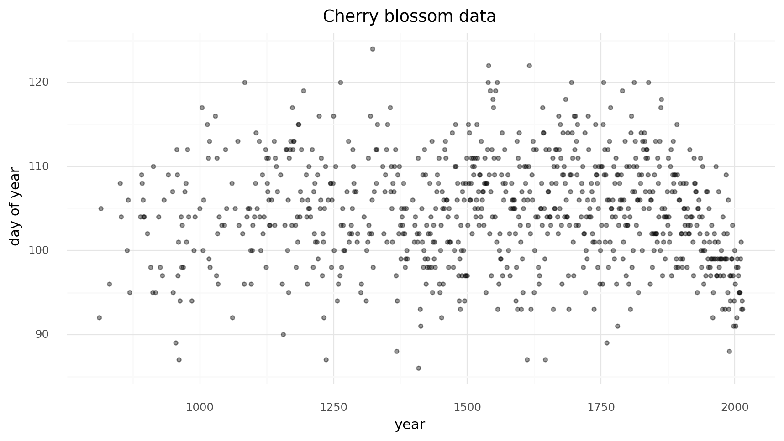
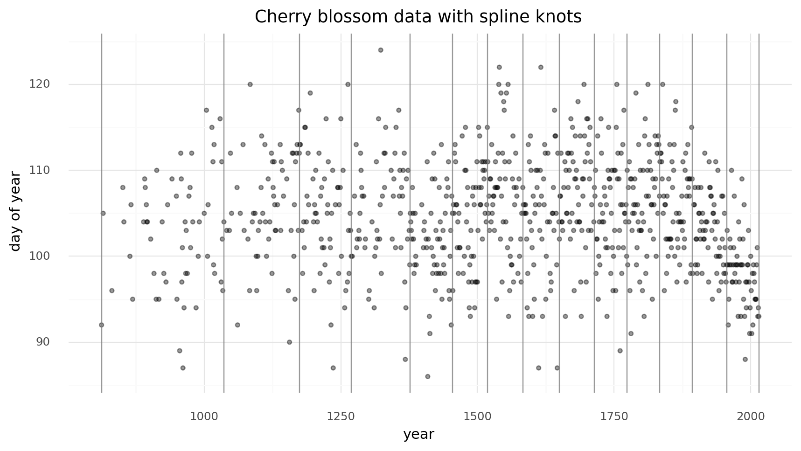
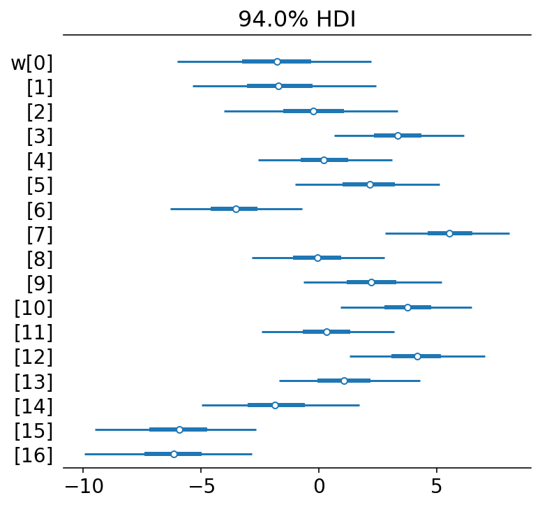

## Introduction

Often, the model we want to fit is not a perfect line between some $x$ and $y$.
Instead, the parameters of the model are expected to vary over $x$.
There are multiple ways to handle this situation, one of which is to fit a *spline*.
The spline is effectively multiple individual lines, each fit to a different section of $x$, that are tied togehter at their boundaries, often called *knots*.
Below is an exmaple of how to fit a spline using the Bayesian framework [PyMC3](https://docs.pymc.io).

## Fitting a spline with PyMC3

Below is a full working example of how to fit a spline using the probabilitic programming language PyMC3.
The data and model are taken from [*Statistical Rethinking* 2e](https://xcelab.net/rm/statistical-rethinking/) by Richard McElreath.
As the book uses Stan (another advanced probabilitistic programming language), the modeling code is primarily taken from the [GitHub repository of the PyMC3 implementation of *Statistical Rethinking*](https://github.com/pymc-devs/resources/blob/master/Rethinking_2/Chp_04.ipynb).
My contributions are primarily of explination and additional analyses of the data and results.

### Set-up

Below is the code to import packages and set some variables used in the analysis.
Most of the libraries and modules are likely familiar to most.
Of those that may not be well known are ['ArviZ'](https://arviz-devs.github.io/arviz/) and ['patsy'](https://patsy.readthedocs.io/en/latest/), and ['plotnine'](https://plotnine.readthedocs.io/en/stable/).
'ArviZ' is a library for managing the components of a Bayesian model.
I will use it to manage the results of fitting the model and some standard data visualizations.
The 'patsy' library is an interface to statistical modeling using a specific formula language simillar to that used in the R language.
Finally, 'plotnine' is a plotting library that implements the "Grammar or Graphics" system based on the ['ggplot2']() R package.
As I have a lot of experience with R, I found 'plotnine' far more natural than the "standard" in Python data science, 'matplotlib'.


```python
from pathlib import Path

import arviz as az
import matplotlib.pyplot as plt
import numpy as np
import pandas as pd
import plotnine as gg
import pymc3 as pm
import seaborn as sns
from patsy import dmatrix

# Set default theme for 'plotnine'.
gg.theme_set(gg.theme_minimal())

# For reproducibility.
RANDOM_SEED = 847
np.random.seed(RANDOM_SEED)

# Path to the data used in Statistical Rethinking.
rethinking_data_path = Path("../data/rethinking_data")
```

### Data

The data for this example is the number of days of the year (`doy`) that some cherry trees were in bloom in each year (`year`).
We will ignore the other columns for now.

```python
d = pd.read_csv(rethinking_data_path / "cherry_blossoms.csv")
d2 = d.dropna(subset=["doy"]).reset_index(drop=True)
d2.head(n=10)
```
|    |   year |   doy |   temp |   temp_upper |   temp_lower |
|---:|-------:|------:|-------:|-------------:|-------------:|
|  0 |    812 |    92 | nan    |       nan    |       nan    |
|  1 |    815 |   105 | nan    |       nan    |       nan    |
|  2 |    831 |    96 | nan    |       nan    |       nan    |
|  3 |    851 |   108 |   7.38 |        12.1  |         2.66 |
|  4 |    853 |   104 | nan    |       nan    |       nan    |
|  5 |    864 |   100 |   6.42 |         8.69 |         4.14 |
|  6 |    866 |   106 |   6.44 |         8.11 |         4.77 |
|  7 |    869 |    95 | nan    |       nan    |       nan    |
|  8 |    889 |   104 |   6.83 |         8.48 |         5.19 |
|  9 |    891 |   109 |   6.98 |         8.96 |         5    |

There are 827 years with `doy` data.

```python
>>> d2.shape
(827, 5)
```

Below is the `doy` values plotted over `year`.

```python
(
    gg.ggplot(d2, gg.aes(x="year", y="doy"))
    + gg.geom_point(color="black", alpha=0.4, size=1.3)
    + gg.theme(figure_size=(10, 5))
    + gg.labs(x="year", y="days of year", title="Cherry blossom data")
)
```



### Model

We will fit the following model.

$D \sim \mathcal{N}(\mu, \sigma)$  
$\quad \mu = a + Bw$  
$\qquad a \sim \mathcal{N}(100, 10)$  
$\qquad w \sim \mathcal{N}(0, 10)$  
$\quad \sigma \sim \text{Exp}(1)$

The number of days of bloom will be modeled as a normal distribution with mean $\mu$ and standard deviation $\sigma$.
The mean will be a linear model composed of a y-intercept $a$ and spline with basis $w$.
Both have relatively weak normal priors.

#### Prepare the spline

We can now prepare the spline matrix.
First, we must determine the boundaries of the spline, often referred to as "knots" because the different lines will be tied together at these boundaries to make a continuous and smooth curve.
For this example, we will create 15 knots evenly spaced as quantiles of the years data (the x-axis).

```python
num_knots = 15
knot_list = np.quantile(d2.year, np.linspace(0, 1, num_knots))
```

```python
>>> knot_list
array([ 812., 1036., 1174., 1269., 1377., 1454., 1518., 1583., 1650.,
       1714., 1774., 1833., 1893., 1956., 2015.])
```

Below is the plot of the data we are modeling with the splines indicated by the vertical gray lines.

```python
(
    gg.ggplot(d2, gg.aes(x="year", y="doy"))
    + gg.geom_point(color="black", alpha=0.4, size=1.3)
    + gg.geom_vline(xintercept=knot_list, color="gray", alpha=0.8)
    + gg.theme(figure_size=(10, 5))
    + gg.labs(x="year", y="days of year", title="Cherry blossom data with spline knots")
)
```



We can get an idea of what the spline will look like by fitting a LOESS curve (a local ploynomial regression).

```python
(
    gg.ggplot(d2, gg.aes(x="year", y="doy"))
    + gg.geom_point(color="black", alpha=0.4, size=1.3)
    + gg.geom_smooth(method = "loess", span=0.3, size=1.5, color="blue", linetype="-")
    + gg.geom_vline(xintercept=knot_list, color="gray", alpha=0.8)
    + gg.theme(figure_size=(10, 5))
    + gg.labs(x="year", y="days of year", title="Cherry blossom data with spline knots")
)
```


Another way of visualizing what the spline should look like is to plot individual linear models over the data between each knot.
The spline will effectively be a compromise between these individual models and a continuous curve.

```python
d2["knot_group"] = [np.where(a <= knot_list)[0][0] for a in d2.year]
d2["knot_group"] = pd.Categorical(d2["knot_group"], ordered=True)

(
    gg.ggplot(d2, gg.aes(x="year", y="doy"))
    + gg.geom_point(color="black", alpha=0.4, size=1.3)
    + gg.geom_smooth(gg.aes(group = "knot_group"), method="lm", size=1.5, color="red", linetype="-")
    + gg.geom_vline(xintercept=knot_list, color="gray", alpha=0.8)
    + gg.theme(figure_size=(10, 5))
    + gg.labs(x="year", y="days of year", title="Cherry blossom data with spline knots")
)
```


Finally we can use 'patsy' to create the matrix $B$ that will be the b-spline basis for the regression.
The degree is set to 3 to create a cubic b-spline.

```python
B = dmatrix(
    "bs(year, knots=knots, degree=3, include_intercept=True) - 1",
    {"year": d2.year.values, "knots": knot_list[1:-1]},
)
```

```python
>>> B
DesignMatrix with shape (827, 17)
  Columns:
    ['bs(year, knots=knots, degree=3, include_intercept=True)[0]',
     'bs(year, knots=knots, degree=3, include_intercept=True)[1]',
     'bs(year, knots=knots, degree=3, include_intercept=True)[2]',
     'bs(year, knots=knots, degree=3, include_intercept=True)[3]',
     'bs(year, knots=knots, degree=3, include_intercept=True)[4]',
     'bs(year, knots=knots, degree=3, include_intercept=True)[5]',
     'bs(year, knots=knots, degree=3, include_intercept=True)[6]',
     'bs(year, knots=knots, degree=3, include_intercept=True)[7]',
     'bs(year, knots=knots, degree=3, include_intercept=True)[8]',
     'bs(year, knots=knots, degree=3, include_intercept=True)[9]',
     'bs(year, knots=knots, degree=3, include_intercept=True)[10]',
     'bs(year, knots=knots, degree=3, include_intercept=True)[11]',
     'bs(year, knots=knots, degree=3, include_intercept=True)[12]',
     'bs(year, knots=knots, degree=3, include_intercept=True)[13]',
     'bs(year, knots=knots, degree=3, include_intercept=True)[14]',
     'bs(year, knots=knots, degree=3, include_intercept=True)[15]',
     'bs(year, knots=knots, degree=3, include_intercept=True)[16]']
  Terms:
    'bs(year, knots=knots, degree=3, include_intercept=True)' (columns 0:17)
  (to view full data, use np.asarray(this_obj))
```

The b-spline basis is plotted below.

```python
spline_df = (
    pd.DataFrame(B)
    .assign(year=d2.year.values)
    .melt("year", var_name="spline_i", value_name="value")
)

(
    gg.ggplot(spline_df, gg.aes(x="year", y="value"))
    + gg.geom_line(gg.aes(group="spline_i", color="spline_i"))
    + gg.scale_color_discrete(guide=gg.guide_legend(ncol=2))
    + gg.labs(x="year", y="basis", color="spline idx")
)
```


#### Fitting

Finally, the model can be built using PyMC3.
A graphical diagram shows the organization of the model parameters.

```python
with pm.Model() as m4_7:
    a = pm.Normal("a", 100, 10)
    w = pm.Normal("w", mu=0, sd=10, shape=B.shape[1])
    mu = pm.Deterministic("mu", a + pm.math.dot(np.asarray(B, order="F"), w.T))
    sigma = pm.Exponential("sigma", 1)
    D = pm.Normal("D", mu, sigma, observed=d2.doy)
```

```python
pm.model_to_graphviz(m4_7)
```


2000 samples of the posterior distribution are taken along with samples for prior and posterior predictive checks.

```python
with m4_7:
    prior_pc = pm.sample_prior_predictive(random_seed=RANDOM_SEED)
    trace_m4_7 = pm.sample(2000, tune=2000, random_seed=RANDOM_SEED)
    post_pc = pm.sample_posterior_predictive(trace_m4_7, random_seed=RANDOM_SEED)
```

```
Auto-assigning NUTS sampler...
Initializing NUTS using jitter+adapt_diag...
Multiprocess sampling (2 chains in 2 jobs)
NUTS: [sigma, w, a]
Sampling 2 chains, 0 divergences: 100%|██████████| 8000/8000 [00:30<00:00, 259.07draws/s]
The number of effective samples is smaller than 25% for some parameters.
100%|██████████| 4000/4000 [00:06<00:00, 591.29it/s]
```

As mentioned above, the model and sampling results are collated into an ArviZ object for ease of use.

```
az_m4_7 = az.from_pymc3(
    model=m4_7, trace=trace_m4_7, posterior_predictive=post_pc, prior=prior_pc
)
```

### Fit parameters

Below is a table summarizing the posterior distributions of the model parameters.
The posteriors of $a$ and $\sigma$ are quite narrow while those for $w$ are wider.
This is likely because all of the data points are used to estimate $a$ and $\sigma$ whereas only a subset are used for each value of $w$.
The number of effective samples for $a$ is quite low, though, likely due to autocorrelation of the MCMC chains (this is visible in the following plots of the trace).

```python
az.summary(az_m4_7, var_names=["a", "w", "sigma"])
```

|       |    mean |    sd |   hdi_3% |   hdi_97% |   mcse_mean |   mcse_sd |   ess_mean |   ess_sd |   ess_bulk |   ess_tail |   r_hat |
|:------|--------:|------:|---------:|----------:|------------:|----------:|-----------:|---------:|-----------:|-----------:|--------:|
| a     | 103.303 | 2.424 |   98.879 |   107.724 |       0.098 |     0.069 |        615 |      614 |        618 |       1027 |       1 |
| w[0]  |  -2.876 | 3.862 |  -10.391 |     4.208 |       0.11  |     0.078 |       1225 |     1225 |       1223 |       2105 |       1 |
| w[1]  |  -0.92  | 3.944 |   -7.944 |     6.87  |       0.109 |     0.077 |       1303 |     1303 |       1306 |       1794 |       1 |
| w[2]  |  -0.95  | 3.64  |   -7.69  |     5.972 |       0.115 |     0.082 |        994 |      994 |        995 |       1799 |       1 |
| w[3]  |   4.896 | 2.917 |   -1.005 |    10.029 |       0.099 |     0.07  |        871 |      871 |        872 |       1236 |       1 |
| w[4]  |  -0.827 | 2.937 |   -6.642 |     4.437 |       0.105 |     0.075 |        776 |      776 |        781 |       1199 |       1 |
| w[5]  |   4.384 | 2.969 |   -0.994 |    10.089 |       0.098 |     0.069 |        921 |      921 |        922 |       1600 |       1 |
| w[6]  |  -5.305 | 2.848 |  -10.728 |    -0.249 |       0.103 |     0.073 |        771 |      771 |        774 |       1226 |       1 |
| w[7]  |   7.899 | 2.845 |    2.319 |    12.968 |       0.098 |     0.07  |        848 |      818 |        849 |       1546 |       1 |
| w[8]  |  -0.974 | 2.921 |   -6.47  |     4.431 |       0.1   |     0.07  |        861 |      861 |        863 |       1402 |       1 |
| w[9]  |   3.132 | 3.007 |   -2.191 |     9.091 |       0.1   |     0.071 |        910 |      906 |        913 |       1399 |       1 |
| w[10] |   4.676 | 2.909 |   -0.455 |    10.563 |       0.104 |     0.074 |        780 |      780 |        781 |       1377 |       1 |
| w[11] |  -0.085 | 2.952 |   -5.434 |     5.604 |       0.098 |     0.069 |        909 |      909 |        911 |       1468 |       1 |
| w[12] |   5.6   | 2.947 |    0.167 |    11.29  |       0.104 |     0.073 |        809 |      809 |        813 |       1279 |       1 |
| w[13] |   0.784 | 3.116 |   -5.015 |     6.579 |       0.103 |     0.073 |        924 |      924 |        927 |       1382 |       1 |
| w[14] |  -0.782 | 3.333 |   -7.152 |     5.164 |       0.104 |     0.073 |       1030 |     1030 |       1030 |       1404 |       1 |
| w[15] |  -6.933 | 3.501 |  -13.454 |    -0.133 |       0.106 |     0.075 |       1091 |     1091 |       1084 |       1684 |       1 |
| w[16] |  -7.61  | 3.292 |  -14.056 |    -1.642 |       0.104 |     0.075 |       1003 |      965 |       1005 |       1368 |       1 |
| sigma |   5.946 | 0.147 |    5.66  |     6.199 |       0.002 |     0.002 |       3684 |     3671 |       3709 |       2558 |       1 |

We can visualize the trace (MCMC samples) of $a$ and $\sigma$, again showing they were confidently estimated.

```python
az.plot_trace(az_m4_7, var_names=["a", "sigma"])
plt.show()
```


A forest plot shows the distributions of the values for $w$ are larger, though some do fall primarily away from 0 indicating a non-null effect/association.

```python
az.plot_forest(az_m4_7, var_names=["w"], combined=True)
plt.show()
```



Another visualization of the fit spline values is to plot them multiplied against the basis matrix.
The knot boundaries are shown in gray again, but now the spline bases are multipled against the values of $w$ (represented as the rainbow-colored curves).
The dot product of $B$ and $w$ - the actual computation in the linear model - is shown in blue.

```python
wp = trace_m4_7["w"].mean(0)

spline_df = (
    pd.DataFrame(B * wp.T)
    .assign(year=d2.year.values)
    .melt("year", var_name="spline_i", value_name="value")
)

spline_df_merged = (
    pd.DataFrame(np.dot(B, wp.T))
    .assign(year=d2.year.values)
    .melt("year", var_name="spline_i", value_name="value")
)

(
    gg.ggplot(spline_df, gg.aes(x="year", y="value"))
    + gg.geom_vline(xintercept=knot_list, color="gray", alpha=0.5)
    + gg.geom_line(data=spline_df_merged, linetype="-", color="blue", size=2, alpha=0.7)
    + gg.geom_line(gg.aes(group="spline_i", color="spline_i"), alpha=0.7, size=1)
    + gg.scale_color_discrete(guide=gg.guide_legend(ncol=2), color_space="husl")
    + gg.theme(figure_size=(10, 5))
    + gg.labs(x="year", y="basis", title="Fit spline", color="spline idx")
)
```


### Model predictions

Lastly, we can visualize the predictions of the model using the posterior predictive check.

```python
post_pred = az.summary(az_m4_7, var_names=["mu"]).reset_index(drop=True)
d2_post = d2.copy().reset_index(drop=True)
d2_post["pred_mean"] = post_pred["mean"]
d2_post["pred_hdi_lower"] = post_pred["hdi_3%"]
d2_post["pred_hdi_upper"] = post_pred["hdi_97%"]
```

```python
(
    gg.ggplot(d2_post, gg.aes(x="year"))
    + gg.geom_ribbon(
        gg.aes(ymin="pred_hdi_lower", ymax="pred_hdi_upper"), alpha=0.3, fill="tomato"
    )
    + gg.geom_line(gg.aes(y="pred_mean"), color="firebrick", alpha=1, size=2)
    + gg.geom_point(gg.aes(y="doy"), color="black", alpha=0.4, size=1.3)
    + gg.geom_vline(xintercept=knot_list, color="gray", alpha=0.8)
    + gg.theme(figure_size=(10, 5))
    + gg.labs(
        x="year",
        y="days of year",
        title="Cherry blossom data with posterior predictions",
    )
)
```


