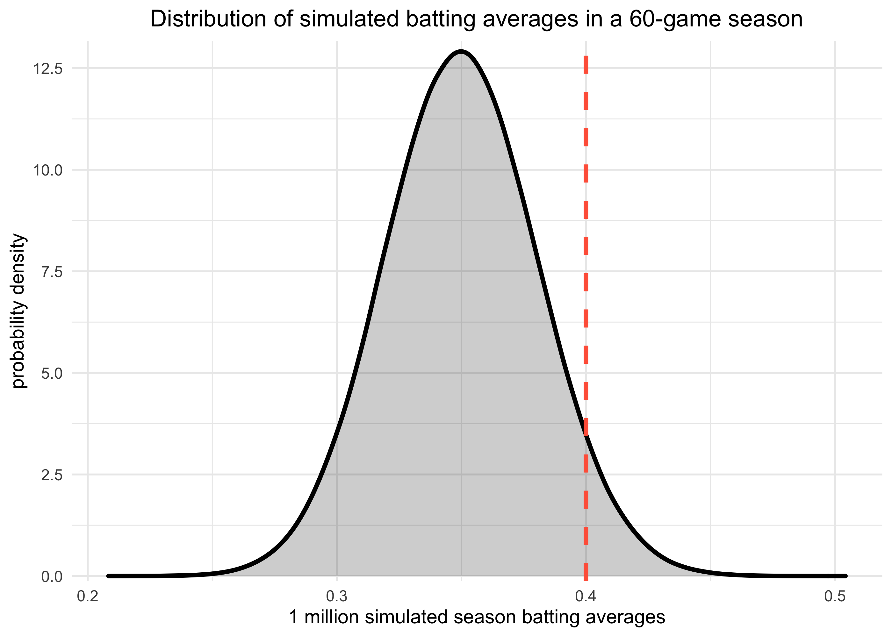
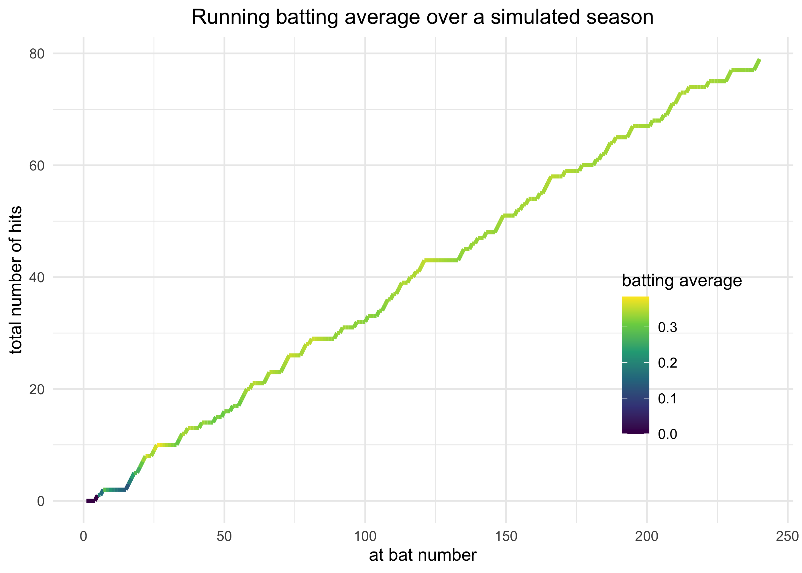
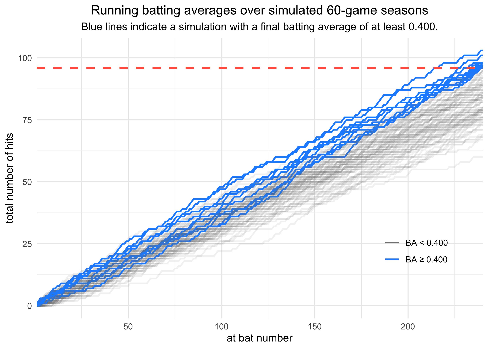
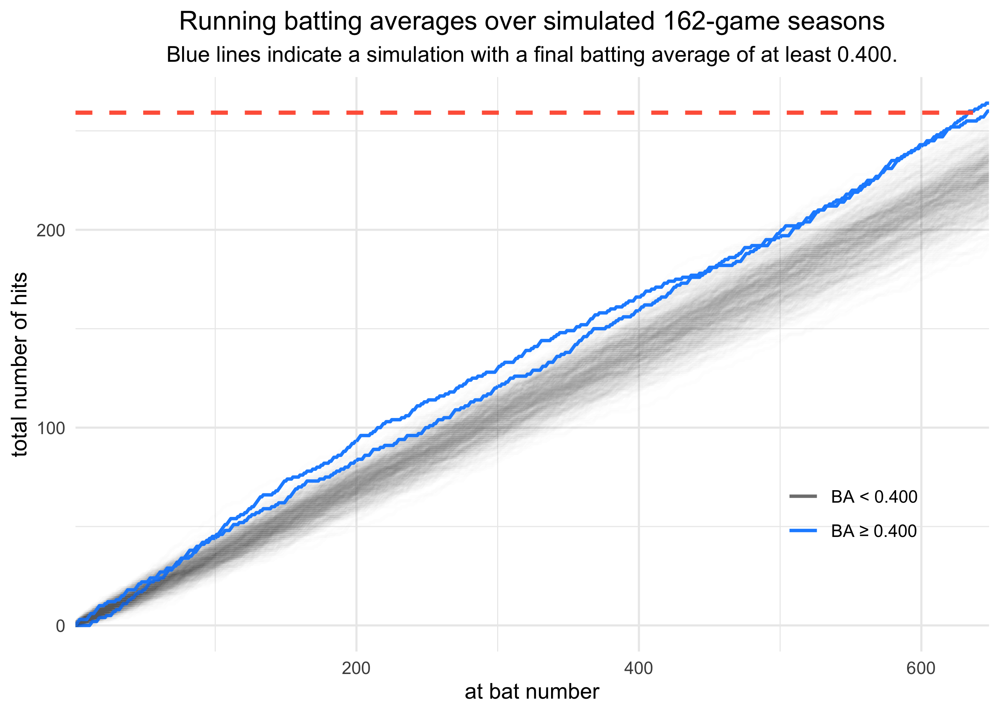

## FiveThirtyEight’s Riddler Express

[link](https://fivethirtyeight.com/features/can-the-hare-beat-the-tortoise/)

> From Taylor Firman comes an opportunity to make baseball history:
> 
> This year, Major League Baseball announced it will play a shortened
> 60-game season, as opposed to the typical 162-game season. Baseball is
> a sport of numbers and statistics, and so Taylor wondered about the
> impact of the season’s length on some famous baseball records.
> 
> Some statistics are more achievable than others in a shortened season.
> **Suppose your true batting average is .350, meaning you have a 35
> percent chance of getting a hit with every at-bat. If you have four
> at-bats per game, what are your chances of batting at least .400 over
> the course of the 60-game season?2 And how does this compare to your
> chances of batting at least .400 over the course of a 162-game season?**

## Plan

This riddle should be pretty straight forward to solve statistically and
with simulations, so I will do both.

## Setup

``` r
knitr::opts_chunk$set(echo = TRUE, comment = "#>", cache = FALSE, dpi = 400)

library(mustashe)
library(tidyverse)
library(conflicted)

# Handle any namespace conflicts.
conflict_prefer("filter", "dplyr")
conflict_prefer("select", "dplyr")

# Default 'ggplot2' theme.
theme_set(theme_minimal())

# For reproducibility.
set.seed(123)
```

## Statistical solution

This is a simple binomial system: at each at bat, the player either gets
a hit or not. If their real batting average is 0.350, that means the
probability of them getting a hit during each at bat is 35%. Thus,
according the the Central Limit Theorem, given a sufficiently large
number of at bats, the frequency of a hit should be 35%. This is because
the distribution converges towards the mean. However, at smaller
sample-sizes, the distribution is more broad, meaning that the observed
batting average has a greater chance of being further away from the true
value.

First, let’s answer the riddle. The solution is just the probability of
observing a batting average of 0.400 or greater. The first value is
computed using `dbinom()` and the second cumulative probability is
calculated using `pbinom()`, setting `lower.tail = FALSE` to get the
tail above 0.400.

``` r
num_at_bats <- 60 * 4
real_batting_average <- 0.350
target_batting_average <- 0.400

prob_at_400 <- dbinom(x = target_batting_average * num_at_bats, 
                      size = num_at_bats, 
                      prob = real_batting_average)
prob_above_400 <- pbinom(q = target_batting_average * num_at_bats, 
                         size = num_at_bats, 
                         prob = real_batting_average, 
                         lower.tail = FALSE)
prob_at_400 + prob_above_400
```

    #> [1] 0.06083863

**Under the described assumptions, there is a 6.1% chance of reaching a
batting average of 0.400 in the shorter season.**

For comparison, the chance for a normal 162-game season is calculated
below. Because $0.400 \times 162 \times 4$ is a non-integer value, an
exact 0.400 batting average cannot be obtained. Therefore, only the
probability of a batting average greater than 0.400 needs to be
calculated.

``` r
num_at_bats <- 162 * 4
real_batting_average <- 0.350
target_batting_average <- 0.400

prob_above_400 <- pbinom(q = target_batting_average * num_at_bats, 
                         size = num_at_bats, 
                         prob = real_batting_average, 
                         lower.tail = FALSE)
prob_above_400
```

    #> [1] 0.003789922

Over 162 games, there is a 0.4% chance of achieving a batting average of
at least 0.400.

## Simulation

The solution to this riddle could also be found by simulating a whole
bunch of seasons with the real batting average of 0.350 and then just
counting how frequently the simulations resulted in an observed batting
average of 0.400.

A single season can be simulated using the `rbinom()` function where `n`
is the number of seasons to simulate, `size` takes the number of at
bats, and `prob` takes the true batting average. The returned value is a
sampled number of hits (“successes”) over the season from the binomial
distribution.

The first example shows the observed batting average from a single
season.

``` r
num_at_bats <- 60 * 4
real_batting_average <- 0.350
target_batting_average <- 0.400

rbinom(n = 1, size = num_at_bats, prob = real_batting_average) / num_at_bats
```

    #> [1] 0.3375

The `n = 1` can just be replaced with a large number to simulate a bunch
of seasons. The average batting average over these seasons should be
close to the true batting average.

``` r
n_seasons <- 1e6  # 1 million simulations.
sim_res <- rbinom(n = n_seasons, 
                  size = num_at_bats, 
                  prob = real_batting_average) 

sim_res <- sim_res / num_at_bats

# The average batting average is near the true batting average of 0.350.
mean(sim_res)
```

    #> [1] 0.3500121

The full distribution of batting averages over the 1 million simulations
is shown below.

``` r
tibble(sims = sim_res) %>%
    ggplot(aes(x = sims)) +
    geom_density(color = "black", fill = "black", adjust = 2,
                 alpha = 0.2, size = 1.2, ) +
    geom_vline(xintercept = target_batting_average, 
               color = "tomato", lty = 2, size = 1.2) +
    scale_y_continuous(expand = expansion(mult = c(0.01, 0.02))) +
    theme(plot.title = element_text(hjust = 0.5)) +
    labs(x = "1 million simulated season batting averages",
         y = "probability density",
         title = "Distribution of simulated batting averages in a 60-game season")
```

<!-- -->

The answer from the simulation is pretty close to the actual answer.

``` r
mean(sim_res >= 0.40)
```

    #> [1] 0.060813

One last visualization I want to do demonstrates why the length of the
season matters to the distribution. Instead of using `rbinom()` to
simulate the number of successes over the entire season, I use it below
to simulate a season’s-worth of individual at bats, returning a vector
of 0’s and 1’s. I then plotted the cumulative number of hits at each at
bat and colored the line by the running batting average.

The coloring shows how the batting average was more volatile when there
were fewer at bats.

``` r
sampled_at_bats <- rbinom(60*4, 1, 0.35)
tibble(at_bat = sampled_at_bats) %>%
    mutate(i = row_number(),
           cum_total = cumsum(at_bat),
           running_avg = cum_total / i) %>%
    ggplot(aes(x = i, y = cum_total)) +
    geom_line(aes(color = running_avg), size = 1.2) +
    scale_color_viridis_c() +
    theme(plot.title = element_text(hjust = 0.5),
          legend.position = c(0.85, 0.35)) +
    labs(x = "at bat number",
         y = "total number of hits",
         color = "batting average",
         title = "Running batting average over a simulated season")
```

<!-- -->

The following two plots do the same analysis many times to simulate many
seasons and color the lines by whether or not the final batting average
was at or above 0.400. As there are more games, the running batting
averages, which are essentially biased random walks, regress towards the
true batting average. (Note that I had to do 500 simulations for the
162-game season to get any simulations with a final batting average
above 0.400.)

``` r
simulate_season_at_bats <- function(num_at_bats) {
    sampled_at_bats <- rbinom(num_at_bats, size = 1, prob = 0.35)
    tibble(result = sampled_at_bats) %>%
        mutate(at_bat = row_number(),
               cum_total = cumsum(result),
               running_avg = cum_total / at_bat)
}

tibble(season = 1:100) %>%
    mutate(season_results = map(season, ~ simulate_season_at_bats(60 * 4))) %>%
    unnest(season_results) %>%
    group_by(season) %>%
    mutate(
        above_400 = 0.4 <= running_avg[which.max(at_bat)],
        above_400 = ifelse(above_400, "BA ≥ 0.400", "BA < 0.400")
    ) %>%
    ungroup() %>%
    ggplot(aes(x = at_bat, y = cum_total)) +
    geom_line(aes(group = season, color = above_400, 
                  alpha = above_400), 
              size = 0.8) +
    geom_hline(yintercept = 0.4 * 60 * 4, 
               color = "tomato", lty = 2, size = 1) +
    scale_color_manual(values = c("grey50", "dodgerblue")) +
    scale_alpha_manual(values = c(0.1, 1.0), guide = FALSE) +
    scale_x_continuous(expand = c(0, 0)) +
    theme(plot.title = element_text(hjust = 0.5),
          plot.subtitle = element_text(hjust = 0.5),
          legend.position = c(0.85, 0.25)) +
    labs(x = "at bat number",
         y = "total number of hits",
         color = NULL,
         title = "Running batting averages over simulated 60-game seasons",
         subtitle = "Blue lines indicate a simulation with a final batting average of at least 0.400.")
```

<!-- -->

<!-- -->
