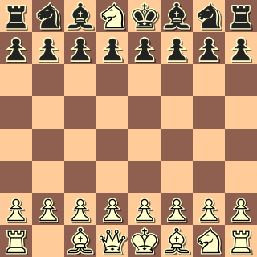
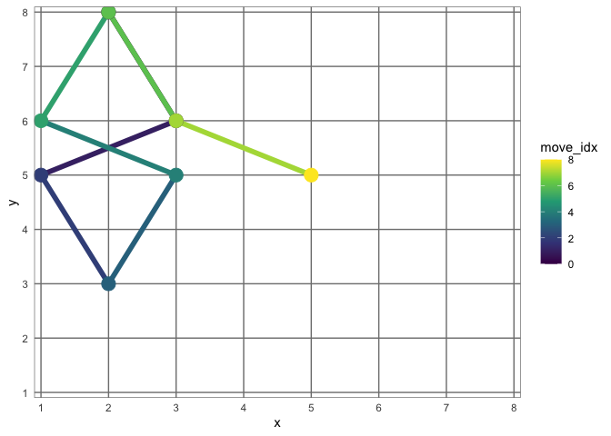
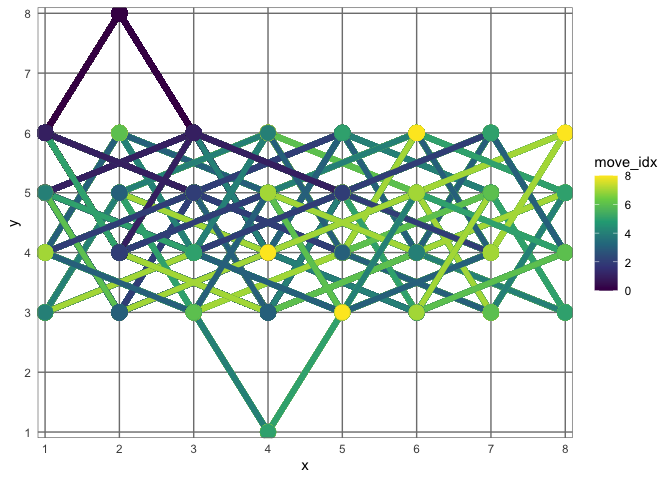
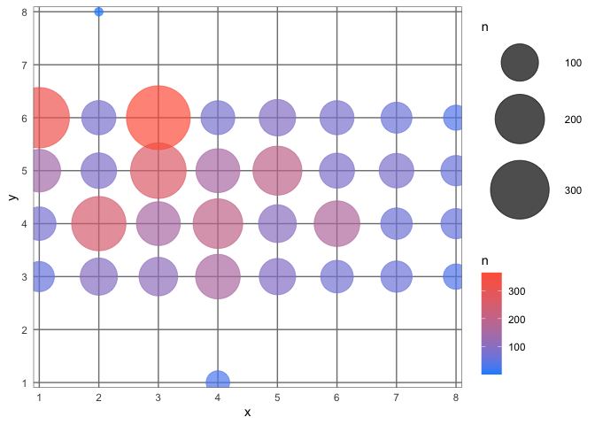
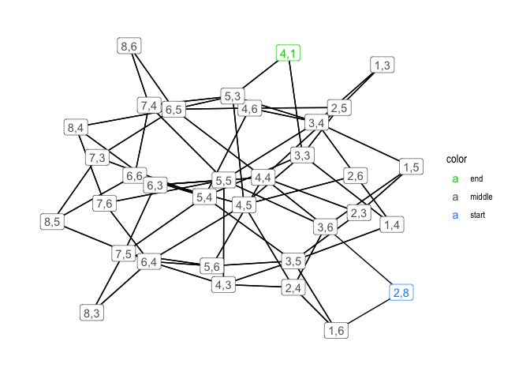
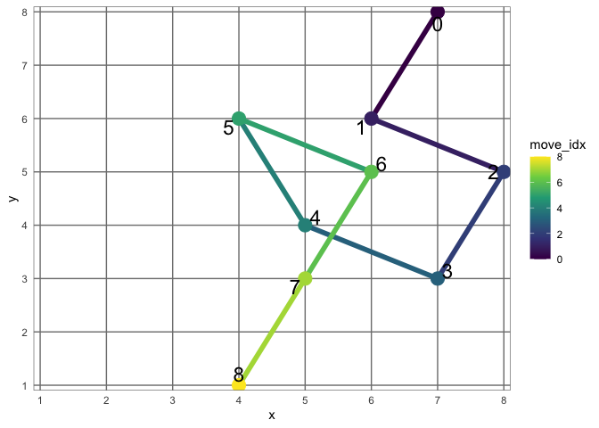
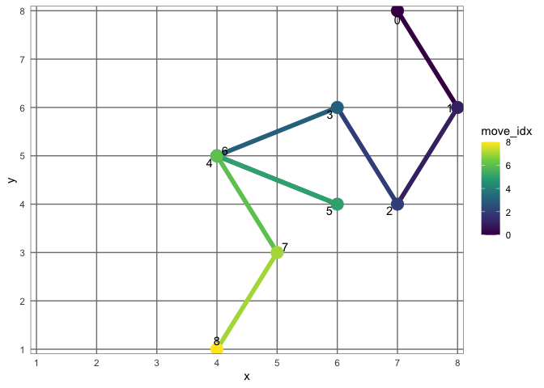

## Summary

[*The Riddler*](https://fivethirtyeight.com/tag/the-riddler/) is a
weekly puzzle provided by FiveThirtyEight. This week’s puzzle involves
finding the path used by the knight to kill the opposing queen in a game
of chess. Below, I show how I solved puzzle using two methods: a
siumulation of the chessboard and by building a graph of the possible
paths for the knight. The simulations were good, but not solution was
found in the first attempt. Only after realizing a key insight could the
riddle be solved.

## FiveThirtyEight’s Riddler Express

<https://fivethirtyeight.com/features/can-you-solve-the-chess-mystery/>

> From Yan Zhang comes a royal murder mystery:
> 
> Black Bishop: “Sir, forensic testing indicates the Queen’s assassin,
> the White Knight between us, has moved exactly eight times since the
> beginning of the game, which has been played by the legal rules.”
> 
> Black King: “So?”
> 
> Black Bishop: “Well, to convict this assassin, we need to construct a
> legal game history. But we just can’t figure out how he got there\!”
> 
> Can you figure it out?



(The
[solution](https://fivethirtyeight.com/features/can-you-beat-the-goat-monty-hall-problem/)
is available at the end of the following week’s Riddler.)

``` r
knitr::opts_chunk$set(echo = TRUE, comment = "#>")

library(glue)
library(tidygraph)
library(ggraph)
library(tidyverse)

theme_set(theme_minimal())
```

## Simulation method

The first method I tried was to use a simulation to find the path from
the blank space to the final space.

I abstracted the chessboard as a matrix with 0 as empty space, 1 as a
taken space, and 2 as the knight.

``` r
chessboard <- matrix(c(
    1, 1, 1, 0, 1, 1, 1, 1,
    1, 1, 1, 1, 1, 1, 1, 1,
    0, 0, 0, 0, 0, 0, 0, 0,
    0, 0, 0, 0, 0, 0, 0, 0,
    0, 0, 0, 0, 0, 0, 0, 0,
    0, 0, 0, 0, 0, 0, 0, 0,
    1, 1, 1, 1, 1, 1, 1, 1,
    1, 2, 1, 1, 1, 1, 1, 1
), nrow = 8, byrow = TRUE)

chessboard
```

    #>      [,1] [,2] [,3] [,4] [,5] [,6] [,7] [,8]
    #> [1,]    1    1    1    0    1    1    1    1
    #> [2,]    1    1    1    1    1    1    1    1
    #> [3,]    0    0    0    0    0    0    0    0
    #> [4,]    0    0    0    0    0    0    0    0
    #> [5,]    0    0    0    0    0    0    0    0
    #> [6,]    0    0    0    0    0    0    0    0
    #> [7,]    1    1    1    1    1    1    1    1
    #> [8,]    1    2    1    1    1    1    1    1

I then created a bunch of functions that take care of different parts of
the algorithm.

``` r
# Return the current location of the knight on the chessboard `mat`.
get_knight_location <- function(mat) {
    knight_row <- which(apply(mat, 1, function(x) any(x == 2)))
    knight_col <- which(apply(mat, 2, function(x) any(x == 2)))
    return(list(x = knight_col, y = knight_row))
}

get_knight_location(chessboard)
```

    #> $x
    #> [1] 2
    #> 
    #> $y
    #> [1] 8

``` r
# A helper for visiualizing the chessboard.
print_chessboard <- function(mat) {
    new_mat <- mat
    new_mat[new_mat == "0"] <- " "
    new_mat[new_mat == "1"] <- "+"
    new_mat[new_mat == "2"] <- "H"
    new_mat[1, 4] <- "o"
    print(new_mat)
    invisible(NULL)
}
print(chessboard)
```

    #>      [,1] [,2] [,3] [,4] [,5] [,6] [,7] [,8]
    #> [1,]    1    1    1    0    1    1    1    1
    #> [2,]    1    1    1    1    1    1    1    1
    #> [3,]    0    0    0    0    0    0    0    0
    #> [4,]    0    0    0    0    0    0    0    0
    #> [5,]    0    0    0    0    0    0    0    0
    #> [6,]    0    0    0    0    0    0    0    0
    #> [7,]    1    1    1    1    1    1    1    1
    #> [8,]    1    2    1    1    1    1    1    1

``` r
# Movement: (horizontal movement, vertical movement)
possible_knight_movements <- rbind(
        expand.grid(c(1, -1), c(2, -2)),
        expand.grid(c(2, -2), c(1, -1))
    ) %>%
    as_tibble() %>%
    set_names(c("x", "y"))

possible_knight_movements
```

    #> # A tibble: 8 x 2
    #>       x     y
    #>   <dbl> <dbl>
    #> 1     1     2
    #> 2    -1     2
    #> 3     1    -2
    #> 4    -1    -2
    #> 5     2     1
    #> 6    -2     1
    #> 7     2    -1
    #> 8    -2    -1

One optimization I added to the simulation to help it preform better
than a purely random walk was to prevent it from retracing its steps.
This was achieved by adding a check in `is_available_move()` to prevent
it from returning to the previous step. (As we see with the final
solution, this wasn’t really necessary.)

``` r
# Select a random move for the knight.
get_random_movement <- function() {
    sample_n(possible_knight_movements, 1)
}

# Get the new location of the knight after a move.
get_new_location <- function(movement, current_loc) {
    new_x_loc <- movement$x + current_loc$x
    new_y_loc <- movement$y + current_loc$y
    return(list(x = new_x_loc, y = new_y_loc))
}


# Move the knight on the board.
move_knight_to_new_location <- function(movement, mat) {
    current_loc <- get_knight_location(mat)
    new_loc <- get_new_location(movement, current_loc)
    new_mat <- mat
    new_mat[current_loc$y, current_loc$x] <- 0
    new_mat[new_loc$y, new_loc$x] <- 2
    return(new_mat)
}

previous_location <- get_knight_location(chessboard)

# Is the new position on a board possible or available.
# i.e. can the knight make the `movement` on the `mat`.
# This function "remembers" the previous location and will not let the knight
# move backwards. Because this is reset at the beginning, the knight won't get
# trapped in a corder forever, just one round.
is_available_move <- function(movement, mat) {
    
    current_loc <- get_knight_location(mat)
    new_loc <- get_new_location(movement, current_loc)
    
    # Check that the piece stays on the board.
    if (new_loc$x < 1 | new_loc$x > ncol(chessboard)) {
        return(FALSE)
    } else if (new_loc$y < 1 | new_loc$y > nrow(chessboard)) {
        return(FALSE)
    } 

    # Check if the new location would be the same as the previous location.
    if (new_loc$x == previous_location$x & new_loc$y == previous_location$y) {
        return(FALSE)
    }
    
    # Check the new space is not already taken.
    if (mat[new_loc$y, new_loc$x] == 1) {
        return(FALSE)
    }
    
    previous_location <<- current_loc
    TRUE
}

# Move the knight one time randomly, but legally.
move_knight <- function(mat) {
    old_loc <- get_knight_location(mat)
    
    movement <- get_random_movement()
    while(!is_available_move(movement, mat)) {
        movement <- get_random_movement()
    }
    
    move_knight_to_new_location(movement, mat)
}
```

The function to play a round just calls `move_knight()` 8 times on the
same chessboard. It returns a tibble with the locations of the knight
during the process.

``` r
# Return a tidy tibble of the knights locations.
knight_location_tidy <- function(l) {
    enframe(l, name = "move_idx") %>% 
        mutate(x = map_dbl(value, ~ .x[[1]]),
               y = map_dbl(value, ~ .x[[2]])) %>%
        select(move_idx, x, y) %>%
        mutate(move_idx = move_idx - 1)
}

# Play a round of the simulation.
play_round <- function(num_moves = 8) {
    gameboard <- chessboard
    knight_locs <- rep(NA, num_moves + 1)
    knight_locs[1] <- list(get_knight_location(gameboard))
    for (i in seq(1, num_moves)) {
        gameboard <- move_knight(gameboard)
        knight_locs[i + 1] <- list(get_knight_location(gameboard))
    }
    return(knight_location_tidy(knight_locs))
}

play_round()
```

    #> # A tibble: 9 x 3
    #>   move_idx     x     y
    #>      <dbl> <dbl> <dbl>
    #> 1        0     2     8
    #> 2        1     3     6
    #> 3        2     1     5
    #> 4        3     3     4
    #> 5        4     4     6
    #> 6        5     5     4
    #> 7        6     3     3
    #> 8        7     2     5
    #> 9        8     1     3

I also added a simple function to plot the path of the knight. Each step
is labeled with its place in the sequence.

``` r
# A visualization tool for the path of the knight.
plot_knight_locations <- function(df) {
    df %>%
        ggplot(aes(x = x, y = y, color = move_idx)) +
        geom_path(aes(group = game_idx), size = 2) +
        geom_point(size = 5) +
        scale_x_continuous(limits = c(1, 8), 
                           expand = expansion(add = c(0.1, 0.1)),
                           breaks = 1:8) +
        scale_y_continuous(limits = c(1, 8), 
                           expand = expansion(add = c(0.1, 0.1)),
                           breaks = 1:8) +
        scale_color_viridis_c(breaks = seq(0, 8, 2)) +
        theme(
            panel.grid.major = element_line(color = "grey50", size = 0.5),
            panel.grid.minor = element_blank(),
            panel.border = element_rect(fill = NA, color = "grey50")
        )
}


play_round() %>%
    add_column(game_idx = 1) %>%
    plot_knight_locations()
```

<!-- -->

Finally, we can play the game many times until a solution is found.

``` r
# `TRUE` is returned if the riddle was solved.
finished_riddle <- function(df) {
    last_loc <- df %>% slice(nrow(df))
    if (last_loc$x == 4 & last_loc$y == 1) {
        return(TRUE)
    } else {
        return(FALSE)
    }
}
```

``` r
set.seed(0)
n_max <- 5e2
all_games <- rep(NA, n_max)
for (i in seq(1, n_max)) {
    moves <- play_round()
    all_games[i] <- list(moves)
    if (finished_riddle(moves)) {
        print("RIDDLE SOLVED!")
        break
    }
}
```

Interestingly, the desired end point, `(4, 1)`, was reached, just not at
the end of the path.

``` r
bind_rows(all_games, .id = "game_idx") %>%
    plot_knight_locations()
```

<!-- -->

We can look at the most visited locations (ignoring the starting
location).

``` r
bind_rows(all_games, .id = "game_idx") %>%
    count(x, y) %>%
    mutate(n = ifelse(x == 2 & y == 8, 1, n)) %>%
    ggplot(aes(x = x, y = y, color = n)) +
    geom_point(aes(size = n), alpha = 0.7) +
    scale_x_continuous(limits = c(1, 8), 
                       expand = expansion(add = c(0.1, 0.1)),
                       breaks = 1:8) +
    scale_y_continuous(limits = c(1, 8), 
                       expand = expansion(add = c(0.1, 0.1)),
                       breaks = 1:8) +
    scale_color_gradient(low = "dodgerblue", high = "tomato") +
    scale_size_continuous(range = c(3, 25)) +
    theme(
        panel.grid.major = element_line(color = "grey50", size = 0.5),
        panel.grid.minor = element_blank(),
        panel.border = element_rect(fill = NA, color = "grey50")
    )
```

<!-- -->

After a lot of simulations (only 500 shown above, but I also tried
10,000), no solution was found. I was inspired by the visualization to
try a graph-based approach.

## Graph method

I can build a graph of all the possible paths of the knight given the
state of the board and then find the path between the start and end that
is 8 steps long.

The graph building process is a bit complicated, but it follows the
basic algorithm outlined below:

1.  Start from a seed location (`(2, 8)` at the beginning).
2.  Find all possible next locations for the knight.
3.  Of these locations, add the new ones to a record of visted locations
    (`position_table`).
4.  Add to the edge list (`edge_list`) a link between the parent `(x,y)`
    to these next positions.
5.  For the nodes that have not yet been visited, repeat this algorithm
    for each.

<!-- end list -->

``` r
# A table to track where the algorithm has been already.
position_table <- tibble(x = 2, y = 8)

# An edge list for the graph.
edge_list <- tibble()

# A tibble with the possible x and y changes of position for the knight.
possible_knight_changes <- possible_knight_movements %>%
    set_names(c("change_x", "change_y"))

# Is the position allowed on the chessboard?
position_is_allowed <- function(x, y) {
    if (x > 8 | x < 1 | y > 8 | y < 1) {
        return(FALSE)
    } else if (chessboard[y, x] != 0) {
        return(FALSE)
    }
    TRUE
}

# A tibble of the next possible locations for the knight.
possible_next_positions <- function(x, y) {
    rep(list(tibble(x = x, y = y)), 
                          nrow(possible_knight_changes)) %>%
        bind_rows() %>%
        bind_cols(possible_knight_changes) %>%
        mutate(x = x + change_x,
               y = y + change_y,
               is_legal = map2_lgl(x, y, position_is_allowed)) %>%
        filter(is_legal) %>% 
        select(x, y)
}

# Build the graphs starting from a seed x and y position.
get_knight_edges <- function(x, y) {
    df <- possible_next_positions(x, y)
    
    # Add the new edges to the edge list.
    edge_list <<- bind_rows(
        edge_list,
        tibble(from = paste0(x, ",", y),
               to = paste0(df$x, ",", df$y))
    )

    # Remove positions already recorded.
    df <- df %>% anti_join(position_table, b = c("x", "y"))
    
    if (nrow(df) != 0) {
        position_table <<- bind_rows(position_table, df)
        for (i in 1:nrow(df)) {
            get_knight_edges(df$x[[i]], df$y[[i]])
        }
        
    }
    
    invisible(NULL)
}

get_knight_edges(2, 8)

edge_list
```

    #> # A tibble: 134 x 2
    #>    from  to   
    #>    <chr> <chr>
    #>  1 2,8   3,6  
    #>  2 2,8   1,6  
    #>  3 3,6   4,4  
    #>  4 3,6   2,4  
    #>  5 3,6   5,5  
    #>  6 3,6   1,5  
    #>  7 4,4   5,6  
    #>  8 4,4   3,6  
    #>  9 4,4   6,5  
    #> 10 4,4   2,5  
    #> # … with 124 more rows

The edge list can be turned into a `tidygraph` from the ‘tidygraph’
library.

``` r
knight_graph <- as_tbl_graph(edge_list, directed = FALSE)
knight_graph
```

    #> # A tbl_graph: 34 nodes and 134 edges
    #> #
    #> # An undirected multigraph with 1 component
    #> #
    #> # Node Data: 34 x 1 (active)
    #>   name 
    #>   <chr>
    #> 1 2,8  
    #> 2 3,6  
    #> 3 4,4  
    #> 4 5,6  
    #> 5 6,4  
    #> 6 7,6  
    #> # … with 28 more rows
    #> #
    #> # Edge Data: 134 x 2
    #>    from    to
    #>   <int> <int>
    #> 1     1     2
    #> 2     1    34
    #> 3     2     3
    #> # … with 131 more rows

Here is a simple visualization of the graph.

``` r
knight_graph %N>%
    mutate(color = case_when(name == "2,8" ~ "start",
                             name == "4,1" ~ "end",
                             TRUE ~ "middle")) %>%
    ggraph(layout = "stress") +
    geom_edge_link() +
    geom_node_label(aes(label = name, color = color)) +
    scale_color_manual(values = c("green3", "grey40", "dodgerblue")) +
    theme_graph()
```

<!-- -->

One possible way to find the path of 8 steps between the “start” and
“end” would be to elucidate all the possible paths and then find those
of length 8. This takes way too long, though, so I instead used a random
walk method. However, I was still unable to find a solution after 1,000
random walks.

``` r
n_max <- 1e3

set.seed(0)

for (i in seq(1, n_max)) {
    path <-igraph::random_walk(knight_graph,
                               start = "2,8", 
                               steps = 9, 
                               mode = "all")
    if (names(path)[[9]] == "4,1") {
        print("RIDDLE SOLVED!")
        break
    }
}
```

That means both of my methods have failed to find a solution to this
Riddler…

### Problem with my solving methods

**The knight cannot travel from the original blank square to the final
position.** This is true because every time the knight moves, it goes
from a black to a white square or a white to a black square. Thus, it is
not possible for the knight in the bottom-left to travel from a white
square to a black square in 8 moves. In 8 moves, it will always be on a
white square again.

## Solution

Thus the knight that killed the queen must have come from the
bottom-right and the bottom-left knight took its place. We can solve the
puzzle by just changing the original chessboard and re-running the
simulations and graph search.

### Simulation

If we change the chessboard and re-try the simulation method, it finds a
solution easily.

``` r
chessboard <- matrix(c(
    1, 1, 1, 0, 1, 1, 1, 1,
    1, 1, 1, 1, 1, 1, 1, 1,
    0, 0, 0, 0, 0, 0, 0, 0,
    0, 0, 0, 0, 0, 0, 0, 0,
    0, 0, 0, 0, 0, 0, 0, 0,
    0, 0, 0, 0, 0, 0, 0, 0,
    1, 1, 1, 1, 1, 1, 1, 1,
    1, 1, 1, 1, 1, 1, 2, 1
), nrow = 8, byrow = TRUE)

chessboard
```

    #>      [,1] [,2] [,3] [,4] [,5] [,6] [,7] [,8]
    #> [1,]    1    1    1    0    1    1    1    1
    #> [2,]    1    1    1    1    1    1    1    1
    #> [3,]    0    0    0    0    0    0    0    0
    #> [4,]    0    0    0    0    0    0    0    0
    #> [5,]    0    0    0    0    0    0    0    0
    #> [6,]    0    0    0    0    0    0    0    0
    #> [7,]    1    1    1    1    1    1    1    1
    #> [8,]    1    1    1    1    1    1    2    1

``` r
previous_location <- get_knight_location(chessboard)

set.seed(0)
n_max <- 1e2
all_games <- rep(NA, n_max)
for (i in seq(1, n_max)) {
    moves <- play_round()
    all_games[i] <- list(moves)
    if (finished_riddle(moves)) {
        print("RIDDLE SOLVED!")
        break
    }
}
```

    #> [1] "RIDDLE SOLVED!"

``` r
all_games <- all_games[!is.na(all_games)]
successful_game <- all_games[length(all_games)][[1]]
successful_game <- successful_game %>% 
    mutate(game_idx = 1)
p <- plot_knight_locations(successful_game)
p + 
    ggrepel::geom_text_repel(aes(label = move_idx), 
                             color = "black", size = 6)
```

<!-- -->

### Graph

We can try the graph-based method again, too, and this time it finds a
solution.

``` r
# A table to track where the algorithm has been already.
position_table <- tibble(x = 7, y = 8)

# An edge list for the graph.
edge_list <- tibble()

get_knight_edges(7, 8)
new_knight_graph <- as_tbl_graph(edge_list, directed = FALSE)
new_knight_graph
```

    #> # A tbl_graph: 34 nodes and 134 edges
    #> #
    #> # An undirected multigraph with 1 component
    #> #
    #> # Node Data: 34 x 1 (active)
    #>   name 
    #>   <chr>
    #> 1 7,8  
    #> 2 8,6  
    #> 3 7,4  
    #> 4 5,5  
    #> 5 6,3  
    #> 6 7,5  
    #> # … with 28 more rows
    #> #
    #> # Edge Data: 134 x 2
    #>    from    to
    #>   <int> <int>
    #> 1     1     2
    #> 2     1    34
    #> 3     2     3
    #> # … with 131 more rows

``` r
n_max <- 1e2

set.seed(0)

for (i in seq(1, n_max)) {
    path <-igraph::random_walk(new_knight_graph,
                               start = "7,8", 
                               steps = 9, 
                               mode = "all")
    if (names(path)[[9]] == "4,1") {
        print("RIDDLE SOLVED!")
        break
    }
}
```

    #> [1] "RIDDLE SOLVED!"

``` r
print(path)
```

    #> + 9/34 vertices, named, from d355afd:
    #> [1] 7,8 8,6 7,4 6,6 4,5 6,4 4,5 5,3 4,1

``` r
p <- tibble(node = names(path)) %>%
    mutate(x = as.numeric(str_extract(node, "^[:digit:]")),
           y = as.numeric(str_extract(node, "[:digit:]$"))) %>%
    mutate(move_idx = 1:n() - 1,
           game_idx = 1) %>%
    plot_knight_locations()
p + 
    ggrepel::geom_text_repel(aes(label = move_idx), color = "black")
```

<!-- -->

It seems like there are actually a few different solutions. 34 different
paths were found in 10,000 trials.

``` r
n_max <- 1e4

set.seed(0)

successful_paths <- c()

for (i in seq(1, n_max)) {
    path <-igraph::random_walk(new_knight_graph,
                               start = "7,8", 
                               steps = 9, 
                               mode = "all")
    if (names(path)[[9]] == "4,1") {
        successful_paths <- c(successful_paths, path)
    }
}

length(unique(successful_paths))
```

    #> [1] 34

-----

If you take a look at the
[solution](https://fivethirtyeight.com/features/can-you-beat-the-goat-monty-hall-problem/)
available at the end of the following week’s Riddler, you’ll see that I
have successfully solved the puzzle.
