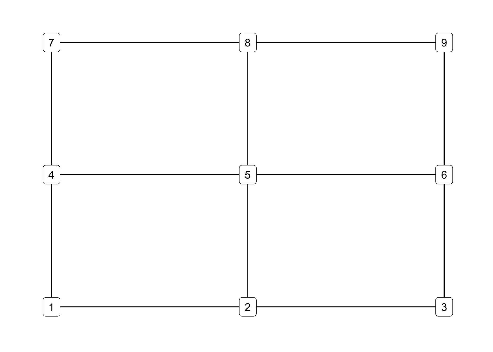
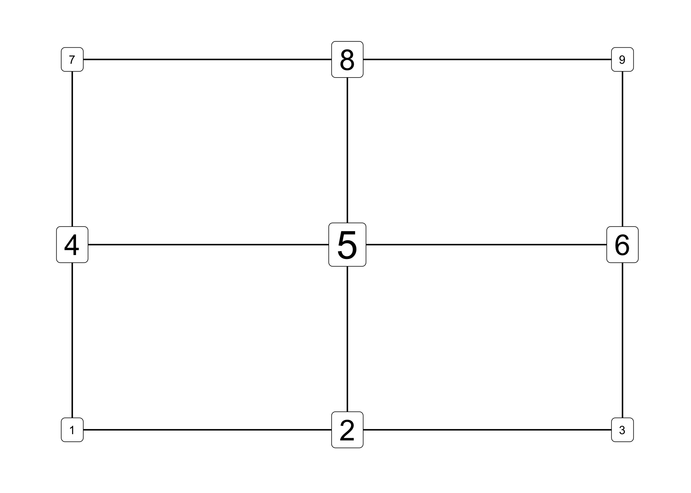
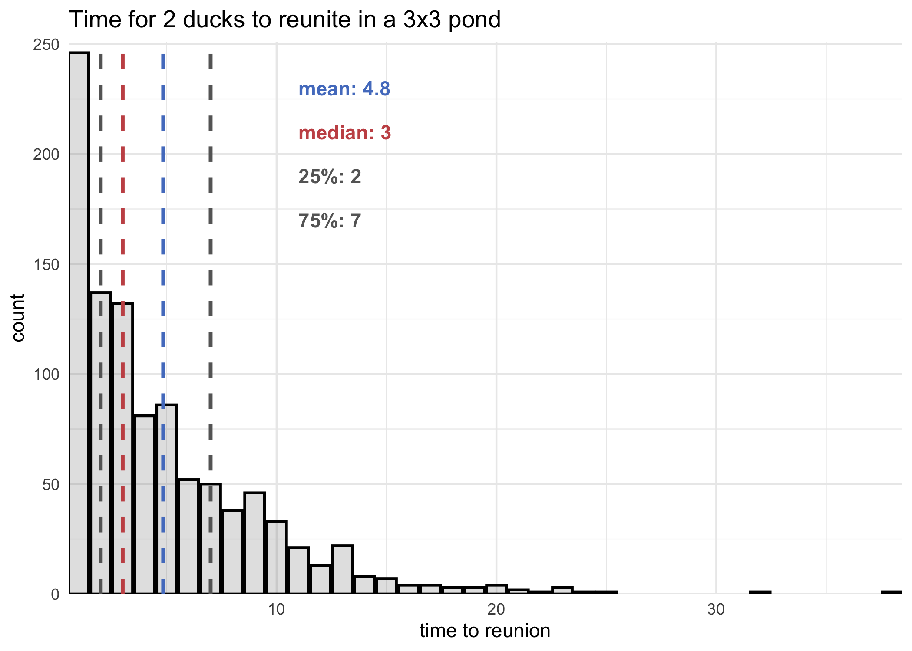
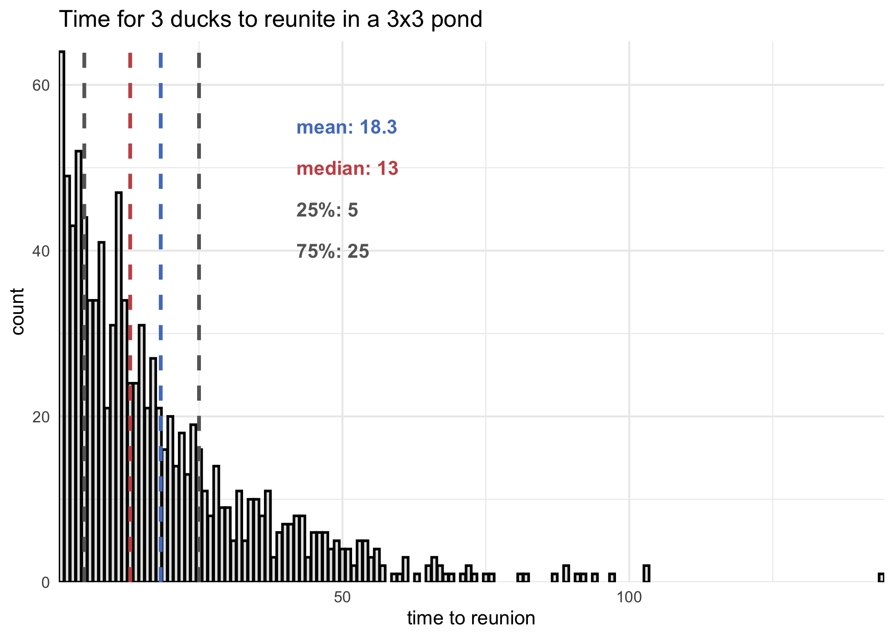
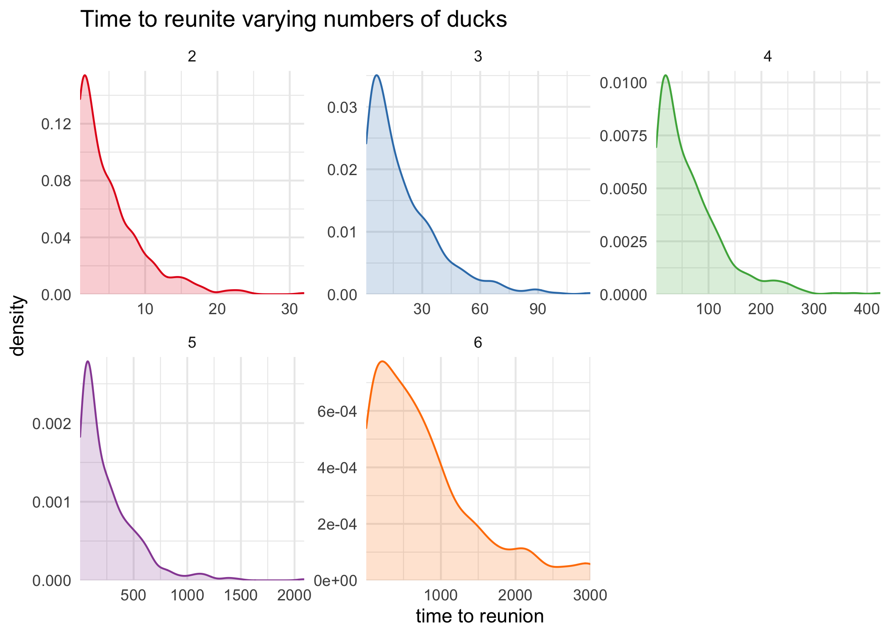
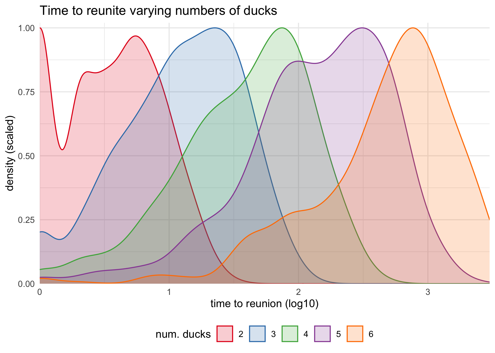

## FiveThirtyEight’s Riddler Classic

[link](https://fivethirtyeight.com/features/can-you-track-the-delirious-ducks/)

> After a long night of frivolous quackery, two delirious ducks are
> having a difficult time finding each other in their pond. The pond
> happens to contain a 3×3 grid of rocks.
> 
> Every minute, each duck randomly swims, independently of the other
> duck, from one rock to a neighboring rock in the 3×3 grid — up, down,
> left or right, but not diagonally. So if a duck is at the middle rock,
> it will next swim to one of the four side rocks with probability 1/4.
> From a side rock, it will swim to one of the two adjacent corner rocks
> or back to the middle rock, each with probability 1/3. And from a
> corner rock, it will swim to one of the two adjacent side rocks with
> probability 1/2.
> 
> **If the ducks both start at the middle rock, then on average, how
> long will it take until they’re at the same rock again?** (Of course,
> there’s a 1/4 chance that they’ll swim in the same direction after the
> first minute, in which case it would only take one minute for them to
> be at the same rock again. But it could take much longer, if they
> happen to keep missing each other.)
> 
> **Extra credit: What if there are three or more ducks?** **If they all
> start in the middle rock, on average, how long will it take until they
> are all at the same rock again?**

## Plan

The plan is to run a straight forward simulation of the game. I will try
to parameterize as many variables of the game as possible so that
different numbers of ducks or pond dimensions can be tested.

## Setup

``` r
knitr::opts_chunk$set(echo = TRUE, comment = "#>", cache = TRUE, dpi = 300)

library(mustashe)
library(ggraph)
library(tidygraph)
library(tidyverse)
library(conflicted)

# Handle any namespace conflicts.
conflict_prefer("filter", "dplyr")
conflict_prefer("select", "dplyr")

# Default 'ggplot2' theme.
theme_set(theme_minimal())

# Some standard colors used throughout
green <- "#54c761"
red <- "#c75454"
blue <- "#547ec7"
purple <- "#a06bdb"
light_grey <- "grey70"
grey <- "grey40"

# For reproducibility.
set.seed(0)
```

I decided to abstract the pond as a graph because there are discrete
states (the rocks in the pond) and specific links between these states
(the constraints on which rocks can be traveled to from another). The
graph was built by first creating a data frame of all possible nodes
with $x$ and $y$ coordinates using `expand.grid()` and giving each a
unique identifier (`name`). Then, every possible edge between each pair
of nodes were compiled into a data frame using `combn()` and reduced by
only keeping those with a distance (using the $x$ and $y$
coordinates of each node) of 1.

``` r
# Calculate the distance between nodes `a` and `b`.
node_distance <- function(a, b) {
    sqrt((a$x[1] - b$x[1])^2 + (a$y[1] - b$y[1])^2)
}


# Build the graph of a pond with dimensions `n` x `m`.
build_pond_graph <- function(n, m) {
    nodes <- expand.grid(x = seq(1, n), y = seq(1, m)) %>%
        as_tibble() %>%
        transmute(name = as.character(row_number()), 
                  x, y)
    
    num_nodes <- nrow(nodes)
    
    edges <- combn(seq(1, num_nodes), 2) %>% 
        t() %>% 
        as.data.frame() %>% 
        as_tibble() %>% 
        set_names(c("from", "to")) %>%
        filter(map2_lgl(from, to, function(n1, n2) {
            node_distance(nodes[nodes$name == n1, ], nodes[nodes$name == n2, ]) == 1
        }))
    
    as_tbl_graph(edges, directed = FALSE) %N>%
        left_join(nodes, by = "name")
}
```

An example graph for the pond in this riddle is shown below.

``` r
pond <- build_pond_graph(3, 3)
ggraph(pond, "grid") +
    geom_edge_link() +
    geom_node_label(aes(label = name), 
                    color = "black",
                    label.padding = unit(2, "mm"),
                    label.r = unit(1, "mm"),
                    label.size = 0.2) +
    theme_graph()
```

<!-- -->

Because I want to parameterize this simulation, the dimensions of the
pond can change. Therefore, the starting point at the middle rock must
be identified algorithmically. This is further complicated by how the
pond can be rectangular and have an even width or height. For these
reasons, I decided to utilize the graph structure of the abstraction to
find the center of the pond using the betweenness centrality. The
betweenness centrality is the number of geodesics (shortest paths) that
travel through a node. Thus, it seemed like a natural fit for this
application. Below is a visualization of the centrality of each node in
the 3x3 pond graph.

``` r
pond %N>%
    mutate(ctr = centrality_betweenness(directed = FALSE)) %>%
    ggraph("grid") +
    geom_edge_link() +
    geom_node_label(aes(label = name, size = ctr), 
                    color = "black",
                    label.padding = unit(2, "mm"),
                    label.r = unit(1, "mm"),
                    label.size = 0.2) +
    scale_size_continuous(range = c(3, 10)) +
    theme_graph() +
    theme(legend.position = "none")
```

<!-- -->

The `find_central_node()` function handles this process for the
simulation, taking a graph and returning the node with the highest
centrality value. If there are ties, only the first is returned. The
function is [memoised](https://CRAN.R-project.org/package=memoise) so it
only has to run once per graph.

``` r
find_central_node <- function(gr) {
    gr %N>%
        mutate(ctr = centrality_betweenness(directed = FALSE)) %>%
        as_tibble() %>%
        filter(ctr == max(ctr)) %>%
        slice(1) %>%
        pull(name) %>%
        unlist()
}
find_central_node <- memoise::memoise(find_central_node)
```

## The simulation

The final step before building the main simulation function is to create
a function that moves a duck a single step on the graph. This is
accomplished in the `take_a_step()` function by using the
`igraph::ego()` function to isolate the immediate neighborhood of a node
(`n`) in a graph (`gr`) and sampling from those nodes.

``` r
# Take a step to another node in `gr` from node `n`.
take_a_step <- function(n, gr) {
    neighbors <- igraph::ego(gr, order = 1, nodes = n, mode = "all") %>%
        unlist() %>%
        names()
    sample(neighbors[neighbors != n], 1)
}
```

The main simulation function, `simulate_delirious_ducks()` is relatively
simple. It first builds a pond and locates the center. Then a list of
duck positions, one per duck, is instantiated with the name of the
center node for each duck. Finally, the `for` loop runs the simulation
by moving each duck a single position on each iteration. The ducks are
moved by mapping the `take_a_step()` function over the `ducks` list. If
all of the ducks are on the same stone (i.e. there is only one distinct
value in the `ducks` list), then the `for` loop is broken to stop the
simulation. The `tracker` data frame records the positions of all of the
ducks throughout the simulation and is returned at the end of the
function.

``` r
simulate_delirious_ducks <- function(pond_n = 3, pond_m = 3, 
                                     n_ducks = 2, 
                                     start_node = NULL,
                                     max_iters = 1e3) {
    # Make pond graph.
    pond <- build_pond_graph(pond_n, pond_m)
    
    # Get the center node to start from which to start the ducks.
    if (is.null(start_node)) {
        start_node <- find_central_node(pond)
    }
    
    # Make a list of positions for the ducks
    ducks <- rep(start_node, n_ducks)
    
    # Iterate until all the ducks are at the same location or max iterations.
    tracker <- tibble()
    for (i in seq(1, max_iters)) {
        ducks <- map(ducks, take_a_step, gr = pond)
        tracker <- bind_rows(tracker, 
                             tibble(i, duck_pos = list(unlist(ducks))))
        
        if (n_distinct(ducks) == 1) { break }
    }
    
    return(tracker)
}

simulate_delirious_ducks()
```

    #> # A tibble: 12 x 2
    #>        i duck_pos 
    #>    <int> <list>   
    #>  1     1 <chr [2]>
    #>  2     2 <chr [2]>
    #>  3     3 <chr [2]>
    #>  4     4 <chr [2]>
    #>  5     5 <chr [2]>
    #>  6     6 <chr [2]>
    #>  7     7 <chr [2]>
    #>  8     8 <chr [2]>
    #>  9     9 <chr [2]>
    #> 10    10 <chr [2]>
    #> 11    11 <chr [2]>
    #> 12    12 <chr [2]>

## Simulating the delirious ducks

I used the
[‘micobenchmark’](https://CRAN.R-project.org/package=microbenchmark)
library to first estimate how long the trials take to run. It seems they
take 100 ms on average, though there is *a lot* of variation.

``` r
library(microbenchmark)
microbenchmark(simulate_delirious_ducks(), times = 50)
```

    #> Unit: milliseconds
    #>                        expr     min       lq     mean   median       uq     max
    #>  simulate_delirious_ducks() 44.3163 70.25602 94.19177 79.80663 101.6753 273.984
    #>  neval
    #>     50

I also created a simple helper function to run the simulation `n_trials`
times and only return the length of each round.

``` r
# Play some number of simulations of the delirious ducks.
play_delirious_ducks <- function(n_trials = 10, n_ducks = 2, max_iters = 1e3) {
    map_dbl(seq(1, n_trials), ~ nrow(
            simulate_delirious_ducks(n_ducks = n_ducks, max_iters = max_iters)
        )
    )
}
```

Finally, we can run the simulation and answer the Riddler. I used the
[‘mustashe’](https://jhrcook.github.io/mustashe/) package to stash and
load the results of the simulation so I don’t have to wait each time
while writing and coding this Riddler solution.

``` r
n_trials <- 1e3
stash("delirious_duck_sims2", {
    delirious_duck_sims2 <- play_delirious_ducks(n_trials, n_ducks = 2)
})
```

    #> Loading stashed object.

The results for 1,000 trials are plotted as a histogram below with the
mean, median, and 25% and 75% quantile are indicated by vertical lines.

``` r
# Summary statistics.
mean_time <- mean(delirious_duck_sims2)
median_time <- median(delirious_duck_sims2)
q25_time <- quantile(delirious_duck_sims2, 0.25)
q75_time <- quantile(delirious_duck_sims2, 0.75)
summ_stats <- tibble(value = c(mean_time, median_time, q25_time, q75_time),
                     name = c("mean", "median", "25%", "75%"),
                     color = c(blue, red, grey, grey)) %>%
    mutate(label = paste0(name, ": ", round(value, 1)))

tibble(sims = delirious_duck_sims2) %>%
    ggplot(aes(sims)) +
    geom_bar(color = "black", size = 0.7, fill = grey, alpha = 0.2) +
    geom_vline(aes(xintercept = value, color = color), data = summ_stats, 
               size = 1, lty = 2) +
    annotate("text", x = 11, y = seq(230, 170, length.out = 4), 
             label = summ_stats$label, color = summ_stats$color, 
             hjust = 0, fontface = "bold", family = "Arial") +
    scale_x_continuous(expand = c(0, 0)) +
    scale_y_continuous(expand = expansion(mult = c(0, 0.02))) +
    scale_color_identity(guide = FALSE) +
    labs(x = "time to reunion", 
         y = "count",
         title = "Time for 2 ducks to reunite in a 3x3 pond")
```

<!-- -->

**Therefore, the answer to the Riddler is it would take, on average, the
2 ducks 4.84 minutes to reunite.**

## More ducks

Since the simulation was parameterized, we can answer the Extra Credit
question and run the process with varying numbers of ducks. The plot
below shows the results for running the simulation with 3 ducks.

``` r
n_trials <- 1e3
stash("delirious_duck_sims3", {
    delirious_duck_sims3 <- play_delirious_ducks(n_trials, n_ducks = 3)
})
```

    #> Loading stashed object.

<!-- -->

The density plots below show the simulation run with 2 through 6 ducks.

``` r
stash("many_ducks_sims", {
    many_ducks_sims <- tibble(n_ducks = c(2:6)) %>%
        mutate(sims = map(n_ducks, ~ play_delirious_ducks(n_trials = 5e2,
                                                          n_ducks = .x,
                                                          max_iters = 3e3)))
})
```

    #> Loading stashed object.

``` r
many_ducks_sims %>%
    unnest(sims) %>%
    ggplot(aes(sims)) +
    facet_wrap(~ n_ducks, scales = "free", nrow = 2) +
    geom_density(aes(color = factor(n_ducks), 
                     fill = factor(n_ducks)), 
                 alpha = 0.2) +
    scale_x_continuous(expand = c(0, 0)) +
    scale_y_continuous(expand = expansion(mult = c(0, 0.02))) +
    scale_color_brewer(palette = "Set1", guide = FALSE) +
    scale_fill_brewer(palette = "Set1", guide = FALSE) +
    labs(x = "time to reunion",
         y = "density",
         color = "num. ducks",
         fill = "num. ducks",
         title = "Time to reunite varying numbers of ducks")
```

<!-- -->

Unsurprisingly, the distributions seem exponential, so taking the
logarithm of the number of steps makes the peaks line up in succession.

``` r
many_ducks_sims %>%
    unnest(sims) %>%
    ggplot(aes(log10(sims))) +
    geom_density(aes(y = ..scaled.., 
                     color = factor(n_ducks), 
                     fill = factor(n_ducks)), 
                 alpha = 0.2) +
    scale_x_continuous(expand = c(0, 0)) +
    scale_y_continuous(expand = expansion(mult = c(0, 0.02))) +
    scale_color_brewer(palette = "Set1") +
    scale_fill_brewer(palette = "Set1") +
    theme(legend.position = "bottom") +
    labs(x = "time to reunion (log10)",
         y = "density (scaled)",
         color = "num. ducks",
         fill = "num. ducks",
         title = "Time to reunite varying numbers of ducks")
```

<!-- -->

-----

### Additional analyses

There are some additional analyses that would be interesting to do (if I
had more time) with the simulation results:

1.  Model the Markov process of the simulation to derive an analytical
    solution.
2.  Identify trends for where the ducks tend to reunite on the pond.
