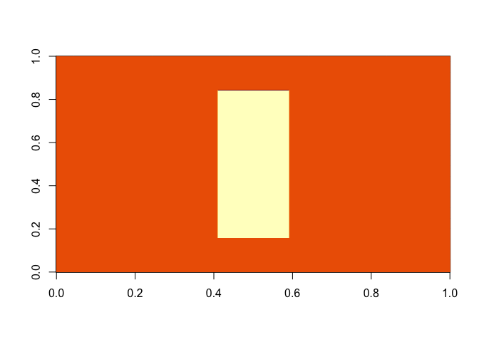
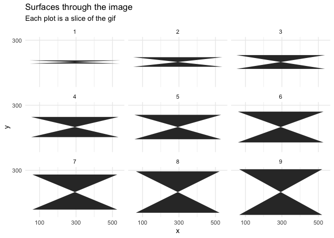
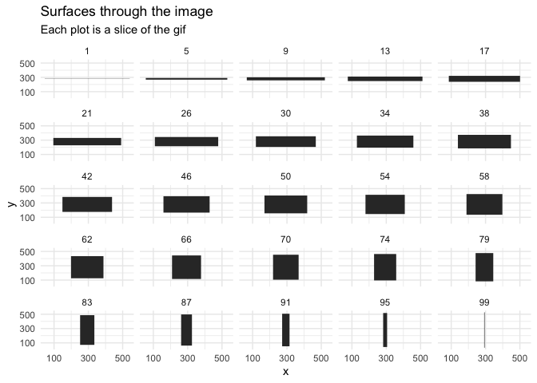

## FiveThirtyEight’s Riddler Express

> Dakota Jones is back in action. In her quest to locate the Temple of
> Diametra, she has found another highly symmetric crystal. However,
> nefarious agents have again gotten wind of her plans, and now Dakota
> and the crystal are nowhere to be found.

> And so, you must once again recreate the crystal using the data from
> Dakota’s laser scanner. As a reminder, the scanner takes a 3D object
> and records 2D cross-sectional slices along the third dimension.
> Here’s the looping animation file the scanner produced for the
> crystal this time:


> What sort of three-dimensional shape is the crystal? No pressure —
> Dakota Jones, nay, the entire world, is counting on you to locate the
> lost temple\!

-----

## Plan

My plan is to read in the slices of the GIF, extract the information as
a binary mask, identify the corners of the maks, and plot these corners
in 3D-space.

## Setup

``` r
knitr::opts_chunk$set(echo = TRUE, comment = "#>")

library(plotly)
library(htmlwidgets)
library(tidyverse)

theme_set(theme_minimal())
```

## Preparing the image data

I read in the GIF image data using the `read.gif()` function from the
[‘caTools’](https://cran.r-project.org/package=caTools) package.

``` r
gif_path <- file.path("assets", "crystal_538.gif")
gif <- caTools::read.gif(gif_path)
```

    #> Warning in caTools::read.gif(gif_path): write.gif: file 'assets/crystal_538.gif'
    #> contains multiple color-maps. Use 'frame' > 0.

The image is contained as a 3D matrix in the `image` slot. The image
matrix is numeric where each number corresponds to a color in the slice.

``` r
names(gif)
```

    #> [1] "image"       "col"         "transparent" "comment"

``` r
dim(gif$image)
```

    #> [1] 558 586 101

``` r
gif$image[1:5, 1:5, 1:3]
```

    #> , , 1
    #> 
    #>      [,1] [,2] [,3] [,4] [,5]
    #> [1,]    0    0    0    0    0
    #> [2,]    0    0    0    0    0
    #> [3,]    0    0    0    0    0
    #> [4,]    0    0    0    0    0
    #> [5,]    0    0    0    0    0
    #> 
    #> , , 2
    #> 
    #>      [,1] [,2] [,3] [,4] [,5]
    #> [1,]    2    2    2    2    2
    #> [2,]    2    2    2    2    2
    #> [3,]    2    2    2    2    2
    #> [4,]    2    2    2    2    2
    #> [5,]    2    2    2    2    2
    #> 
    #> , , 3
    #> 
    #>      [,1] [,2] [,3] [,4] [,5]
    #> [1,]    1    1    1    1    1
    #> [2,]    1    1    1    1    1
    #> [3,]    1    1    1    1    1
    #> [4,]    1    1    1    1    1
    #> [5,]    1    1    1    1    1

The built-in `image()` function can plot a matrix of numeric values.

``` r
image(gif$image[, , 21])
```

<!-- -->

I expected to only find two colors, the foreground and background, but
the edge of the foreground and background sometimes had a slightly
different color.

``` r
table(gif$image[, , 20])
```

    #> 
    #>      0      1      2 
    #>  38164 288012    812

``` r
table(gif$image[, , 21])
```

    #> 
    #>      0      1      2      3 
    #>  40000    802 285986    200

``` r
table(gif$image[, , 22])
```

    #> 
    #>      0      1      2 
    #>  41184 285012    792

Luckly, the foreground always had the color `0`. Therefore, I made a
copy of the `gif$image` where all the 0 values were `TRUE` and the rest
were `FALSE`.

``` r
img <- gif$image
img <- img == 0
```

Finally, the first and last frames are empty, so I removed them.

``` r
img <- img[, , -c(1, 101)]
```

## ‘Tidy’ the image data

I wanted to put the image data into a tidy format so that each row was a
data point with columns `x`, `y`, and `z` (the slice of the GIF) for the
data point’s coordinates and a column `value` for the value (either
`TRUE` or `FALSE`) of the point. This was done by the `get_tidy_xy()`
funciton that takes an index for which to slice `img`.

Then, I needed to get just the corners of the mask. Thankfully, this was
easy because all of the individual shages were rectangles. Therefore, I
could just filter for the points at the minimum and maximum `x` values
and then the minimum and maximum `y` values. This was done by
`get_mask_corners()` that takes a tidy data frame like that produced by
`get_tidy_xy()`.

Both of these functions were used in tandem to produce the `tidy_img`
tibble.

``` r
get_tidy_xy <- function(i) {
    m <- img[, , i]
    colnames(m) <- as.character(seq(1, ncol(m)))
    as.data.frame(m) %>%
        as_tibble() %>%
        mutate(y = 1:n()) %>%
        pivot_longer(-y, names_to = "x", values_to = "value") %>%
        mutate(x = as.numeric(x))
}


get_mask_corners <- function(df) {
    df %>%
        filter(value) %>%
        filter(x == min(x) | x == max(x)) %>%
        filter(y == min(y) | y == max(y))
}


tidy_img <- tibble(z = seq(1, dim(img)[3])) %>%
    mutate(xy = map(z, get_tidy_xy),
           xy = map(xy, get_mask_corners)) %>%
    unnest(xy)

tidy_img
```

    #> # A tibble: 396 x 4
    #>        z     y     x value
    #>    <int> <int> <dbl> <lgl>
    #>  1     1   278    46 TRUE 
    #>  2     1   278   541 TRUE 
    #>  3     1   281    46 TRUE 
    #>  4     1   281   541 TRUE 
    #>  5     2   275    49 TRUE 
    #>  6     2   275   538 TRUE 
    #>  7     2   284    49 TRUE 
    #>  8     2   284   538 TRUE 
    #>  9     3   273    51 TRUE 
    #> 10     3   273   536 TRUE 
    #> # … with 386 more rows

I used the ‘ggforce’ library to plot the first few layers, individually,
before going to 3D.

``` r
tidy_img %>%
    filter(z %in% 1:9) %>%
    ggplot(aes(x = x, y = y, group = z)) +
    facet_wrap(~ z) +
    ggforce::geom_shape() +
    scale_x_continuous(breaks = c(100, 300, 500)) +
    scale_y_continuous(breaks = c(100, 300, 500)) +
    theme(
        panel.grid = element_line()
    ) +
    labs(x = "x", y = "y",
         title = "Surfaces through the image",
         subtitle = "Each plot is a slice of the gif")
```

<!-- -->

Instead of nice rectangles, this produced a bow-tie shape. This was
because of the order of the points - they weree not in the correct order
to draw a rectangle, but instead the top-left point was followed by the
bottom-right point, causing the diagonal. Therefore, the
`arrange_tidy_xy()` function just rearranges each coordinate to properly
draw a rectangle.

``` r
arrange_tidy_xy <- function(df) {
    df <- df[c(1, 2, 4, 3), ]
}

tidy_img <- tidy_img %>%
    group_by(z) %>%
    nest() %>%
    mutate(data = map(data, arrange_tidy_xy)) %>%
    unnest(data)

tidy_img
```

    #> # A tibble: 396 x 4
    #> # Groups:   z [99]
    #>        z     y     x value
    #>    <int> <int> <dbl> <lgl>
    #>  1     1   278    46 TRUE 
    #>  2     1   278   541 TRUE 
    #>  3     1   281   541 TRUE 
    #>  4     1   281    46 TRUE 
    #>  5     2   275    49 TRUE 
    #>  6     2   275   538 TRUE 
    #>  7     2   284   538 TRUE 
    #>  8     2   284    49 TRUE 
    #>  9     3   273    51 TRUE 
    #> 10     3   273   536 TRUE 
    #> # … with 386 more rows

``` r
tidy_img %>%
    filter(z %in% round(seq(1, 99, length.out = 25))) %>%
    ggplot(aes(x = x, y = y, group = z)) +
    facet_wrap(~ z) +
    ggforce::geom_shape() +
    scale_x_continuous(breaks = c(100, 300, 500)) +
    scale_y_continuous(breaks = c(100, 300, 500)) +
    theme(
        panel.grid = element_line()
    ) +
    labs(x = "x", y = "y",
         title = "Surfaces through the image",
         subtitle = "Each plot is a slice of the gif")
```

<!-- -->

## 3D Plotting

Finally, I could plot the points in 3D to create the shape of “Dakota
Jones’ crystal” as the Riddle requests.

``` r
plot_ly(data = tidy_img, x = ~x, y = ~y, z = ~z, size = 1, 
        mode = "markers", opacity = 1.0, type = "scatter3d")
```

<!--html_preserve-->

<iframe src="plot1.html" width="800px" height="500px" scrolling="no" seamless="seamless" frameBorder="0">

</iframe>

<!--/html_preserve-->

``` r
plot_ly(data = tidy_img, x = ~x, y = ~y, z = ~z, size = 1, 
        mode = "line", opacity = 0.5, type = "scatter3d")
```

<!--html_preserve-->

<iframe src="plot2.html" width="800px" height="500px" scrolling="no" seamless="seamless" frameBorder="0">

</iframe>

<!--/html_preserve-->

``` r
plot_ly(data = tidy_img, x = ~x, y = ~y, z = ~z, type = "mesh3d")
```

<!--html_preserve-->

<iframe src="plot3.html" width="800px" height="500px" scrolling="no" seamless="seamless" frameBorder="0">

</iframe>

<!--/html_preserve-->
