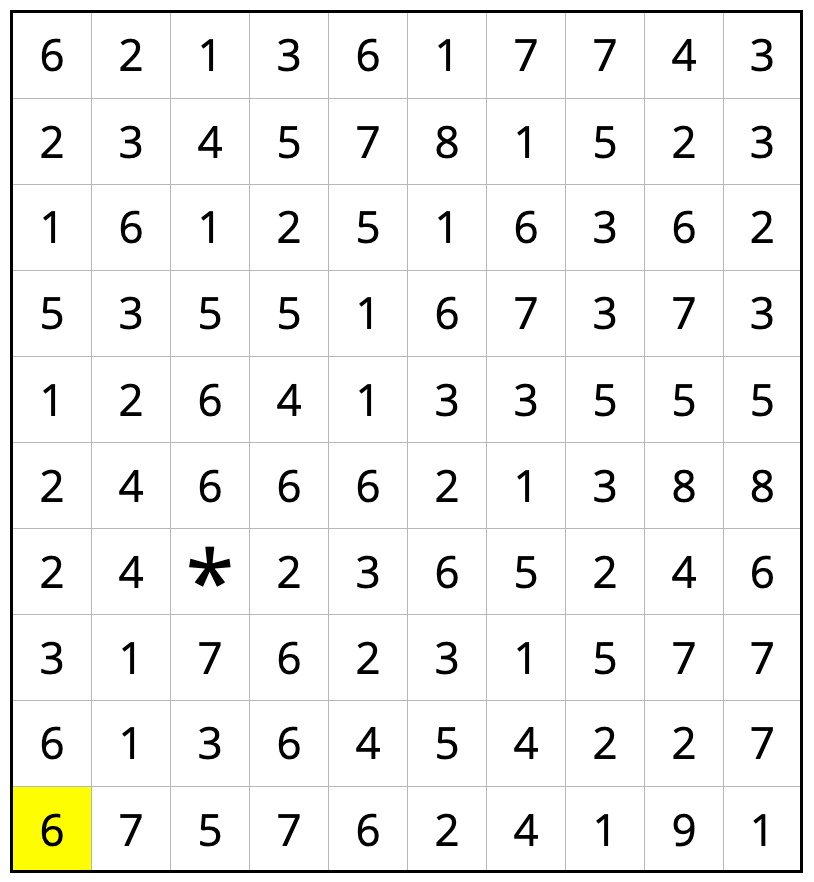
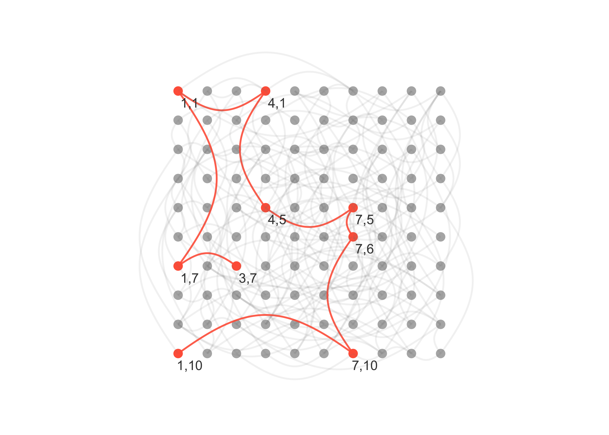
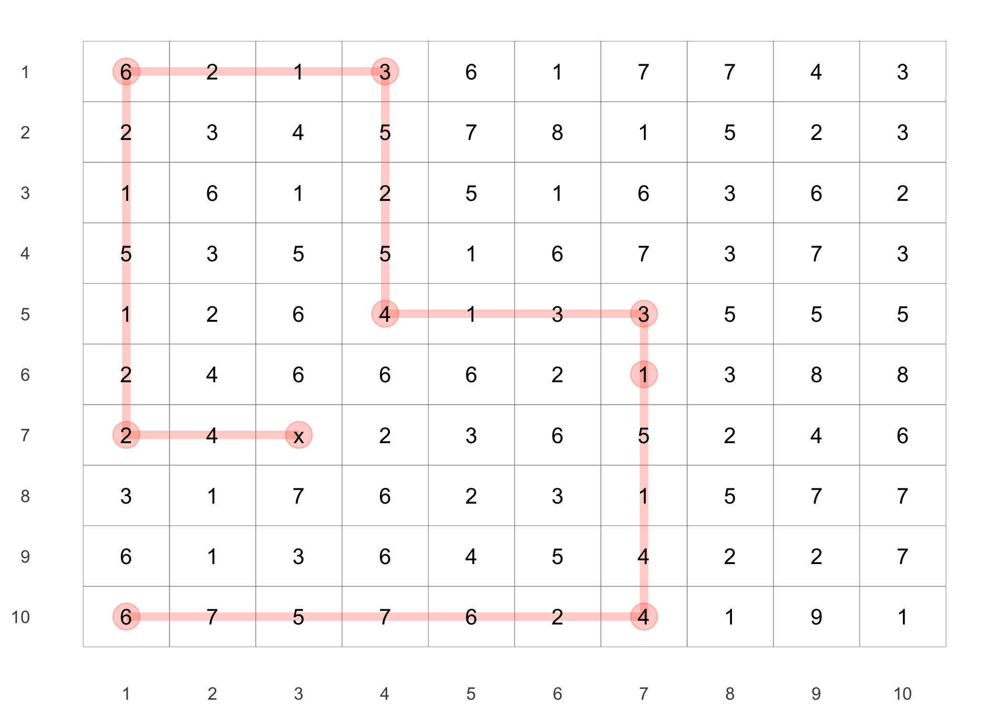

## FiveThirtyEight’s Riddler Express

[link](https://fivethirtyeight.com/features/can-you-break-the-riddler-bank/)

> From Tom Hanrahan, a maze you can solve without getting lost in a
> field of corn:
> 
> </img>
> 
> The number in each box tells you how many spaces up, down, left or
> right you must move. (No diagonal moves, people.) Starting at the
> yellow six in the bottom left corner, can you make your way to the
> asterisk?

## Plan

I can think of two ways to solve this puzzle:

1.  Work backwards from the asterisk and find all possible paths that
    could get there, selecting the one that reaches the highlighted 6.
2.  Make a graph from the highlighted 6 that connects each square (node)
    to all of the ones that it could reach, then use a graph search to
    find the shortest path between the highlighted 6 to the asterisk.

Though the first is likely more efficient, I decided to go with the
second because it seemed easier to implement.

## Setup

``` r
knitr::opts_chunk$set(echo = TRUE, comment = "#>", cache = TRUE, dpi = 300)

library(mustashe)
library(ggraph)
library(tidygraph)
library(tidyverse)
library(conflicted)

# Handle any namespace conflicts.
conflict_prefer("filter", "dplyr")
conflict_prefer("select", "dplyr")

# Default 'ggplot2' theme.
theme_set(theme_minimal())

# For reproducibility.
set.seed(0)
```

I first created a matrix from the PNG image from the riddle.

``` r
maze_matrix <- matrix(
    c(6, 2, 1, 3, 6, 1, 7, 7, 4, 3,
      2, 3, 4, 5, 7, 8, 1, 5, 2, 3,
      1, 6, 1, 2, 5, 1, 6, 3, 6, 2,
      5, 3, 5, 5, 1, 6, 7, 3, 7, 3,
      1, 2, 6, 4, 1, 3, 3, 5, 5, 5,
      2, 4, 6, 6, 6, 2, 1, 3, 8, 8,
      2, 4, 0, 2, 3, 6, 5, 2, 4, 6,
      3, 1, 7, 6, 2, 3, 1, 5, 7, 7,
      6, 1, 3, 6, 4, 5, 4, 2, 2, 7,
      6, 7, 5, 7, 6, 2, 4, 1, 9, 1),
    nrow = 10,
    byrow = TRUE
)
maze_matrix
```

    #>       [,1] [,2] [,3] [,4] [,5] [,6] [,7] [,8] [,9] [,10]
    #>  [1,]    6    2    1    3    6    1    7    7    4     3
    #>  [2,]    2    3    4    5    7    8    1    5    2     3
    #>  [3,]    1    6    1    2    5    1    6    3    6     2
    #>  [4,]    5    3    5    5    1    6    7    3    7     3
    #>  [5,]    1    2    6    4    1    3    3    5    5     5
    #>  [6,]    2    4    6    6    6    2    1    3    8     8
    #>  [7,]    2    4    0    2    3    6    5    2    4     6
    #>  [8,]    3    1    7    6    2    3    1    5    7     7
    #>  [9,]    6    1    3    6    4    5    4    2    2     7
    #> [10,]    6    7    5    7    6    2    4    1    9     1

## Create the graph

There are several ways to make this graph structure, but I decided to go
with a brute force approach - it is simple, but highly inefficient.
Briefly, I made a complete graph (where all of the nodes are connected
to all other nodes) and then removed the edges that couldn’t occur based
on the values on the board. Because the direction of the edge matters
(i.e. the steps are not reversible), this results in a
$(10 \times 10)^2 - 100 = 10,000$ number of edges (subtracting the 100
edges that would connect each node to itself). If the maze was even a
bit larger, this strategy would become untenable.

### Make the node and edge lists

To begin, a data frame of all of the nodes was created from their $x$
and $y$ locations on the board. A column `value` was made by
subsetting the matrix with the $x$ and $y$ coordinates.

``` r
node_list <- expand.grid(1:10, 1:10) %>%
    as_tibble() %>%
    set_names(c("x", "y")) %>%
    mutate(value = map2_dbl(x, y, ~ maze_matrix[.y, .x]),
           name = paste(x, y, sep = ",")) %>%
    select(name, x, y, value)
node_list
```

    #> # A tibble: 100 x 4
    #>    name      x     y value
    #>    <chr> <int> <int> <dbl>
    #>  1 1,1       1     1     6
    #>  2 2,1       2     1     2
    #>  3 3,1       3     1     1
    #>  4 4,1       4     1     3
    #>  5 5,1       5     1     6
    #>  6 6,1       6     1     1
    #>  7 7,1       7     1     7
    #>  8 8,1       8     1     7
    #>  9 9,1       9     1     4
    #> 10 10,1     10     1     3
    #> # … with 90 more rows

Then an edge list was made of all possible connections, removing the
edges that connect a node to itself.

``` r
edge_list <- expand.grid(node_list$name, node_list$name, 
                         stringsAsFactors = FALSE) %>%
    as_tibble() %>%
    set_names(c("from", "to")) %>%
    filter(from != to)
edge_list
```

    #> # A tibble: 9,900 x 2
    #>    from  to   
    #>    <chr> <chr>
    #>  1 2,1   1,1  
    #>  2 3,1   1,1  
    #>  3 4,1   1,1  
    #>  4 5,1   1,1  
    #>  5 6,1   1,1  
    #>  6 7,1   1,1  
    #>  7 8,1   1,1  
    #>  8 9,1   1,1  
    #>  9 10,1  1,1  
    #> 10 1,2   1,1  
    #> # … with 9,890 more rows

The edge list was pruned by only keeping the edges that represented
possible connections from one node to another based on the first node’s
value. This process was handled by the `is_possible_connection()`
function that takes two node names and a data frame with the node
information and returns a boolean value for whether an edge should
exist. (I used the `stash()` function from
[‘mustashe’](https://jhrcook.github.io/mustashe/) to stash the
results instead of having to wait for the code to run every time.)

``` r
stash("edge_list", depends_on = c("edge_list", "node_list"),
{
    is_possible_connection <- function(a, b, nodes) {
        # Get the requisite information.
        a_data <- node_list %>% filter(name == !!a) %>% as.list()
        b_data <- node_list %>% filter(name == !!b) %>% as.list()
        val <- a_data$value
        
        # Check all four possible directions.
        opt1 <- (a_data$x + val == b_data$x) & (a_data$y == b_data$y)
        opt2 <- (a_data$x - val == b_data$x) & (a_data$y == b_data$y)
        opt3 <- (a_data$y + val == b_data$y) & (a_data$x == b_data$x)
        opt4 <- (a_data$y - val == b_data$y) & (a_data$x == b_data$x)
        
        # Return if any of the four possibilities are true.
        return(any(opt1, opt2, opt3, opt4))
    }
    
    edge_list <- edge_list %>%
        filter(map2_lgl(from, to, is_possible_connection, nodes = node_list))
})
```

    #> Loading stashed object.

``` r
edge_list
```

    #> # A tibble: 233 x 2
    #>    from  to   
    #>    <chr> <chr>
    #>  1 4,1   1,1  
    #>  2 8,1   1,1  
    #>  3 3,1   2,1  
    #>  4 2,4   2,1  
    #>  5 3,8   3,1  
    #>  6 2,1   4,1  
    #>  7 3,1   4,1  
    #>  8 4,3   4,1  
    #>  9 4,5   4,1  
    #> 10 6,1   5,1  
    #> # … with 223 more rows

### Search the graph for the solution

With the edge list and node list created, all that’s left to do was
create a [‘tidygraph’](https://tidygraph.data-imaginist.com) object and search for the shortest path between
the starting location and destination.

``` r
maze_graph <- as_tbl_graph(edge_list, directed = TRUE) %>%
    left_join(node_list, by = "name")
maze_graph
```

    #> # A tbl_graph: 100 nodes and 233 edges
    #> #
    #> # A directed simple graph with 1 component
    #> #
    #> # Node Data: 100 x 4 (active)
    #>   name      x     y value
    #>   <chr> <int> <int> <dbl>
    #> 1 4,1       4     1     3
    #> 2 8,1       8     1     7
    #> 3 3,1       3     1     1
    #> 4 2,4       2     4     3
    #> 5 3,8       3     8     7
    #> 6 2,1       2     1     2
    #> # … with 94 more rows
    #> #
    #> # Edge Data: 233 x 2
    #>    from    to
    #>   <int> <int>
    #> 1     1    12
    #> 2     2    12
    #> 3     3     6
    #> # … with 230 more rows

``` r
start_node <- jhcutils::get_node_index(maze_graph, name == "1,10")
end_node <- jhcutils::get_node_index(maze_graph, name == "3,7")
maze_graph %>%
    convert(to_shortest_path, from = start_node, to = end_node,
            .clean = TRUE)
```

    #> # A tbl_graph: 9 nodes and 8 edges
    #> #
    #> # A rooted tree
    #> #
    #> # Node Data: 9 x 4 (active)
    #>   name      x     y value
    #>   <chr> <int> <int> <dbl>
    #> 1 4,1       4     1     3
    #> 2 4,5       4     5     4
    #> 3 1,1       1     1     6
    #> 4 7,5       7     5     3
    #> 5 1,10      1    10     6
    #> 6 1,7       1     7     2
    #> # … with 3 more rows
    #> #
    #> # Edge Data: 8 x 2
    #>    from    to
    #>   <int> <int>
    #> 1     1     3
    #> 2     2     1
    #> 3     4     2
    #> # … with 5 more rows

Below is a plot of the graph with the solution path highlighted in red.
The grid is arranged in the same orientation as the original matrix from
the riddle and the nodes in the solution path are labeled with their
$(x,y)$ coordinates.

``` r
plot_maze_graph <- maze_graph %>%
    morph(to_shortest_path, from = start_node, to = end_node) %N>%
    mutate(is_on_shortest_path = TRUE) %E>%
    mutate(is_on_shortest_path = TRUE) %N>%
    unmorph() %E>%
    mutate(is_on_shortest_path = ifelse(is.na(is_on_shortest_path), 
                                        FALSE, TRUE)) %N>%
    mutate(is_on_shortest_path = ifelse(is.na(is_on_shortest_path), 
                                        FALSE, TRUE),
           label = ifelse(is_on_shortest_path, name, NA))
    

layout_maze_graph <- create_layout(plot_maze_graph, "nicely")
layout_maze_graph$y <- -1 * layout_maze_graph$y
ggraph(layout_maze_graph) +
    geom_node_point(aes(color = is_on_shortest_path),
                    size = 3) +
    geom_edge_arc(aes(color = is_on_shortest_path, 
                      alpha = is_on_shortest_path),
                  width = 0.7, strength = 0.4) +
    geom_node_text(aes(label = label), color = "grey25", nudge_x = 0.4, nudge_y = -0.4) +
    scale_color_manual(values = c("grey70", "tomato")) +
    scale_edge_color_manual(values = c("grey50", "tomato")) +
    scale_edge_alpha_manual(values = c(0.1, 0.9)) +
    coord_equal() +
    theme_graph() +
    theme(legend.position = "none")
```

<!-- -->

Plotting the solution with normal ‘ggplot2’ is possible, though takes a
bit more work. All of the code is shown below, but since it is a bit
more in the weeds, I did’t explain each step. I did add comments to help
those who are curious.

``` r
# A data frame of the node information of the maze graph.
node_idx <- as_tibble(maze_graph, active = "nodes") %>%
    mutate(idx = row_number())

# The names of the nodes on the shortest path (i.e. the solution) were gathered
# and used to get the information of the nodes in the correct order.
maze_soln_paths <- igraph::shortest_paths(maze_graph, 
                                          from = "1,10", 
                                          to = "3,7")$vpath %>% 
    unlist() %>%
    enframe() %>%
    select(name) %>%
    left_join(node_idx, by = "name")

# A long ("tidy") version of the maze matrix was created to use with 'ggplot2'.
long_maze_df <- maze_matrix %>%
    as.data.frame() %>%
    as_tibble() %>%
    set_names(1:10) %>%
    mutate(row = row_number()) %>%
    pivot_longer(-row, names_to = "column", values_to = "value") %>%
    mutate(column = as.numeric(column),
           label = ifelse(value == 0, "x", as.character(value)))

# The plot was made with the long version of the matrix and the path of
# the solution was added in on top by specifying a different data source.
long_maze_df %>%
    ggplot(aes(x = column, y = -1 * row)) +
    geom_tile(color = "grey50", fill = NA) +
    geom_path(aes(x = x, y = -1 * y),
              data = maze_soln_paths, group = "a",
              size = 2, alpha = 0.3, color = "tomato") +
    geom_point(aes(x = x, y = -1 * y),
               data = maze_soln_paths,
               size = 6, alpha = 0.3, color = "tomato") +
    geom_text(aes(label = label), family = "Arial") +
    scale_x_continuous(breaks = 1:10) +
    scale_y_continuous(label = function(x) { str_remove(x, "-") },
                       breaks = -1:-10) +
    theme(panel.grid = element_blank(),
          axis.title = element_blank()) +
    labs()
```

<!-- -->

