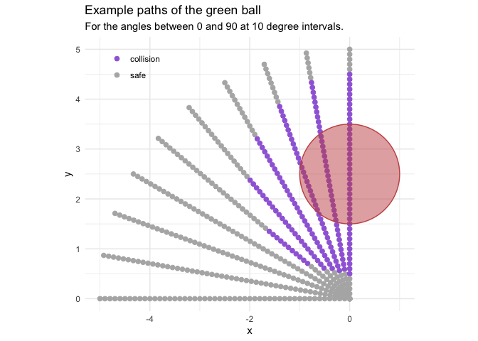

## FiveThirtyEight’s Riddler Express

[link](https://fivethirtyeight.com/features/can-you-roll-the-perfect-bowl/)

> At the recent World Indoor Bowls Championships in Great Yarmouth,
> England, one of the rolls by Nick Brett went viral. Here it is in all
> its glory:

<blockquote class="twitter-tweet">

<p lang="en" dir="ltr">

12/10 on the mindblowing scale 🤯
<a href="https://twitter.com/hashtag/SCtop10?src=hash&amp;ref_src=twsrc%5Etfw">\#SCtop10</a><br><br>(via
<a href="https://twitter.com/BBCSport?ref_src=twsrc%5Etfw">@BBCSport</a>)
<a href="https://t.co/6pN6ybzVel">pic.twitter.com/6pN6ybzVel</a>

</p>

— SportsCenter (@SportsCenter)
<a href="https://twitter.com/SportsCenter/status/1220355057503363072?ref_src=twsrc%5Etfw">January
23, 2020</a>

</blockquote>

<script async src="https://platform.twitter.com/widgets.js" charset="utf-8"></script>

> In order for Nick’s green bowl to split the two red bowls, he needed
> expert precision in both the speed of the roll and its final angle of
> approach.

> Suppose you were standing in Nick’s shoes, and you wanted to split two
> of your opponent’s bowls. Let’s simplify the math a little, and say
> that each bowl is a sphere with a radius of 1. Let’s further suppose
> that your opponent’s two red bowls are separated by a distance of 3 —
> that is, the centers of the red bowls are separated by a distance of
> 5. Define phi as the angle between the path your bowl is on and the
> line connecting your opponent’s bowls.

> For example, here’s how you could split your opponent’s bowls when phi
> is 75 degrees:


> What is the minimum value of phi that will allow your bowl to split
> your opponents’ bowls without hitting them?

## Plan

I will approximate the solution to this puzzle by simulating the game
from many different angles. Thankfully, because the game is vertically
and horizontally symmetric, I only need to simulate the green ball
reaching the middle point between the red balls and only need to see if
it collides with the top red ball.

## Setup

``` r
knitr::opts_chunk$set(echo = TRUE, comment = "#>", cache = TRUE)

library(glue)
library(clisymbols)
library(ggforce)
library(gganimate)
library(tidyverse)

theme_set(theme_minimal())

# Some standard colors used throughout
green <- "#54c761"
red <- "#c75454"
purple <- "#a06bdb"
light_grey <- "grey70"
grey <- "grey40"

set.seed(0)
```

## Simulate a single pass

I split the code into two pieces. The first simulates a bowl with a
given angle, and the second decides on the angle to narrow down the
approximation. The following functions take care of the first part:
simulating a bowl.

A single simulation can be run by calling `run_bowl_simulation()` with
an angle (in degrees). The function works by changing the hypotenuse,
starting with `h_start = 5` and decreasing it to 0 by `step_size` steps
(the steps are held in the numeric vector `h_vals`). The actual position
of the ball is calculated from the length of the hypotenuse and angle
with a bit of trigonometry in `make_green_ball()`. For each hypotenuse
value, the green ball is positioned and then tested to see if it
collides with the red ball (set at \((x,y) = (0,2.5)\) as per the
riddle) using the function `did_balls_collide()`. This information is
recorded by building a single data frame with the data for each step of
the simulation. The data frame is returned at the end of the simulation.

``` r
# Run a simulation of the bowling game.
run_bowl_simulation <- function(angle, 
                                step_size = 0.1, 
                                red_ball_loc = list(x = 0, y = 2.5)) {
    h_start <- 5
    h_vals <- seq(h_start, 0, by = -step_size)
    angle <- angle * (pi / 180)
    
    all_ball_pos <- NULL
    
    for (h in h_vals) {
        green_ball <- make_green_ball(h, angle)
        collision <- did_balls_collide(green_ball, red_ball_loc, radius = 1)
        all_ball_pos <- bind_rows(
            all_ball_pos,
            tibble(h = h, 
                   x = green_ball$x, 
                   y = green_ball$y, 
                   collision = collision)
        )
    }
    return(all_ball_pos)
}
```

``` r
# Make a green ball location from the x-position and angle.
make_green_ball <- function(h, angle) {
    x <- -1 * h * cos(pi/2 - angle)
    y <- h * sin(pi/2 - angle)
    list(x = x, y = y)
}
```

``` r
# Decide wether the two balls of radius `r` collided.
did_balls_collide <- function(ball1, ball2, radius) {
    d <- sqrt((ball1$x - ball2$x)^2 + (ball1$y - ball2$y)^2)
    return(d <= 2*radius)
}
```

Below are the results from running the simulation at angles between 90
degrees (horizontal) and 0 degrees (vertical) at 10 degree increments.
Each line is an individual simulation, and each point is a round of the
simulation. A red ball is positioned as per the riddle, and the purple
points indicate where the green ball would collide with the red ball.
These example simulations show that the `run_bowl_simulation()` function
is working as expected.

``` r
map(seq(90, 0, -10), run_bowl_simulation, step_size = 0.1) %>%
    map2(seq(90, 0, -10), ~ .x %>% add_column(angle = .y)) %>%
    bind_rows() %>%
    mutate(collision = ifelse(collision, "collision", "safe")) %>%
    ggplot() +
    geom_point(aes(x, y, color = collision), size = 2) +
    geom_circle(aes(x0 = x0, y0 = y0, r = r), 
                         data = tibble(x0 = 0, y0 = 2.5, r = 1),
                         color = red, fill = red, alpha = 0.5) +
    scale_color_manual(values = c(purple, light_grey)) +
    coord_fixed() +
    theme(
        legend.position = c(0.15, 0.9),
        legend.title = element_blank()
    ) +
    labs(x = "x", y = "y", 
         title = "Example paths of the green ball",
         subtitle = "For the angles between 0 and 90 at 10 degree intervals.")
```

<!-- -->

## Find the smallest angle

The second part of the code is to find the smallest (narrowest) angle at
which there is no collision. Instead of trying every angle between 90
degrees and 0 degrees at some very small increment, I approach this
problem a bit more efficiently. I built an algorithm than starts at 90
degrees and takes large steps until there is an angle that causes a
collision. It then takes a step back an tries again with a progressively
smaller step, until it no longer collides. This continues with the step
size getting smaller and smaller. The algorithm stops when the step size
is small enough for a good approximation and the angle does not cause a
collision. The code chunk below carries out this process, printing the
information for each pass.

The purpose of the `angle` and `previous_angle` parameters are fairly
obvious. The `angle_delta` parameter is the value by which the angle is
reduced at each step. `epsilon` is used to reduce `angle_delta` when
there are collisions at an angle. Finally, `min_angle_delta` is one of
the stopping criteria: when `angle_delta` gets below this value, the
algorithm is sufficiently close to the correct answer and it stops
trying new angles. *Thus, this parameter determines the precision of the
algorithm.* It is set relatively high for now, because this first pass
is just a demonstration and prints out the results of each iteration.

For efficiency, the while loop uses a memoised version of
`run_bowl_simulation()` because when the balls collide, the previous
step is tried again. Therefore, memoising the function saves some time
instead of running the simulation from the same angle multiple times.

``` r
# The starting angle.
angle <- 90
previous_angle <- angle

# The "learning rate" paramerters.
angle_delta <- 10
epsilon <- 0.5
min_angle_delta <- 0.01

# Start with TRUE, though it doesn't matter.
collision <- TRUE

memo_bowl_sim <- memoise::memoise(run_bowl_simulation)

while (angle_delta >= min_angle_delta | collision) {
    # Run the bowling simulation with the current angle.
    sim_res <- memo_bowl_sim(angle = angle, step_size = 0.1)
    
    # Were there any collisions?
    collision <- any(sim_res$collision)
    
    # Print results
    msg <- "collision: {ifelse(collision, symbol$cross, symbol$tick)}" %>%
        paste("{collision},") %>%
        paste("angle: {round(angle, 4)},") %>%
        paste("angle_delta: {round(angle_delta, 4)}")
    print(glue(msg))
    
    if (!collision) {
        # Reduce the angle if there is no collision.
        previous_angle <- angle
        angle <- angle - angle_delta
    } else {
        # Revert to the previous angle and reduce delta if there is a collision.
        angle_delta <- epsilon * angle_delta
        angle <- previous_angle
    }
}
```

    #> collision: ✔ FALSE, angle: 90, angle_delta: 10
    #> collision: ✔ FALSE, angle: 80, angle_delta: 10
    #> collision: ✔ FALSE, angle: 70, angle_delta: 10
    #> collision: ✔ FALSE, angle: 60, angle_delta: 10
    #> collision: ✖ TRUE, angle: 50, angle_delta: 10
    #> collision: ✔ FALSE, angle: 60, angle_delta: 5
    #> collision: ✔ FALSE, angle: 55, angle_delta: 5
    #> collision: ✖ TRUE, angle: 50, angle_delta: 5
    #> collision: ✔ FALSE, angle: 55, angle_delta: 2.5
    #> collision: ✖ TRUE, angle: 52.5, angle_delta: 2.5
    #> collision: ✔ FALSE, angle: 55, angle_delta: 1.25
    #> collision: ✔ FALSE, angle: 53.75, angle_delta: 1.25
    #> collision: ✖ TRUE, angle: 52.5, angle_delta: 1.25
    #> collision: ✔ FALSE, angle: 53.75, angle_delta: 0.625
    #> collision: ✖ TRUE, angle: 53.125, angle_delta: 0.625
    #> collision: ✔ FALSE, angle: 53.75, angle_delta: 0.3125
    #> collision: ✔ FALSE, angle: 53.4375, angle_delta: 0.3125
    #> collision: ✖ TRUE, angle: 53.125, angle_delta: 0.3125
    #> collision: ✔ FALSE, angle: 53.4375, angle_delta: 0.1562
    #> collision: ✔ FALSE, angle: 53.2812, angle_delta: 0.1562
    #> collision: ✖ TRUE, angle: 53.125, angle_delta: 0.1562
    #> collision: ✔ FALSE, angle: 53.2812, angle_delta: 0.0781
    #> collision: ✔ FALSE, angle: 53.2031, angle_delta: 0.0781
    #> collision: ✖ TRUE, angle: 53.125, angle_delta: 0.0781
    #> collision: ✔ FALSE, angle: 53.2031, angle_delta: 0.0391
    #> collision: ✔ FALSE, angle: 53.1641, angle_delta: 0.0391
    #> collision: ✖ TRUE, angle: 53.125, angle_delta: 0.0391
    #> collision: ✔ FALSE, angle: 53.1641, angle_delta: 0.0195
    #> collision: ✔ FALSE, angle: 53.1445, angle_delta: 0.0195
    #> collision: ✖ TRUE, angle: 53.125, angle_delta: 0.0195
    #> collision: ✔ FALSE, angle: 53.1445, angle_delta: 0.0098

From the print-out above, we can see how the algorithm jumps back an
forth, narrowing in on a solution around 53 degrees.

With that successful proof-of-concept, the following code runs the
algorithm with a smaller `min_angle_delta = 1e-5` to achieve greater
precision. Instead of printing out the results of each iteration, the
simulation results and parameters are saved to `sim_results_tracker` and
`sim_parameters_tracker`, respectively, and are inspected below.

``` r
angle <- 90
previous_angle <- angle

angle_delta <- 10
epsilon <- 0.7
min_angle_delta <- 1e-5

collision <- TRUE

sim_results_tracker <- tibble()
sim_parameters_tracker <- tibble()

memo_bowl_sim <- memoise::memoise(run_bowl_simulation)

while (angle_delta >= min_angle_delta | collision) {
    sim_res <- memo_bowl_sim(angle = angle, step_size = 0.01)
    collision <- any(sim_res$collision)
    
    sim_results_tracker <- bind_rows(sim_results_tracker,
                                     sim_res %>% add_column(angle = angle))
    
    sim_parameters_tracker <- bind_rows(sim_parameters_tracker,
                                        tibble(angle, angle_delta, 
                                               collision, epsilon))
    
    if (!collision) {
        previous_angle <- angle
        angle <- angle - angle_delta
    } else {
        angle_delta <- epsilon * angle_delta
        angle <- previous_angle
    }
}
```

The simulation took 89 steps. The plot below shows the angle and
`angle_delta` at each step, colored by whether there was a collision or
not.

``` r
sim_parameters_tracker %>%
    mutate(row_idx = row_number()) %>%
    pivot_longer(-c(row_idx, epsilon, collision)) %>%
    ggplot(aes(x = row_idx, y = value)) +
    facet_wrap(~ name, nrow = 2, scales = "free") +
    geom_point(aes(color = collision), size = 0.9) + 
    scale_color_manual(values = c(light_grey, purple)) +
    labs(x = "iteration number", 
         y = "value",
         title = "Simulation parameters")
```

<!-- -->

The following plot shows each of the paths tried, again, coloring the
locations of collisions in purple.

``` r
sim_results_tracker %>%
    mutate(collision = ifelse(collision, "collision", "safe")) %>%
    ggplot() +
    geom_point(aes(x = x, y = y, color = collision), 
              size = 0.1) +
    scale_color_manual(values = c(collision = purple,
                                  safe = light_grey)) +
    coord_fixed() +
    theme(legend.position =  "none") +
    labs(x = "x", 
         y = "y", 
         title = "Paths of the green ball",
         subtitle = "Points marked in purple were collisions with the red ball.")
```

<!-- -->

Finally, we can find the approximated angle by taking the smallest angle
tried in the rounds of simulation that did not have any collisions.

``` r
smallest_angle <- sim_parameters_tracker %>% 
    filter(collision == FALSE) %>% 
    top_n(1, wt = -angle) %>%
    pull(angle) %>%
    unique()
```

**The algorithm approximates the solution to be: 53.1301 degrees (0.9273
in radians).**

The simulation with this angle is shown in an animated plot below.

``` r
final_result <- sim_results_tracker %>%
    filter(angle == smallest_angle) %>%
    mutate(row_idx = row_number()) %>%
    filter(row_idx == 1)

bind_rows(
    final_result,
    final_result %>%
        mutate(x = -1 * x, y = -1 * y)
) %>%
    mutate(row_idx = row_number()) %>%
    ggplot() +
    geom_point(aes(x = x, y = y),
               color = green, size = 2) +
    geom_circle(aes(x0 = x, y0 = y, r = 1),
                fill = green, alpha = 0.2, size = 0) +
    geom_point(aes(x, y),
               data = tibble(x = 0, y = 2.5),
               color = red, size = 2) +
    geom_circle(aes(x0 = x, y0 = y, r = r),
                data = tibble(x = 0, y = 2.5, r = 1),
                fill = red, alpha = 0.2, size = 0) +
    geom_point(aes(x, y),
               data = tibble(x = 0, y = -2.5),
               color = red, size = 2) +
    geom_circle(aes(x0 = x, y0 = y, r = r),
                data = tibble(x = 0, y = -2.5, r = 1),
                fill = red, alpha = 0.2, size = 0) +
    coord_fixed() +
    labs(
        x = "x",
        y = "y",
        title = glue(
             "The tightest angle of the perfect bowl: {round(smallest_angle, 3)} deg."
    )) +
    transition_states(row_idx, transition_length = 2,
                      state_length = 0, wrap = FALSE) +
    ease_aes("sine-in-out")
```

<!-- -->

-----

## Acknowledgements

Repetitive tasks were sped up using the
[‘memoise’](https://github.com/r-lib/memoise) package for
memoization. Plotting was accomplished using
[‘ggplot2’](https://ggplot2.tidyverse.org),
[‘ggforce’](https://ggforce.data-imaginist.com), and
[‘gganimate’](https://gganimate.com).
