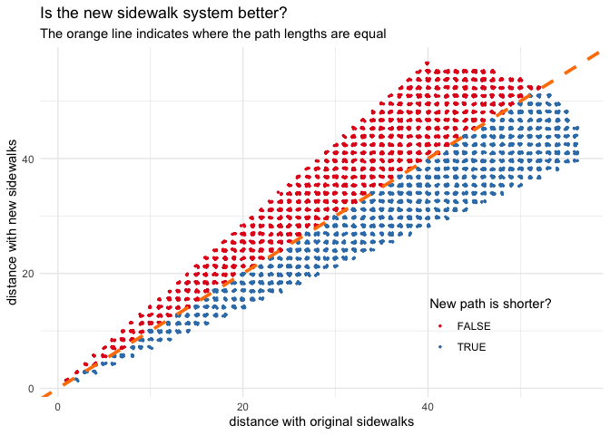

## FiveThirtyEight’s Riddler Express

[link](https://fivethirtyeight.com/features/can-you-solve-this-rather-pedestrian-puzzle/)

> Riddler City is a large circular metropolis, with countless square
> city blocks that each have a side length of 1 km. A small section of
> the city, composed of 36 blocks, is shown in the diagram below:

> At the very center of the city lies Riddler City Hall. Its many
> employees all walk to and from work, and their homes are evenly
> scattered across the city. The sidewalks they walk along have always
> been adjacent to the streets — but that may be changing.


> Recently, several city hall employees submitted a petition, requesting
> that the sidewalks should no longer lie alongside the streets.
> Instead, they want the sidewalks to cut diagonally across the city,
> connecting nearby street intersections. These proposed sidewalks are
> represented by the thicker blue lines in the diagram below:


> The mayor of Riddler City has tasked you with resolving this dispute
> in a mathematical manner. She would like you to answer the following
> question: **What fraction of the city hall employees would have a
> shorter walk home (that is, to the street intersection nearest to
> their home) if the city replaced its traditional sidewalks with these
> diagonal sidewalks?**

## Plan

My plan is to build out each system as a graph and then measure the
shortest distance to the center from each node.

## Setup

``` r
knitr::opts_chunk$set(echo = TRUE, comment = "#>")

library(glue)
library(ggraph)
library(tidygraph)
library(tidyverse)

theme_set(theme_minimal())

set.seed(0)
```

## Building the graphs

I plan to do a small-scale example and then get the final answer with a
larger city. To help with this, I parameterized the number of blocks in
the city as the variable `N_BLOCKS` derived from the radius of the city
`CITY_RADIUS`. The number of rows and columns were derived from this.

``` r
CITY_RADIUS <- 3
N_BLOCKS <- CITY_RADIUS * 2 + 2
num_rows <- N_BLOCKS + 1
num_cols <- num_rows
```

I built a simple function `node_name()` to help keep the naming of the
nodes standardized as the column (x) and row (y) of the node. It is
first used to locate the city hall.

``` r
node_name <- function(column_idx, row_idx) {
    paste(column_idx, row_idx, sep = ",")
}

TOWN_HALL_POS <- list(col = 1 + floor(0.5 * N_BLOCKS), 
                      row = 1 + floor(0.5 * N_BLOCKS))
TOWN_HALL <- node_name(TOWN_HALL_POS$col, TOWN_HALL_POS$row)
TOWN_HALL
```

    #> [1] "5,5"

I also made a the function `is_in_circle()` that checks if the point
made by `col` and `row` are in a circle defined by `center` and
`radius`. This is used below to trim down a rectangular grid to a circle
for the city.

``` r
is_in_circle <- function(center, col, row, radius) {
    sqrt((col - center$col)^2 + (row - center$row)^2) <= radius
}
is_in_circle <- memoise::memoise(is_in_circle)
```

### The original sidewalk system

I built the first graph of the original layout of the city in two
pieces, first stringing all of the columns of the grid together, and
then adding edges for the rows. I plot the intermediate graphs to make
this more clear. At each step, the two nodes are checked to make sure
they are both within the circle of the city.

The first set of for-loops below iterate through the rows for each
column, adding an edge to the edgelist `el`.

``` r
el <- tibble()

for (col_idx in seq(1, num_cols)) {
    for (row_idx in seq(1, num_rows - 1)) {
        
        check_1 <- is_in_circle(TOWN_HALL_POS, col_idx, row_idx, CITY_RADIUS)
        check_2 <- is_in_circle(TOWN_HALL_POS, col_idx, row_idx+1, CITY_RADIUS)
        
        if (check_1 & check_2) {
            node_a <- node_name(col_idx, row_idx)
            node_b <-node_name(col_idx, row_idx + 1)
            el <- bind_rows(el, tibble(from = node_a, to = node_b))
        }
    }
}
```

Below shows the intermediate graph where only the vertical connections
have been made.

<!-- -->

The same process is followed to add the horizontal edges of the grid to
the edge list.

``` r
for (row_idx in seq(1, num_rows)) {
    for (col_idx in seq(1, num_cols - 1)) {
        if (is_in_circle(TOWN_HALL_POS, col_idx, row_idx, CITY_RADIUS) & 
            is_in_circle(TOWN_HALL_POS, col_idx + 1, row_idx, CITY_RADIUS)) {
            node_a <- node_name(col_idx, row_idx)
            node_b <-node_name(col_idx + 1, row_idx)
            el <- bind_rows(el, tibble(from = node_a, to = node_b))
        }
    }
}
```

With the horizontal connections made, the `tidygraph` object can be
created from the edge list.

``` r
city_graph <- as_tbl_graph(el, directed = FALSE)
```

<!-- -->

### The diagonal sidewalk system

Building the graph for the diagonal layout was a bit different. I’m sure
there is a more efficient method, but I decided to use a very verbose
one. It uses two nested for-loops to iterate over each integer value in
the grid. For each of these nodes, connections to nodes in the middle of
the block were made. Therefore, there are now nodes with 0.5 positions
on the grid. The many if-statements are there to make sure connections
are not made beyond the limits of the grid (though I don’t think they
would matter to the final calculation because they would not create
faster routes to the middle).

``` r
el <- tibble()

add_to_el <- function(from, to_col, to_row) {
    el <<- bind_rows(el, tibble(from = node_a, to = node_name(to_col, to_row)))
}

for (col_idx in seq(1, num_cols)) {
    for (row_idx in seq(1, num_rows)) {
        node_a <- node_name(col_idx, row_idx)
        
        if (!is_in_circle(TOWN_HALL_POS, col_idx, row_idx, CITY_RADIUS)) {
            next
        }
        
        if (col_idx < num_cols & row_idx < num_rows) {
            add_to_el(node_a, col_idx + 0.5, row_idx + 0.5)
        } 
        
        if (col_idx > 1 & row_idx < num_rows) {
            add_to_el(node_a, col_idx - 0.5, row_idx + 0.5)
        }
        
        if (row_idx > 1 & col_idx < num_cols) {
            add_to_el(node_a, col_idx + 0.5, row_idx - 0.5)
        }
        
        if (row_idx > 1 & col_idx > 1) {
            add_to_el(node_a, col_idx - 0.5, row_idx - 0.5)
        }
    }
}

diag_graph <- as_tbl_graph(el, directed = FALSE)
```

The grid looks similar to the first, but we can also see the new 0.5
nodes.

<!-- -->

## Measure distance to city hall

Finally, we can measure the distance from each node to the city hall at
the center. Note that I do adhere to the Riddler because it asks for the
length of the path to the nearest street intersection, which is a node
(with an integer values for the name) in the two graphs that have been
built.

The distance of the shortest path was measured from every node to the
center node using the `distance()` function from the
[‘igraph’](https://igraph.org) package.

``` r
original_city_distances <- igraph::distances(city_graph, to = TOWN_HALL)
diagonal_city_distances <- igraph::distances(diag_graph, to = TOWN_HALL) 
```

These values had to be slightly modified because the length of an edge
in the original graph is longer than the edge in the graph with diagonal
sidewalks. Each edge in the graph of diagonal sidewalks is half of the
hypotenuse. This value is calculated below in units of the original
sidewalk length and multiplied against the lengths of the shortest
paths.


``` r
original_sidewalk_unit <- 1
diagonal_sidewalk_unit <- 0.5 * sqrt(original_sidewalk_unit^2 + original_sidewalk_unit^2)

original_city_distances <- original_city_distances * original_sidewalk_unit
diagonal_city_distances <- diagonal_city_distances * diagonal_sidewalk_unit
```

Below are the summaries of these distances. It seems like, on average,
the walking distances were shorter with original sidewalks, but only
slightly.

``` r
summary(original_city_distances)
```

    #>       5,5       
    #>  Min.   :0.000  
    #>  1st Qu.:2.000  
    #>  Median :3.000  
    #>  Mean   :2.483  
    #>  3rd Qu.:3.000  
    #>  Max.   :4.000

``` r
summary(diagonal_city_distances)
```

    #>       5,5       
    #>  Min.   :0.000  
    #>  1st Qu.:2.121  
    #>  Median :2.828  
    #>  Mean   :2.906  
    #>  3rd Qu.:3.536  
    #>  Max.   :4.950

### Visualizing the results

Below are several ways of visualizing the results.

The first code chunk below “tidy’s” the data by creating one tall data
frame with the data from both graphs. (I don’t show the code for the
plots as they are relatively standard ‘ggplots’, but the code is
available in the R Markdown notebook linked at the top of the page.)

``` r
tidy_distance_matrix <- function(mat, name) {
    mat %>%
        as.data.frame() %>%
        set_names(c("dist_to_cityhall")) %>%
        rownames_to_column("from") %>%
        as_tibble() %>%
        add_column(city = name)
}

walking_dists <- bind_rows(
    tidy_distance_matrix(original_city_distances, "original"),
    tidy_distance_matrix(diagonal_city_distances, "diagonal")
) %>%
    filter(
        city == "original" | (city == "diagonal" & !str_detect(from, "\\."))
    ) %>%
    filter(from != !!TOWN_HALL)

head(walking_dists)
```

    #> # A tibble: 6 x 3
    #>   from  dist_to_cityhall city    
    #>   <chr>            <dbl> <chr>   
    #> 1 3,3                  4 original
    #> 2 3,4                  3 original
    #> 3 3,5                  2 original
    #> 4 3,6                  3 original
    #> 5 4,3                  3 original
    #> 6 4,4                  2 original

The plot below just shows a histogram of the walking distances.

<!-- -->

We can also calculate the difference in the shortest distance from each
node on each graph. I subtracted the shortest distances on the original
sidewalks from those on the diagonal sidewalks, so a negative number
indicates the node’s shortest distance to the center decreased on the
diagonal sidewalks.

``` r
diff_walking_dists <- walking_dists %>%
    pivot_wider(from, names_from = city, values_from = dist_to_cityhall) %>%
    mutate(dist_diff = diagonal - original)

summary(diff_walking_dists$dist_diff)
```

    #>     Min.  1st Qu.   Median     Mean  3rd Qu.     Max. 
    #> -1.17157 -0.58579 -0.17157  0.05497  0.82843  1.24264

The plot below shows both shortest distance values on the x and y-axis.
The line indicates where the distances are the same. The points that lie
below the line (blue) have a shorter walk with the diagonal sidewalks.

<!-- -->

Below is a histogram of the differences in shortest path lengths for
each node. By eye, it looks like most data points lie below 0 on the
x-axis.

<!-- -->

Finally, we can plot which node has a shorter or longer distance with
the diagonal sidewalks overlayed on the original grid system.

<!-- -->

## What about with a larger city?

The Riddler states that the city is very large, so I increased the
radius for the simulation and re-ran the same code and generated the
same plots. In this simulation, city hall is on node (42, 42).

``` r
CITY_RADIUS <- 40
N_BLOCKS <- CITY_RADIUS * 2 + 2
num_rows <- N_BLOCKS + 1
num_cols <- num_rows

TOWN_HALL_POS <- list(col = 1 + floor(0.5 * N_BLOCKS), 
                      row = 1 + floor(0.5 * N_BLOCKS))
TOWN_HALL <- node_name(TOWN_HALL_POS$col, TOWN_HALL_POS$row)
TOWN_HALL
```

    #> [1] "42,42"

    #>      Min.   1st Qu.    Median      Mean   3rd Qu.      Max. 
    #> -16.40202  -4.96573  -0.04416  -0.04943   4.87006  16.56854

The density plot below shows that the distributions of walking distances
are pretty much equivalent between the two sidewalk layouts.

<!-- -->

Taking the difference of the path lengths for each person backs up this
initial observation. It looks like half of the nodes fall above the 1:1
line, and half fall below.

<!-- -->

Plotting a histogram of the differences in distance between the two
layouts presents the 50:50 split quite clearly.

<!-- -->

Finally, laying out the difference between the distances from each node
on their original geographic location shows quite clearly that half of
the nodes have a shorter distance to city hall, while the walk for the
other half gets longer.

<!-- -->

## Answer

As a reminder, the original question was:

> What fraction of the city hall employees would have a shorter walk
> home (that is, to the street intersection nearest to their home) if
> the city replaced its traditional sidewalks with these diagonal
> sidewalks?

``` r
mean(diff_walking_dists$dist_diff < 0)
```

    #> [1] 0.5015924

**About 50% of employees would now have a shorter walk to work.** This
makes sense when we think about the use of the diagonal sidewalks as
just a rotation of the current grid system. The net total would be no
change in the average distance walked to city hall.

---

## An analytic solution

A few days after posting this article, I recieved an email from David Lubinsky explaining how the problem could be solved analytically.
Below is his explination (with a few modifications with his permission).

> Fun article on the Pedestrian puzzle. 
> There is a much simpler analytic solution.
> 
> First, let's assume the centre point is at the origin and look at only the upper-right quadrant where $(x,y) \ge 0$. 
> Now restrict it more so that $x \ge y$. 
> So we are only looking at the area below the $y = x$ line in the upper-right quadrant.
> 
> The rectilinear distance $R(x,y) = x+y$. 
> Since we walk $x$ blocks across and $y$ up.
> 
> Now the distance with the diagonal sidewalks is $D(x,y) = \sqrt{2}y + \sqrt{2}(x-y)$. 
> Starting from $(0,0)$, we now take $y$ diagonal steps up to the point $(y,y)$ then $(x-y)$ steps to the right to $(x,y)$, but now each right step is also $\sqrt{2}$ times the length of the original unit since we have to go diagonally up the centre of the square and down.
> 
> Simplifying $D(x,y) = \sqrt{2}x$.
> In other words $y$ doesn't matter since $x \ge y$, so it is just $x$ steps of length $\sqrt{2}$.
> 
> Now to find the are where $R(x,y) \ge D(x,y)$.
> 
> $x+y \ge \sqrt{2}x$
> 
> $y \ge (\sqrt{2}-1) x$
> 
> $\frac{y}{x} >= \sqrt{2}-1$
> 
> $\arctan(\sqrt{2}-1) = 22.5 \text{ degrees}$
> 
> Recall that the line $y=x$ is at 45 degrees. 
> So the triangle where $R(X,Y) \ge D(X,Y)$ is half of the restricted area we are looking at.
> Therefore, the $\Pr(R(X,Y) \ge D(X,Y)) = 0.5$, as you discovered in your article.
> 
> This assumes that the integer points are equally distributed in each triangular sliver, but, since we said the city is very large, that's okay.

A huge thank you to David Lubinsky for taking the time to write this up and send it over.
Mr. Lubinsky can be contacted via his [LinkedIn](https://www.linkedin.com/in/david-lubinsky-422419/) profile.

---

## Acknowledgements

The graphs were made and analyzed with [igraph](https://igraph.org) and
[tidygraph](https://tidygraph.data-imaginist.com). The graphs were
plotted with [ggraph](https://ggraph.data-imaginist.com). Repetitive
tasks were sped up using the [memoise](https://github.com/r-lib/memoise)
package for memoization.

