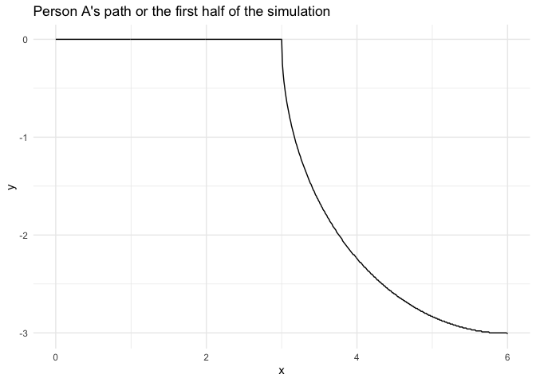
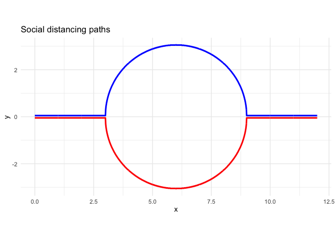
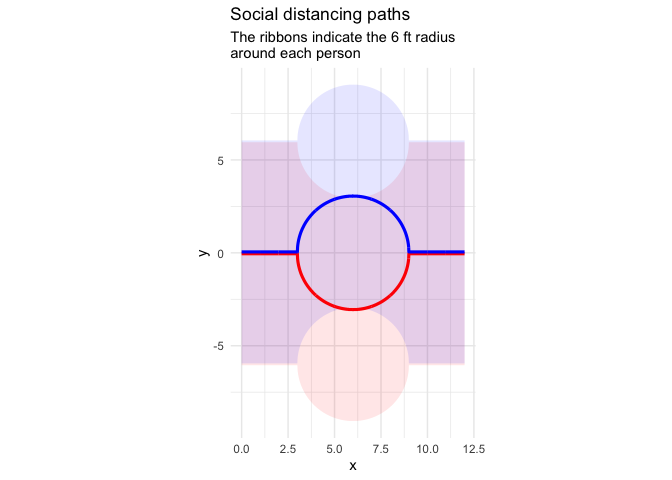
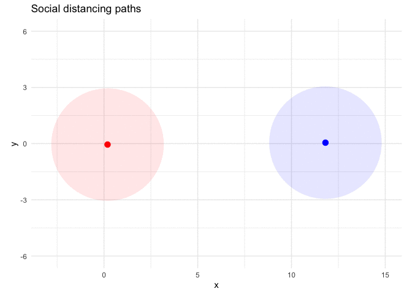

## FiveThirtyEight’s Riddler Express

([Link](https://fivethirtyeight.com/features/can-you-catch-the-free-t-shirt/) to the original article.)

> From Patrick Mayor comes a question about something we’re doing these
> days to keep ourselves and others safe: social distancing.

> You’re walking along the middle of a wide sidewalk when you see
> someone walking toward you from the other direction, also down the
> middle of the sidewalk, 12 feet away. Being responsible citizens, you
> pass each other while maintaining a distance of at least 6 feet at all
> times. By the time you reach each other’s original positions, you
> should be back in the middle of the sidewalk again.

> You should assume that the other person follows the same path you do,
> but flipped around (since they’re walking in the opposite direction).
> For example, you could both walk 3 feet to the left, 12 feet forward
> and finally 3 feet back to the right, walking a total of 18 feet
> before swapping positions.

> **Being lazy (I mean, efficient), you’d like to know the shortest
> distance you and the other person could walk so that you can switch
> positions, all while staying at least 6 feet apart at all times. What
> is this distance?**

## Plan

I am basically going to simulate the process with very small time steps
and track the location of each person. These points can then be used to
measure the distance traveled by each person.

## Setup

``` r
knitr::opts_chunk$set(echo = TRUE, comment = "#>")

library(glue)
library(ggforce)
library(gganimate)
library(tidyverse)

theme_set(theme_minimal())
```

## Simulation

### Global constants

Below are a few constants to define from the beginning. `time_step_size`
is the distance traveled at each time step of the simulation.
`minimum_distance` is the minimum safe distance that the two people need
to stay from each other.

``` r
time_step_size <- 0.01
minimum_distance <- 6
```

### Subroutines

The `update_tracker()` function updates a data table with a person’s
current location for a given time step.

``` r
update_tracker <- function(pos, time_step, tracker_tib) {
    bind_rows(
        tracker_tib,
        tibble(x = pos[[1]], y = pos[[2]], t = time_step)
    )
}
```

The `move_person()` function moves a person left or right by a given
amount `x`.

``` r
move_person <- function(person, x, right = TRUE) {
    if (right) {
        person[[1]] <- person[[1]] + x
    } else {
        person[[1]] <- person[[1]] - x
    }
    return(person)
}
```

The `shift_person()` function shifts a person up or down by a given
about `y`.

``` r
shift_person <- function(person, y, down = TRUE) {
    if (down) {
        person[[2]] <- person[[2]] - y
    } else {
        person[[2]] <- person[[2]] + y
    }
    return(person)
}
```

The `measure_distance()` function measures the distances between two
\((x, y)\) coordinates `a` and `b`.

``` r
measure_distance <- function(a, b) {
    dist(matrix(c(a, b), nrow = 2, byrow = TRUE))[[1]]
}
```

### Main simulation loop

The following for-loop moves each person, `A` and `B`, towards each
other from 12 feet away. At each step, the distance between one another
is measured, and if they are too close to each other, they are slowly
moved apart until they are again safe. The movement of each person is
tracked in a data table.

One complication I ran into was how to move the people back towards the
middle after they passed each other. Instead, I realized that the
problem is symmetric, so I could just run the first half of the
simulation - from 12 to 6 feet apart - and then use the symmetry to get
the second half.

``` r
A <- c(0, 0)
B <- c(12, 0)

A_tracker <- update_tracker(A, 0, tibble())
B_tracker <- update_tracker(B, 0, tibble())

for (t in seq(time_step_size, 6, time_step_size)) {
    A <- move_person(A, time_step_size)
    B <- move_person(B, time_step_size, right = FALSE)
    
    while (measure_distance(A, B) < minimum_distance) {
        A <- shift_person(A, 0.01, down = TRUE)
        B <- shift_person(B, 0.01, down = FALSE)
    }

    A_tracker <- update_tracker(A, t, A_tracker)
    B_tracker <- update_tracker(B, t, B_tracker)
}
```

The plot below shows the path of `A` for the first half of the
simulation.

``` r
A_tracker %>% 
    ggplot(aes(x = x, y = y)) +
    geom_line() +
    labs(title = "Person A's path or the first half of the simulation")
```

<!-- -->

The simulation was completed by copying the tracker data tables for `A`
and `B` and combing these into a single `people_tracker` data table.

``` r
A_tracker <- bind_rows(
    A_tracker, 
    A_tracker %>% 
        mutate(x = 6 + x, y = rev(y), t = 6 + t) %>%
        filter(t != 6)
)

B_tracker <- bind_rows(
    B_tracker,
    B_tracker %>% 
        mutate(x = x - 6, y = rev(y), t = 6 + t) %>%
        filter(t != 6)
)

ppl_tracker <- inner_join(A_tracker,
                          B_tracker,
                          by = "t",
                          suffix = c("_A", "_B"))
```

Finally, I could plot the paths taken by the two individuals while
always remaining as close to the middle of the sidewalk as possible and
keeping 6 feet apart.

``` r
ppl_tracker %>%
    mutate(y_A = y_A - 0.05,
           y_B = y_B + 0.05) %>%
    ggplot() +
    geom_line(aes(x = x_A, y = y_A), color = "red", size = 1.1) +
    geom_line(aes(x = x_B, y = y_B), color = "blue", size = 1.1) +
    coord_equal() +
    labs(x = "x", y = "y", 
         title = "Social distancing paths")
```

<!-- -->

The social distancing rules guides are shown in the plot below, they
they overlap a lot because there is no time dimension.

``` r
ppl_tracker %>%
    mutate(y_A = y_A - 0.05,
           y_B = y_B + 0.05) %>%
    ggplot() +
    geom_ribbon(aes(x = x_A, 
                    ymin = y_A-minimum_distance, ymax = y_A+minimum_distance), 
                fill = "red", color = NA, alpha = 0.1) +
    geom_ribbon(aes(x = x_B, 
                    ymin = y_B-minimum_distance, ymax = y_B+minimum_distance), 
                fill = "blue", color = NA, alpha = 0.1) +
    geom_line(aes(x = x_A, y = y_A), color = "red", size = 1.1) +
    geom_line(aes(x = x_B, y = y_B), color = "blue", size = 1.1) +
    coord_equal() +
    labs(x = "x", y = "y", 
         title = "Social distancing paths",
         subtitle = "The ribbons indicate the 6 ft radius\naround each person")
```

<!-- -->

I used [‘gganimate’](https://gganimate.com) to show the two people
walking towards each other with their 6-foot social distancing guides.

``` r
ppl_tracker %>%
    mutate(y_A = y_A - 0.05,
           y_B = y_B + 0.05) %>%
    filter(row_number() %% 20 == 0) %>%
    ggplot() +
    geom_point(aes(x = x_A, y = y_A), color = "red", size = 3) +
    geom_point(aes(x = x_B, y = y_B), color = "blue", size = 3) +
    geom_circle(aes(x0 = x_A, y0 = y_A, r = minimum_distance / 2),
                fill = "red", alpha = 0.1, color = NA) +
    geom_circle(aes(x0 = x_B, y0 = y_B, r = minimum_distance / 2),
                fill = "blue", alpha = 0.1, color = NA) +
    coord_equal() +
    labs(x = "x", y = "y", title = "Social distancing paths") +
    transition_states(t, transition_length = 0.01, 
                      state_length = 0, wrap = FALSE)
```

<!-- -->

### Total distance traveled

Finally, as the Riddler requested, I calculated the total distance
traveled by person `A`.

``` r
total_distance <- 0
for (i in seq(2, nrow(A_tracker))) {
    a <- c(A_tracker$x[[i - 1]], A_tracker$y[[i - 1]])
    b <- c(A_tracker$x[[i]], A_tracker$y[[i]])
    total_distance <- total_distance + measure_distance(a, b)
}

total_distance <- round(total_distance, 1)
```

**Each person travels a total of 15.7 ft, 3.7 more feet than without the
need for social distancing.**
