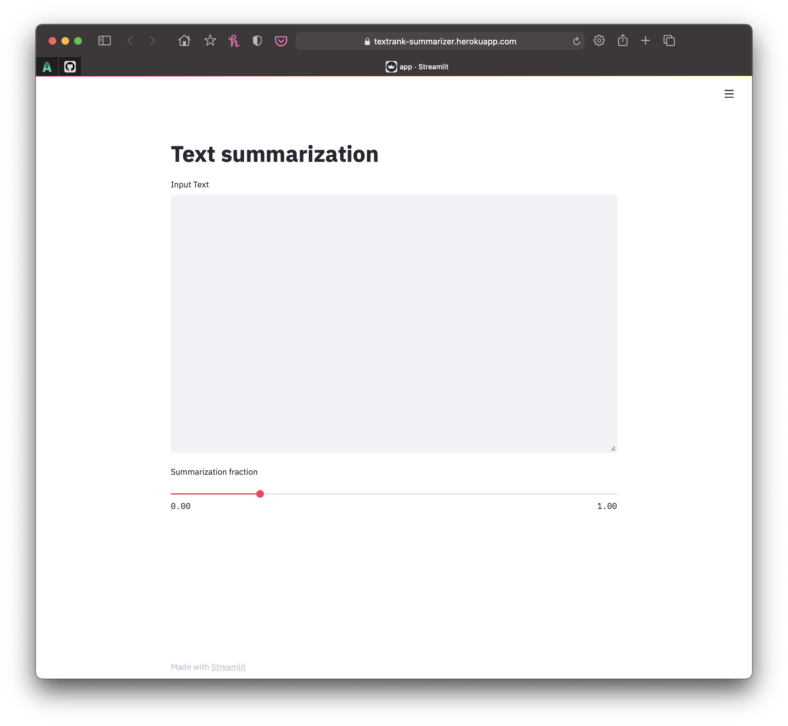
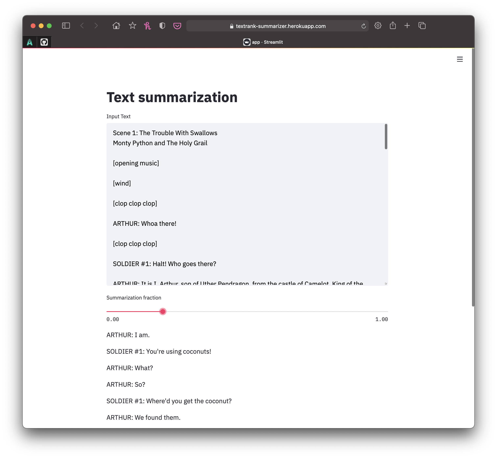

This tutorial is meant to act as a guide for deploying [Streamlit](https://www.streamlit.io) applications on [Heroku](https://heroku.com) using [Docker](https://www.docker.com) and [GitHub Actions](https://github.com/features/actions).
As a data scientist, Streamlit offers the simplest route from analysis to application by providing an API to create an interactive UI in a normal Python script.
We'll see more about this in the example later on, but there are many examples in their [gallery](https://www.streamlit.io/gallery).

Once the application is built and running locally, we just need to package it up using Docker and deploy to Heroku.
In addition, I have included a step to use GitHub Actions to build and push the Docker image, saving my local computer some computation and time.
Below, I walk through this process, step-by-step.

## Create a Streamlit application

### Introduction to Streamlit

Streamlit is built for data scientists and analysts.
Instead of building applications like many software engineers, we often write scripts that collect and clean data, visualize the data, design and train models, etc.
While it is possible to process the output of these scripts into interactive applications that requires a substantial amount of work and maintenance.
Instead, Streamlit offers a clever API: just "print" the plots, text, etc. and accept user input to variables.
Streamlit then handles all of the UI design, reacts to the user, and presents interactive widgets.
If this seems appealing to you, I would recommend looking through their [website](https://www.streamlit.io), [gallery](https://www.streamlit.io/gallery), and [documentation](https://docs.streamlit.io/en/stable/) to see examples and get guidance on implementation. 

### Example: text-summarizing application

As an example of using Streamlit, I built an application that summarizes text.

First things first, it is generally a good idea (and will be necessary for using Docker) to create a virtual environment for this project and installing ['summa'](https://github.com/summanlp/textrank) (the library that I used to summarize the text) and ['streamlit'](https://github.com/streamlit/streamlit).

```bash
$ python3 -m venv env
$ source env/bin/activate
(env)$ pip install summa streamlit
```

Below is the ***entire*** Streamlit application!
I won't provide much explanation because I don't think much is required - in most cases, it is very obvious what Streamlit is doing.
Using the `st.title()` function, a title is placed at the top of the app.
Then some text is collected from the user by the `st.text_area()` function - this text is saved as a string to `input_sent`.
The summarization ratio is obtained using a slider with the `st.slider()` function.
Finally, the text is summarized using the 'summa' library and printed to the application using `st.write()` in a for-loop.

```python
#!/usr/bin/env python

from summa import summarizer
import streamlit as st

# Add title to the page.
st.title("Text summarization")

# Ask user for input text.
input_sent = st.text_area("Input Text", "", height=400)

# User input on what fraction of the original text to return.
ratio = st.slider(
    "Summarization fraction", min_value=0.0, max_value=1.0, value=0.2, step=0.01
)

# Summarize the original text.
summarized_text = summarizer.summarize(
    input_sent, ratio=ratio, language="english", split=True, scores=True
)

# Print out the results.
for sentence, score in summarized_text:
    st.write(sentence)
```

The application can be run locally with the following command and going to [http://localhost:8501](http://localhost:8501) in your browser.

```bash
(env)$ streamlit run app.py
```

The initial blank application is shown below followed by an example of summarizing the opening scene to [Monty Python and the Holy Grail](https://en.wikipedia.org/wiki/Monty_Python_and_the_Holy_Grail) ([text source](http://www.montypython.50webs.com/scripts/Holy_Grail/Scene1.htm))






## Build a Dockerfile

The next step is to construct a file called "Dockerfile" that provide instructions to produce a Docker image with the running application.
Below is the complete Dockerfile and I have provided a brief explanation afterwards.

```docker
FROM python:3.9
EXPOSE 8501
WORKDIR /app
COPY requirements.txt ./requirements.txt
RUN pip3 install -r requirements.txt
COPY . .
CMD streamlit run app.py
```

The `FROM python:3.9` at the beginning of the file means that this Dockerfile builds on-top of another that has Python 3.9 already installed and configured.
In order to use this, you must have a [Dockerhub](https://hub.docker.com) account and link it to the Docker application on you computer.
Here is the link to the Python Dockerhub page: [https://hub.docker.com/\_/python](https://hub.docker.com/\_/python).

Next, the `EXPOSE 8501` command exposes port 8501 from the Docker image so that it can be reached when the image is run.

All of the commands from `WORKDIR /app` to `COPY . .` set-up of the Docker environment and create the virtual environment. I'm no expert in Docker, so the details are lost on me, but I think the overall objective is clear from the statements.

Finally, `CMD streamlit run app.py` declares that the Docker image should run `streamlit run app.py` and exit when it finishes.

With the Dockerfile in place, the Docker image can be built and run.

```bash
$ docker build -t app:latest .
$ docker run -p 8501:8501 app:latest
```

Going to the same [http://localhost:8501](http://localhost:8501), you should again see the application.

## Connect and publish to Heroku

### Setting up Heroku

The next step is to deploy the application on the World Wide Web using [Heroku](https://heroku.com).
In order to do so, you will need to create an account - there is a free tier for hobbyists that will be sufficient.

Then the command line interface (CLI) for interfacing with Heroku from your computer must be installed.
Full instructions can be found [here](https://devcenter.heroku.com/categories/command-line); I use a Mac, so I used the Homebrew option.

```bash
$ # Make sure to use the correct installation steps for *your* computer.
$ brew tap heroku/brew && brew install heroku
```
With a Heroku account created and the CLI installed, the next step is to login with the CLI.
The command `heroku login` will open a login window in your browser.

```bash
$ heroku login
heroku: Press any key to open up the browser to login or q to exit
 ›   Warning: If browser does not open, visit
 ›   https://cli-auth.heroku.com/auth/browser/***
heroku: Waiting for login...
Logging in... done
Logged in as me@example.com
```

Finally, we can create a Heroku app by running `heroku create` while within the project directory.

```bash
heroku create
```

### Deploying a Heroku app

The following steps deploy the Streamlit app to Heroku using their *Docker registry*.
You can find the full documentation [here](https://devcenter.heroku.com/categories/deploying-with-docker); specifically, I used the [Container Registry](https://devcenter.heroku.com/articles/container-registry-and-runtime) option.

We need to make one change to the Dockerfile in order to deploy on Heroku.
As documented [here](https://devcenter.heroku.com/articles/container-registry-and-runtime), the port to the app must be set to the variable `$PORT`.
This is accomplished using the `--server.port` flag for the `streamlit` command, resulting in the following change to the Dockerfile.

```docker
...
# CMD streamlit run app.py
CMD streamlit run --server.port $PORT app.py
```
From there, deploying using the Docker registry in Heroku is routine.
First, you must log in to the registry using the command below.

```bash
$ heroku container:login
```

Then, the following command builds the Docker image and pushes it to the Heroku registry.

```bash
$ heroku container:push web
```

The app is then deployed to the web as follows.

```bash
$ heroku container:release web
```

After allowing a few minutes for Heroku to work its magic, you can open the app on the web from the command line or in your [Heroku Dashboard](https://dashboard.heroku.com/apps).

```bash
$ heroku open
```

## Set up deployment with GitHub Actions

You can stop here if the above pipeline works for you, but I wanted to automate the deployment pipeline and move the computation of my computer.
Therefore, I turned to [GitHub Actions](https://github.com/features/actions) to build the Docker image and push to Heroku's registry when I push changes to the remote repository.
(Obviously, to use GitHub Actions, you will need to have the project under git source control and an accompanying GitHub repo.)

Below is the GitHub Actions workflow file; you will need to place this in the subdirectory `./.github/workflows/CI.yml`.
It is a YAML file with a single job with multiple steps that perform the same operations using the Heroku command line we preformed above.
Additional details are available below.
Once you have the YAML file and the authorization secret setup for the repo (explained below), pushing the changes to GitHub should result in the building and deployment of the app.

```yaml
name: Build Docker image and deploy to Heroku
on:
  # Trigger the workflow on push or pull request,
  # but only for the main branch
  push:
    branches:
      - master
jobs:
  build:
    runs-on: ubuntu-latest
    steps:
      - uses: actions/checkout@v1
      - name: Login to Heroku Container registry
        env:
          HEROKU_API_KEY: ${{ secrets.HEROKU_API_KEY }}
        run: heroku container:login
      - name: Build and push
        env:
          HEROKU_API_KEY: ${{ secrets.HEROKU_API_KEY }}
        run: heroku container:push -a textrank-summarizer web
      - name: Release
        env:
          HEROKU_API_KEY: ${{ secrets.HEROKU_API_KEY }}
        run: heroku container:release -a textrank-summarizer web
```

### Explanation of the GitHub Action workflow

```yaml
name: Build Docker image and deploy to Heroku
on:
  # Trigger the workflow on push or pull request,
  # but only for the main branch
  push:
    branches:
      - master
```

The name of the  workflow is stated first, followed by a description of when the  workflow should be run. In this case, I have it set to run when there are pushes to the `master` branch. More details and options can be found in the documentation on [Events that trigger workflows](https://docs.github.com/en/free-pro-team@latest/actions/reference/events-that-trigger-workflows).

```yaml
jobs:
  build:
    runs-on: ubuntu-latest
    steps:
      - uses: actions/checkout@v1
```

This next chunk is fairly standard for simple workflows.
To begin, it declares a new job (workflows can have multiple jobs that run in parallel) and is set to run on a "runner" server using Ubuntu.
Then, the first step is to use the `actions/checkout@v1` action to checkout the current repository.
This action is provided by GitHub and must be run in order to use the files in the repo.

```yaml
- name: Login to Heroku Container registry
  env:
    HEROKU_API_KEY: ${{ secrets.HEROKU_API_KEY }}
  run: heroku container:login
- name: Build and push
  env:
    HEROKU_API_KEY: ${{ secrets.HEROKU_API_KEY }}
  run: heroku container:push -a textrank-summarizer web
- name: Release
  env:
    HEROKU_API_KEY: ${{ secrets.HEROKU_API_KEY }}
  run: heroku container:release -a textrank-summarizer web
```

The following steps perform the same commands we just ran on our local machine to login to the Heroku container registry, build the Docker image, and deploy it to the web.
The only difference is the declaration and use of the `HEROKU_API_KEY` variable.
This is declared in the YAML structure under the heading `env`.
To actually set it to a key to allow access to Heroku, we must use [GitHub secrets](https://docs.github.com/en/free-pro-team@latest/actions/reference/encrypted-secrets) - *do NOT put your login information the workflow file in plain text.*
To add the key to secrets, run the following command on your computer to get an authorization key.

```bash
$ heroku authorizations:create
```

Then, put the key in a secret by going to the "Settings" tab of your GitHub repo, navigating to "Secrets" in the bar on the left, and clicking "New repository secret."
I named the secret key `HEROKU_API_KEY` to match the variable name used by Heroku, though you can change it to whatever makes sense to you, just make sure to also change the workflow file.

## Conclusion

This simple project was amazing to me - the ability to build a good application in ~20 lines of code and deploy it to the web *for free* with such ease really speaks to the incredible state of open source tooling.
So far I have deployed two Streamlit apps currently running on Heroku: the [Text Summarization](https://textrank-summarizer.herokuapp.com/) ([source](https://github.com/jhrcook/textrank-streamlit)) application demonstrated here and a [Suduko Solver](https://streamlit-sudoku-solver.herokuapp.com/) ([source](https://github.com/jhrcook/streamlit-sudoku)) that uses linear programming to find the solution.
I look forward to using this setup as a starting point for more complex apps in the future.
