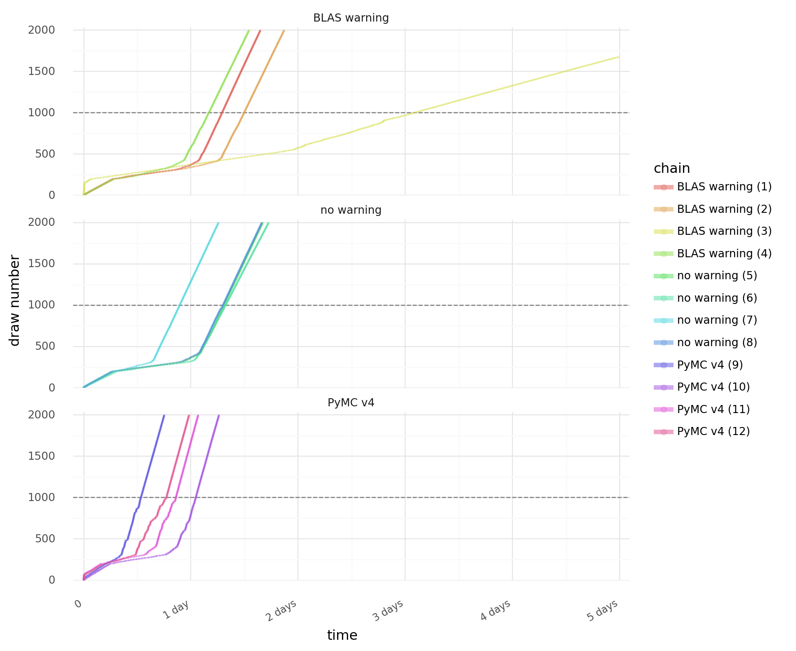
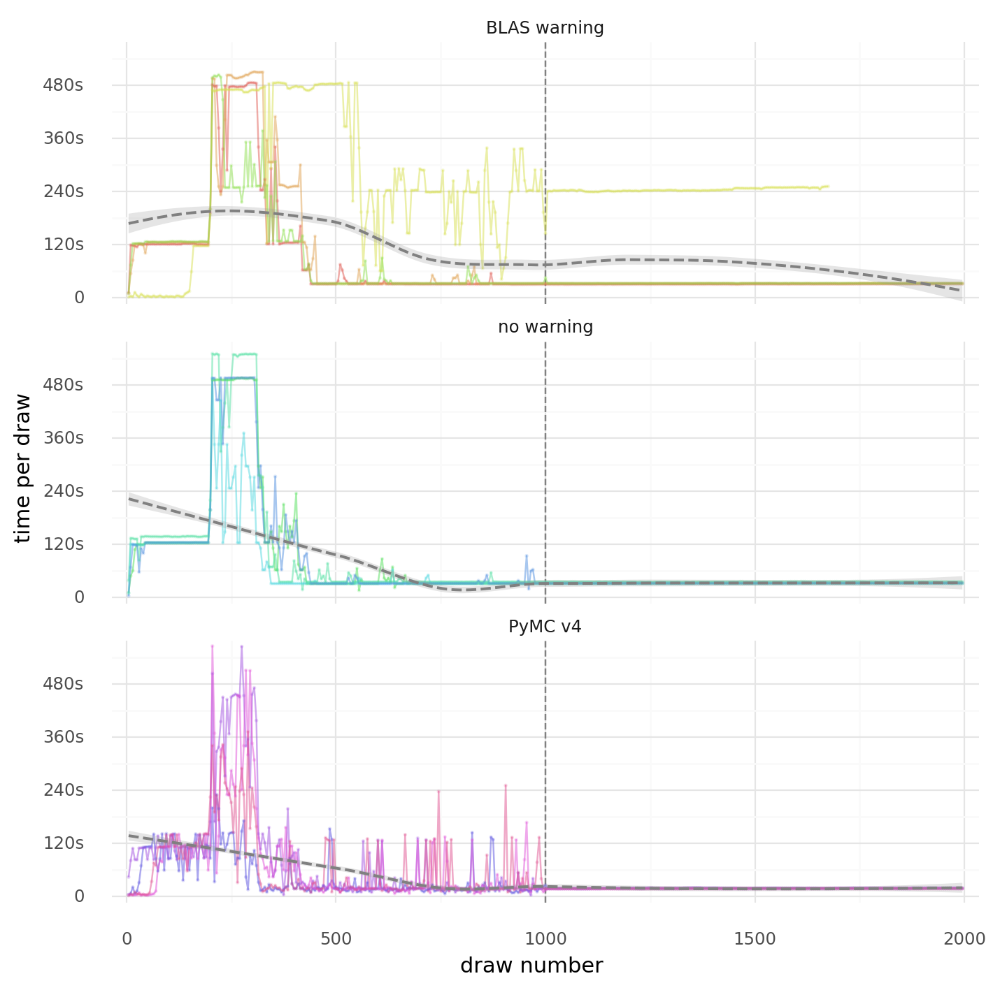
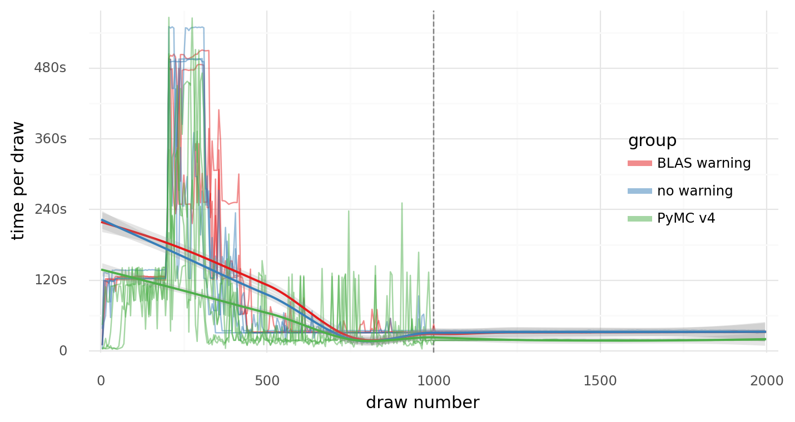
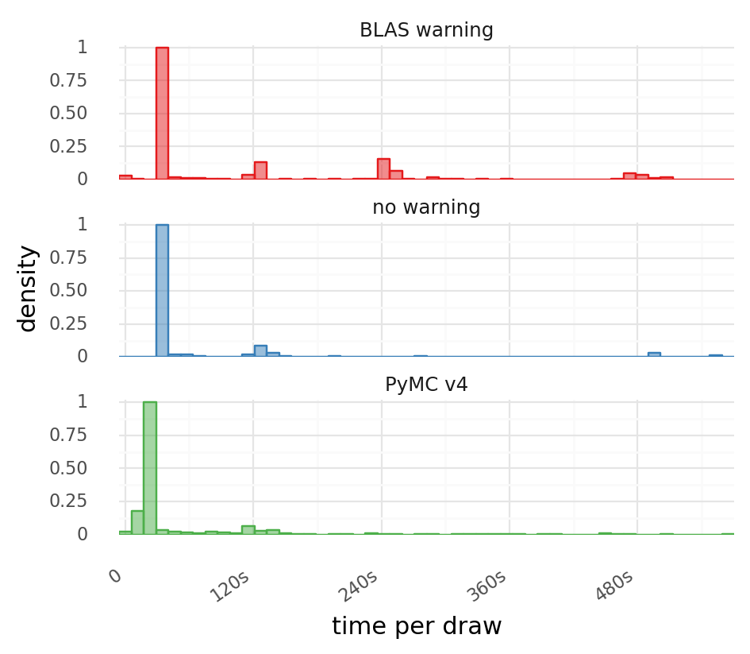

## Introduction

[PyMC3](https://docs.pymc.io/en/v3/) is a Python-based probabilistic programming language used to fit Bayesian models with a variety of cutting-edge algorithms including [NUTS MCMC](http://www.stat.columbia.edu/~gelman/research/published/nuts.pdf)[^1] and [ADVI](https://arxiv.org/abs/1603.00788)[^2].
It is [not uncommon](https://discourse.pymc.io/search?q=Using%20NumPy%20C-API%20based%20implementation%20for%20BLAS%20functions) for PyMC3 users to receive the following warning:

[^1]: Hoffman, Matthew D., and Andrew Gelman. 2011. “The No-U-Turn Sampler: Adaptively Setting Path Lengths in Hamiltonian Monte Carlo.” arXiv [stat.CO]. arXiv. <http://arxiv.org/abs/1111.4246>.
[^2]: Kucukelbir, Alp, Dustin Tran, Rajesh Ranganath, Andrew Gelman, and David M. Blei. 2017. “Automatic Differentiation Variational Inference.” Journal of Machine Learning Research: JMLR 18 (14): 1–45.

```text
WARNING (theano.tensor.blas): Using NumPy C-API based implementation
for BLAS functions.
```

where [*Theano*](https://github.com/Theano/Theano)[^3] is the autodiff engine that PyMC3[^4] uses under-the-hood.
The usual solution is to re-install the library and its dependencies following the operating system-specific instructions in the [wiki](https://github.com/pymc-devs/pymc/wiki).

[^3]: [Theano](https://en.wikipedia.org/wiki/Theano_(philosopher)) was the wife (and follower) of the famous mathematician [Pythagoras](https://en.wikipedia.org/wiki/Pythagoras) and [Aesara](https://en.wikipedia.org/wiki/Aesara) was their daughter and followed in their occupational and religious footsteps.
[^4]: The next version of PyMC3 will be called "PyMC" and use a fork of Theano called [Aesara](https://github.com/aesara-devs/aesara).

I am working on a project using PyMC3 to fit large [hierarchical models](https://docs.pymc.io/en/v3/pymc-examples/examples/case_studies/multilevel_modeling.html) and was receiving the warning on the Linux server used to fit the full models, but not on my local MacBook Pro when experimenting with model designs (even after re-creating the conda environment).
Therefore, I asked for more [help](https://discourse.pymc.io/t/numpy-c-api-based-implementation-for-blas-functions-is-it-a-problem/8690) on the [PyMC Discourse](https://discourse.pymc.io) with two questions:

1. How can I get this warning to go away?
2. Is the problem that Theano is warning about affecting its performance?

Thankfully, I got the first question squared away (it was a problem with my `$PATH`) and that enabled me to test the second.
The results of that test are presented here.

### Update

Based on a [suggestion](https://twitter.com/JoshDoesa/status/1493254823587852289?s=20&t=2FD5XFOOnYsrU0fMjD-5wA) from PyMC core developer, Thomas Wiecki, on Twitter, I have since updated this analysis by fitting the same model on the same data on the same compute cluster with PyMC v4 (specifically v4.0.0b2).
I left the text below primarily untouched, but the main take away was that Wiecki was correct (unsurprisingly): version 4 is *much* faster than version 3.

## TL;DR

1. Does Theano's warning "Using NumPy C-API based implementation for BLAS functions," affect its performance?
1. On average, sampling was faster without the warning.
1. But, the rate of sampling at its fastest point was the same in each condition.
1. **Thus, fixing the underlying issue for the warning may increase sampling, but there is still a lot of variability due to the stochastic nature of MCMC.**
1. **MCMC sampling PyMC v4 (currently in beta) is faster than PyMC3.**

## The experiment

For my test, I fit a large hierarchical model I am working on with and without the amended `$PATH` variable, the latter resulting in the Theano warning.
The model is for a research project that is still hush-hush so I can't publish the code for it just yet, but it is a negative binomial hierarchical model with thousands of parameters.
The model was fit with just under 1 million data points.
I fit four chains for each round of MCMC, each with a different random seed and 1,000 draws for tuning and 1,000 draws for sampling.
Each chain was run on a separate CPU with up to 64 GB of RAM.
Using a [custom callback](https://docs.pymc.io/en/v3/pymc-examples/examples/pymc3_howto/sampling_callback.html), I was able to log the time-point for every 5 draws from the posterior.

## Results

### Resource consumption

To begin, each model used about 53-56 GB of the available 64 GB of RAM.
No real substantial difference there.

### Sampling rates

The first plot below shows the time-course for each chain, colored by the experimental condition.
The plot below that displays the duration of each 5-draw interval indicating the *rate* of the sampling process over time for each condition followed by a plot that shows the same data on the same axes.






Each chain generally went through about 3 stages of rapid early tuning, slow tuning, and then rapid sampling post-tuning (the draws that will represent the approximate posterior distributions).

One exception to this is one of the chains from the "warning" condition that, comparatively, had an incredibly rapid early stage, prolonged slow stage, and a slower final stage than the other chains. (This chain took longer than 5 days to fit and my job timed-out before it could.)
I similar result happens reliably when I use ADVI to initialize the chains (this may be a future post), so I think this is just a process of the randomness inherent to MCMC and not necessarily attributable to the Theano warning.
Removing this chain shows how similar the results were between those remaining.



The sampling durations in each condition are also plotted as histograms (below).



### Summary table

Finally, the following is a table summarizing the sampling rates for each chain.
Note that chain #2 of the "warning" condition never finished (>5 days).

Note that the average draw rate (in minutes per 5 draws) is the same for all chains during the "sampling" stage (except for the outlier chain).

<style type="text/css">
</style>
<table id="T_8ad4f">
  <thead>
    <tr>
      <th class="blank" >&nbsp;</th>
      <th class="blank" >&nbsp;</th>
      <th class="blank level0" >&nbsp;</th>
      <th id="T_8ad4f_level0_col0" class="col_heading level0 col0" >total (hr.)</th>
      <th id="T_8ad4f_level0_col1" class="col_heading level0 col1" colspan="7">draw rate (min.)</th>
    </tr>
    <tr>
      <th class="blank" >&nbsp;</th>
      <th class="blank" >&nbsp;</th>
      <th class="blank level1" >&nbsp;</th>
      <th id="T_8ad4f_level1_col0" class="col_heading level1 col0" >duration</th>
      <th id="T_8ad4f_level1_col1" class="col_heading level1 col1" >mean</th>
      <th id="T_8ad4f_level1_col2" class="col_heading level1 col2" >std</th>
      <th id="T_8ad4f_level1_col3" class="col_heading level1 col3" >min</th>
      <th id="T_8ad4f_level1_col4" class="col_heading level1 col4" >25%</th>
      <th id="T_8ad4f_level1_col5" class="col_heading level1 col5" >50%</th>
      <th id="T_8ad4f_level1_col6" class="col_heading level1 col6" >75%</th>
      <th id="T_8ad4f_level1_col7" class="col_heading level1 col7" >max</th>
    </tr>
    <tr>
      <th class="index_name level0" >chain group</th>
      <th class="index_name level1" >chain</th>
      <th class="index_name level2" >stage</th>
      <th class="blank col0" >&nbsp;</th>
      <th class="blank col1" >&nbsp;</th>
      <th class="blank col2" >&nbsp;</th>
      <th class="blank col3" >&nbsp;</th>
      <th class="blank col4" >&nbsp;</th>
      <th class="blank col5" >&nbsp;</th>
      <th class="blank col6" >&nbsp;</th>
      <th class="blank col7" >&nbsp;</th>
    </tr>
  </thead>
  <tbody>
    <tr>
      <th id="T_8ad4f_level0_row0" class="row_heading level0 row0" rowspan="8">BLAS warning</th>
      <th id="T_8ad4f_level1_row0" class="row_heading level1 row0" rowspan="2">0</th>
      <th id="T_8ad4f_level2_row0" class="row_heading level2 row0" >tune</th>
      <td id="T_8ad4f_row0_col0" class="data row0 col0" >30.9</td>
      <td id="T_8ad4f_row0_col1" class="data row0 col1" >9.3</td>
      <td id="T_8ad4f_row0_col2" class="data row0 col2" >11.2</td>
      <td id="T_8ad4f_row0_col3" class="data row0 col3" >0.9</td>
      <td id="T_8ad4f_row0_col4" class="data row0 col4" >2.5</td>
      <td id="T_8ad4f_row0_col5" class="data row0 col5" >2.6</td>
      <td id="T_8ad4f_row0_col6" class="data row0 col6" >10.1</td>
      <td id="T_8ad4f_row0_col7" class="data row0 col7" >40.5</td>
    </tr>
    <tr>
      <th id="T_8ad4f_level2_row1" class="row_heading level2 row1" >sampling</th>
      <td id="T_8ad4f_row1_col0" class="data row1 col0" >39.5</td>
      <td id="T_8ad4f_row1_col1" class="data row1 col1" >2.6</td>
      <td id="T_8ad4f_row1_col2" class="data row1 col2" >0.0</td>
      <td id="T_8ad4f_row1_col3" class="data row1 col3" >2.5</td>
      <td id="T_8ad4f_row1_col4" class="data row1 col4" >2.5</td>
      <td id="T_8ad4f_row1_col5" class="data row1 col5" >2.6</td>
      <td id="T_8ad4f_row1_col6" class="data row1 col6" >2.6</td>
      <td id="T_8ad4f_row1_col7" class="data row1 col7" >2.6</td>
    </tr>
    <tr>
      <th id="T_8ad4f_level1_row2" class="row_heading level1 row2" rowspan="2">1</th>
      <th id="T_8ad4f_level2_row2" class="row_heading level2 row2" >tune</th>
      <td id="T_8ad4f_row2_col0" class="data row2 col0" >35.9</td>
      <td id="T_8ad4f_row2_col1" class="data row2 col1" >10.8</td>
      <td id="T_8ad4f_row2_col2" class="data row2 col2" >12.5</td>
      <td id="T_8ad4f_row2_col3" class="data row2 col3" >0.8</td>
      <td id="T_8ad4f_row2_col4" class="data row2 col4" >2.7</td>
      <td id="T_8ad4f_row2_col5" class="data row2 col5" >2.7</td>
      <td id="T_8ad4f_row2_col6" class="data row2 col6" >10.5</td>
      <td id="T_8ad4f_row2_col7" class="data row2 col7" >42.6</td>
    </tr>
    <tr>
      <th id="T_8ad4f_level2_row3" class="row_heading level2 row3" >sampling</th>
      <td id="T_8ad4f_row3_col0" class="data row3 col0" >44.9</td>
      <td id="T_8ad4f_row3_col1" class="data row3 col1" >2.7</td>
      <td id="T_8ad4f_row3_col2" class="data row3 col2" >0.0</td>
      <td id="T_8ad4f_row3_col3" class="data row3 col3" >2.6</td>
      <td id="T_8ad4f_row3_col4" class="data row3 col4" >2.7</td>
      <td id="T_8ad4f_row3_col5" class="data row3 col5" >2.7</td>
      <td id="T_8ad4f_row3_col6" class="data row3 col6" >2.7</td>
      <td id="T_8ad4f_row3_col7" class="data row3 col7" >2.8</td>
    </tr>
    <tr>
      <th id="T_8ad4f_level1_row4" class="row_heading level1 row4" rowspan="2">2</th>
      <th id="T_8ad4f_level2_row4" class="row_heading level2 row4" >tune</th>
      <td id="T_8ad4f_row4_col0" class="data row4 col0" >73.7</td>
      <td id="T_8ad4f_row4_col1" class="data row4 col1" >22.2</td>
      <td id="T_8ad4f_row4_col2" class="data row4 col2" >14.3</td>
      <td id="T_8ad4f_row4_col3" class="data row4 col3" >0.1</td>
      <td id="T_8ad4f_row4_col4" class="data row4 col4" >10.0</td>
      <td id="T_8ad4f_row4_col5" class="data row4 col5" >20.2</td>
      <td id="T_8ad4f_row4_col6" class="data row4 col6" >39.2</td>
      <td id="T_8ad4f_row4_col7" class="data row4 col7" >40.5</td>
    </tr>
    <tr>
      <th id="T_8ad4f_level2_row5" class="row_heading level2 row5" >sampling</th>
      <td id="T_8ad4f_row5_col0" class="data row5 col0" >119.8</td>
      <td id="T_8ad4f_row5_col1" class="data row5 col1" >20.3</td>
      <td id="T_8ad4f_row5_col2" class="data row5 col2" >0.8</td>
      <td id="T_8ad4f_row5_col3" class="data row5 col3" >12.1</td>
      <td id="T_8ad4f_row5_col4" class="data row5 col4" >20.2</td>
      <td id="T_8ad4f_row5_col5" class="data row5 col5" >20.2</td>
      <td id="T_8ad4f_row5_col6" class="data row5 col6" >20.6</td>
      <td id="T_8ad4f_row5_col7" class="data row5 col7" >21.0</td>
    </tr>
    <tr>
      <th id="T_8ad4f_level1_row6" class="row_heading level1 row6" rowspan="2">3</th>
      <th id="T_8ad4f_level2_row6" class="row_heading level2 row6" >tune</th>
      <td id="T_8ad4f_row6_col0" class="data row6 col0" >28.0</td>
      <td id="T_8ad4f_row6_col1" class="data row6 col1" >8.4</td>
      <td id="T_8ad4f_row6_col2" class="data row6 col2" >8.7</td>
      <td id="T_8ad4f_row6_col3" class="data row6 col3" >0.8</td>
      <td id="T_8ad4f_row6_col4" class="data row6 col4" >2.7</td>
      <td id="T_8ad4f_row6_col5" class="data row6 col5" >3.2</td>
      <td id="T_8ad4f_row6_col6" class="data row6 col6" >10.6</td>
      <td id="T_8ad4f_row6_col7" class="data row6 col7" >42.0</td>
    </tr>
    <tr>
      <th id="T_8ad4f_level2_row7" class="row_heading level2 row7" >sampling</th>
      <td id="T_8ad4f_row7_col0" class="data row7 col0" >37.0</td>
      <td id="T_8ad4f_row7_col1" class="data row7 col1" >2.7</td>
      <td id="T_8ad4f_row7_col2" class="data row7 col2" >0.1</td>
      <td id="T_8ad4f_row7_col3" class="data row7 col3" >2.7</td>
      <td id="T_8ad4f_row7_col4" class="data row7 col4" >2.7</td>
      <td id="T_8ad4f_row7_col5" class="data row7 col5" >2.7</td>
      <td id="T_8ad4f_row7_col6" class="data row7 col6" >2.7</td>
      <td id="T_8ad4f_row7_col7" class="data row7 col7" >3.8</td>
    </tr>
    <tr>
      <th id="T_8ad4f_level0_row8" class="row_heading level0 row8" rowspan="8">no warning</th>
      <th id="T_8ad4f_level1_row8" class="row_heading level1 row8" rowspan="2">4</th>
      <th id="T_8ad4f_level2_row8" class="row_heading level2 row8" >tune</th>
      <td id="T_8ad4f_row8_col0" class="data row8 col0" >31.4</td>
      <td id="T_8ad4f_row8_col1" class="data row8 col1" >9.4</td>
      <td id="T_8ad4f_row8_col2" class="data row8 col2" >11.9</td>
      <td id="T_8ad4f_row8_col3" class="data row8 col3" >0.8</td>
      <td id="T_8ad4f_row8_col4" class="data row8 col4" >2.6</td>
      <td id="T_8ad4f_row8_col5" class="data row8 col5" >2.6</td>
      <td id="T_8ad4f_row8_col6" class="data row8 col6" >10.2</td>
      <td id="T_8ad4f_row8_col7" class="data row8 col7" >41.3</td>
    </tr>
    <tr>
      <th id="T_8ad4f_level2_row9" class="row_heading level2 row9" >sampling</th>
      <td id="T_8ad4f_row9_col0" class="data row9 col0" >40.0</td>
      <td id="T_8ad4f_row9_col1" class="data row9 col1" >2.6</td>
      <td id="T_8ad4f_row9_col2" class="data row9 col2" >0.0</td>
      <td id="T_8ad4f_row9_col3" class="data row9 col3" >2.6</td>
      <td id="T_8ad4f_row9_col4" class="data row9 col4" >2.6</td>
      <td id="T_8ad4f_row9_col5" class="data row9 col5" >2.6</td>
      <td id="T_8ad4f_row9_col6" class="data row9 col6" >2.6</td>
      <td id="T_8ad4f_row9_col7" class="data row9 col7" >2.6</td>
    </tr>
    <tr>
      <th id="T_8ad4f_level1_row10" class="row_heading level1 row10" rowspan="2">5</th>
      <th id="T_8ad4f_level2_row10" class="row_heading level2 row10" >tune</th>
      <td id="T_8ad4f_row10_col0" class="data row10 col0" >31.7</td>
      <td id="T_8ad4f_row10_col1" class="data row10 col1" >9.6</td>
      <td id="T_8ad4f_row10_col2" class="data row10 col2" >12.6</td>
      <td id="T_8ad4f_row10_col3" class="data row10 col3" >1.4</td>
      <td id="T_8ad4f_row10_col4" class="data row10 col4" >2.9</td>
      <td id="T_8ad4f_row10_col5" class="data row10 col5" >2.9</td>
      <td id="T_8ad4f_row10_col6" class="data row10 col6" >11.4</td>
      <td id="T_8ad4f_row10_col7" class="data row10 col7" >45.9</td>
    </tr>
    <tr>
      <th id="T_8ad4f_level2_row11" class="row_heading level2 row11" >sampling</th>
      <td id="T_8ad4f_row11_col0" class="data row11 col0" >41.4</td>
      <td id="T_8ad4f_row11_col1" class="data row11 col1" >2.9</td>
      <td id="T_8ad4f_row11_col2" class="data row11 col2" >0.0</td>
      <td id="T_8ad4f_row11_col3" class="data row11 col3" >2.8</td>
      <td id="T_8ad4f_row11_col4" class="data row11 col4" >2.9</td>
      <td id="T_8ad4f_row11_col5" class="data row11 col5" >2.9</td>
      <td id="T_8ad4f_row11_col6" class="data row11 col6" >2.9</td>
      <td id="T_8ad4f_row11_col7" class="data row11 col7" >2.9</td>
    </tr>
    <tr>
      <th id="T_8ad4f_level1_row12" class="row_heading level1 row12" rowspan="2">6</th>
      <th id="T_8ad4f_level2_row12" class="row_heading level2 row12" >tune</th>
      <td id="T_8ad4f_row12_col0" class="data row12 col0" >21.5</td>
      <td id="T_8ad4f_row12_col1" class="data row12 col1" >6.5</td>
      <td id="T_8ad4f_row12_col2" class="data row12 col2" >7.0</td>
      <td id="T_8ad4f_row12_col3" class="data row12 col3" >0.8</td>
      <td id="T_8ad4f_row12_col4" class="data row12 col4" >2.6</td>
      <td id="T_8ad4f_row12_col5" class="data row12 col5" >2.6</td>
      <td id="T_8ad4f_row12_col6" class="data row12 col6" >10.2</td>
      <td id="T_8ad4f_row12_col7" class="data row12 col7" >41.2</td>
    </tr>
    <tr>
      <th id="T_8ad4f_level2_row13" class="row_heading level2 row13" >sampling</th>
      <td id="T_8ad4f_row13_col0" class="data row13 col0" >30.2</td>
      <td id="T_8ad4f_row13_col1" class="data row13 col1" >2.6</td>
      <td id="T_8ad4f_row13_col2" class="data row13 col2" >0.0</td>
      <td id="T_8ad4f_row13_col3" class="data row13 col3" >2.6</td>
      <td id="T_8ad4f_row13_col4" class="data row13 col4" >2.6</td>
      <td id="T_8ad4f_row13_col5" class="data row13 col5" >2.6</td>
      <td id="T_8ad4f_row13_col6" class="data row13 col6" >2.6</td>
      <td id="T_8ad4f_row13_col7" class="data row13 col7" >2.6</td>
    </tr>
    <tr>
      <th id="T_8ad4f_level1_row14" class="row_heading level1 row14" rowspan="2">7</th>
      <th id="T_8ad4f_level2_row14" class="row_heading level2 row14" >tune</th>
      <td id="T_8ad4f_row14_col0" class="data row14 col0" >31.1</td>
      <td id="T_8ad4f_row14_col1" class="data row14 col1" >9.4</td>
      <td id="T_8ad4f_row14_col2" class="data row14 col2" >11.6</td>
      <td id="T_8ad4f_row14_col3" class="data row14 col3" >0.2</td>
      <td id="T_8ad4f_row14_col4" class="data row14 col4" >2.6</td>
      <td id="T_8ad4f_row14_col5" class="data row14 col5" >2.6</td>
      <td id="T_8ad4f_row14_col6" class="data row14 col6" >10.3</td>
      <td id="T_8ad4f_row14_col7" class="data row14 col7" >41.4</td>
    </tr>
    <tr>
      <th id="T_8ad4f_level2_row15" class="row_heading level2 row15" >sampling</th>
      <td id="T_8ad4f_row15_col0" class="data row15 col0" >39.8</td>
      <td id="T_8ad4f_row15_col1" class="data row15 col1" >2.6</td>
      <td id="T_8ad4f_row15_col2" class="data row15 col2" >0.0</td>
      <td id="T_8ad4f_row15_col3" class="data row15 col3" >2.6</td>
      <td id="T_8ad4f_row15_col4" class="data row15 col4" >2.6</td>
      <td id="T_8ad4f_row15_col5" class="data row15 col5" >2.6</td>
      <td id="T_8ad4f_row15_col6" class="data row15 col6" >2.6</td>
      <td id="T_8ad4f_row15_col7" class="data row15 col7" >2.6</td>
    </tr>
    <tr>
      <th id="T_8ad4f_level0_row16" class="row_heading level0 row16" rowspan="8">PyMC v4</th>
      <th id="T_8ad4f_level1_row16" class="row_heading level1 row16" rowspan="2">8</th>
      <th id="T_8ad4f_level2_row16" class="row_heading level2 row16" >tune</th>
      <td id="T_8ad4f_row16_col0" class="data row16 col0" >12.8</td>
      <td id="T_8ad4f_row16_col1" class="data row16 col1" >3.8</td>
      <td id="T_8ad4f_row16_col2" class="data row16 col2" >4.1</td>
      <td id="T_8ad4f_row16_col3" class="data row16 col3" >0.4</td>
      <td id="T_8ad4f_row16_col4" class="data row16 col4" >1.3</td>
      <td id="T_8ad4f_row16_col5" class="data row16 col5" >1.5</td>
      <td id="T_8ad4f_row16_col6" class="data row16 col6" >6.1</td>
      <td id="T_8ad4f_row16_col7" class="data row16 col7" >19.2</td>
    </tr>
    <tr>
      <th id="T_8ad4f_level2_row17" class="row_heading level2 row17" >sampling</th>
      <td id="T_8ad4f_row17_col0" class="data row17 col0" >18.0</td>
      <td id="T_8ad4f_row17_col1" class="data row17 col1" >1.6</td>
      <td id="T_8ad4f_row17_col2" class="data row17 col2" >0.1</td>
      <td id="T_8ad4f_row17_col3" class="data row17 col3" >1.5</td>
      <td id="T_8ad4f_row17_col4" class="data row17 col4" >1.6</td>
      <td id="T_8ad4f_row17_col5" class="data row17 col5" >1.6</td>
      <td id="T_8ad4f_row17_col6" class="data row17 col6" >1.6</td>
      <td id="T_8ad4f_row17_col7" class="data row17 col7" >2.2</td>
    </tr>
    <tr>
      <th id="T_8ad4f_level1_row18" class="row_heading level1 row18" rowspan="2">9</th>
      <th id="T_8ad4f_level2_row18" class="row_heading level2 row18" >tune</th>
      <td id="T_8ad4f_row18_col0" class="data row18 col0" >25.1</td>
      <td id="T_8ad4f_row18_col1" class="data row18 col1" >7.6</td>
      <td id="T_8ad4f_row18_col2" class="data row18 col2" >10.2</td>
      <td id="T_8ad4f_row18_col3" class="data row18 col3" >0.3</td>
      <td id="T_8ad4f_row18_col4" class="data row18 col4" >1.5</td>
      <td id="T_8ad4f_row18_col5" class="data row18 col5" >2.6</td>
      <td id="T_8ad4f_row18_col6" class="data row18 col6" >9.2</td>
      <td id="T_8ad4f_row18_col7" class="data row18 col7" >47.1</td>
    </tr>
    <tr>
      <th id="T_8ad4f_level2_row19" class="row_heading level2 row19" >sampling</th>
      <td id="T_8ad4f_row19_col0" class="data row19 col0" >30.3</td>
      <td id="T_8ad4f_row19_col1" class="data row19 col1" >1.6</td>
      <td id="T_8ad4f_row19_col2" class="data row19 col2" >0.0</td>
      <td id="T_8ad4f_row19_col3" class="data row19 col3" >1.5</td>
      <td id="T_8ad4f_row19_col4" class="data row19 col4" >1.5</td>
      <td id="T_8ad4f_row19_col5" class="data row19 col5" >1.6</td>
      <td id="T_8ad4f_row19_col6" class="data row19 col6" >1.6</td>
      <td id="T_8ad4f_row19_col7" class="data row19 col7" >1.6</td>
    </tr>
    <tr>
      <th id="T_8ad4f_level1_row20" class="row_heading level1 row20" rowspan="2">10</th>
      <th id="T_8ad4f_level2_row20" class="row_heading level2 row20" >tune</th>
      <td id="T_8ad4f_row20_col0" class="data row20 col0" >20.6</td>
      <td id="T_8ad4f_row20_col1" class="data row20 col1" >6.2</td>
      <td id="T_8ad4f_row20_col2" class="data row20 col2" >8.7</td>
      <td id="T_8ad4f_row20_col3" class="data row20 col3" >0.2</td>
      <td id="T_8ad4f_row20_col4" class="data row20 col4" >1.5</td>
      <td id="T_8ad4f_row20_col5" class="data row20 col5" >1.8</td>
      <td id="T_8ad4f_row20_col6" class="data row20 col6" >9.5</td>
      <td id="T_8ad4f_row20_col7" class="data row20 col7" >47.2</td>
    </tr>
    <tr>
      <th id="T_8ad4f_level2_row21" class="row_heading level2 row21" >sampling</th>
      <td id="T_8ad4f_row21_col0" class="data row21 col0" >25.6</td>
      <td id="T_8ad4f_row21_col1" class="data row21 col1" >1.5</td>
      <td id="T_8ad4f_row21_col2" class="data row21 col2" >0.0</td>
      <td id="T_8ad4f_row21_col3" class="data row21 col3" >1.2</td>
      <td id="T_8ad4f_row21_col4" class="data row21 col4" >1.5</td>
      <td id="T_8ad4f_row21_col5" class="data row21 col5" >1.5</td>
      <td id="T_8ad4f_row21_col6" class="data row21 col6" >1.5</td>
      <td id="T_8ad4f_row21_col7" class="data row21 col7" >1.5</td>
    </tr>
    <tr>
      <th id="T_8ad4f_level1_row22" class="row_heading level1 row22" rowspan="2">11</th>
      <th id="T_8ad4f_level2_row22" class="row_heading level2 row22" >tune</th>
      <td id="T_8ad4f_row22_col0" class="data row22 col0" >18.5</td>
      <td id="T_8ad4f_row22_col1" class="data row22 col1" >5.6</td>
      <td id="T_8ad4f_row22_col2" class="data row22 col2" >6.6</td>
      <td id="T_8ad4f_row22_col3" class="data row22 col3" >0.2</td>
      <td id="T_8ad4f_row22_col4" class="data row22 col4" >1.5</td>
      <td id="T_8ad4f_row22_col5" class="data row22 col5" >1.6</td>
      <td id="T_8ad4f_row22_col6" class="data row22 col6" >9.4</td>
      <td id="T_8ad4f_row22_col7" class="data row22 col7" >31.1</td>
    </tr>
    <tr>
      <th id="T_8ad4f_level2_row23" class="row_heading level2 row23" >sampling</th>
      <td id="T_8ad4f_row23_col0" class="data row23 col0" >23.6</td>
      <td id="T_8ad4f_row23_col1" class="data row23 col1" >1.5</td>
      <td id="T_8ad4f_row23_col2" class="data row23 col2" >0.0</td>
      <td id="T_8ad4f_row23_col3" class="data row23 col3" >1.5</td>
      <td id="T_8ad4f_row23_col4" class="data row23 col4" >1.5</td>
      <td id="T_8ad4f_row23_col5" class="data row23 col5" >1.5</td>
      <td id="T_8ad4f_row23_col6" class="data row23 col6" >1.5</td>
      <td id="T_8ad4f_row23_col7" class="data row23 col7" >1.5</td>
    </tr>
  </tbody>
</table>

## Conclusion

My understanding of the inner-workings of PyMC and Theano is limited, so it is impossible for me to provide a confident final conclusion.
From this experiment, it seems like PyMC3 performed equivalently with and without the warning message.
That said, it is probably best to address the underlying issue to ensure optimal PyMC3 performance and behavior.

**Update with addition of PyMC v4:** PyMC v4 samples faster during both the tuning and sampling stages of MCMC.
In addition, version 4 tends to have fewer long-duration steps in the tuning process, dramatically cutting down on overall runtime.

---

<span style="color: gray">Featured image source: ["Theano – A Woman Who Ruled the Pythagoras School"](https://www.ancient-origins.net/history-famous-people/theano-woman-who-ruled-pythagoras-school-005965), *Ancient Origins*.</span>
