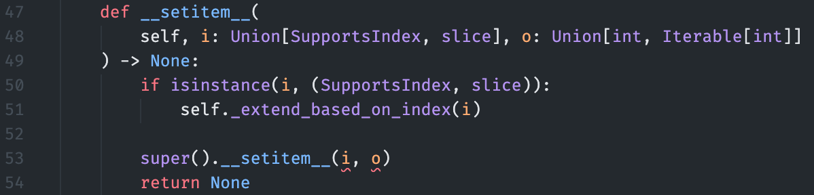
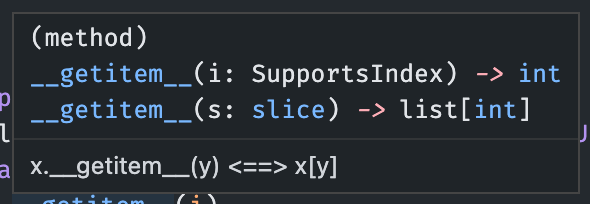
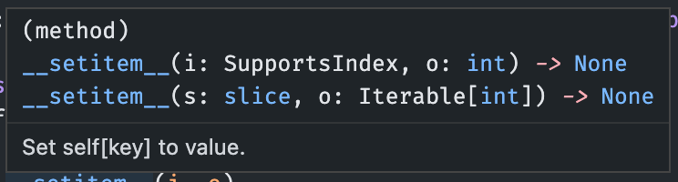

Below, I describe how to type hint some of the dunder methods of a subclass of the built-in Python `list`.
I begin by describing why I wanted to do this in the first place, then, with the aim of being somewhat pedagogical, how I figured out what to do before getting to the solution.
As I do not go through all of the dunder methods of `list`, I hope that by explaining the process, you will be able to figure out how to add type hints in similar situations in the future.

## TL;DR

For those on a time crunch, below are the main points to type hinting the dunder methods `__getitem__` and `__setitem__` in a subclass of `list`.

You first need to import the `overload` decorator from `typing` (along with other standard types.)

Then, for each possible input and output to the dunder method, create a type signature using the `@overload` decorator.
Make sure to put these stubs directly preceding the actual method.

This language feature is called [*function overloading*](https://www.python.org/dev/peps/pep-0484/#function-method-overloading) and I recommend reading [mypy's tutorial](https://mypy.readthedocs.io/en/stable/more_types.html?highlight=overload#function-overloading) to get a better understanding.

```python
from typing import (
    Any,
    Iterable,
    SupportsIndex,
    Union,
    overload,
    TypeVar,
)

T = TypeVar("T")


class Mylist(list[T]):
    @overload
    def __getitem__(self, i: SupportsIndex) -> T:
        ...

    @overload
    def __getitem__(self, i: slice) -> list[T]:
        ...

    def __getitem__(self, i: Union[SupportsIndex, slice]) -> Union[T, list[T]]:
        # Implement your specific features here.
        return super().__getitem__(i)

    @overload
    def __setitem__(self, i: SupportsIndex, o: T) -> None:
        ...

    @overload
    def __setitem__(self, s: slice, o: Iterable[T]) -> None:
        ...

    def __setitem__(self, *args: Any) -> None:
        # Implement your specific features here.
        super().__setitem__(*args)
        return None
```

## Background

While working through [Advent of Code 2019](https://adventofcode.com/2019) (a bit late 🤷🏻‍♂️), I needed a list but with different behavior for setting and getting items by index.
Normally, you can only use a maximum index of the length of the list (-1 for zero-based counting) and trying to index a list beyond the index throws an `IndexError`.

```python
x = ["a", "b", "c", "d"]
x[0]
#> 'a'
x[100]
#> Traceback (most recent call last):
#>   File "<stdin>", line 1, in <module>
#> IndexError: list index out of range
```

For my program, I wanted all the normal behavior of a list, except that trying to index beyond the list's range would cause the list to automatically expand to that size and fill all of the missing values with 0.
To do this, I decided to subclass `list` and override the dunder methods `__getitem__()` and `__setitem__()` with my specific functionality.
Below, I walk through the steps of how I figured out what to do with the hope that this process can be replicated for your future type hinting needs.

## The subclass with imperfect type hints

To begin, I just want to build a subclass of `list` that has the functionality I need with the basic type hints.
It includes some type hints, but `mypy` will raise a few errors that we'll address later.
Here is the full class with a description of what is going on below.
(The class is called `Intcode` because it is meant to be the Intcode program[^1] for the machine built in the challenge.)

[^1]: "An `Intcode` program is a list of integers separated by commas (like `1,0,0,3,99`).
To run one, start by looking at the first integer (called position 0). 
Here, you will find an opcode - either `1`, `2`, or `99`. The `opcode` indicates what to do..."
More information can be found on [Day 2](https://adventofcode.com/2019/day/2) of Advent of Code 2019.

```python
class Intcode(list[int]):
    def __getitem__(self, i: Union[SupportsIndex, slice]) -> Union[int, list[int]]:
        self._extend_based_on_index(i)
        return super().__getitem__(i)

    def __setitem__(
        self, i: Union[SupportsIndex, slice], o: Union[int, Iterable[int]]
    ) -> None:
        if isinstance(i, (SupportsIndex, slice)):
            self._extend_based_on_index(i)

        super().__setitem__(i, o)
        return None

    def _ensure_length_atleast(self, x: int) -> None:
        if x >= len(self):
            self.extend([0] * (x + 1 - len(self)))

    def _extend_based_on_index(self, i: Union[SupportsIndex, slice]) -> None:
        if isinstance(i, SupportsIndex):
            self._ensure_length_atleast(x=int(i))
        elif isinstance(i, slice):
            x = max([a for a in (i.start, i.stop, i.stop) if a is not None])
            self._ensure_length_atleast(x=x)
```

Both the get and set dunder methods call the private method `_extend_based_on_index()` that actually performs the extension of the list if the index provided is beyond the current length.
This method just calls `_ensure_length_atleast()` with the maximum indexing value, be it either of type [`SupportsIndex`](https://docs.python.org/3/library/typing.html#typing.SupportsIndex) or any of the parts of a [`slice`](https://docs.python.org/3/library/functions.html#slice).

This class currently works as is, but there are some warnings from [Pylance](https://marketplace.visualstudio.com/items?itemName=ms-python.vscode-pylance) in VSCode and [mypy](https://mypy.readthedocs.io/en/stable/)...

## Type-checker warnings

With the above implementation in place, I began to get some warnings and errors.

First, VSCode had underlined in red the inputs to `super().__setitem__(i, o)`.



On hover, I received the following message:

> Argument of type "SupportsIndex | slice" cannot be assigned to parameter "s" of type "slice" in function "\_\_setitem\_\_".
> Type "SupportsIndex | slice" cannot be assigned to type "slice".
> "SupportsIndex" is incompatible with "slice".

In addition, mypy raised the following errors:

```python
mypy type hinting-list-subclass.py
#> intcode.py:43: error: Signature of "__getitem__" incompatible with supertype "list"
#> intcode.py:43: error: Signature of "__getitem__" incompatible with supertype "MutableSequence"
#> intcode.py:43: error: Signature of "__getitem__" incompatible with supertype "Sequence"
#> intcode.py:53: error: Invalid index type "Union[typing.SupportsIndex, slice]" for "Intcode"; expected type "typing_extensions.SupportsIndex"
#> intcode.py:53: error: Incompatible types in assignment (expression has type "Union[int, Iterable[int]]", target has type "int")
```

From these messages, I could find two main problems:

1. The child's definitions of `__getitem__()` and `__setitem__()` do not match the parent's.
2. For each method, there are specific pairs of types that need to be indicated.

Basically, the type hints are incorrect and may lead to *more* bugs and confusion about the intent of the code - the exact opposite of their purpose.

The second issue above is a bit strange, so to elaborate:

- For the `__getitem__()` method, the input either needs to be a `SupportsIndex` with an `int` output **or** the input should be a `slice` and output a `list[int]`.
- For the `__setitem__()` method, the inputs either need to be of types `SupportsIndex` and `int` **or** `slice` and `Iterable[int]`.

It's not just that the method can take and output multiple different types, but there are different pairs of inputs and outputs.
This was a problem I hadn't run into before and took some investigation to solve.

## Type hinting the overridden dunder methods

### Multiple typing signatures

The trick to figuring out what the type hints needed to be was looking at the signature of the parent class methods.
In VSCode, I just hovered over the `super().__getitem__()` and `super.__setitem__()` calls:





Now we can see the separate pairings of types.
But how do we declare multiple signatures for a single method?

### Function overloading

After a bit of DuckDuckGo-ing, I found the solution was to use *function overloading*, a feature introduced to Python in the original type hinting PEP ([PEP 484](https://www.python.org/dev/peps/pep-0484/#function-method-overloading) in section ["Function/method overloading"](https://www.python.org/dev/peps/pep-0484/#function-method-overloading)).
[mypy](https://mypy.readthedocs.io/en/stable/more_types.html?highlight=overload#function-overloading) has a great introduction to function overloading that I recommend reading to get a better understanding of implementing the feature.[^2]

[^2]: In [Swift](https://www.swift.org), a strictly-typed language, a function is not just defined by its name, but by its full signature.
Therefore, there can be multiple functions (or methods of a class or struct) with the same name but different input and output types and different implementations in the bodies of the functions.
It's a really fun feature of the language that can make for very elegant APIs.
Take a look [here](https://www.programiz.com/swift-programming/function-overloading) for more info.

In essence, we can define multiple type signatures using the `@overload` decorator.
Here is this feature implemented for my `Intcode` class:

```python
class Intcode(list[int]):
    @overload
    def __getitem__(self, i: SupportsIndex) -> int:
        ...

    @overload
    def __getitem__(self, i: slice) -> list[int]:
        ...

    def __getitem__(self, i: Union[SupportsIndex, slice]) -> Union[int, list[int]]:
        self._extend_based_on_index(i)
        return super().__getitem__(i)

    @overload
    def __setitem__(self, i: SupportsIndex, o: int) -> None:
        ...

    @overload
    def __setitem__(self, s: slice, o: Iterable[int]) -> None:
        ...

    def __setitem__(self, *args: Any) -> None:
        assert len(args) == 2
        idx = args[0]
        if isinstance(idx, (SupportsIndex, slice)):
            self._extend_based_on_index(idx)

        super().__setitem__(*args)
        return None
    
    # ... no changes below
```

Now, any type checkers, including mypy and Pylance, know that the dunder get method can take a `SupportsIndex` and return an `int` or take a `slice` and return a `list[int]`.
They also know that the set dunder method has specific pairings of input and output types.
