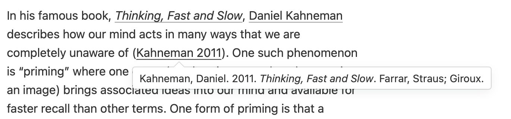
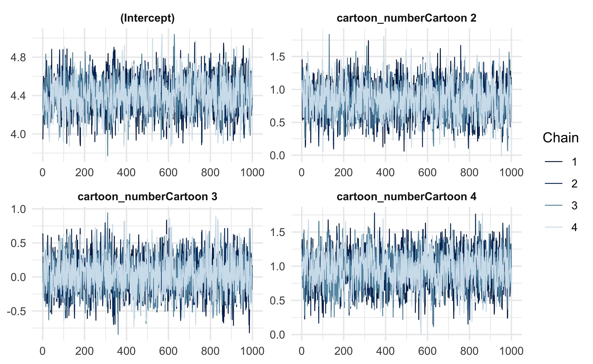
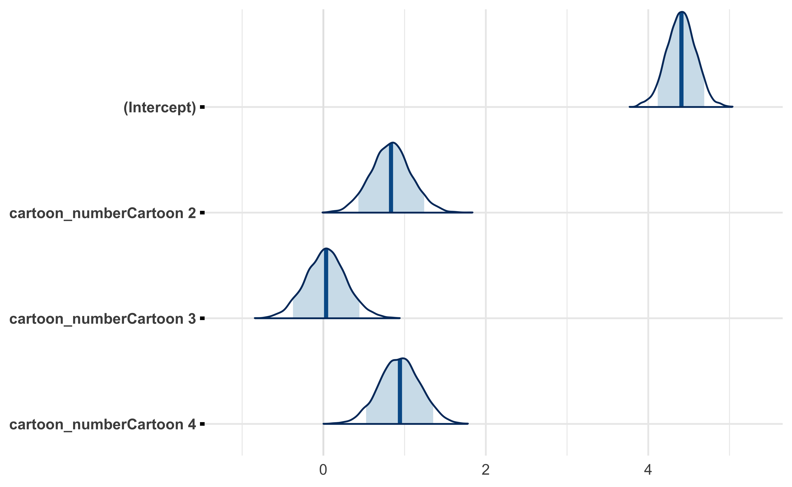
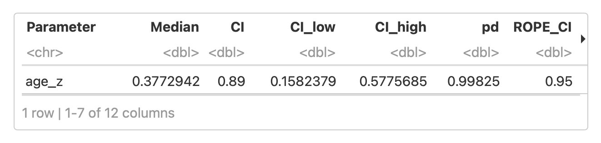

This is just a simple post about the tooling for a small project I just wrapped up.
For this project, I conducted a Bayesian data analysis and published the analysis to GitHub as a static website.
The data analysis portion relied heavily upon the 'rstanarm' package and I generated the website using 'distill'.
Below, I discuss both of these tools and how I used them.

> Jump to the discussion of ['distill'](#site-generation-with-distill).  
> Jump to the discussion of ['rstanarm'](#bayesian-data-analysis-with-rstanarm).

---

## Site generation with 'distill'

**TL;DR**

1. 'distill' makes it easy to publish a data analysis as a website.
2. I particularly like how customizable and feature rich it is, while remaining simple and out-of-the-way.

As [described]([https://rstudio.github.io/distill/) by its creators, "distill for R Markdown is a web publishing format optimized for scientific and technical communication."
To this end, it inlcudes powerful formatting options of tables and figures, interactive visualizations, and code and math formatting.
Thankfully, the [documentation](https://rstudio.github.io/distill/) matches the expansive feature set — it is incredibly descriptive and well organized.
I highly recommend looking through the various documentation pages before getting started on a new site.

I really enjoyed using 'distill' for this analysis project because it uses the the familliar R Markdown format, but adds many additional features compared to rendering as a markdown or HTML file.
Importantly, however, it does not noticeably increase the rendering time when building the site.
This analysis was primarily constituted by a ~1,000 line R Markdown file, but the entire site could be built within two minutes (with some caching of long running computations discussed in the following section).

The look and feel of the site is heaviliy customizable.
If you are used to using ['pkgdown'](https://pkgdown.r-lib.org) for building a website for you R package's documentation, then this will seem very familliar.
Like 'pkgdown', 'distill' uses a "_site.yaml" file for configuration.
I have copied the file for my project below as way of an example.

```yaml
name: "wagenmaker-data-analysis"
title: "Analyzing a replication of the Facial Feedback Hypothesis"
base_url: https://jhrcook.github.io/wagenmaker-data-analysis/
repository_url: https://github.com/jhrcook/wagenmaker-data-analysis
description: |
  "My own visualization and statistical analysis of the results from a 
   replication study of the classic physicology study, *Inhibiting and
   Facilitating Conditions of the Human Smile: A Nonobtrusive Test of 
   the Facial Feedback Hypothesis* by Strack, Martin, and Stepper (1988)."
output_dir: "docs"
exclude: ["data/*.csv", "Makefile"]
navbar:
  search: true
  right:
    - text: "Analysis"
      href: index.html
    - text: "About"
      href: about.html
    - icon: fab fa-github
      href: https://github.com/jhrcook/distill-example
    - icon: fab fa-twitter
      href: https://twitter.com/JoshDoesA
    - icon: fas fa-laptop
      href: https://joshuacook.netlify.app
output: distill::distill_article
```

You can see how easy it is to link to specific pages of the site and external links such as Twitter or the source code on GitHub from the navigation bar.

One of my favorite features included in 'distill' is the wonderful [citation system](https://rstudio.github.io/distill/citations.html).
The citations can be listed in file using the BibTeX format and included in the page by listing the file name in the YAML front-matter.
Then, citations can be made throughout the text using the format `[@WatsonCrick1953]`, and they will appear on hover and also at the bottom of the page.



Finally, I found it useful to create a small "Makefile" to turn some common tasks into simple commands.
For instance, I create a make command to run ['styler'](https://styler.r-lib.org) over all R code in the directory and then render the site.
This command is shown below and the entire "Makefile" can be found [here](https://github.com/jhrcook/wagenmaker-data-analysis/blob/master/Makefile).

```sh
style:
  Rscript -e "styler::style_dir()"

build: style
  Rscript -e "rmarkdown::render_site()"
```

To summarize, I really enjoyed using 'distill' on this project and highly recommend it.
If you'd like to see another example of a site documenting a data analysis project built using 'distill', here is a link to [the analysis of the data Spotify has collected about me](https://github.com/jhrcook/spotify-data-analysis) (it is currently a work-in-progress).

---

## Bayesian data analysis with 'rstanarm'

**TL;DR**

1. 'rstanarm' is an easy way to fit Bayesian models in R.
2. There is a strong Stan community and many packages compatabile with 'rstanarm' models.
3. Use some sort of caching system for long running computations — I recommend ['mustashe'](https://jhrcook.github.io/mustashe/).

The ['rstanarm'](http://mc-stan.org/rstanarm/) packages serves as a simplified interface to the [Stan](https://mc-stan.org) probabilistic programming language using the [R formula syntax](https://stat.ethz.ch/R-manual/R-devel/library/stats/html/formula.html).
The website has many useful [vignettes](http://mc-stan.org/rstanarm/articles/index.html) for building different types of models including those for modeling [count data](http://mc-stan.org/rstanarm/articles/count.html) and [hierarchical mixed-effects models](http://mc-stan.org/rstanarm/articles/glmer.html).
In addition to the detailed vignettes, there is also a very active [Stan Forum](https://discourse.mc-stan.org) for interacting with the large community (hosted on Discourse).
I used 'rstanarm' to build and fit each of the five relatively simple models in my analysis project, and they all sampled quickly and with few issues.

In addition to the helpful community built around Stan, there are also many great packages for analyzing 'rstanarm' models, including some specifically for Bayesian models.
In my project, I used ['bayesplot'](https://mc-stan.org/bayesplot/) and ['bayestestR'](https://easystats.github.io/bayestestR/), and many users also find the ['tidybayes'](http://mjskay.github.io/tidybayes/) package tremendously helpful for organizing posterior samples and parameter estimates (though I did not use it in this project).
I found 'bayesplot' useful for quickly generating common plots such as trace plots for inspecting the MCMC chains and for plotting posterior distributions.
An example of each is shown below where `m1` is an 'rstanarm' model.

```r
library(bayesplot)

mcmc_trace(
  m1, 
  pars = c("(Intercept)", glue("cartoon_numberCartoon {c(2:4)}"))
)
```



```r
mcmc_areas(
  as.matrix(m1),
  pars = c("(Intercept)", glue("cartoon_numberCartoon {c(2:4)}")),
  prob = 0.89
)
```



I primarily used 'bayestestR' for quickly computing a table describing the posteriors of a model's parameters.
Below is an example where I piped the data frame into `rmarkdown::paged_table()` to produce a more attractive and user-friendly table on the website (though it is only a screenshot here).

```r
bayestestR::describe_posterior(
  m4,
  ci = 0.89,
  parameters = c("age_z"),
  effects = "all"
) %>%
  as_tibble() %>%
  rmarkdown::paged_table()
```



The last recommendation I have for conduting these kinds of modeling analyses is to use some form of caching of the fit models.
Fitting a Bayesian model often means running MCMC to sample from the posterior distribution and, depending on the complexity of the model and size of the data, can take a significant amount of time (for example, in my jobby-job, I am working with models that take half a day to fit on a small testing subset of the data).
There are various options for caching in R, but my favorite is the ['mustashe'](https://jhrcook.github.io/mustashe/) package that I developed about a year ago.
It automatically stashes/loads objects to/from disk and can react to changes in the code and other objects.
Below is an example of using it to store the fifth model I built for this analysis (`m5`).
In this example, if the code block or the data frame `model_data` change, then the code is re-run and the new results cached.

```r
stash("m5", depends_on = "model_data", {
  m5 <- stan_lmer(
    rating ~ (1 | subject_number) +
      (1 + age_z + condition | cartoon_number) +
      gender + student,
    data = model_data,
    seed = 0,
    cores = 4
  )
  m5$loo <- rstanarm::loo(m5, cores = 3)
  m5
})
```

---

## Conclusion

I hope that this has helped to serve as a quick primer on 'distill', 'rstanarm', or both.
Alternatively, for those familliar with these tools, I hope this post and the corresponding [project](https://jhrcook.github.io/wagenmaker-data-analysis/) can serve as reference for future data analyses.
If you have any questions, comments, additions, etc., please leave them in the comments and I will do my best to respond soon.
