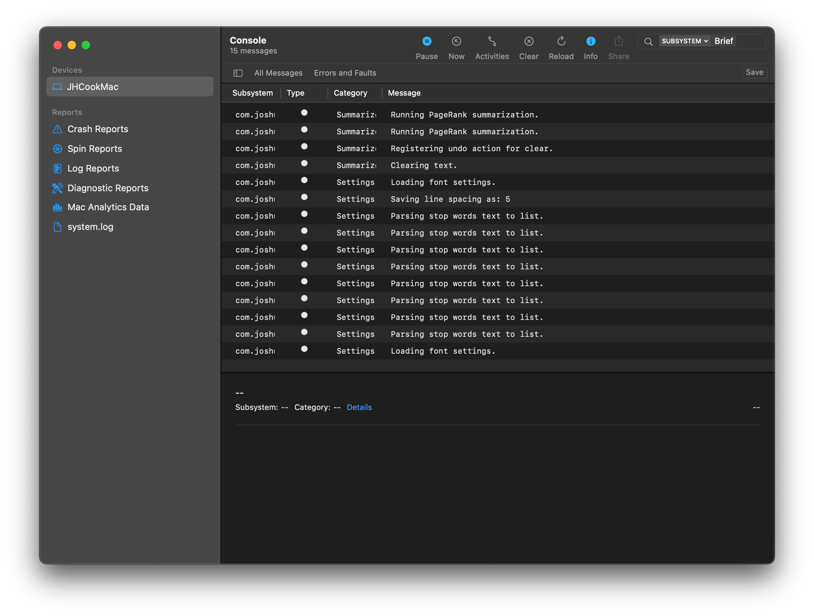

This post is to primarily serve as a repository for my notes on the [*Explore logging in Swift*](https://developer.apple.com/videos/play/wwdc2020/10168/) video originally presented at WWDC 2020.
It provides a general overview of how to use the logging system, then touches on a few specific features to keep in mind.

### Additional Resources

- [Apple Documentation: Logging](https://developer.apple.com/documentation/os/logging): logging documentation homepage
- [Apple Documentation: Logger](https://developer.apple.com/documentation/os/logger): documentaiton of the `Logger` structure
- [Generating Log Messages from Your Code](https://developer.apple.com/documentation/os/logging/generating_log_messages_from_your_code): detailed documentation of how to write log messages
- [Customizing Logging Behavior While Debugging](https://developer.apple.com/documentation/os/logging/customizing_logging_behavior_while_debugging): adjusting loging behaviour from the command line

---

## Creating a logger object

Here are some basic rules to follow when creating a new logger object.

1. The subsystem should be the same for every logger in the project.
2. The category describes the part of the app the logger is reporting on.

Below is the general architecture I like to use for orgniazing my loggers in apps.

```swift
// Logger-extension.swift
import Foundation
import os

extension Logger {
    static let subsystem = "com.joshuacook.MyApplication"

    // Logger for the User model class.
    static let userLogger = Logger(
      subsystem: subsystem, 
      category: "UserModel"
    )
    // Logger for the user preferences manager class.
    static let settingsLogger = Logger(
      subsystem: subsystem,
      category: "SettingsManager"
    )
}
```

These logging objects can then be used in the general form shown below.

```swift
// User.swift
import os

class User {
  let logger = Logger.userLogger
  // ...
  func changeName(to newName: String) {
    logger.info("Changing user name - old: \(self.name), new: \(newName)")
    // ...
  }
}
```

> All non-numeric objects/types included as run-time info in a log message will be redacted by default.
> This can be adjusted by setting the privacy inside the parentheses of the string interpolation.
> This is covered in the [Privacy](#privacy) section below.

## Log levels

| Level  | Use | Persistence |
|--------|-----|-------------|
| **Debug**  | for messages that are useful only during debugging | not stored |
| **Info**   | helpful but not essential for troubleshooting |only persisted during "log collect" |
| **Notice** (defualt) | essential for troubleshooting | persistent up to storage limit |
| **Error**  | for errors during execution | persistent up to storage limit |
| **Fault**  | for bugs in the program (unexpected errors) | persistent up to storage limit |


## Obtaining logs

The logs of a currently running process can be seen in the Console application.
There are many ways of filtering the messages to only see the ones you are interested in, including filtering by subsystem, category, and type of log message.
Helpfully, these filters can be saved and reused later by clicking the "Save" button under the search bar (see the image below).

Below is an example screenshot of the log messages as I am debugging a macOS application I am currently developing.



The logs can be gathered from a test device using the following command.
Make sure to set the start time a few minutes before seeing the bug or other event of interest.

```bash
log collect \
  --device \
  --start '2020-06-22 9:41:00' \
  --output 'app-name.logarchive'
```

The output ("app-name.logarchive" in this case) can then be opened in the Console application.

## Formatting log messages

Log messages can be aligned or formatted in a variety of ways using the `align` and `format` arguments.
The options for these parameters depend on the type of the input variable; here are the links to the documentation for aligning [strings](https://developer.apple.com/documentation/os/oslogstringalignment) and formatting [integers](https://developer.apple.com/documentation/os/oslogintegerformatting), [floats](https://developer.apple.com/documentation/os/oslogfloatformatting), and [booleans](https://developer.apple.com/documentation/os/oslogboolformat).

```swift
logger.log("\(number, align: .<methods>)")
logger.log("\(number, format: .<methods>)")
```

Below are some examples taken from Apple's [documentation](https://developer.apple.com/documentation/os/logging/generating_log_messages_from_your_code).
The first example shows how to specify the width of a variable in the message.

```swift
let shapeType: String = getShapeType()
let selectedColor: String = getSelectedColor()
logger.log("Shape type: \(shapeType, align: .right(columns: 15)) Color: \(selectedColor, align: .left(columns: 10))")
```

Integers can be formatted to decimals, hex, or octal values.
The precision of floating point values can be refined, too.

```swift
let bigNumber = 1.0234e30
logger.log("The big number is \(bigNumber, format: .exponential(precision: 10, explicitPositiveSign: true, uppercase: false) )")
```

Boolean values can be formatted to values such as `true`/`false` or `yes`/`no.

```swift
let theAnswer = true
logger.log("The answer is \(theAnswer, format: .answer)")
```

## Privacy

All non-numeric objects/types included as run-time info in log message will be redacted by default.
This can be adjusted by setting the privacy inside the parentheses of the string interpolation.

The original string can be included using the `.public` privacy option.
This should only be used for non-identifiable and non-sensitive data.

```swift
logger.log("my message: \(text, privacy: .public)")
```

Another useful option is to make a hash of the value so that it remains anonymous yet unique for debugging purposes.

```swift
logger.log("my message: \(word, privacy: .private(mask: .hash))")
```
