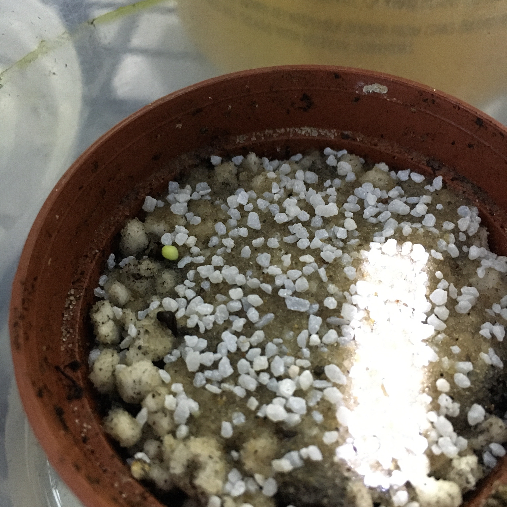
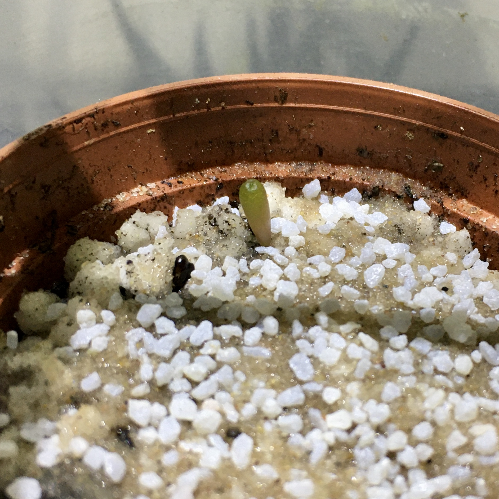

## Introduction

Frailea castanea is a species of cactus found in high elevations ranging from Sourthern Brazil to Northern Uruguay.
They are small, black, are primarily solitary, though they are known to prpduce seed frequently and quickly.
Further, they are **, meaning they self-fertilize.
They have actually been known to fruit without the flower ever opening.

Back in California, my parents had one that flowered and produced a seed pod.
I have since brought it to Boston to try growing new plants from seed.
This project is the documentation of this process.

### Additional Sources

* [*Frailea castanea*](http://www.llifle.com/Encyclopedia/CACTI/Family/Cactaceae/3524/Frailea_castanea) by LLifle Encyclopedia of Cacti
* [*Frailea castanea*](https://worldofsucculents.com/frailea-castanea/) by World of Succulents

---

#### 2020-02-16 - Sowing

I planted the seeds using the following soil mixture:

- 2 parts [Espoma Organic Perlite](https://www.amazon.com/Espoma-PR8-8-Quart-Organic-Perlite/dp/B002Y0AK6S/ref=sr_1_1?keywords=espoma+perlite&qid=1581897997&s=lawn-garden&sr=1-1)
- 1 part [Espoma Organic Cactus Mix](https://www.amazon.com/Espoma-CA8-4-8QT-Cactus-Pot/dp/B07JYRV59V/ref=sr_1_3?keywords=espoma+cactus&qid=1581897976&s=lawn-garden&sr=1-3)
- 1 part [Hoffman Western Desert Sand](https://www.amazon.com/Hoffman-14302-Western-Desert-Quarts/dp/B000RNH2U6)

I think it would be preferable to use decomposed granite or pool filter sand, but I could not find a non-industrial size bag of either.

I did not sterilize the soil with a microwave or oven because I doubt my roommate would appreciate that.
However, if possible, this is generally a recommended way of sterilizing the soil before sowing.

I believe there were roughly 10 seeds in the pod, though it was hard to separate the seeds from the seed pod debris.

I first packed the soil into 2x2 4-inch tall plastic pots and then watered the soil thoroughly.
This compacted the soil, so I added more to the top to fill in the difference.
The seeds were dispersed over the top; I use a small piece of paper folded in the middle to funnel the seeds mixed with some sand across the surface.
I then left the pot in a tub with 2 cm of water around the base to keep the soil moist and air humid.
They will remain there until there is sufficient germination.

#### 2020-02-22 - First germination

I have noticed the first germination, today.
This is a good sign as I wasn't terribly confident that the seeds were still viable so long after being made.
My only fear is that the seedling is above the top layer of soil and may not be able to penetrate the top layer.
I may add a bit more sand around it to help.

#### 2020-03-22 - Still growing

The one germination looks like that's all I'll get. He's still alive and growing. I tried moving him to more light, but it was too strong and he began to redden. I moved him back to the middle level and most of the original green returned.

