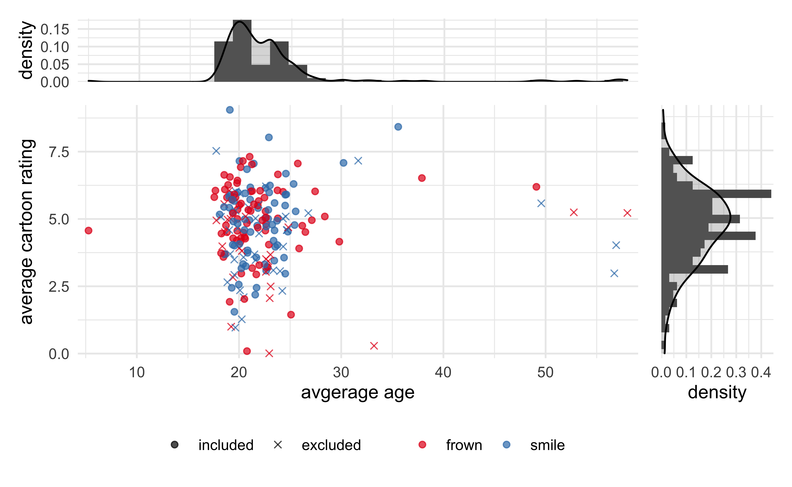

---

title: "Bayesian Data Analysis"
summary: "The steps I have taken to learn how to conduct Bayesian data analysis."
authors: []
tags: ["Bayesian", "Bayesian", "data analysis", "data", "data science", "statistics"]
categories: ["Bayesian Data Analysis"]
date: 2021-08-03T07:00:00-00:00
draft: false

# Optional external URL for project (replaces project detail page).
external_link: ""

# Featured image
# To use, add an image named `featured.jpg/png` to your page's folder.
# Focal points: Smart, Center, TopLeft, Top, TopRight, Left, Right, BottomLeft, Bottom, BottomRight.
image:
  preview_only: true

# Custom links (optional).
#   Uncomment and edit lines below to show custom links.
# links:
# - name: Follow
#   url: https://twitter.com
#   icon_pack: fab
#   icon: twitter

---

I am continually learning about and implementing Bayesian techniques for data analysis.
Below is a record of the resources I have used followed by examples of my work that have employed these methods.

---

## Books and courses

Below are the books I have worked through for learning how to conduct Bayesian data analyses.
I plan to revisit both Kruschke so that I can practice the coding alongside the theory.

| Title                                    | Author                  | Links                                                                                                                                                                               |
|------------------------------------------|-------------------------|:-----------------------------------------------------------------------------------------------------------------------------------------------------------------------------------:|
| ***Statistical Rethinking*** (2e)        | Richard McElreath       | [<i class="fab fa-github"></i>](https://github.com/jhrcook/statistical-rethinking) [<i class="fas fa-laptop"></i>](https://statistical-rethinking-notes.netlify.app)                |
| ***Doing Bayesian Data Analysis*** (2e)  | John Kruschke           |                                                                                                                                                                                     |
| ***Bayesian Analysis with Python*** (2e) | Osvaldo Martin          | [<i class="fab fa-github"></i>](https://github.com/jhrcook/bayesian-analysis-with-python_e2)                                                                                        |
| ***Bayesian Data Analysis*** (3e)        | Andrew Gelman, *et al.* | [<i class="fab fa-github"></i>](https://github.com/jhrcook/bayesian-data-analysis-course) [<i class="fas fa-laptop"></i>](https://jhrcook.github.io/bayesian-data-analysis-course/) |

---

## Tutorials

I have [GitHub repository](https://github.com/jhrcook/pymc3-tutorials) of Jupyter notebooks where I follow, annotate, and experiment with tutorials on using the probabilistic programming language [PyMC3](https://docs.pymc.io).

I have also contributed my tutorial on [fitting splines with PyMC3]() to the official [pymc3-examples](https://github.com/pymc-devs/pymc-examples) repository.

---

## Examples

### Computational biology

Below are some instances where I have used Bayesian methods in my research.

#### *KRAS* A59 comutation with the MAPK pathway

[<i class="fab fa-github"></i> Source](https://github.com/jhrcook/comutation/blob/master/src/90_40_kh_A59-mutations.R)

I worked with a post-doc in the Haigis lab on analyzing the comutation of the rare *KRAS* A59 mutations with the MAPK pathway in human colorectal cancer sequencing data.
We found that a hypermutation phenotype (likely due to MSI) was associated with an increase in odds of a MAPK pathway, regardless of the mutational status of *KRAS*.
However, *KRAS* A59E/T mutant tumor samples had similar probabilities of having a concomitant MAPK mutation as *KRAS* WT tumors, far higher than other *KRAS* mutant tumors.

This work will likely be published within the next year or so as part of a broader study of the dynamics of the Kras A59 mutants.

#### Comutation of *SIRT4* in colorectal cancer

[<i class="fab fa-github"></i> Source](https://github.com/jhrcook/sirt4-comutations) (currently private)

For a collaboration with Prof. Marcia Haigis, I conducted a comutation analysis with *SIRT4* with various genes in PI3K pathway, *KRAS*, and *BRAF*.
We found novel comutation interactions that she used as preliminary data in a grant proposal.

#### Differential gene expression of *DUSP* genes

I did a small analysis to see if there was evidence for differential expression of *DUSP* genes associated with the *KRAS* alleles or with the loss *APC* in human samples of colorectal cancer tumors.

### Miscellaneous analyses

#### Analyzing the results of “Inhibiting and Facilitating Conditions of the Human Smile: A Nonobtrusive Test of the Facial Feedback Hypothesis”

[<i class="fab fa-github"></i> Source](https://github.com/jhrcook/wagenmaker-data-analysis) |
[<i class="fas fa-laptop"></i> Website](https://jhrcook.github.io/wagenmaker-data-analysis/)

After reading about it in [Daniel Kahneman's](https://en.wikipedia.org/wiki/Thinking,_Fast_and_Slow) [*Thinking, Fast and Slow*](https://en.wikipedia.org/wiki/Daniel_Kahneman), I conducted my own analysis of the results from a replication report on the famous social psychology paper ["Inhibiting and Facilitating Conditions of the Human Smile: A Nonobtrusive Test of the Facial Feedback Hypothesis"](https://doi.apa.org/doiLanding?doi=10.1037%2F0022-3514.54.5.768).
I began with several different visualizations of the data and then fit several different models, analyzing each and comparing them all together.
The full analysis can be found here: [https://jhrcook.github.io/wagenmaker-data-analysis/]().

---

### TidyTuesdays

[TidyTuesday](https://github.com/rfordatascience/tidytuesday) is a tradition in the R programming community where a new dataset is provided each Tuesday for everyone to play with.
While some days I try to create visually appealing data visualizations, I generally take the opportunity to experiment with modeling.
Below are the instances where I have explored Bayesian data analysis.

**August 11, 2020 [Avatar: The Last Airbender](https://github.com/jhrcook/tidy-tuesday/blob/master/2020-08-11_avatar.md)**: I experimented with prior predictive checks.  
**August 4, 2020 [European energy](https://github.com/jhrcook/tidy-tuesday/blob/master/2020-08-04_european-energy.md)**: Using multi-level models to explain energy source usage per country.  
**July 14, 2020 [Astronaut database](https://github.com/jhrcook/tidy-tuesday/blob/master/2020-07-14_astronaut-database.md)**: Compared the results of a Poisson regression model using Frequentist and Bayesian methods.  
**July 7, 2020 [Coffee ratings](https://github.com/jhrcook/tidy-tuesday/blob/master/2020-07-07_coffee-ratings.md)**: Using various regression models to explain coffee rating using qualitative metrics.  
**June 23, 2020 [Caribou location tracking](https://github.com/jhrcook/tidy-tuesday/blob/master/2020-06-23_caribou-location-tracking.md)**: Hierarchical modeling of caribou speeds.  
**June 9, 2020 [Passwords](https://github.com/jhrcook/tidy-tuesday/blob/master/2020-06-09_passwords.md)**: Experimented with modeling the security of passwords based off of their characteristics.  
**May 5, 2020 [Animal Crossing - New Horizons](https://github.com/jhrcook/tidy-tuesday/blob/master/2020-05-05_animal-crossing-new-horizons.md)**: I used sentiment analysis of game reviews to model a players rating of the game.

---

### Blog Posts

#### Uncanny X-Men - Bayesian version

I wrote a [**post**]() as a follow-up on an article to Julia Silge's [Uncanny X-Men analysis](https://juliasilge.com/blog/uncanny-xmen/).
She used a bootstrapping method to build confidence intervals for an estimate of some feature of the comic books (more details are in my original post).
My analysis was focussed on how this was similar to using a Bayesian technique, while also highlighting how a fit Bayesian model is more easily interpreted than 95% confidence intervals from a permutation test.

#### Splines

I have two blog posts about modeling splines.
The [first]() is a more detialed introduction to these forms of transformations and how the model interprets the spline basis.
The [second]() is a more exploratory comparison of different structures for multi-level and hierarchical spline regressions.
These models are more problematic to fit, so I experimented with different forms of spline bases and hierarchical prior distributions.

#### Understanding the "funnel of doom"

Another [**post**]() I made was just a PyMC3 version of Betancourt's post on funnel degeneracies that commonly plague hierarchical models.
The main point was to increase my own understanding of the theory Betancourt explained and the diagnostics he demonstrated.
Also, this served as an opportunity to create a model in PyMC3 with a mixture of centered and non-centered parameterizations, a technique I may need in my own work.

#### Non-linear modeling of serial dilutions

This was a [**post**]() following the model for serial dilutions in the *Bayesian Data Aanlysis* book by Gelman *et al.*
I built the model with Stan and sampling from the posterior with MCMC then conducted some standard analyses of the posterior distributions and predictions.
