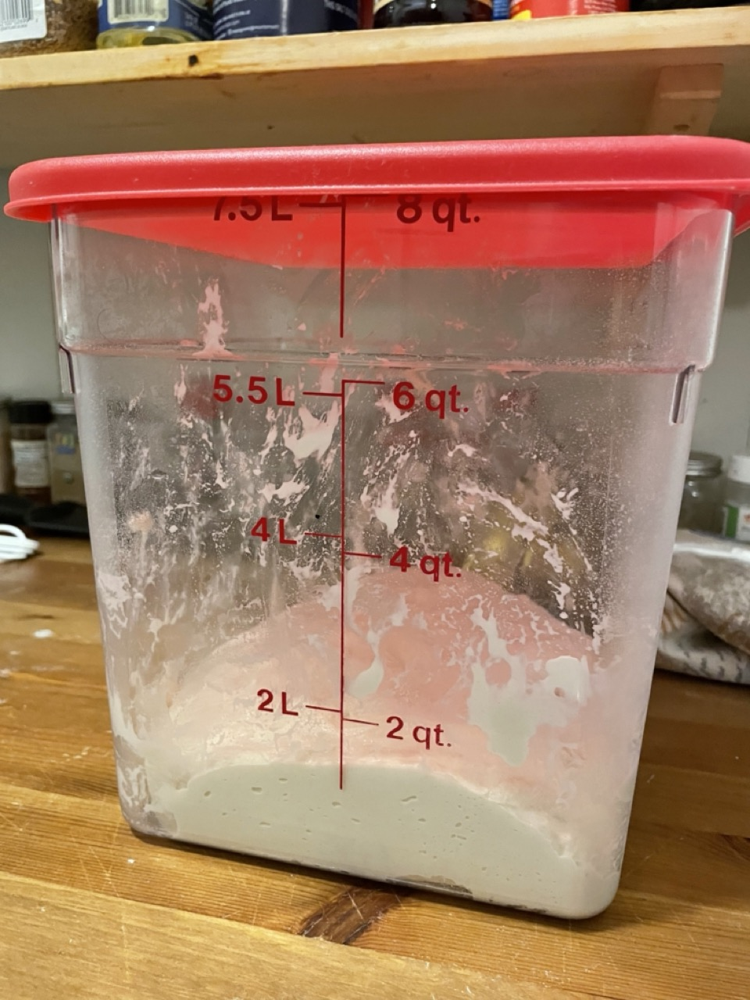
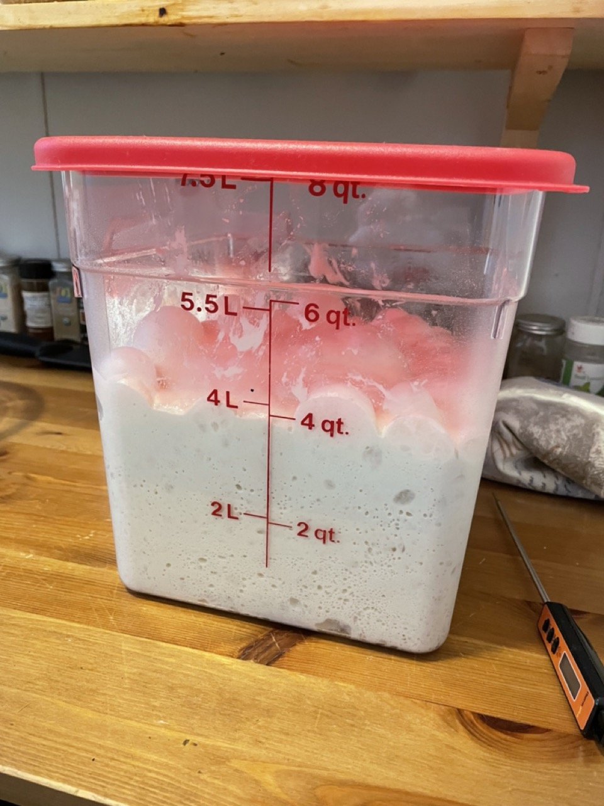
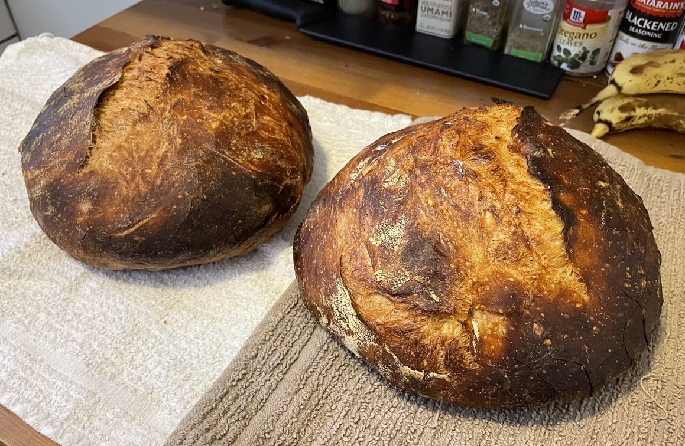
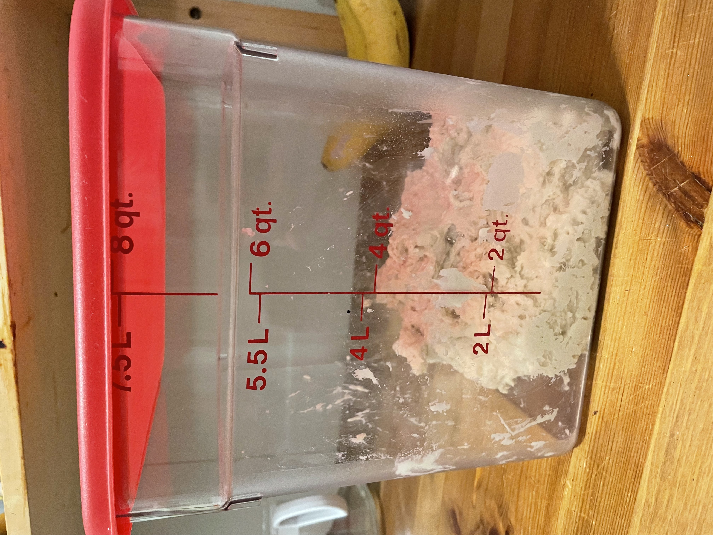
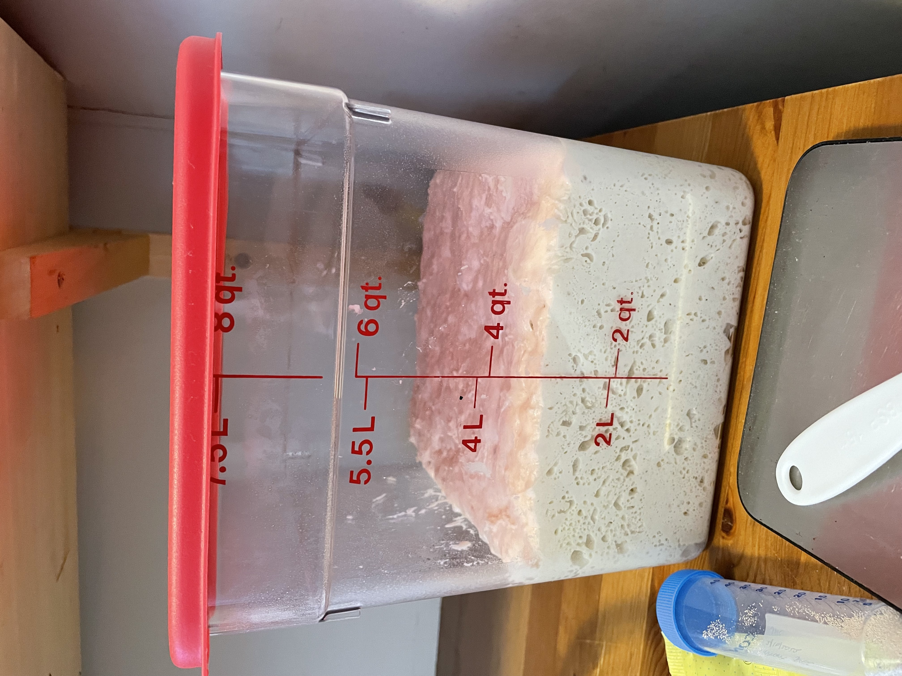
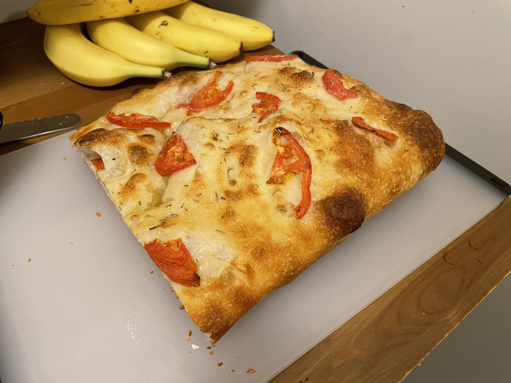
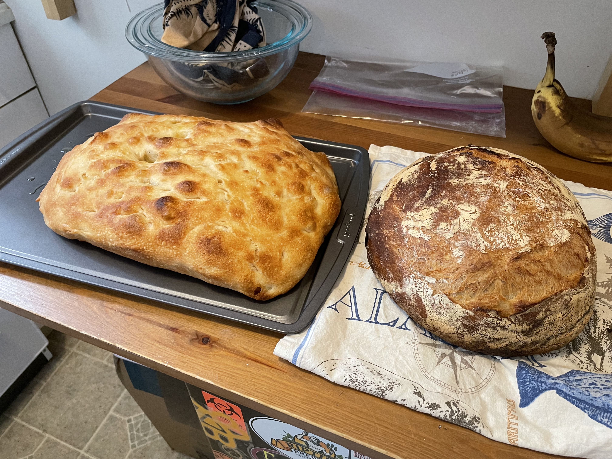

This project is here to loosely document my journey in bread making.

## Intro

I didn't have an outsized desire to make bread, but someone in my apartment building put three high-quality bread-making books out by the front door with a "Free" sign, so I took this as a sign from the heavens to pick up a new hobby.
Immediately, I was very excited to get started.
I ordered a handful of items I needed (e.g. a quick-read thermometer) on Amazon, and as I waited for them to arrive I couldn't stop reading about the process.

The three books are [*Flour Water Salt Yeast*](https://kensartisan.com/flour-water-salt-yeast/) (FWSY) by Ken Forkish, [*Tartine Bread*](https://www.goodreads.com/book/show/8185785-tartine-bread) by Chad Robertson, and [*Bread Making at Home*](https://www.simonandschuster.com/books/Making-Bread-at-Home/Jane-Mason/9781788791908) by Jane Mason.
So far, I am working through FWSY and then, as I get more knowledge and experience, will try recipes from the other two.

## 2022

### Feb. 10, 2022 – The beginning

My first bread.
I followed the basic Saturday White Bread recipe and instructions from FWSY.
The second load was proofed overnight in the fridge and baked the following morning.

| Boule 1 | Boule 2 |
|:-------:|:-------:|
|  |  |

The room was around 75 ºF, a bit warmer than the recommended 70 ºF, so I  think the bulk fermentation was faster than expected.
Both tasted great, though!

### Feb. 14, 2022 – Saturday white bread

This was an over-night fermentation.
It starts with less yeast so that there is more time for the microorganisms to produce more complex flavors.
I didn't taste a remarkable difference, but the texture and mouth feel was more buttery.

| Pre-fermentation | Post-fermentation (12 hr) | Final boules |
|:----------------:|:-------------------------:|:------------:|
|  |  |  |

### Feb. 26, 2022 – *Biga* pre-fermentation

This was my first *biga* pre-fermentation.
This begins with a small amount of yeast in 800 g of flour and about 200 g of water.
It triples in size overnight and the smell the next morning is delightful with far more complex aromas than a standard white bread.

From this batch, I produced a standard boule and a tomato, rosemary focaccia.
The *biga* definitely made a large difference to the taste and I don't think Ill ever do a standard Saturday white boule again (unless under a time restriction).

| *biga* 0 hr | *biga* 13 hr | Boule | Focaccia |
|:-------------------------:|:------------:|:-------------------------:|:------------:|
|  |  |  |  |

### March 5, 2022 – *Biga* pre-fermentation

Another *biga* pre-fermentation to make a boule and focaccia.
I left this focaccia plain so I could pay more attention to the texture and flavor of the final bread.

