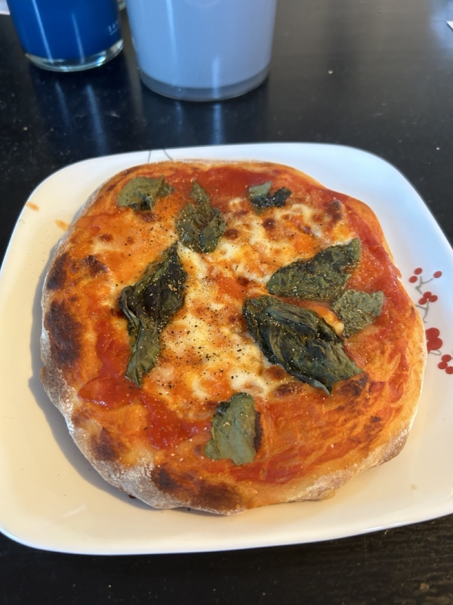

## Intro

I didn't have an outsized desire to make bread, but someone in my apartment building put three high-quality bread-baking books out by the front door under a paper saying "Free", so I took this as a sign from the heavens to pick up a new hobby.
After perusing their pages, I was immediately excited to get started.
I ordered a handful of items I needed (e.g. a quick-read thermometer) on Amazon, and as I waited for them to arrive I couldn't stop studying the process.

The three books are [*Flour Water Salt Yeast*](https://kensartisan.com/flour-water-salt-yeast/) (FWSY) by Ken Forkish, [*Tartine Bread*](https://www.goodreads.com/book/show/8185785-tartine-bread) by Chad Robertson, and [*Bread Making at Home*](https://www.simonandschuster.com/books/Making-Bread-at-Home/Jane-Mason/9781788791908) by Jane Mason.

## The beginnings

I began with *FWSY* as it seemed the simplest and most home-cook friendly way to get started making artisan bread.
I practiced with the Saturday loaf recipes with white flour, whole wheat flour, and mixtures, before stepping up the preferments.
I have since settled on making the 80% biga quite regularly.
It fits well into a normal day's schedule if I'm working from home, requiring only a few disruptions for a few minutes out of the day.
Below are some photos of boules I have made following these recipes.

This recipe also makes great focaccia!

## Pizza

Lately, I have moved to using the same bread recipes for pizza.
I love the flexibility of pizza, topping them with whatever is in my fridge or catches my eye at the market.

I have recently purchased Ken Forkish's [*The Elements of Pizza*](https://kensartisan.com/elements-of-pizza/) and have already learned new techniques to incorporate into my cooking.

(More photos coming – I've made more varieties, but forgot to take photos.)

