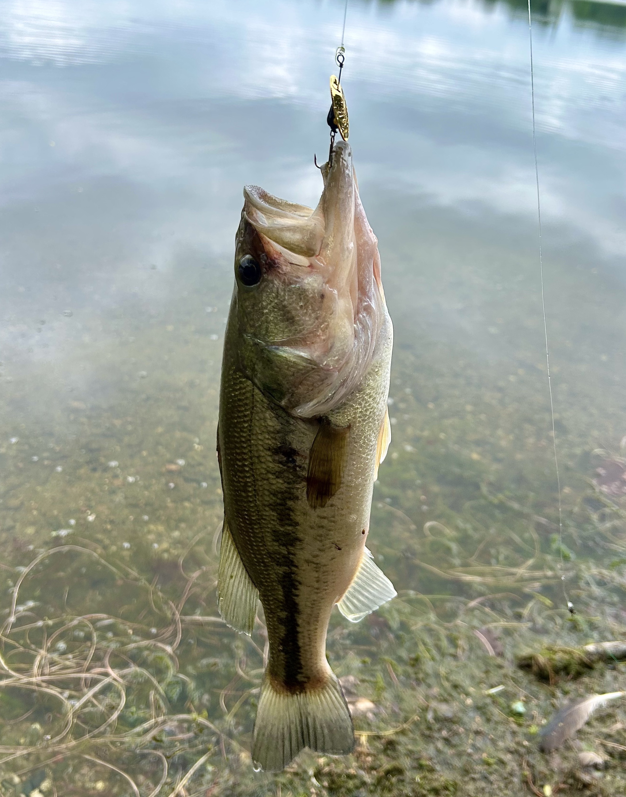

My friend from graduate school, Dr. Viktor Ljungström, left me his fishing pole and some tackle when he moved back to Sweden 🇸🇪.
This was the catalyst to finally get me into fishing[^1].
I now spend hours a week fishing whenever I can find time in the mornings and evenings.

## Locations

### The Charles

I live in the South End of Boston, about a mile from the Charles River, so that is where I fish from most often.
There I primarily catch largemouth bass (pictured below), crappie, and perch (the bluegills nip at the lures, but rarely to they hook).
In general, I prefer using lures over bait because I enjoy the interactivity of the method.
I predominately use in-line spinners and soft-plastics.

The other week, I nearly tripped over this snapping turtle laying eggs!

### Jamaica Pond

On the weekends, I head to Jamaica Pond in search of trout.
This artificial reservoir is stocked with trout in the spring making it a very popular target of the locals.
I have yet to successfully catch one, but I have no mind to give up.
I have caught a couple of largemouths, one of which is pictured below.

### Wompatuck State Park

I went for a weekend camping trip to Wompatuck State Park, a 45 minute train ride south of Boston.
I spent a Saturday afternoon and entire Sunday fishing the reservoir, catching largemouths and crappie.
I also caught my first northern pickerel, pictured below.

At Wompatuck, I also saw several water snakes.
It was fun to watch them swim and look for prey.

[^1]: I would have started sooner if I had realized how inexpensive it was to get started. I haven't explicitly priced it out, but I think you could easily get going with good equipment for under $100.
