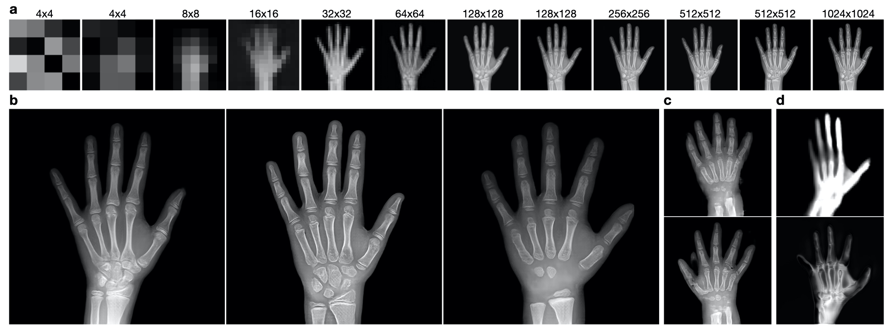
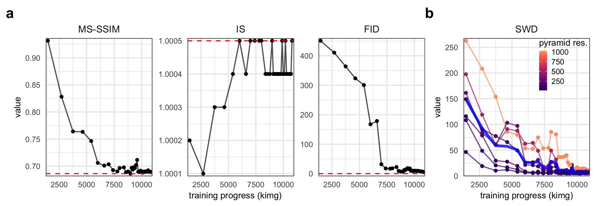
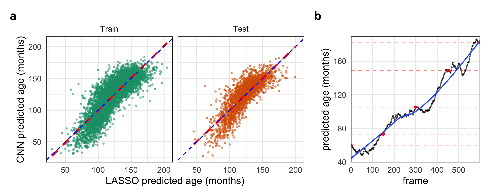

> Below is a summary of a project I worked on with two other students in our class *BMI 707 - Deep Learning for Biomedical Data* at Harvard Medical School. Here, I chose to focus on parts that were more interesting to me, and more details can be found in the full report linked above.

## TL;DR

1. We trained a GAN to produce realistic, yet novel, hand radiographs at 1024 x 1024 resolution.
2. We trained a CNN to predict the age of a patient from their hand radiograph and used it to label images generated by the GAN.
3. These labels were used to map axes of age in the GAN's latent input space (see the video about $\frac{3}{4}$ths of the way down.)

---

## Abstract

The assessment of bone (skeletal) age via X-ray imaging of the left hand is a useful measurement to
understand and diagnose growth abnormalities in pediatric patients with endocrine (hormone) disorders.
As bone age is typically determined by medical subspecialists by comparing a patient’s radiographs against medical atlases of reference images, we proposed the use of a generative adversarial network (GAN) to create additional images of hands for clinical training purposes. 

Pre-processed and annotated data which was originally provided by the Radiology Society of North America 2017 Bone Age challenge was used to train a progressively growing GAN (PGGAN).
The PGGAN successfully generated images with high visual similarity to real images in the original dataset.
A convolutional neural network (CNN) was trained to predict bone age on the annotated with mean absolute error of 3.7 months on the training set and 8.8 months on the test set.
We used the CNN to yield age predictions on 200,000 GAN-generated images with high visual similarity of generated images to their real image counterparts with age predictions which were similar.
LASSO regression of the CNN-predicted ages on the GAN’s input vectors demonstrated a linear correlation, suggesting an embedding of bone age in the GAN’s latent space which can be leveraged to control the GAN outputs based on desired bone age.

## Introduction

For our project, we are interested in training a generative adversarial network (GAN) to create novel images of hand radiographs.
We are interested in the quality of the outputs along with how the model incorporates and encodes age.
As the current standard of medical care for the evaluation of bone age involves physician determination of skeletal maturity by comparison of clinical images against reference images, the ability to generate synthetic images via GANs could be used to expand the corpus of reference images available for clinical training while preserving patient privacy and ensuring that population-specific characteristics of images (rather than patient-specific characteristics) of are modelled.
A GAN is composed of two artificial neural networks, a generator that creates novel data and a discriminator that estimates a probability that a sample is real or fake (Goodfellow 2014).
The training process can be summarized as a two-step game.
First, the generator produces a batch of novel samples which are mixed with real samples to train the discriminator to distinguish between real and fake data.
Then, the generator is trained by trying to trick the discriminator to predict that another batch of novel samples are real. 
Thus, the generator learns to model the data distribution without ever "seeing" a real data sample.

GANs are notoriously difficult to train and understanding the theoretical basis for the most common issues is still ongoing. In most cases, the field has been guided by an evolving set of best practices such as using narrow Gaussian distributions to initialize network weights and scaling the input into each layer using Batch Normalization (Ioffe 2015, Radford 2015).
One of the most frequently cited problems is "mode collapse," a scenario in which the generator learns to produce just one type out of output very convincingly, neglecting the broader diversity of the data (e.g. generating images of just shoes when the original data has images of many types of clothing). 
As it continues to successfully deceive the discriminator, the generator over-optimizes for this one mode of output, thus losing the ability to generalize and learn the entire data distribution.
Some attempts to address this problem have been to use a Wassterstein loss function (Arjovsky 2017) or incorporate measurements of the diversity of a batch of samples as inputs into the discriminator (where low diversity indicates mode collapse of the generator).

Another common difficulty often met when training a GAN is that the discriminator can become too advanced to provide meaningful guidance to the generator.
This problem results in a vanishing gradient when trying to train the generator, preventing the discriminator from providing meaningful direction to the generator. The use of a Wasserstein loss function (Arjovsky 2017) can battle this issue by preventing vanishing gradients even when the discriminator has reached optimality.

An exciting advancement from Karras et al. was their description of the "progressive growing" of GANs (PGGAN) during the training process to improve the generation of the high-resolution images (Karras 2018).
As the researchers explained, the difficulty of producing larger images is that they are easier to tell apart, amplifying the vanishing gradient problem discussed above (Odena 2017).
By slowly growing both the generator and discriminator, the speed and success of training a GAN was greatly improved.
Briefly, the authors proposed a technique that separates the training process into two phases.
In one phase, the generator and discriminator are trained like normal.
The second phase consists of adding a larger output layer to the generator and a matching input layer to the discriminator.
The weights of these new layers are linearly faded-in over several epochs until the old layers are no longer contributing to either network.
The process continues until the desired output dimensions are achieved.

As a GAN trains, it "learns" an encoding of its latent input space, the interpretation of which can enable control over various features of the model’s output (Goodfellow 2014, Radford 2015).
Methods for controlling the output of GANs, still an active area of research, can be divided into two groups: implicit and explicit. Implicit methods attempt to map the learned input space of the generator to desired features of the output (Lee 2019, Shen 2019, Härkönen 2020, Jahanian 2020, Yang 2020).
Explicit methods, on the other hand, divide the input space a priori into specific subspaces that each correspond to a different controllable property (Mirza 2014, Odena 2017, Shoshan 2021).
The benefit of an explicitly controllable GAN is that it avoids the issue of entanglement often found when trying to map the input space in an implicitly controllable GAN.
In this context, entanglement refers to changes of one controllable feature affecting another; e.g. increasing the desired age of a generated human face also turns the hair more gray.
By modeling these properties as separate subspaces of the generator’s input, the features will necessarily be disentangled.

### Primary Research Questions

1. **Can we train a generative adversarial network (GAN) to generate realistic hand X-ray images?**
2. **Can we identify a linear embedding of age in the GAN’s input space?**

## Methods

> I have only included the sections for the GAN and its evaluation and the CNN. The methods for data processing are available in the full report linked at the top.

### Progressive Growing GAN to create hand radiographs

We trained a Progressive Growing GAN (PGGAN) to produce novel, yet realistic, hand radiographs. 
We adapted the code from Karras et al. (Karras 2017) to produce a GAN with a 512 dimensional input space and produce output with a resolution of 1024 x 1024. 
We used the same training schedule, optimizer, and  hyperparameters as described in the original implementation as the limited time restricted our ability to explore further modifications. 
We trained the model on Harvard Medical School’s high-performance computing cluster using 4 TeslaV100 GPUs. 
The model required about 3 days and 7 hours to converge.

### GAN evaluation

We implemented four quantitative measures to assess the GAN’s ability to generate realistic images while still learning the diversity of the dataset (avoiding mode collapse). 
Multi-scale structural similarity (MS-SSIM) is a multi-scale form of a similarity metric previously optimized for the human perceptual system (Wang 2004a, Wang 2004b, Ma 2016, Odena 2017, Karras 2017). 
The Inception score measures both the realism of an image and the diversity over all of the images (Salimans 2016). 
More precisely, it makes a prediction on the classification of a sampling of images from the GAN using an Inception model trained on ImageNet. 
For each image, the entropy is measured as the negative of the sum of the probability times the log probability for each class. A lower entropy indicates that the image is likely to belong to a single classification (i.e. is realistic). 
The diversity of the image set is estimated as the average Kullback-Leibler divergence between the conditional and marginal probabilities. 
These values are then combined to produce the Inception score between 1 and 1000 (the number of classes in ImageNet) where a larger value is better. 
We also implemented the Fréchet Inception distance (FID) score which is a variant of the IS, but is often better at recognizing similarity between generated and real images (Heusel 2017). 
Finally, we used the sliced Wassertstein distance (SWD) that was originally introduced alongside the PGGAN (Karras 2017). 
This metric compares the local structure of patches from images at a variety of sizes, thus providing a measure of realism at different scales. 
We implemented the MS-SSIM on 5,000 images, IS on 5,000 images, FID on 10,000 images, and SWD on 1,000 images at regular intervals during the training process. 

We complemented the quantitative measures described above with a qualitative measure in the form of a nearest neighbors comparison. 
How to define the distance between images for this comparison can vary, and we employed two different methods: 1) the sum of the Euclidean distance of the matrices of pixels composing two images, 2) based on the weights generated in the last layer of our CNN (composed of 2048 values) when analyzing the image to determine its bone age. 
The second metric may more effectively capture true features of the image relating to bone age, compared with a naive pixel-to-pixel comparison. 
These generated images were then visually analyzed to qualitatively assess to what extent the GAN was over- or underfitting the data. 

### Convolutional Neural Network to predict the age of a hand radiograph

We trained a convolutional neural network via transfer learning using a modified version of the Xception model from Keras Applications & TensorFlow 2 with pre-trained ImageNet weights (Russakovsky 2015) used to accelerate the training process on the bone age images. 
The Xception model was chosen because of its compact size, network depth (rather than width), and high accuracy reported for prediction on ImageNet validation data. 
Because the models used for ImageNet predictions result in multiclass likelihood estimation, the model architecture was modified to output continuous data as a regression task for bone age prediction (rather than classification).  

## Results

### A CNN accurately predicted the age of a patient from their hand radiograph

Overall in the original training data, we found higher representation of images from patients with bone age between 8 years and 14 years, collectively comprising 72.4% of the input data (compared to the younger or older ages). 
The CNN yielded predictions with a mean absolute error (MAE) of 3.7 months on the training (in-bag) data (median absolute error 2.2 months). On test (out-of-bag) data, predictions showed a mean absolute error of 8.8 months (median absolute error 7.4 months). 
When stratifying the absolute error by annotated bone age, higher error was noted among the youngest and oldest patients in the training set; these findings were similarly noted, albeit to a lesser degree on the test set consisting of 200 images.

### The PGGAN reliably produced realistic hand radiographs

**Figure 1. Examples from the PGGAN trained on hand radiographs.** **a.** Increasing resolution of generated images over the training process. **b.** Visually realistic, 1024x1024-resolution images from the PGGAN. **c.** Examples of generated images with significant artifacts and errors **d.** Example outputs from failed training of the PGGAN with 20 (top) and 100 (bottom) input dimensions.

During the training process, the resolution of the generator’s output and discriminator’s input concomitantly increased in resolution, helping the generator first learn large-scale features before learning small-scale details (Fig. 1a). 
The PGGAN was successfully able to produce realistic images as judged by the members of this project (Fig. 1b). 
We noted that the model was seemingly able to capture the diversity of many features including position of the fingers, amount of wrist and forearm included, and boneage/development (analyzed more rigorously below). 
Notably, there were rare images with obvious artifacts indicating that the model had yet to fully converge (Fig. 1c).

As our goal was to interpret the GAN’s encoding of the latent input space, we attempted to train PGGAN models with fewer input dimensions in order to reduce inherent complexity caused by the "curse of dimensionality." 
In attempts with just 20 or 100 dimensions (compared to the default 512 dimensions we used first), the models were less stable during the resolution changes of the training process. 
In both scenarios, without modifications to the training schedule, the generators began to output distorted images (Fig. 1d). 
To rule out the possibility that random flukes perverted the training processes, both were restarted using model snapshots from earlier timepoints free of obvious signs of failure, but the models continued to fail at similar phases as before. 
We believe this is linked to the size of the input space because the 20-dimensional-input GAN consistently failed earlier than the 100-dimensional-input GAN. 
We adjusted the training schedule to account for these difficulties by increasing the number of epochs over which a new layer is phased in to the generator and discriminator, but unfortunately were unable to complete the training within the time restrictions of this project. 
Taken together, this suggests that the size of the GAN’s input space is associated with its representational capacity. For the remainder of the project, we continued with the 512-dimensional-input PGGAN.

**Figure 2. Quantitative metrics of generated image realism. a.** MS-SSIM, IS, and FID metrics for the PGGAN over the
training process (measured in thousands of images shown to the discriminator). Red, dashed horizontal lines indicate the
value when evaluated on real images. **b.** The SWD scores at different levels of the Laplcaian pyramid (represented as
resolution of the processed image) over the training process of the PGGAN. The blue line represents the average over all
resolutions.

Evaluating and comparing GANs is a daunting task, and while many measures have been introduced, there is no consensus as to which measure best captures the strengths and limitations of models (Borji 2019). 
Our GAN demonstrated great success in creating realistic images when assessed by quantitative metrics of MS-SSIM, IS, FID, and SWD (Fig. 2). All metrics converged very close or exactly to values for real hand radiographs.
The IS is likely not a valuable metric for our purpose because of the high degree of homogeneity of the dataset relative to other common image datasets such as ImageNet of CIFAR-10. 
The SWD values indicate that the PGGAN was able to learn both small- and large-scale features, though additional training may lead to still better convergence for the small-scale features.

### Demonstration of an interpretable latent input space of the PGGAN

Thus far, we have demonstrated that we have trained a CNN to reliably predict the age of a patient given a radiograph of his/her left hand and a PGGAN to generate novel, yet realistic, hand radiographs. 
Our next objective was to use the CNN’s predictions on the ages of images generated by the PGGAN to interpret the input space of the PGGAN. 

**Figure 3. Evidence for embedding of age in the GAN’s latent input space. a.** The predicted ages from the LASSO model trained on latent GAN input vectors against the predicted ages from the CNN on the training data and unseen test
data. **b.** Predicted ages of each frame of Video 1 interpolating through the GANs latent space from younger to older hands. The black points represent the predicted age by the CNN with red points indicating the original interpolation vectors. The blue line is a LOESS regression to highlight the overall trend.

Due to time constraints, we were unable to fully address this goal, but we have evidence that it is possible.
One piece of evidence to support this is that we successfully fit a LASSO regression model of the CNN-predicted age regressed on the GAN’s input vectors. 
The regularization penalty strength coefficient was determined as that which minimized the error over 10-fold cross validation. The error of the final LASSO model was almost identical on the training and out-of-bag withheld data (11.6 ± 9.4 and 10.9 ± 9.0 months, respectively; mean ± std. dev.), indicating that the LASSO did not overfit the data (Fig. 3a). 
This demonstrates that there was a linear embedding of age in at least part of the GAN’s latent space.

<iframe width="560" height="315" src="https://www.youtube.com/embed/QpChTgTsY1k" title="Video 1. Interpolation through the latent input space of the PGGAN along an axis corresponding to bone age." frameborder="0" allow="accelerometer; autoplay; clipboard-write; encrypted-media; gyroscope; picture-in-picture" allowfullscreen></iframe>

**Video 1. Interpolation through the latent input space of the PGGAN along an axis corresponding to bone age.**

Another demonstration of this relationship was that we were able to find vectors of different ages near each other that appeared to show a hand “aging” ([Video 1](https://www.youtube.com/watch?v=QpChTgTsY1k)). 
Interpolation between these points created realistic videos of what appeared to be the aging of the hand’s skeletal structure including the formation of the carpals and ossification of the growth plates of the phalanges. 
The predictions of the age of each frame by the trained CNN supports this visual assertion (Fig. 3b). 
The interpolation points were found by starting with an input vector corresponding to a generated image predicted to be of a specific age and then locating the nearest vector corresponding to a generated image predicted to be slightly older than the first. 
This process, starting from ages near 3 or 4 years old and using age gaps of 2 years, was able to reliably produce realistic interpolations through age. We believe that additional optimizations (such as adaptively mapping the predicted age of the local space around a starting input vector) could produce higher-fidelity interpolations, further increasing the realism.

## Discussion

### Interpretations/implications of your results

We were able to use the PGGAN to successfully generate images which visually appeared very similar to real images. 
The range of visual similarity captured the positions and lengths of various fingers, the different phases of development of the carpal bones, as well as the position and size of the forearm bones. 
We were also able to successfully train a CNN to predict bone age of training and test images with mean absolute error well under one year of age. 
The CNN was able to yield age predictions on all 200,000 of the GAN-generated images, and the images of both real and generated images with similar age predictions appeared visually similar to one another in skeletal maturity as determined by members of our team. 
Furthermore, LASSO regression of the CNN-predicted ages on the GAN’s input vectors demonstrated a linear correlation, suggesting an embedding of bone age in the GAN’s latent space.

These findings demonstrate that these methods can be used to successfully generate simulated X-ray images of hands across a range of pediatric skeletal maturity. 
Given that the current standard of medical care for the evaluation of bone age involves physician comparison of clinical images against reference images, these methods could potentially be used to expand the corpus of reference images upon which clinical trainees can hone their diagnostic skills. 
Furthermore, given that reference images in medical atlases do not often represent the full spectrum of diversity represented in an entire population, the pipeline described during this project—i.e., using vast amounts of raw clinical images, annotated in routine clinical practice with various demographic labels, for the generation of simulated, representative images of certain population subgroups—could be replicated to ensure adequate diversity of references images which take into consideration any potential differences between (sub)groups of a population. 

### Limitations of the study

While overall successful, this project had a number of limitations. Notably, there were rare images with obvious artifacts indicating that the PGGAN model had yet to fully converge. 
Time and computational resources (e.g., RAM, GPU) limited the degree to which more precise PGGAN and CNN models could be trained. 
Also, because of imbalance in the annotated bone ages represented in the training data, models tended to generate outputs resembling the more frequently represented portion of the population (i.e., images with bone age between 8 and 14 years old). 
Adjusting the training process with resampling and/or data augmentation techniques would likely improve these issues to ensure uniform modeling across the gamut of skeletal maturity. 
While the team was able to benefit from some clinical expertise in qualitatively evaluating the radiographic images—in addition to employing a range of quantitative and qualitative GAN metrics—we did not have a medical subspecialist, such as a pediatric radiologist or pediatric endocrinologist, to help externally validate the utility of these generated images in practice.

### Future directions

Future work that would be fascinating to explore includes the explicit control of GAN outputs by a priori segmenting the input space and building the enforcement of the predefined regions directly into the training process and loss function. 
This ideally would include sex, demographics, and even potentially certain endocrine conditions as controllable dimensions which could be presented to the GAN to generate representative images. 
Experimenting with various training schedules and pre-processing steps to improve the GAN performance and determine their effects on the GAN outputs, which would also be helpful in determining the practicality of applying these methods to other image generation tasks outside of bone age (e.g. representation of skin rashes on various skin tones).

### Group Member Contributions

PH pre-processed the data and trained the CNN to predict patient age from a hand radiograph. 
JC was tasked with training the PGGAN and analyzing its input space. 
MW performed the nearest-neighbor GAN evaluation analyses. 
All members contributed to conducting literature research and creative discussions for all portions of the project.

---

**References**

1. Arjovsky, Martin, Soumith Chintala, and Léon Bottou. 2017. “Wasserstein GAN.” arXiv [stat.ML]. arXiv. http://arxiv.org/abs/1701.07875.
2. Borji A. Pros and Cons of GAN Evaluation Measures. arXiv:180203446 [cs]. Published online October 23, 2018. http://arxiv.org/abs/1802.03446. 
3. Goodfellow, Ian J. and Pouget-Abadie, Jean and Mirza, Mehdi and Xu, Bing and Warde-Farley, David and Ozair, Sherjil and Courville, Aaron and Bengio, Yoshua. 2014. “Generative Adversarial Nets.” Proceedings of the 27th International Conference on Neural Information Processing Systems - Volume 2, 2672–80.
4. Halabi, Safwan S., Luciano M. Prevedello, Jayashree Kalpathy-Cramer, Artem B. Mamonov, Alexander Bilbily, Mark Cicero, Ian Pan, et al. 2019. “The RSNA Pediatric Bone Age Machine Learning Challenge.” Radiology 290 (2): 498–503.
5. Härkönen, Erik, Aaron Hertzmann, Jaakko Lehtinen, and Sylvain Paris. 2020. “GANSpace: Discovering Interpretable GAN Controls.” arXiv [cs.CV]. arXiv. http://arxiv.org/abs/2004.02546.
6. Heusel, Martin, Hubert Ramsauer, Thomas Unterthiner, Bernhard Nessler, and Sepp Hochreiter. 2017. “GANs Trained by a Two Time-Scale Update Rule Converge to a Local Nash Equilibrium.” arXiv [cs.LG]. arXiv. http://arxiv.org/abs/1706.08500.
7. Iglovikov, Vladimir, Alexander Rakhlin, Alexandr A. Kalinin, and Alexey Shvets. 2018. “Pediatric Bone Age Assessment Using Deep Convolutional Neural Networks.” bioRxiv. https://doi.org/10.1101/234120.
8. Ioffe, Sergey, and Christian Szegedy. 2015. “Batch Normalization: Accelerating Deep Network Training by Reducing Internal Covariate Shift.” arXiv [cs.LG]. arXiv. http://arxiv.org/abs/1502.03167.
9. Jahanian, Ali, Lucy Chai, and Phillip Isola. 2019. “On the ‘Steerability’ of Generative Adversarial Networks.” arXiv [cs.CV]. arXiv. http://arxiv.org/abs/1907.07171.
10. Karras, Tero, Timo Aila, Samuli Laine, and Jaakko Lehtinen. 2017. “Progressive Growing of GANs for Improved Quality, Stability, and Variation.” arXiv [cs.NE]. arXiv. http://arxiv.org/abs/1710.10196.
11. Borji, Ali. "Pros and cons of gan evaluation measures." Computer Vision and Image Understanding 179 (2019): 41-65.
12. Lee, Minhyeok, and Junhee Seok. 2017. “Controllable Generative Adversarial Network.” arXiv [cs.LG]. arXiv. http://arxiv.org/abs/1708.00598.
13. Lin T-Y, Maire M, Belongie S, et al. Microsoft COCO: Common Objects in Context. arXiv:14050312 [cs]. Published online February 20, 2015. http://arxiv.org/abs/1405.0312. 
14. Ma, Kede, Qingbo Wu, Zhou Wang, Zhengfang Duanmu, Hongwei Yong, Hongliang Li, and Lei Zhang. 2016. “Group MAD Competition? A New Methodology to Compare Objective Image Quality Models.” In 2016 IEEE Conference on Computer Vision and Pattern Recognition (CVPR), 1664–73.
15. Mirza, Mehdi, and Simon Osindero. 2014. “Conditional Generative Adversarial Nets.” arXiv [cs.LG]. arXiv. http://arxiv.org/abs/1411.1784.
26. Neuro, Inc. Pediatric Bone Age Assessment. Accessed April 21, 2021. https://github.com/neuro-inc/ml-recipe-bone-age 
16. Odena, Augustus, Christopher Olah, and Jonathon Shlens. 2016. “Conditional Image Synthesis With Auxiliary Classifier GANs.” arXiv [stat.ML]. arXiv. http://arxiv.org/abs/1610.09585. 
17. Radford, Alec, Luke Metz, and Soumith Chintala. 2015. “Unsupervised Representation Learning with Deep Convolutional Generative Adversarial Networks.” arXiv [cs.LG]. arXiv. http://arxiv.org/abs/1511.06434.
18. Russakovsky O, Deng J, Su H, et al. ImageNet Large Scale Visual Recognition Challenge. arXiv:14090575 [cs]. Published online January 29, 2015. Accessed May 9, 2021. http://arxiv.org/abs/1409.0575 
19. Salimans, Tim, Ian Goodfellow, Wojciech Zaremba, Vicki Cheung, Alec Radford, and Xi Chen. 2016. “Improved Techniques for Training GANs.” arXiv [cs.LG]. arXiv. http://arxiv.org/abs/1606.03498.
20. Shoshan, Alon, Nadav Bhonker, Igor Kviatkovsky, and Gerard Medioni. 2021. “GAN-Control: Explicitly Controllable GANs.” arXiv [cs.CV]. arXiv. http://arxiv.org/abs/2101.02477. 
23. Tan M, Pang R, Le QV. EfficientDet: Scalable and Efficient Object Detection. arXiv:191109070 [cs, eess]. Published online July 27, 2020. http://arxiv.org/abs/1911.09070. 
21. Wang, Zhou, Eero P. Simoncelli, and Alan C. Bovik. n.d. “Multi-Scale Structural Similarity for Image Quality Assessment.” Accessed April 21, 2021. https://ece.uwaterloo.ca/~z70wang/publications/msssim.pdf.
21. Yang, Ceyuan, Yujun Shen, and Bolei Zhou. 2019. “Semantic Hierarchy Emerges in Deep Generative Representations for Scene Synthesis.” arXiv [cs.CV]. arXiv. http://arxiv.org/abs/1911.09267. 
22. Zhang F, Bazarevsky V, Vakunov A, et al. MediaPipe Hands: On-device Real-time Hand Tracking. arXiv:200610214 [cs]. Published online June 17, 2020. http://arxiv.org/abs/2006.10214.
24. Zhou Wang, A. C. Bovik, H. R. Sheikh and E. P. Simoncelli, "Image quality assessment: from error visibility to structural similarity," in IEEE Transactions on Image Processing, vol. 13, no. 4, pp. 600-612, April 2004, doi: 10.1109/TIP.2003.819861.
