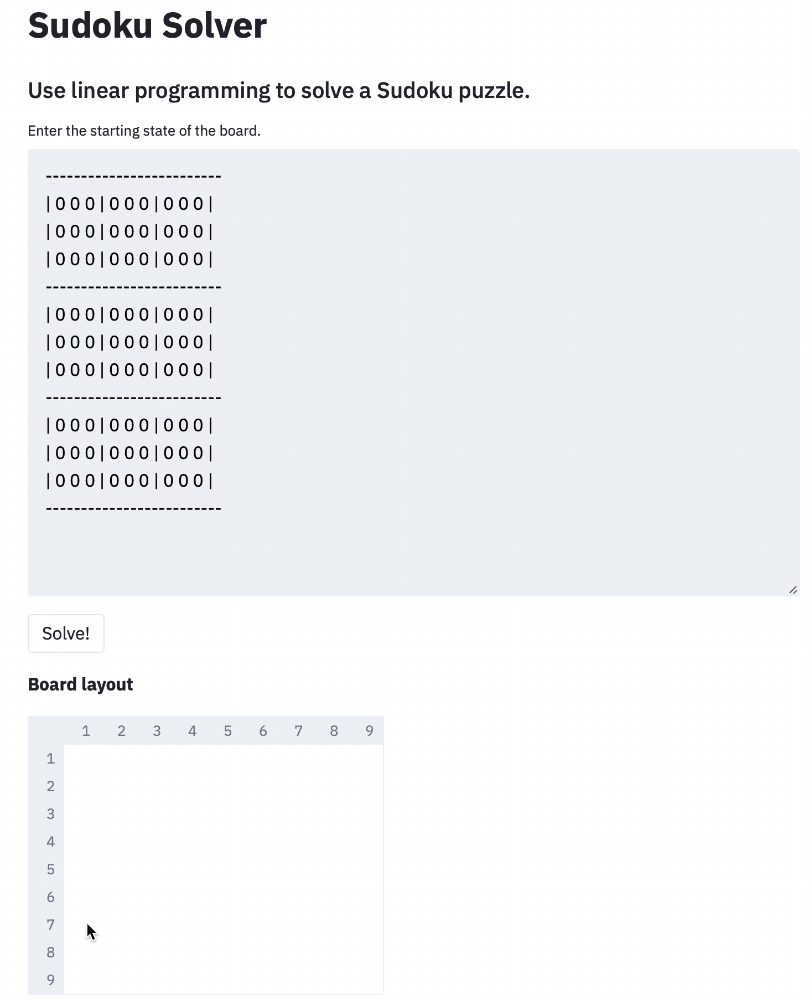

A web application that solves [Sudoku puzzles](https://en.wikipedia.org/wiki/Sudoku).
The user inputs the known values in the grid, clicks the *Solve* button, and the solution is displayed below almost instantly.
The web application is built using [Streamlit](https://www.streamlit.io/) and the solving engine uses the optimization library [Pyomo](https://www.pyomo.org/).

