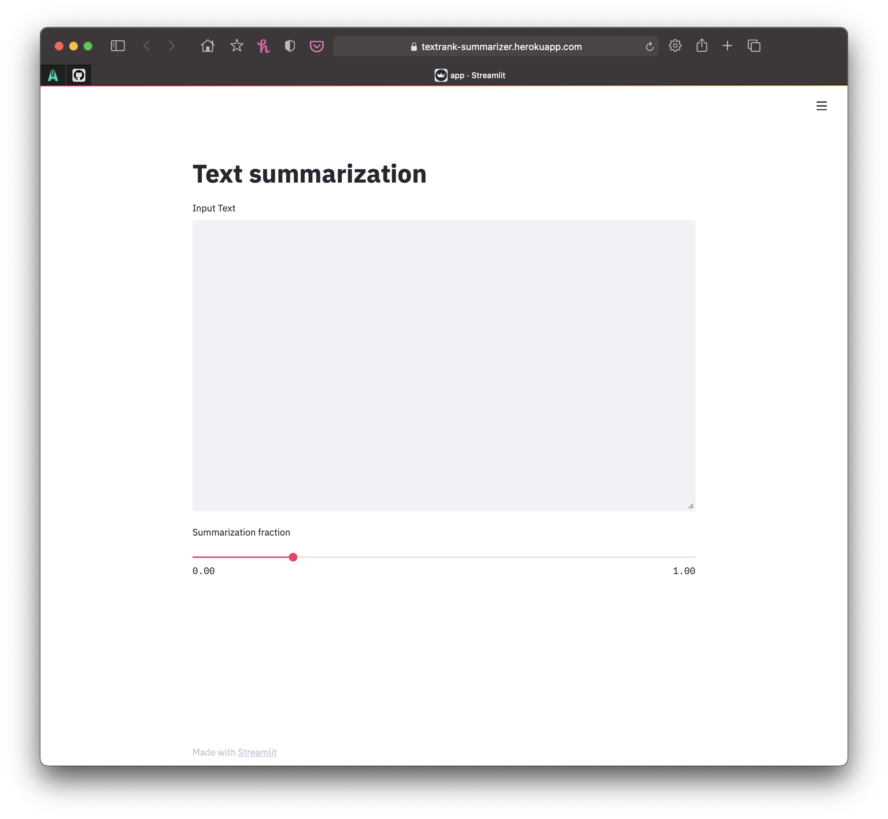
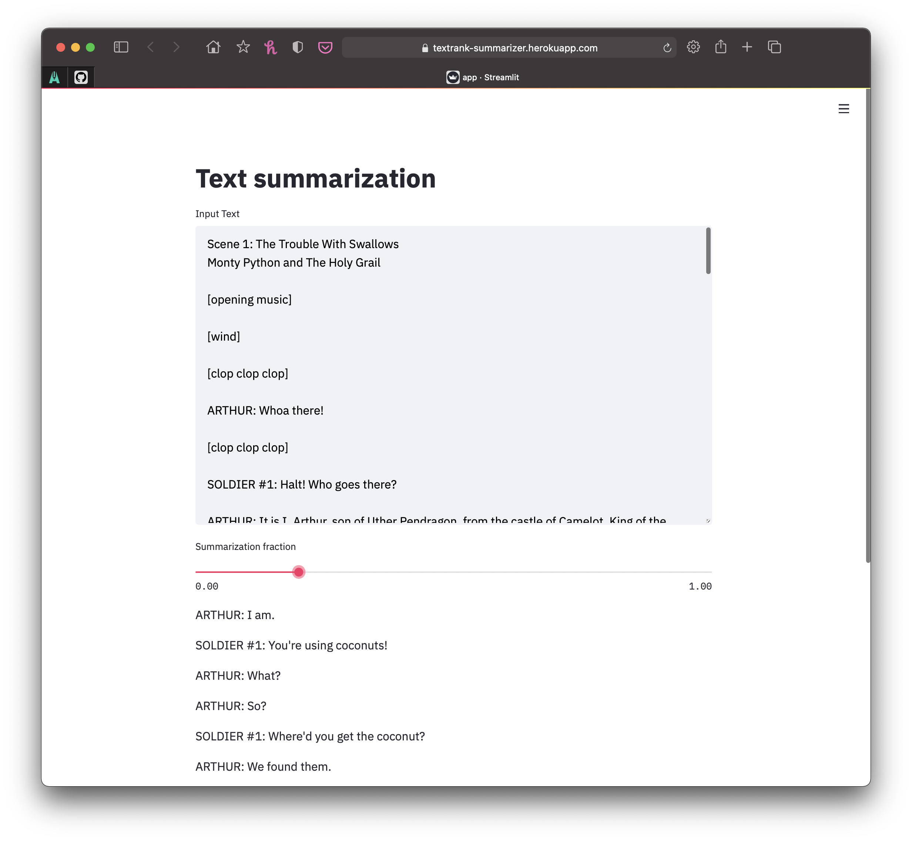

A simple web application built using [Streamlit](https://www.streamlit.io) that summarizes long text by extracting a fraction of the most important sentences.
The sentences are ranked using the TextRank method of the ['summa'](https://github.com/summanlp/textrank) Python library that employs the [PageRank](https://en.wikipedia.org/wiki/PageRank) algorithm using the proportion of shared words as the metric of sentence similarity.

The initial blank application is shown below followed by an example of summarizing the opening scene to [Monty Python and the Holy Grail](https://en.wikipedia.org/wiki/Monty_Python_and_the_Holy_Grail) ([text source](http://www.montypython.50webs.com/scripts/Holy_Grail/Scene1.htm)).

